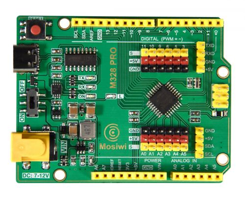
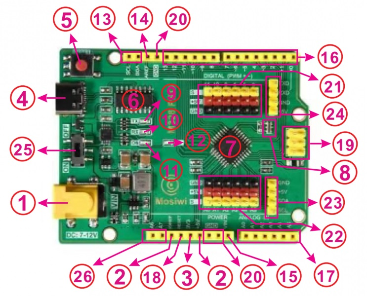
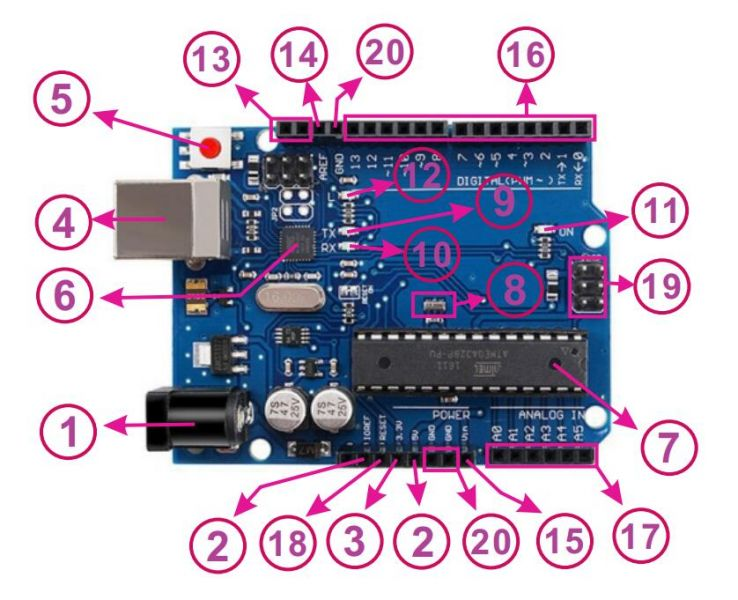
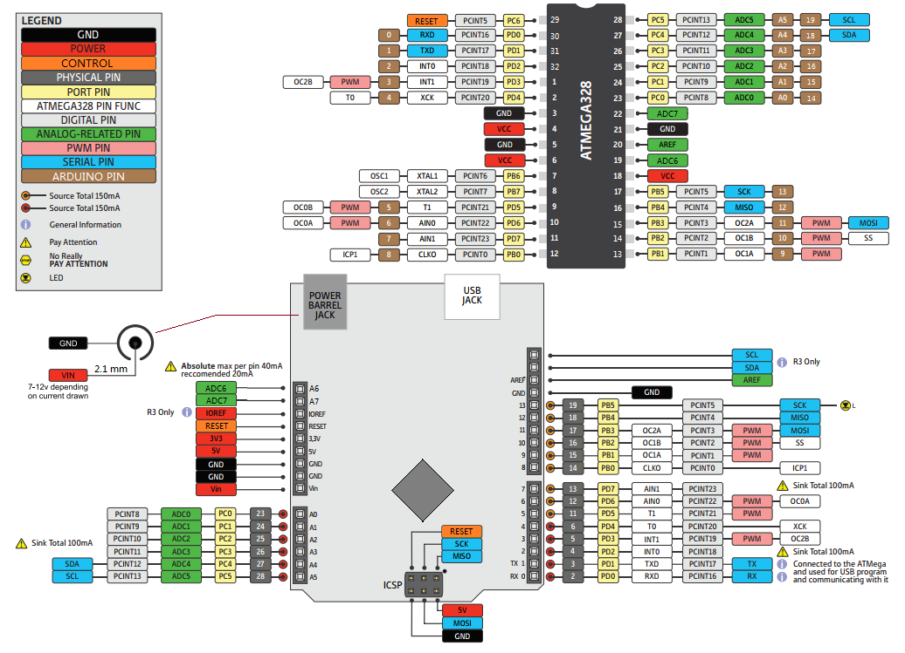
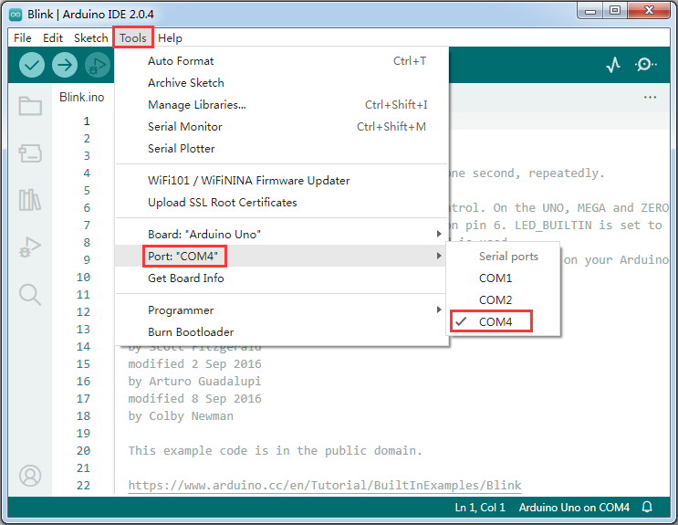
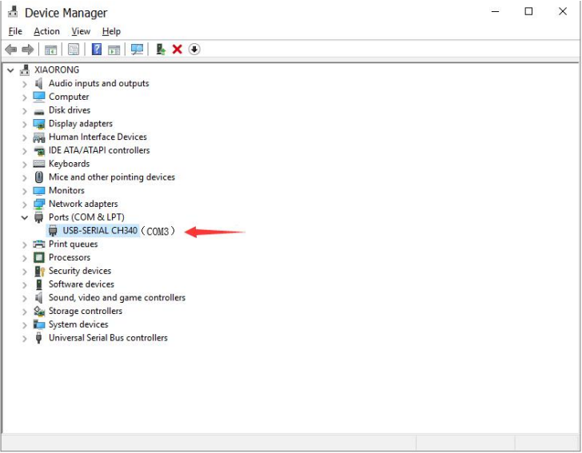
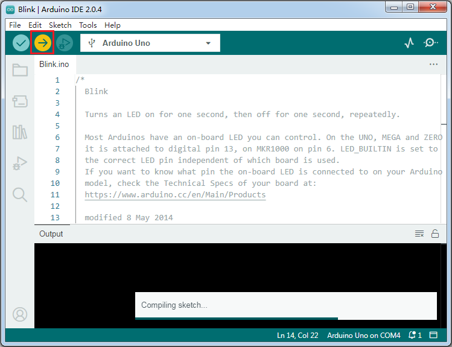

# A1D0001_M328_PRO    
------------------
<center>    
     
</center>       

The M328 PRO development board developed by Mosiwi is fully compatible with the official Arduino UNO R3 development board and has more powerful functions. M328 PRO uses type C USB port; DC socket adds a power switch; integrated DC to DC 5V power supply, output power up to 4W (5V\2A); 3.3V output power up to 1.65W (3.3V\0.5A); use pin header connection Commonly used IO; the appearance is more reasonable and beautiful.

## Specification         
----------------
- Microcontroller: ATMEGA328  
- USB serial chip：CH340C    
- DC Power Jack Input Voltage (recommended): DC 7-12V  
- DC Power Jack Input Voltage (MAX): DC 6.5-16.8V  
- Operating Voltage: 5V  
- DC Current for +5V Pin: 2A  
- DC Current for 3.3V Pin: 500 mA  
- Digital I/O Pins: 14 (0-13) + 6 (A0-A5)  
- PWM Digital I/O Pins: 6 (3, 5, 6, 9, 10, 11)  
- Analog Input Pins: 8 (A0-A7)  
- DC Current per I/O Pin: 20 mA  
- Flash Memory: 32 KB of which 0.5 KB used by bootloader  
- SRAM: 2 KB  
- EEPROM: 1 KB  
- Clock Speed: 16 MHz  
- LED_BUILTIN (L): D13  
- Weight: about 22g  
- Dimensions: 68.58*53.34*12.7mm  


## Pin interfaces            
-----------------
|  |  |
| -- | -- |
| 1. DC input: 7-12V | 1. DC input: 7-12V |
| 2. DC output: 5V/2A (DC to DC) | 2. ~~DC output: 5V/1A (linear power supply )~~ |
| 3. DC output: 3.3V/500mA | 3. ~~DC output: 3.3V/150mA~~ |
| 4. Type C USB port（USB 2.0 protocol, USB-PD Sink） | 4. ~~Type B USB port~~ |
| 5. Reset buttom | 5. Reset buttom |
| 6. CH340C USB to TTL serial port chip | 6. ATmega16u2 USB to TTL serial port chip |
| 7. Microcontroller: ATmega328P | 7. Microcontroller: ATmega328P |
| 8. 16M crystal oscillator for ATmega328P | 8. 16M crystal oscillator for ATmega328P |
| 9. Serial port sends data LED | 9. Serial port sends data LED |
| 10. Serial port receives data LED | 10. Serial port receives data LED |
| 11. Power indicator LED | 11. Power indicator LED |
| 12. Experimental led, controlled by 13pin | 12. Experimental led, controlled by 13pin |
| 13. I2C port | 13. I2C port |
| 14. Reference voltage (0-5V) for analog inputs | 14. Reference voltage (0-5V) for analog inputs |
| 15. External power input DC7-12V | 15. External power input DC7-12V |
| 16. General digital input and output ports (0 and 1 are usually used as serial ports) | 16. General digital input and output ports (0 and 1 are usually used as serial ports) |
| 17. Analog input port (also used as general digital input/output port) | 17. Analog input port (also used as general digital input/output port) |
| 18. Reset input port | 18. Reset input port |
| 19. SPI port | 19. SPI port |
| 20. GND | 20. GND |
| 21. PWM signal output port (also used as general digital input/output port) | NO |
| 22. Analog input port (also used as general digital input/output port) | NO |
| 23. I2C port | NO |
| 24. Serial port | NO |
| 25. DC jack power switch | NO |
| 26. A6, A7 analog input port | NO |

## Pinout Diagram             
-----------------


## Programming platform     
-----------------------
**Install the arduino IDE**  
M328 PRO is programmed with the Arduino IDE, please refer to: [Link](../arduino_ide/arduino_ide.md)  

**Install the CH340 driver**  
Please refer to: [Link](../../resource/ch340/ch340_driver.md)  

**A simple use example:**  
1. Run the arduino IDE and open a blink example.  
  

1. The board model is **"Ardino Uno"**.  
  

1. Select the port to upload the code to. (Each board has a port)  
  

1. Upload the code to Uno r3  
  
After the code is successfully uploaded, the LED with L silk screen on the board flashes every 1 second.  

## Example code          
---------------
### Input and output Pin
The silk screen 0-13 and A0-A5 pins on the development board can be used as digital input and output ports.  
**Example Code1: Output**  
```c++
void setup() {
  pinMode(13, OUTPUT);                     // sets the digital pin 13 as output
}

void loop() {
  digitalWrite(13, HIGH);                  // sets the digital pin 13 on
  delay(1000);                             // waits for a second
  digitalWrite(13, LOW);                   // sets the digital pin 13 off
  delay(1000);                             // waits for a second
}
```

**Example Code2: Input**
```c++
const int buttonPin = 2;                   // the number of the pushbutton pin
const int ledPin =  13;                    // the number of the LED pin
int buttonState = 0;                       // variable for reading the pushbutton status

void setup() {
  pinMode(ledPin, OUTPUT);                 // initialize the LED pin as an output.
  pinMode(buttonPin, INPUT);               // initialize the pushbutton pin as an input.
}

void loop() {
  buttonState = digitalRead(buttonPin);    // read the state of the pushbutton value.
  if (buttonState == HIGH) {               // check if the pushbutton is pressed. If it is, the buttonState is HIGH.
    digitalWrite(ledPin, HIGH);            // turn LED on.
  }  
  else {
    digitalWrite(ledPin, LOW);             // turn LED off.
  }
}
```

### Analog input Pin
The silkscreen pins of A0, A1, A2, A3, A4, A5, A6 and A7 on the development board can be used as analog input ports.    
**Example Code:**   
```c++
int analogPin = A3;                         // potentiometer wiper (middle terminal) connected to analog pin 3, outside leads to ground and +5V
int val = 0;                                // variable to store the value read

void setup() {
  Serial.begin(9600);                       // setup serial
}

void loop() {
  val = analogRead(analogPin);              // read the input pin
  Serial.println(val);                      // serial port monitor prints analog values                           
  delay(500);                               // waits for 0.5 second
}
```

### PWM output Pin
The silkscreen pins of ~3, ~5, ~6, ~9, ~10, ~11 on the development board can be used as pulse width modulation signal outputs.   
**Example Code:**  
```c++
int ledPin = 9;                              // LED connected to digital pin 9
int val = 0;                                 // variable to store the read value

void setup() {
  pinMode(ledPin, OUTPUT);                   // sets the pin as output
}

void loop() {
  for(val=0; val<255; val++){
    analogWrite(ledPin, val);                // analogRead values go from 0 to 1023, analogWrite values from 0 to 255
    delay(20);
  }
}
```

### External interrupt Pin
Silkscreen 2 and 3 pins on the development board can be used as external interrupt input ports.  
**Syntax:**
```c++
attachInterrupt(digitalPinToInterrupt(pin), ISR, mode)   
```

**Parameters:**  
**pin:** the Arduino pin number.   

**ISR:** the ISR to call when the interrupt occurs; this function must take no parameters and return nothing. This function is sometimes referred to as an interrupt service routine.  

**mode:** defines when the interrupt should be triggered. Four constants are predefined as valid values:  
---- **LOW** to trigger the interrupt whenever the pin is low.  
---- **CHANGE** to trigger the interrupt whenever the pin changes value.  
---- **RISING** to trigger when the pin goes from low to high.  
---- **FALLING** for when the pin goes from high to low.  

**Example Code:**
```c++
const byte ledPin = 13;
const byte interruptPin = 2;      //2 or 3
volatile byte state = LOW;

void blink() {
  state = !state;
}

void setup() {
  pinMode(ledPin, OUTPUT);
  pinMode(interruptPin, INPUT_PULLUP);
  attachInterrupt(digitalPinToInterrupt(interruptPin), blink, CHANGE);
}

void loop() {
  digitalWrite(ledPin, state);
}
```

### Serial port
Silkscreen 0(RX) and 1(TX) pins on the development board can be used as hard serial ports.    
**Example Code:**  
```c++
void setup() {
  Serial.begin(9600);                         // open the serial port at 9600 bps
}

void loop() {
  // print labels
  Serial.print("NO FORMAT");                  // prints a label
  Serial.print("\t");                         // prints a tab
  Serial.print("DEC");
  Serial.print("\t");
  Serial.print("HEX");
  Serial.print("\t");
  Serial.print("OCT");
  Serial.print("\t");
  Serial.print("BIN");
  Serial.println();                            // carriage return after the last label
  for (int x = 0; x<64; x++) {                 // only part of the ASCII chart, change to suit
    // print it out in many formats:
    Serial.print(x);                           // print as an ASCII-encoded decimal - same as "DEC"
    Serial.print("\t\t");                      // prints two tabs to accomodate the label lenght
    Serial.print(x, DEC);                      // print as an ASCII-encoded decimal
    Serial.print("\t");                        // prints a tab
    Serial.print(x, HEX);                      // print as an ASCII-encoded hexadecimal
    Serial.print("\t");                        // prints a tab
    Serial.print(x, OCT);                      // print as an ASCII-encoded octal
    Serial.print("\t");                        // prints a tab
    Serial.println(x, BIN);                    // print as an ASCII-encoded binary
    // then adds the carriage return with "println"
    delay(200);                                // delay 200 milliseconds
  }
  Serial.println();                            // prints another carriage return
}
```

More resources：<https://www.arduino.cc/reference/en/language/functions/communication/serial/>  
SoftwareSerial: <https://www.arduino.cc/en/Reference/SoftwareSerial>  

### I2C port
The silkscreen A4(SDA) and A5(SCL) pins on the development board can be used as I2C ports. 

I2C communication protocol: [Click me](../../resource/iic/iic.md)     
More Arduino I2C resources: <https://www.arduino.cc/en/Reference/Wire>   

### SPI port
The silkscreen pins 10(SS), 11(MOSI), 12(MISO), 13(SCK) on the development board can be used as SPI ports.       
SPI communication protocol: [Click me](../../resource/spi/spi.md)         
More Arduino SPI resources: <https://www.arduino.cc/en/Reference/SPI>  
 

### Timer0
Have been used in: PWM output of ~5 and ~6, [delay()](https://www.arduino.cc/reference/en/language/functions/time/delay/), [millis()](https://www.arduino.cc/reference/en/language/functions/time/millis/), [delayMicroseconds()](https://www.arduino.cc/reference/en/language/functions/time/delaymicroseconds/).   

### Timer1
Have been used in: PWM output of ~9 and ~10, [Servo.h](https://www.arduino.cc/reference/en/libraries/servo/), [TimerOne](https://www.arduino.cc/reference/en/libraries/timerone/), when using two tone() variables.    
More resources: <https://playground.arduino.cc/Code/Timer1/>  
More resources: <https://www.arduino.cc/reference/en/libraries/timerone/>  

### Timer2
Have been used in: PWM output of ~3 and ~11, [tone()](https://www.arduino.cc/reference/en/language/functions/advanced-io/tone/), [IRremote.h](https://www.arduino.cc/reference/en/libraries/irremote/) use Timer2 by default, you can [modify the library file](https://github.com/Arduino-IRremote/Arduino-IRremote) to use Timer1.    

**Example Code:**  
```c++
#include <MsTimer2.h>

void flash() {
  static boolean output = HIGH;
  digitalWrite(13, output);
  output = !output;
}

void setup() {
  pinMode(13, OUTPUT);
  MsTimer2::set(500, flash); // 500ms period
  MsTimer2::start();
}

void loop() {
}
```
<span style="color: rgb(255, 76, 65);">Note:</span> The above code requires the [MStimer2.h](https://playground.arduino.cc/uploads/Main/MsTimer2/index.zip) library file to be installed.  
More resources: <https://playground.arduino.cc/Main/MsTimer2/>  
More resources: <https://www.arduino.cc/reference/en/libraries/mstimer2/>  

## Arduino programming language             
-------------------------------
**Required reading for beginners**    
Language Reference: <https://www.arduino.cc/reference/en/>  
Installing Additional Arduino Libraries: <https://www.arduino.cc/en/Guide/Libraries>  

**Required reading for upgrade learners**  
Libraries: <https://www.arduino.cc/reference/en/libraries/>  
Built-in Examples: <https://docs.arduino.cc/built-in-examples/>  

**Required reading for advanced learners**  
Writing a Library for Arduino: <https://www.arduino.cc/en/Hacking/LibraryTutorial>  


## Troubleshooting                
------------------
**The USB port cannot be identified**  
1. Ensure that the USB cable with data communication function is used or another USB cable with communication function is used for testing.    
2. Make sure your computer's device manager can find the port, as follows:  
  

**Development board not working**   
1. Check whether the input voltage of the DC base is DC 7-12.    
2. When the input voltage of the DC head is DC 7-12, use a voltmeter to test whether the voltage of the +5V pin row is 5V. If the difference is large, the power supply may be damaged.    
3. Use a voltmeter to measure the voltage at both ends of the resistor near the crystal oscillator of ATmega328P. If the development board works normally, the voltage at both ends of the resistor is about 0.8V and 0.48V;  Otherwise, the crystal oscillator is bad or the firmware is not burned.  
4. If all the tests are normal according to the above steps, it may be that the development board did not burn the firmware, so it needs to burn the firmware again.      

**Reburn firmware**   
&ensp;&ensp; More resources: <https://docs.arduino.cc/built-in-examples/arduino-isp/ArduinoISP>   
&ensp;&ensp; <span style="color: rgb(255, 76, 65);">Note：Perform this operation with caution. If the operation fails, the mainboard will not work.</span>     


