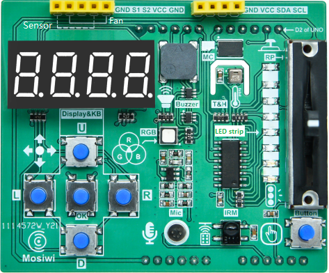
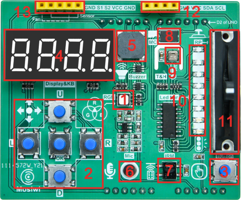
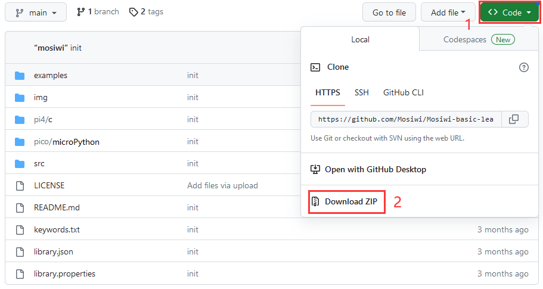
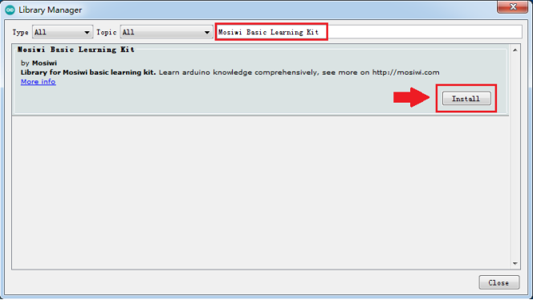

# A1E0000_basic_learning_shield

## Overview
  
The arduino basic learning shield is based on Uno r3 mainboard design, board set temperature, humidity, infrared receiver and buzzer and other sensors, directly inserted with Uno r3 mainboard can be used.  And provides a wealth of examples and tutorial materials, very suitable for learning to use.  

## Specification
1. Operating Voltage: 3 to 5V  
2. Operating Current: Max 550mA  
3. Weight: about 25g  
4. Dimensions: 68.58*56.94mm  

## Meet basic learing shield
|  |
| :-- |
| 1. RGB LED, controlled by pins 5(R), 6(G) and 9(B) of Uno r3. |
| 2. Up, down, left, right and center(OK) buttons, controlled by Uno r3 SPI pin (via BC7278). |
| 3. Interrupt key controlled by 2 pin of uno r3. |
| 4. 4 bit digital tube, controlled by Uno r3 SPI pin (via BC7278). |
| 5. Passive buzzer, controlled by Uno r3 10 pin. |
| 6. Microphone, controlled by Uno r3 A2 pin. |
| 7. Infrared receiver, controlled by Uno r3 4 pin. |
| 8. Storer, controlled by Uno r3 7 pin. |
| 9. AHT20 T/H sensor, controlled by pins A4 and A5 of Uno r3. |
| 10. Yellow LED, controlled by pins A0, A1 and D8 of Uno r3 (via 74HC595). |
| 11. Slide resistor, controlled by Uno r3 A3 pin. |
| 12. I2C interface (A5, A4 V, G). |
| 13. Standby interface (G, 6, 5, V, G) |

## Integration library
**Arduino IDE 2.0.x**  
Open up the IDE，with the editor open, let's take a look at the left column. Here, we can see a couple of icons.   
  
1. Let's click the on the **"library"** icon.  
2. Enter **"Mosiwi Basic Learning Kit"** in the search box.  
3. It is recommended to select the highest version of the library in the down menu.  
4. Select **"INSTALL"** to install the library.    

**Arduino IDE 1.8.x**  
Open up the IDE, choose "Sketch" > "Include Library" > "Manage Libraries", fill in "Mosiwi Basic Learning Kit" in the search bar, Then select "Install" to Install the library.  
  

## Download
|      |      |      |      |
| :--: | :--: | :--: | :--: |
| [SCHEMATICS IN .PDF](../../_static/pdf/A1E0000_basic_learning_shield/basic%20learning%20shield.PDF)|[BC7278 IN .PDF](../../_static/pdf/A1E0000_basic_learing_shield/BC7278.pdf) |[AHT20 IN .PDF](../../_static/pdf/A1E0000_basic_learing_shield/AHT20.pdf) |[74HC595 IN .PDF](../../_static/pdf/A1E0000_basic_learing_shield/74HC595.pdf) |

