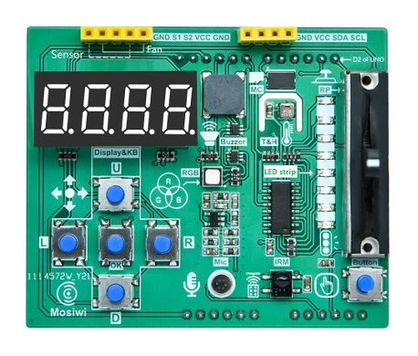
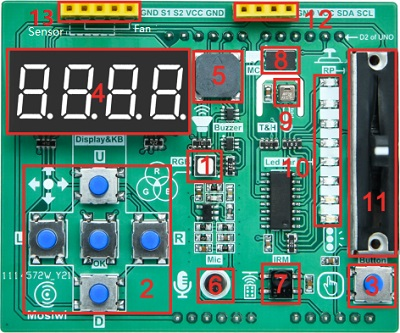
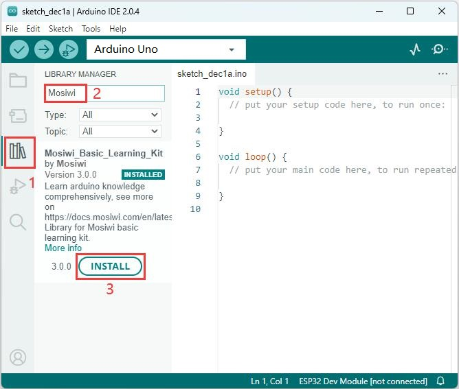
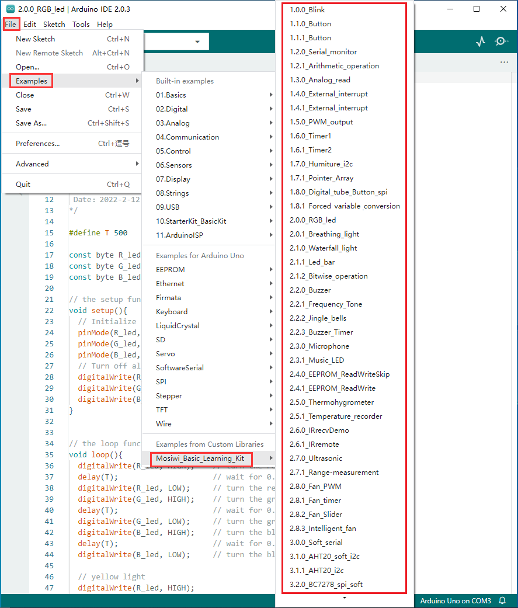

# A1E0000_basic_learning_shield         
-------------------------------   
<center>    
     
</center> 

The arduino basic learning shield is based on Uno r3 mainboard design, board set temperature, humidity, infrared receiver and buzzer and other sensors, directly inserted with Uno r3 mainboard can be used.  And provides a wealth of examples and tutorial materials, very suitable for learning to use.  

## Specification          
----------------
1. Operating Voltage: 3 to 5V  
2. Operating Current: Max 550mA  
3. Weight: about 25g  
4. Dimensions: 68.58*56.94mm  

## Meet basic learing shield         
----------------------------
| <center></center>  |
| :-- |
| 1. RGB LED, controlled by pins 5(R), 6(G) and 9(B) of Uno r3. |
| 2. Up, down, left, right and center(OK) buttons, controlled by Uno r3 SPI pin (via BC7278). |
| 3. Interrupt key controlled by pin 2 of uno r3. |
| 4. 4 bit digital tube, controlled by Uno r3 SPI pin (via BC7278). |
| 5. Passive buzzer, controlled by Uno r3 pin 10. |
| 6. Microphone, controlled by Uno r3 pin A2. |
| 7. Infrared receiver, controlled by Uno r3 pin 4. |
| 8. Storer, controlled by Uno r3 pin 7. |
| 9. AHT20 T/H sensor, controlled by pins A4 and A5 of Uno r3. |
| 10. Yellow LED, controlled by pins A0, A1 and 8 of Uno r3 (via 74HC595). |
| 11. Slide resistor, controlled by Uno r3 A3 pin. |
| 12. I2C interface (A5, A4 V, G). |
| 13. Standby interface (G, 6, 5, V, G) |

## Integration library         
----------------------   
This library package is available for Arduino: UNO and NANO, Raspberry pi 4B, and Raspberry pi pico.       

```{tip}  
Installing the latest version of the library is recommended!     
``` 

### Method_1:       
This library is already in the library manager of Arduino IDE and can be quickly installed through the library manager of Arduino IDE.         
        

### Method_2:          
Download resource: <https://github.com/Mosiwi/Mosiwi-basic-learning-kit>  
  
For Arduino UNO and NANO: C++ && C_language  
For Raspberry pi4: C_language    
For Raspberry pi pico: MicroPython 

Load the "Mosiwi-basic-learning-kit-main.zip" file downloaded above into the arduino IDE in the following ways:     
[Add libraries to Arduino IDE (Click me)](../resources/arduino_libraries/arduino_libraries.md)   

**Open the example codes in the library file:**      
     

## Download            
-----------
|      |      |      |      |      |
| :--: | :--: | :--: | :--: | :--: |
| [Schematic.pdf](../../_static/arduino/A1E0000/pdf/basic_learning_shield.pdf)|[BC7278.pdf](../../_static/arduino/A1E0000/pdf/BC7278.pdf) |[AHT20.pdf](../../_static/arduino/A1E0000/pdf/AHT20.pdf) |[74HC595.pdf](../../_static/arduino/A1E0000/pdf/74HC595.pdf) | [DS2431.pdf](../../_static/arduino/A1E0000/pdf/DS2431.pdf) |    

