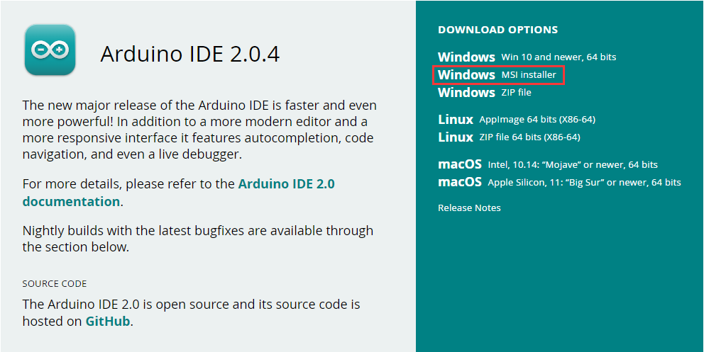
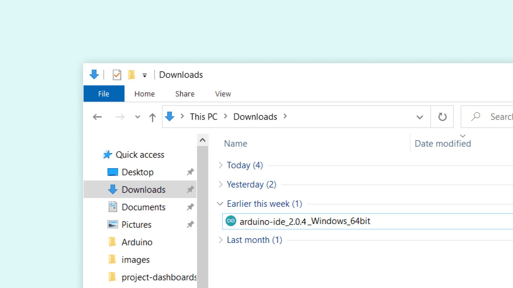
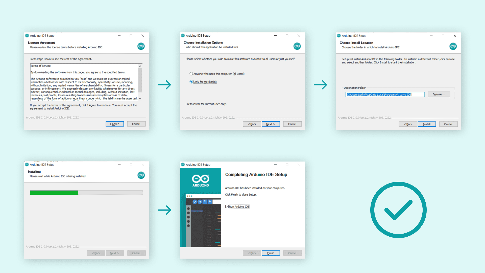
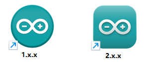
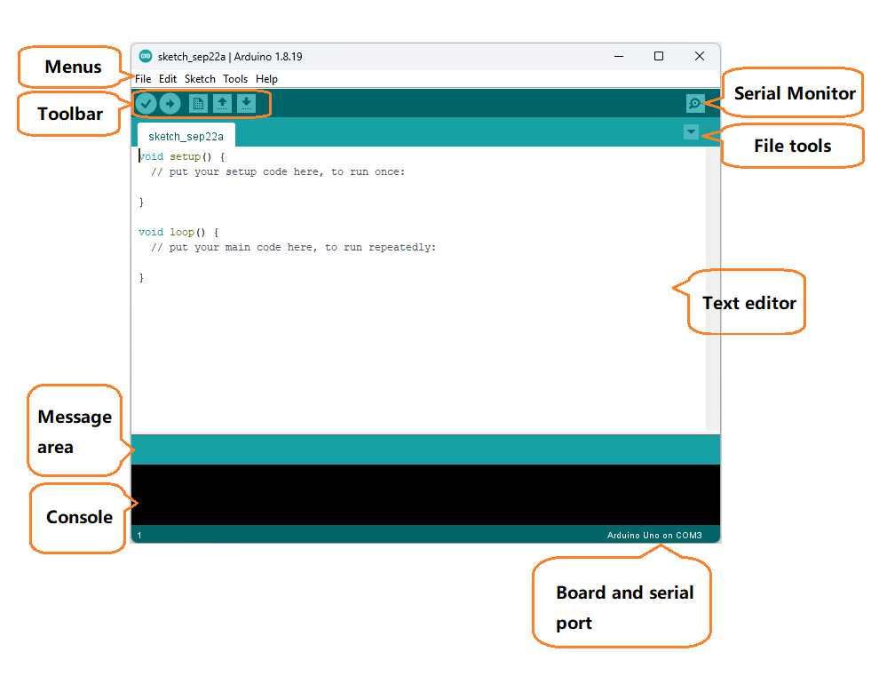
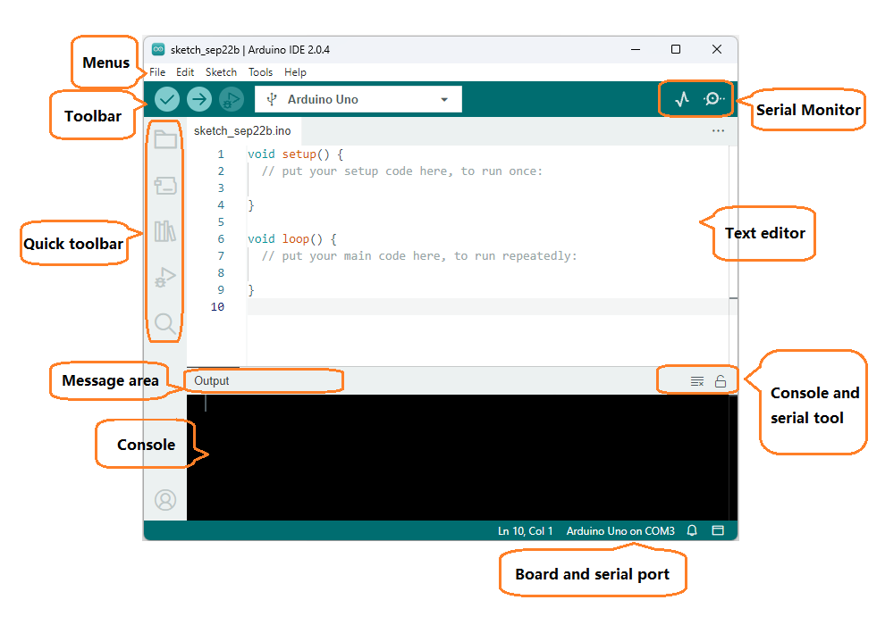
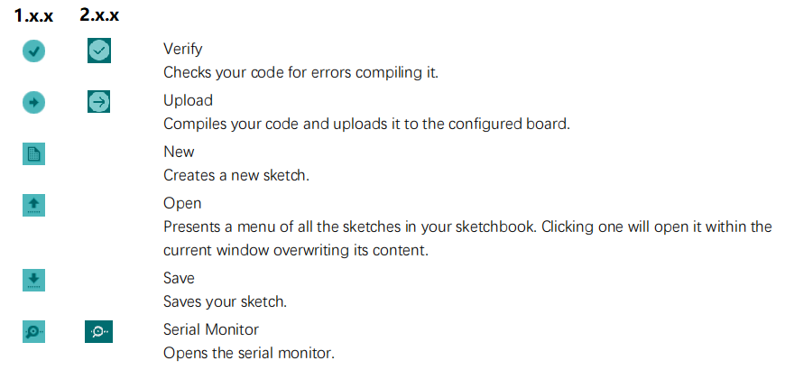
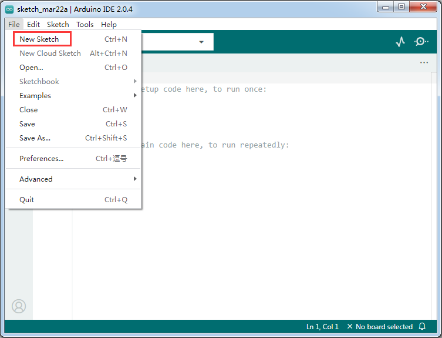
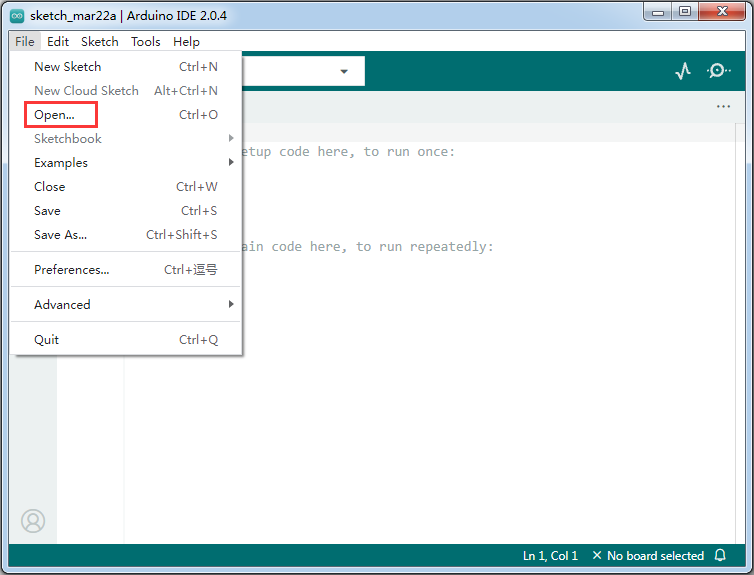
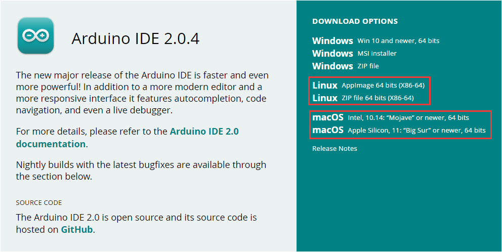

# Arduino IDE 
The purpose of this tutorial is for beginners to quickly use the Arduino IDE, so many of the more tedious details are not shown, but links to tutorials are provided.  

## Installation steps
***Windows*** - Win 10 and newer, 64 bits  
The following steps are performed on a windows PC. It is recommended that beginners use the same device.  

### Download the installation file
Download link：<https://www.arduino.cc/en/software>  
  
 Note: Please select the appropriate software version according to your computer model.     

### Installation
To install the Arduino IDE 2.x.x on a Windows computer, simply run the file downloaded from the software page.  
  

Follow the instructions in the installation guide. The installation may take several minutes.  
  

Run it. The interface of the software is as follows:    
Startup icon
 
1.x.x IDE              
     
2.x.x IDE    
    
Commonly used menus
       

## Use
### Build a new project
Run the IDE and click on the menu bar **"File" --> "New Sketch"**.  
  
Click **"File"-"save"** on the menu bar to save the project.  

### Open an existing project
Click on the menu bar **"File" --> "New Sketch"**.  
  
Then select the "**xxx.ino**" file in the project folder.  
Note: "xxx" is the name of the project.  

## Other ( In-depth study )
1. The Arduino IDE is also supported on **MAC** and **Linux** systems.  
  

2. The official website download links have a variety of old IDEs and downloads, just scroll down to find them.  
Download link：<https://www.arduino.cc/en/software>    

3. In the official website, the IDE installation method in Windows, Mac, Linux system.  
**IDE-2.X.X:** [Click here](https://docs.arduino.cc/software/ide-v2/tutorials/getting-started/ide-v2-downloading-and-installing)  
**IDE-1.8.X:** <https://www.arduino.cc/en/Guide>  
 
4. Official website IDE detailed use of the tutorial.  
**IDE-2.X.X:** [Click here](https://docs.arduino.cc/software/ide-v2?_gl=1*euk9h2*_ga*NDAzNDc1MzkzLjE2NjM5OTc5OTE.*_ga_NEXN8H46L5*MTY3OTQ3MDU1NC4yMy4xLjE2Nzk0NzI1MTEuMC4wLjA.)  
**IDE-1.8.X:** <https://www.arduino.cc/en/Guide>  

5. Learning arduino programming language.  
Link：<https://www.arduino.cc/reference/en/>  

