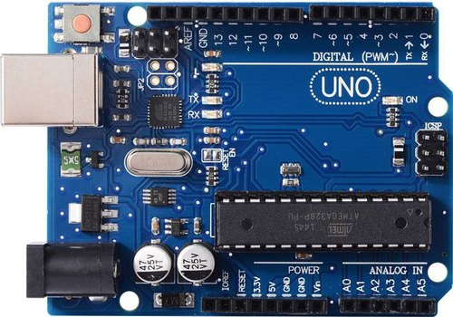

# Arduino index
---------------
   
Arduino designs, manufactures, and supports electronic devices and software, allowing people around the world to easily access advanced technologies that interact with the physical world. Our products are straightforward, simple, and powerful, ready to satisfy users’ needs from students to makers and all the way to professional developers.      

## Kit            
------
| updating | updating | updating |
| :--: | :--: | :--: |
|  |  |  |

## Motherboard       
--------------
| [A1D0000 Uno r3](../A1D0000_uno_r3/A1D0000_uno_r3.md) | [A1D0001 M328 pro](../A1D0001_m328_pro/A1D0001_m328_pro.md) | updating |
| :--: | :--: | :--: |
|  |  |  |

## Expansion board              
------------------
| [A1E0000 basic learning shield](../A1E0000_basic_learning_shield/A1E0000_basic_learning_shield.md) | updating | updating |
| :--: | :--: | :--: |
|  |  |  |

## Resource           
-----------
Arduino IDE: [Link](../arduino_ide/arduino_ide.md)      

