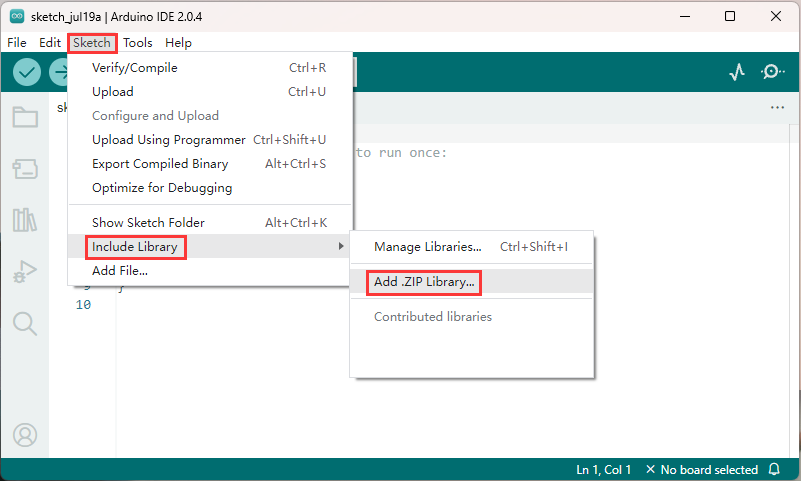

# Arduino libraries
------------------- 
A large part of the reason why Arduino is so popular with the public is that it has a huge open source library file. You only need to download the relevant library file according to the function, and then copy it to the relevant folder to program quickly. Because various functional functions have been integrated in the library file, the desired function can be realized by calling related functions as required.

## Importing a .zip library      
--------------------------- 
    

Select the "xxx.zip" library file to load into the Arduino IDE:         
       


## Manual installation          
----------------------    
When you want to add a library manually, you need to download it as a ZIP file, Unzip it and put it in the libraries folder of your sketchbook by yourself.

You can find or change the location of your sketchbook folder at **"File > Preferences > Sketchbook > Settings"** location:
    

Go to the directory where you have downloaded the ZIP file of the library Unzip the ZIP file and copy it into the "libraries" folder inside your sketchbook.
        

```{tip}   
"xxx" is the name of the library file!   
```

## Installation successful       
--------------------------
Start the Arduino Software (IDE), go to **"Sketch > Include Library"**. Verify that the library you just added is available in the list.
    

```{tip}   
"xxx" is the name of the library file!   
```

## Uninstalling an arduino Library     
----------------------------------
Uninstalling an Arduino Library is simpler than installing it. Find the sketchbook folder on your computer (same as in the **“Manual Installation”** chapter). Go to the location and open the **“libraries”** folder. Select the folder containing the library you want to delete, and then simply delete it. Next time you open your Arduino IDE, there won’t be the deleted library under the Sketch > Include Library menu.    

Libraries don’t take much space and most of the time there is no reason to remove them. If you don’t intend to use them again, though, and want to declutter the list, you can safely delete them. You can always install any Arduino Library again if you need to use it in the future.  


## Other
--------
For other methods, see (Option): <https://www.arduino.cc/en/Guide/Libraries>    
