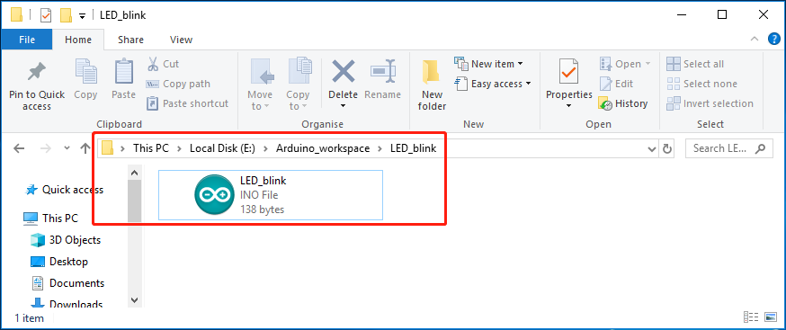
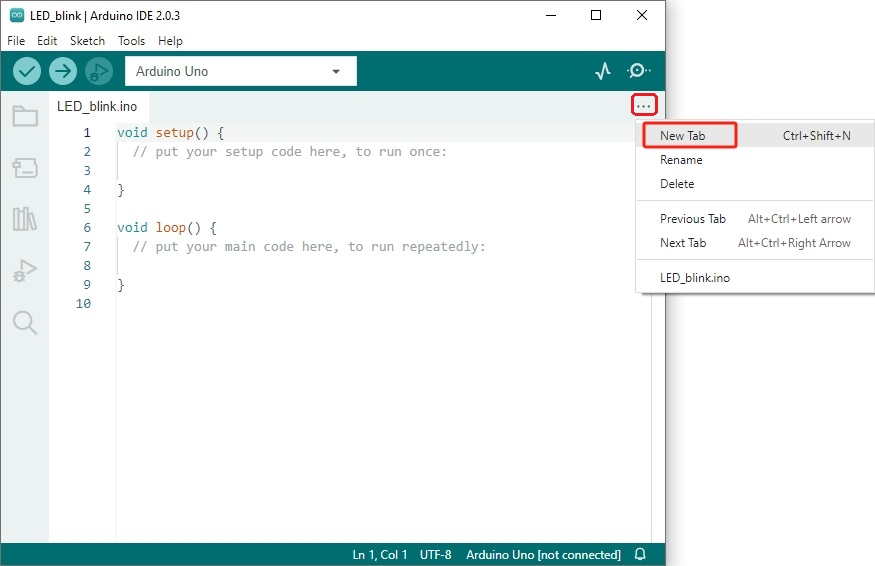
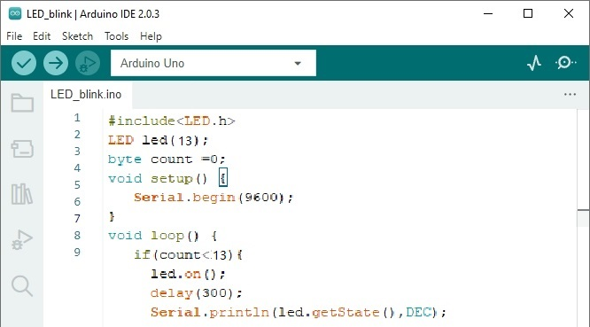

# Make_an_arduino_library    
-------------------------    
The upside of libraries is that they make your code cleaner to look at, easier to use, easier to share, and safer.         

## Learn about Arduino project   
------------------------------
### Catalog specification       
Create a new project and click the "**Ctrl+s**" key on your keyboard to save it.       
       

At this time, a dialog box pops up, name the project. Suppose it is named **"LED_blink"** and saved in my own Arduino working directory **"E:\\Arduino_workspace"**. So the IDE will automatically help us create a folder under **"Arduino_workspace"**, and put the main file in it, and the main file has the same name as the folder.    
```
 E:\Arduino_workspace\
    LED_blink\
      LED_blink.ino
```
         

### Rules for code in the main file
Every Arduino program has a main file with the suffix **".ino"**, which is the file where the program's **setup** function and **loop** function are located.    
            

Open the file, the framework is as follows:    
          

## Use multiple files in the project        
------------------------------------   
Sometimes the bigger the program gets, the messier it gets. Multiple file management can solve this problem. Arduino programs can have multiple source code files, but only one main file, which is the.ino file that stores the **"setup()"** and **"loop()"** functions.       

In order to make the code clearer, we let the main file is used to control the main logical part of the program, and the specific details are packaged into a single module, stored in other files, so that it is easy to manage.    

### Use files with no suffix   

```(tip)
In fact, the suffix is also **".ino"**, but the suffix will not be displayed in the IDE, but **".ino"** will be displayed in the resource manager of the computer, hereinafter referred to as no suffix.
```     

Click the button marked in the figure below, select the first option **\[New Tab\]**, and enter the file name.     
              

          

So our project has 2 files, a **"LED_blink"** main file and a file named **"LED"**. Then write the program in the file, which is the simplest multi-file method. as follows:   

```c++
void ledBlink(byte pin){
  digitalWrite(pin, HIGH);
  delay(500);
  digitalWrite(pin, LOW);
  delay(500);
}
```
            

```c++
void setup() {
  pinMode(13, OUTPUT);
}

void loop() {
  ledBlink(13);
}
```
  

I do not recommend using this method. This is for noobs who have no C/C++ programming experience. They don't understand that functions must be declared before they can be used after they are defined, and they don't understand the inclusion of header files. These are all done for them by the Arduino IDE. The specific processing of the IDE is in the early stage of compilation. Arduino IDE will merge the file without suffix and the main file into one file, the effect is like writing in the main file. And add **#include "Arduino.h"** in the first line of the main file (**Arduino.h** is the core header file of the Arduino program), then, the IDE scans the function definitions of the merged file and adds function declarations to the defined functions. (This is why the function we defined can be compiled even if it is not declared in the main file)      


### Use traditional C/C++ separate files      
In this way, for a code module, we need a pair of files: source file and header file, ie: **"xxx.c"** and **"xxx.h"** or **"xxx.cpp"** and **"xxx.h"** . The former is C language style, and the latter is C++ style. The official seems to recommend that we use C++ to write Arduino code. Whether it is the Arduino standard library or the tutorial, there is a strong C++ atmosphere. So I will use C++ style as an example below.    

First we think about how to control the LED, then we first write the content of the header file, then write the function implementation in the source file, and finally use this module in the main file.

For example, we want to package the LED control into a module. We need to create 2 files:    
**1. LED.h**            
    
After creating a new file, write the following code:     
```c++
/*******************
LED.h
*******************/
#ifndef _LED_H__                              // Prevents header files from being repeatedly included when used.
#define _LED_H__

#include"Arduino.h"                           // Import Arduino core headers 
class LED {
    private:
        byte pin;                             // Store the pin that control the led
     
    public:
        LED(byte p , bool state=LOW );        // Constructor function
        ~LED();                               // Destructor function

        void on();                            // Turn on the LED
        void off();                           // Turn off the LED
        bool getState();                      // Getting the LED statu
        void disattach();                     // Release pin
};

#endif
```

**2. LED.cpp**       
     
After creating a new file, write the following code:   
```c++
/*****************
LED.cpp
******************/
#include"LED.h"
#include"Arduino.h"

LED::LED(byte p,bool state):pin(p){
   pinMode(pin,OUTPUT);
   digitalWrite(pin,state);
}
LED::~LED(){
    disattach();
} 
void LED::on(){
    digitalWrite(pin,HIGH);
}
void LED::off(){
   digitalWrite(pin,LOW);
}
bool LED::getState(){
    return digitalRead(pin);
}
void LED::disattach() {     
    digitalWrite(pin,LOW);
    pinMode(pin,INPUT);
}
```

Include the header file using the **#include "LED.h"** preprocessing directive in the main file.     
**LED_blink.ino**  
        
```c++
/**********************
LED_blink：
Instantiate an LED object, control it with pin 10, let it flash 10 times, 
and print its status in the serial port, release and recover the pin after 10 times.
**********************/
#include"LED.h"

LED led(10);
byte count =0;
void setup() {
   Serial.begin(9600);
}

void loop() {
   if(count<10){
     led.on();
     delay(300);
     Serial.print("LED state:");
     Serial.println(led.getState(),DEC);
     
     led.off();
     delay(300);
     Serial.print("LED state:");
     Serial.println(led.getState(),DEC);
     
     ++count;
     if(count==10)
        led.disattach();
   }
}
```

```{note}
If the header file and the main file are in the same folder, use double quotation marks **"xxx.h"** to include the library file into the main file, as follows:
```

```c++
#include"LED.h"
```

## Make a standard library    
---------------------------         
If the above library works well for you and you use it often, you can set it up as a standard Arduino library file, and then you can include it in the Arduino IDE and use it.     

Arduino's extension libraries can be placed under the libraries directory:     
         

We need to create a folder in this directory. For example, the above example is LED control, so I created a folder named "LED", and then created 2 empty folders ( **examples** and **src** ) and 2 Empty files ( **"keywords.txt"** and **"library.properties"** ):    
          

Then copy the written **"LED.cpp"** and **"LED.h"** files into the src file.      
           

Create a new folder named **"LED_blink"** in the examples folder, and copy the **"LED_blink.ino"** file into it, as follows: 
 

In this way, our main file becomes a example program in the library file. In the sample, we need to use angle brackets **"#include<xxx.h>"** to include standard files, as follows:       
```c++
#include<LED.h>    
LED led(10);
byte count =0;

void setup() {
   Serial.begin(9600);
}

void loop() {
    if(count<10){
        led.on();
        delay(300);
        Serial.println(led.getState(),DEC);
     
        led.off();
        delay(300);
        Serial.println(led.getState(),DEC);
     
        ++count;
        if(count==10)
            led.disattach();
    }
}
```

```{note}
Since the LED control module is already a standard library, use angle brackets **"#include<xxx.h>"** to include library files, as follows: 
``` 

```c++
#include<LED.h>
```

There is a **"keywords.txt"** file in the LED folder, which is used to configure syntax highlighting for custom libraries. If not configured, the Arduino IDE cannot render highlighted colors.      
          

The following is the analysis of **"keywords.txt"**:     
```
Format: word Tab Description

Word: It is the keyword you want to highlight.
Tab: the tab key on the keyboard.

Possible values for DESCRIPTION:
KEYWORD1 --> highlight class name
KEYWORD2 --> Highlight method name
KEYWORD3 --> highlight library file name
LITERAL1 --> highlight constant name
```

The beginning of "#" is a comment and can be omitted.     
```
# Library (KEYWORD3)
LED  KEYWORD3

# Methods and Functions (KEYWORD2)
on  KEYWORD2
off  KEYWORD2
getState  KEYWORD2
disattach  KEYWORD2
```

There is also a **"library.properties"** file in the "LED" folder, which is a configuration library that can display the library name in the Arduino IDE. The contents are as follows:     
```
name=LED
version=*
author=*
maintainer=*
sentence=*
paragraph=*
category=*
url=*
architectures=*
depends=*
```

You can change the * symbol to the required content according to your personal needs, please refer to the following link settings:     
<https://arduino.github.io/arduino-cli/0.24/library-specification/#library-metadata>   

After configuration, you can find the standard library named "LED" and the example code of the library in the Arduino IDE menu **"File"** --> **"examples"**.     


More info: <https://docs.arduino.cc/learn/contributions/arduino-creating-library-guide>      


--------
**End!**      
