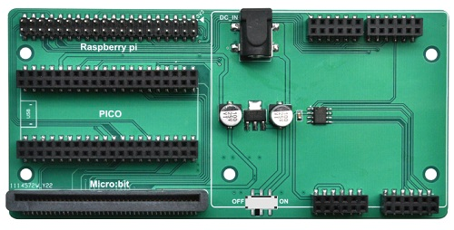
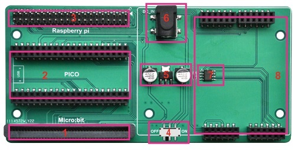
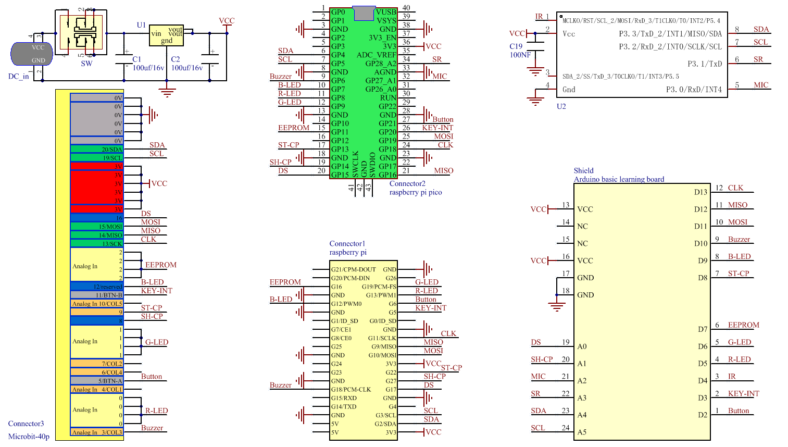
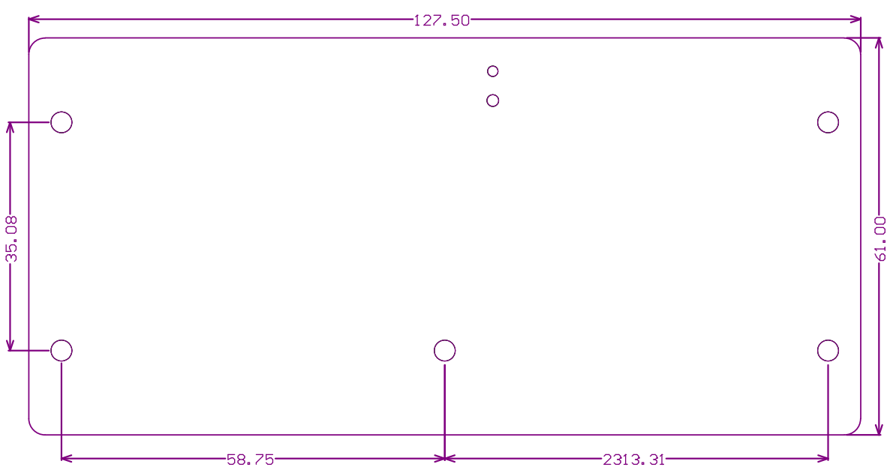
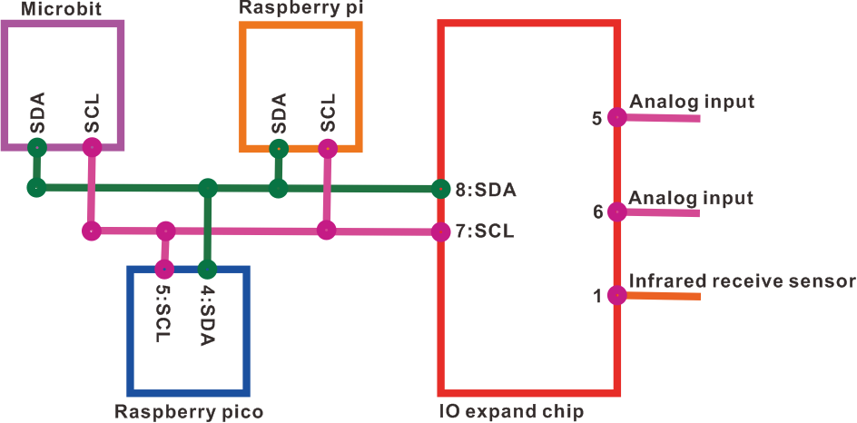
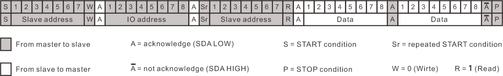

# C1E0000_3in1_basic_learing_shield          
-----------------------------------
       
The 3in1 Basic learning shield enables the [arduino Basic Learning shield](../../arduino/A1E0000_basic_learing_shield/A1E0000_basic_learing_shield.md) to be used on microbit, raspberry pico, and raspberry pi. And provides the corresponding tutorial and sample code, use is very convenient and simple.  

## Specification         
----------------
1. DC jack input power: 4 to 12V  
2. Operating Voltage: 3.3V  
2. Operating Current: Max 1000mA  
3. Weight: about 48g  
4. Dimensions: 127.5*61mm  

## Meet 3in1 basic learing shield              
---------------------------------
|  |
| :-- |
| 1. Microbit motherboard slot.|
| 2. Raspberry PICO motherboard slot. |
| 3. Raspberry Pi IO pin slot. |
| 4. DC jack power switch. |
| 5. 3.3V regulated power supply. |
| 6. DC jack input power. |
| 7. IO expand chip. |
| 8. [Arduino Basic Learning shield](../../arduino/A1E0000_basic_learning_shield/A1E0000_basic_learning_shield.md) slot. |

## Schematic diagram             
--------------------
  

## Dimensional drawing            
----------------------
  

## IO expand              
------------
The 3in1 basic learing shield is integrated with an IO expansion chip, which is an I2C slave chip and the slave address is 0x5a. The microbit, raspberry pico, and raspberry pi communicate with the chip through the I2C interface, which can be expanded with 2 analog input ports, and an infrared receive sensor communication port (NEC).  

  

**I2C Communication protocol:**  
  
<span style="color: rgb(255, 76, 65);">Maximum clock speed: 100K</span> 

|  Slave address  |  IO address  |  2 bytes of data  |
| :--: | :--: | :--: |
| 0x2d | 0x00, 0x02, 0x04 | IO data read by the expansion chip |      

The I2C communication protocol can be referred to: [Click me](../../various_resources/iic/iic.md)  

**Analog input:**  
The 2-channel analog input is a 10-bit analog-to-digital converter corresponding to the 5pin and 6pin of the IO expansion chip, and the IO addresses are as follows:  
      
<span style="color: rgb(255, 76, 65);">Pin5:</span>       

|  Slave address  |  IO address  |  Data  |  Data  |      
| :--: | :--: | :--: | :--: |   
| 0x2d | 0x00 | 0 | L_byte |               

<span style="color: rgb(255, 76, 65);">Pin6:</span>        

|  Slave address  |  IO address  |  Data  |  Data  |      
| :--: | :--: | :--: | :--: |   
| 0x2d | 0x02 | 0 | L_byte |         

**Infrared receive sensor communication port:**         

<span style="color: rgb(255, 76, 65);">Pin1:</span> 

|  Slave address  |  IO address  |  Data  |  Data  |      
| :--: | :--: | :--: | :--: |   
| 0x2d | 0x04 | H_byte | L_byte |         

1. This interface is used to connect external infrared receiving sensors and supports only the [NEC infrared communication protocol](../../various_resources/nec/nec.md).         

2. <span style="color: rgb(255, 76, 65);">Through the above I2C protocol, 2 bytes of data will be obtained, the first byte is the inverse code of the infrared remote control device, the second byte is the command code of the infrared remote control.</span>        

## Example code             
--------------       
Arduino Uno ( C & C++ ):    
```c & c++
#include <Wire.h>

unsigned int slave_addr = 0x2d;

unsigned int readi2c(char io_addr){
  char i = 0;
  int  Byte[2] = {0,0};
  
  Wire.beginTransmission(slave_addr);   // transmit to device 
  Wire.write(io_addr);                  // sends value byte
  Wire.endTransmission(false);          // stop transmitting
  Wire.requestFrom(slave_addr, 2);      // request 4 bytes from slave device
  while(Wire.available()){              // slave may send less than requested  
    Byte[i] = Wire.read();              // receive a byte as character
    i++;
  }
  return Byte[0]*255+Byte[1];
}

void setup() {
  Serial.begin(9600);
  Wire.begin();
}

void loop() {
  Serial.print("chan3.0: ");
  Serial.println(readi2c(0x00));

  Serial.print("chan3.1: ");
  Serial.println(readi2c(0x02));

  Serial.print("ir receiver: ");
  Serial.println(readi2c(0x04),HEX);
  delay(1000);
}
```


Raspberry Pi4 ( C ):      
```c
#include <stdio.h>
#include <bcm2835.h>

unsigned int slave_addr = 0x2d;

char i2c_init(void){
    if (!bcm2835_init()){
      printf("bcm2835_init failed. Are you running as root??\n");
      return -1;
    }

    	// I2C begin if specified
	if (!bcm2835_i2c_begin()){
		printf("bcm2835_i2c_begin failed. Are you running as root??\n");
		return -1;
	}
	// I2C clock: 100k
	bcm2835_i2c_set_baudrate(100000);
	return 0;
}

// io_addr： 0x00, 0x02 and 0x04
unsigned int i2c_read(unsigned char io_addr){
	unsigned int res = 0;
	char reg[1] = {io_addr};
	char buf[3] = {0, 0};

	bcm2835_i2c_setSlaveAddress(slave_addr);
	bcm2835_i2c_write_read_rs(reg, 1, buf, 2);
	res = (buf[0]*256) + buf[1];
	return res;
}
```


