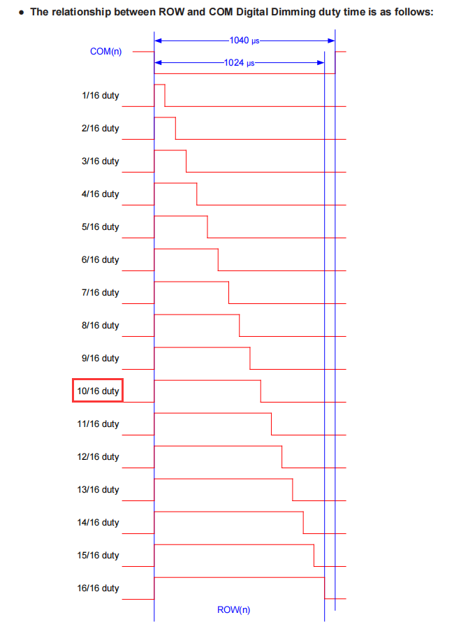
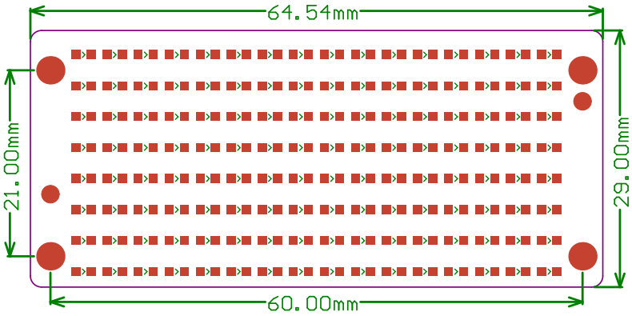

# C1M0000_8x16dot_matrix        
------------------------
    

## Specification    
----------------  
• Operating voltage: 3.0V-5.0V      
• Operating current: < 400mA      
• Pixel: 8x16 dot       
• Colour: blue      
• Communication: IIC     
• Connector: XH2.54-4P      
• Size: 64.54\*29.0mm       
• Driver chip: [HT16K33](../../_static/pdf/chip/ht16k33.PDF)          
Because the booster circuit of the module can only provide a maximum current of 400mA, the maximum drive brightness of the HT16K33 can only be less than 10/16 duty, as shown below:         
        

## Dimension figure      
-------------------  
      

## Sample code     
-------------- 
For Pico: [MicroPython](https://github.com/Mosiwi/Mosiwi-space-station-kit-for-pico/blob/main/MicroPython/Mosiwi_lib_examples/Mosiwi_dotmatrix.py)   

## Application example     
----------------------  
[R1K0000_space_station_kit_for_pico](../../raspberry/R1K0000_space_station_kit/R1K0000_space_station_kit.md)       

