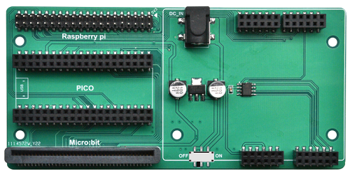

# C1E0000_3in1_basic_learing_shield

## Overview
  
The 3in1 Basic learning shield enables the [arduino Basic Learning shield](../../arduino/A1E0000_basic_learing_shield/A1E0000_basic_learing_shield.md) to be used on microbit, raspberry pico, and raspberry pi. And provides the corresponding tutorial and sample code, use is very convenient and simple.  

## Specification
1. DC jack input power: 4 to 12V  
2. Operating Voltage: 3.3V  
2. Operating Current: Max 1000mA  
3. Weight: about 48g  
4. Dimensions: 127.5*61mm  

## Meet 3in1 basic learing shield
|  |
| :-- |
| 1. Microbit motherboard slot.|
| 2. Raspberry PICO motherboard slot. |
| 3. Raspberry Pi IO pin slot. |
| 4. DC jack power switch. |
| 5. 3.3V regulated power supply. |
| 6. DC jack input power. |
| 7. IO expand chip. |
| 8. [Arduino Basic Learning shield](../../arduino/A1E0000_basic_learning_shield/A1E0000_basic_learning_shield.md) slot. |

## Schematic diagram
  

## Dimensional drawing
  

## IO expand
The 3in1 basic learing shield is integrated with an IO expansion chip, which is an I2C slave chip and the slave address is 0x5a. The microbit, raspberry pico, and raspberry pi communicate with the chip through the I2C interface, which can be expanded with 2 analog input ports, and an infrared receive sensor communication port (NEC).  

  

**I2C Communication protocol:**  
  
Maximum clock speed: 100K 

|  Slave address  |  IO address  |  Data  |
| :--: | :--: | :--: |
| 0x5a | 0x00, 0x02, 0x04 | IO data read by the expansion chip |      

The standard I2C communication protocol can be referred to: [Link](../../_static/pdf/communication_protocol/UM10204%28I2C_Bus_Specification_and_User_Manual_%29.pdf)  

**Analog input:**  
The 2-channel analog input is a 10-bit analog-to-digital converter corresponding to the 5pin and 6pin of the IO expansion chip, and the IO addresses are as follows:  
|Analog input Pin:|  5  |  6  |
| :--: | :--: | :--: |
| IO address: | 0x00 | 0x02 |

**Infrared receive sensor communication port:**  
1\. This interface is used to connect external infrared receiving sensors and supports only the [NEC infrared communication protocol](../../common_resource/nec_communication_protocol/nec_communication_protocol.md). The IO address is **0x04**.   

2\. Through the above I2C protocol, 2 bytes of data will be obtained, the first byte is the inverse code of the infrared remote control device, the second byte is the command code of the infrared remote control.        

