# Advanced tutorial   
Learn communication protocol, driver programming and Arduino library development based on "UNO board + expansion board", and crack Arduino programming deeply with the lowest cost.      

## Previous preparation   
1. Install the [**Arduino IDE**](../../../arduino/arduino_ide/arduino_ide.md).  
2. Install the [**Mosiwi basic learning kit**](../../../arduino/A1E0000_basic_learning_shield/A1E0000_basic_learning_shield.md#Integration-library) library.    
3. Basic operation of the [**Arduino UNO R3**](../../../arduino/A1D0000_uno_r3/A1D0000_uno_r3.md) motherboard.    

## Chapter1 Arduino    
The essence of the Arduino programming language is a combination of C and C++ programming languages, and there is only one main() function, and the initial program entry is also the main() function. In order to allow more people to use the Arduino platform to develop products, the Arduino team tried every means to lower the threshold of programming and hide the tedious details of program development. Open the "main.cpp" file under the Arduino IDE installation file as shown in the figure below, and you can intuitively analyze the above description.         
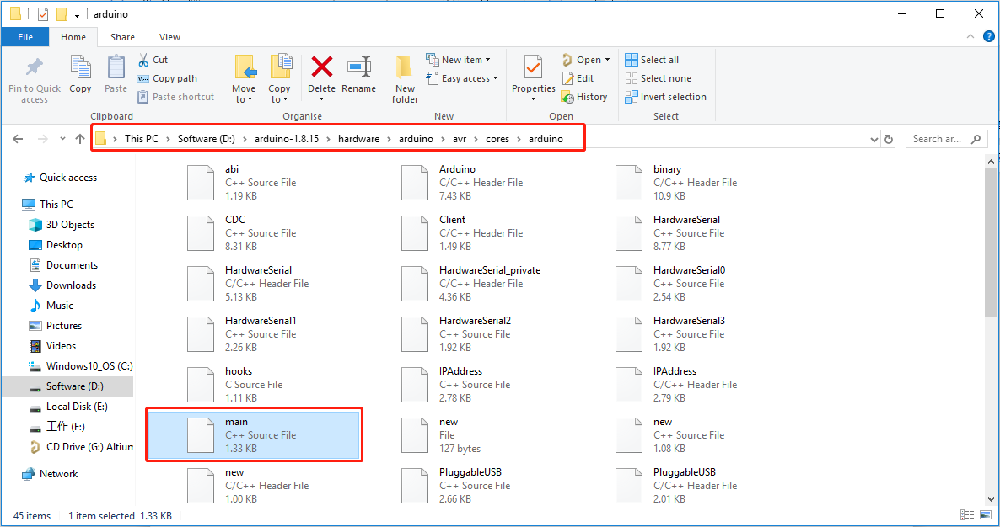       
       
As can be seen from the figure above, the setup() and loop() functions in the Arduino IDE are only called in the main() function, and they are just ordinary function types.       

The definition of some other keywords and commonly used functions can also be found in the header file in the same folder as "main.cpp", and many other definitions can be found in the following path:     
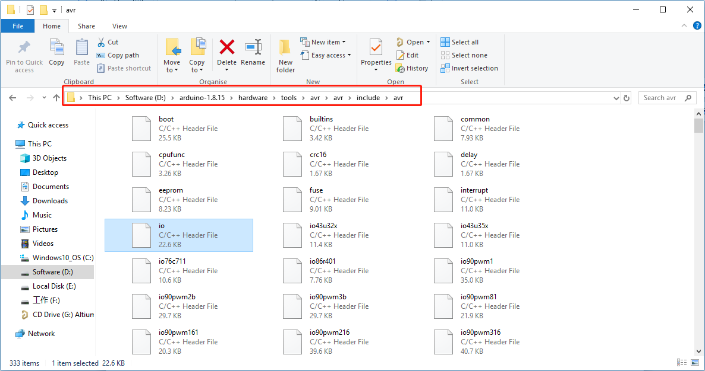       


## Chapter2 Library files for Arduino
A large part of the reason why Arduino is so popular with the public is that it has a huge open source library file. You only need to download the relevant library file according to the function, and then copy it to the relevant folder to program quickly. Because various functional functions have been integrated in the library file, the desired function can be realized by calling related functions as required.      

**1. Learn about Arduino project:**    
■ Catalog specification    
When creating an empty project, press **Ctrl+s** on the keyboard to save it.     
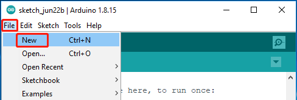       

At this time, a dialog box pops up, name the project. Suppose it is named **"LED_blink"** and saved in my own Arduino working directory **"E:\\Arduino_workspace\\"**. So the IDE will automatically help us create a folder under Arduino_workspace, and put the main file in it, and the main file has the same name as the folder.    
```
 E:\Arduino_workspace\
    LED_blink\
      LED_blink.ino
```
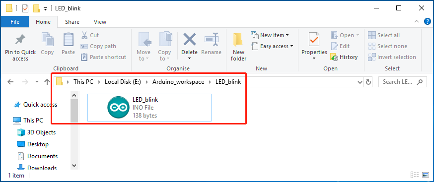       

■ Rules for code in the main file
Every Arduino program has a main file with the suffix .ino, which is the file where the program's setup function and loop function are located.    
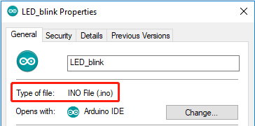       

Open the file, the framework is as follows:    
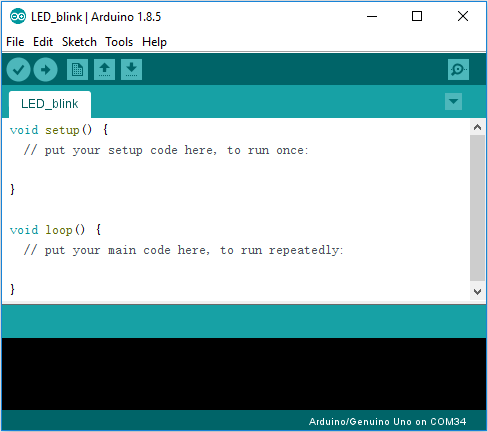       

**2. Use multiple files in the project:**      
Sometimes the bigger the program gets, the messier it gets. Multiple file management can solve this problem. Arduino programs can have multiple source code files, but only one main file, which is the.ino file that stores the **"setup()"** and **"loop()"** functions.       

In order to make the code clearer, we let the main file is used to control the main logical part of the program, and the specific details are packaged into a single module, stored in other files, so that it is easy to manage.    

■ Use files with no suffix (in fact, the suffix is also .ino, but the suffix will not be displayed in the IDE, but .ino will be displayed in the resource manager of the computer, hereinafter referred to as no suffix)     

Click the button marked in the figure below, select the first option **\[New Tab\]**, and enter the file name.     
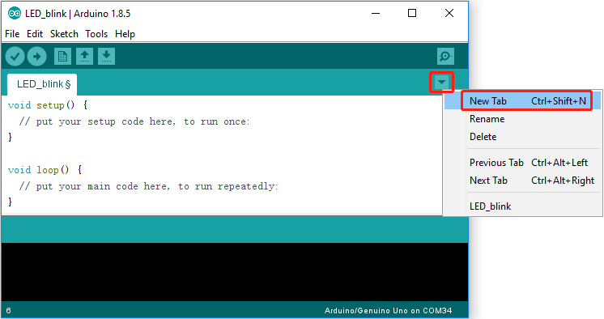       
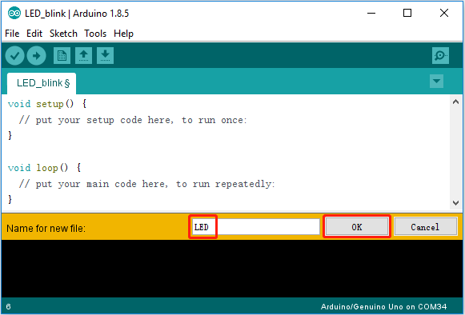       

So our project has 2 files, a **"LED_blink"** main file and a file named **"LED"**. Then write the program in the file, which is the simplest multi-file method. as follows:    
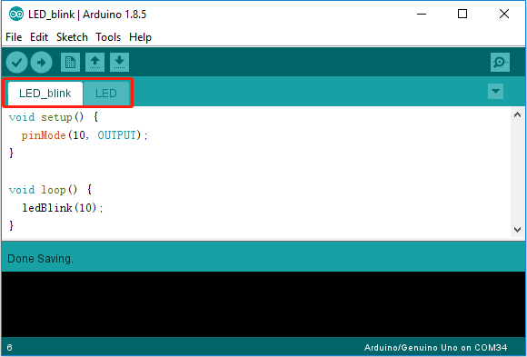       
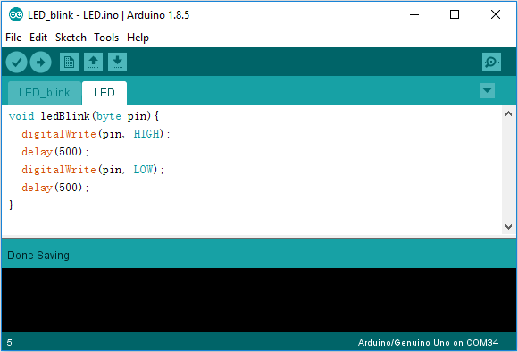       

I do not recommend using this method. This is for noobs who have no C/C++ programming experience. They don't understand that functions must be declared before they can be used after they are defined, and they don't understand the inclusion of header files. These are all done for them by the Arduino IDE. The specific processing of the IDE is in the early stage of compilation. Arduino IDE will merge the file without suffix and the main file into one file, the effect is like writing in the main file. And add **#include "Arduino.h"** in the first line of the main file (**Arduino.h** is the core header file of the Arduino program), then, the IDE scans the function definitions of the merged file and adds function declarations to the defined functions. (This is why the function we defined can be compiled even if it is not declared in the main file)      

But the official made it clear that this mechanism for automatically inserting function declarations is not perfect! So I also suggest that you develop the habit of manually declaring functions.     
```
Also, this generation isn't perfect: it won't create prototypes for functions that have default argument values, or which are declared within a namespace or class.  
```

■ Use traditional C/C++ separate files     
In this way, for a code module, we need a pair of files: source file and header file, ie: **x.c** and **x.h** or **x.cpp** and **x.h** . The former is C language style, and the latter is C++ style. The official seems to recommend that we use C++ to write Arduino code. Whether it is the Arduino standard library or the tutorial, there is a strong C++ atmosphere. So I will use C++ style as an example below.    

For example, we want to package the LED control into a module. We need to create 2 files: LED.h, LED.cpp   
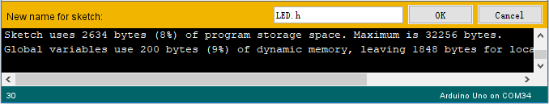       
       
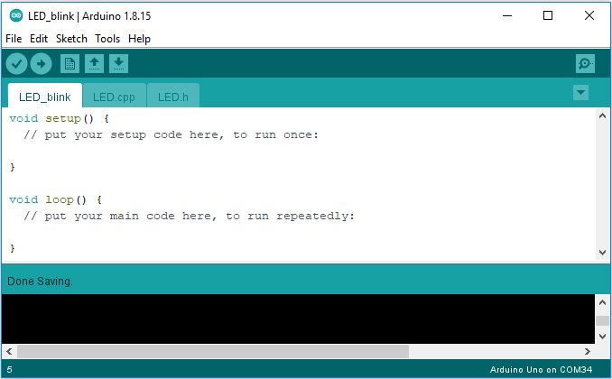       

First we think about how to control the LED, then we first write the content of the header file, then write the function implementation in the source file, and finally use this module in the main file. Include the header file using the **#include "LED.h"** preprocessing directive in the main file.       
```
/*******************
LED.h
*******************/
#ifndef _LED_H__                              // Prevents header files from being repeatedly included when used.
#define _LED_H__

#include"Arduino.h"                           // Import Arduino core headers 
class LED {
    private:
        byte pin;                             // Store the pin that control the led
     
    public:
        LED(byte p , bool state=LOW );        // Constructor function
        ~LED();                               // Destructor function

        void on();                            // Turn on the LED
        void off();                           // Turn off the LED
        bool getState();                      // Getting the LED statu
        void disattach();                     // Release pin
};

#endif
```
```
/*****************
LED.cpp
******************/
#include"LED.h"
#include"Arduino.h"

LED::LED(byte p,bool state):pin(p){
   pinMode(pin,OUTPUT);
   digitalWrite(pin,state);
}
LED::~LED(){
    disattach();
} 
void LED::on(){
    digitalWrite(pin,HIGH);
}
void LED::off(){
   digitalWrite(pin,LOW);
}
bool LED::getState(){
    return digitalRead(pin);
}
void LED::disattach() {     
    digitalWrite(pin,LOW);
    pinMode(pin,INPUT);
}
```
```
/**********************
LED_blink：
Instantiate an LED object, control it with pin 10, let it flash 10 times, 
and print its status in the serial port, release and recover the pin after 10 times.
**********************/
#include"LED.h"

LED led(10);
byte count =0;
void setup() {
   Serial.begin(9600);
}

void loop() {
   if(count<10){
     led.on();
     delay(300);
     Serial.print("LED state:");
     Serial.println(led.getState(),DEC);
     
     led.off();
     delay(300);
     Serial.print("LED state:");
     Serial.println(led.getState(),DEC);
     
     ++count;
     if(count==10)
        led.disattach();
   }
}
```
Note: If the header file and the main file are in the same folder, use double quotation marks **"xx.h"** to include the library file into the main file, as follows:
```
#include"LED.h"
```

**3. Make it a standard library!**
If the above library works well for you and you use it often, you can set it up as a standard Arduino library file, and then you can include it in the Arduino IDE and use it.     

Arduino's extension libraries can be placed under the libraries directory:     
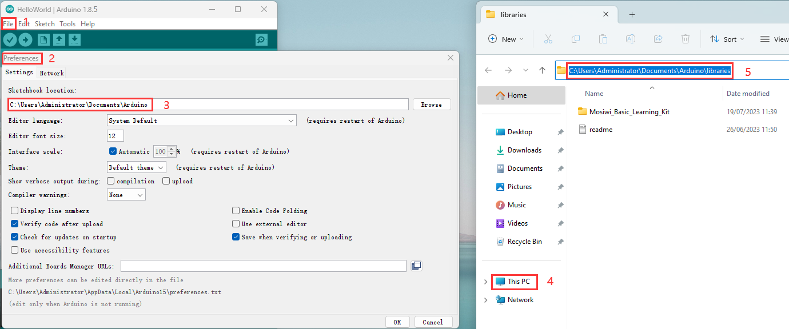       
The usual default path: **C:\\Users\\Administrator\\Documents\\Arduino**    

We need to create a folder in this directory. For example, the above example is LED control, so I created a folder named "LED", and then created 2 empty folders ( examples and src ) and 2 Empty files ( keywords.txt and library.properties ):    
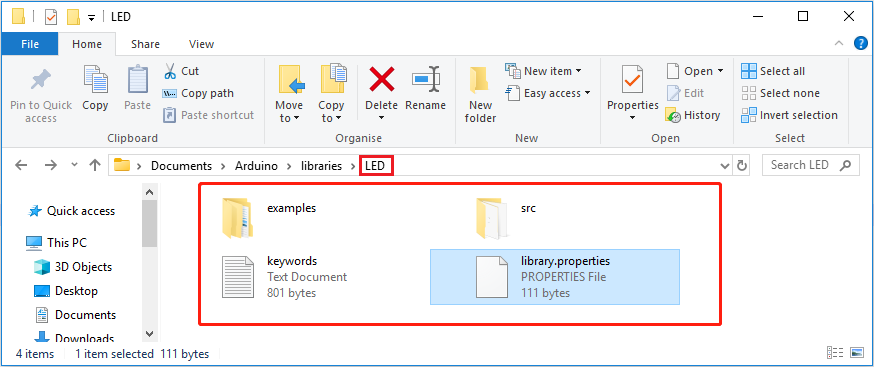       

Then copy the written ".cpp" and ".h" files into the src file. Create a new folder named "LED_blink" in the examples folder, and copy the "LED_blink.ino" file into it, as follows:     
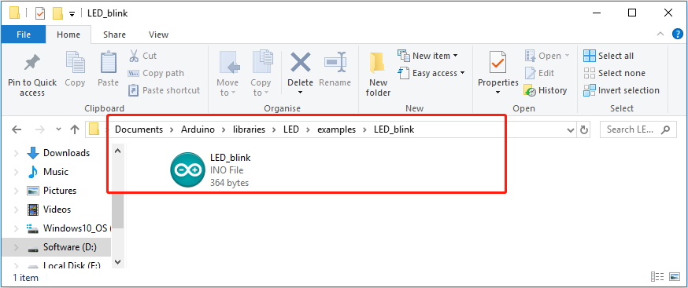       

In this way, our main file becomes a sample program in the library file. In the sample, we need to use angle brackets **< >** to include standard files, as follows:       
```
#include<LED.h>    
LED led(10);
byte count =0;

void setup() {
   Serial.begin(9600);
}

void loop() {
    if(count<10){
        led.on();
        delay(300);
        Serial.println(led.getState(),DEC);
     
        led.off();
        delay(300);
        Serial.println(led.getState(),DEC);
     
        ++count;
        if(count==10)
            led.disattach();
    }
}
```

Note: Since the LED control module is already a standard library, use angle brackets **< >** to include library files, as follows:    
```
#include<LED.h>
```
There is a "keywords.txt" file in the LED folder, which is used to configure syntax highlighting for custom libraries. If not configured, the Arduino IDE cannot render highlighted colors.      
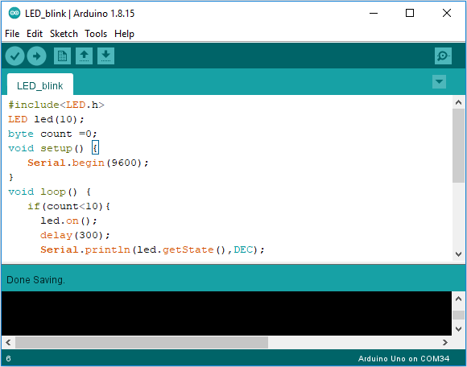       

The following is the analysis of keywords.txt:     
```
Format: word Tab Description

Word: It is the keyword you want to highlight.
Tab: the tab key on the keyboard.

Possible values for DESCRIPTION:
KEYWORD1 --> highlight class name
KEYWORD2 --> Highlight method name
KEYWORD3 --> highlight library file name
LITERAL1 --> highlight constant name
```
The beginning of "#" is a comment and can be omitted.     
```
# Library (KEYWORD3)
LED  KEYWORD3

# Methods and Functions (KEYWORD2)
on  KEYWORD2
off  KEYWORD2
getState  KEYWORD2
disattach  KEYWORD2
```
There is also a library.properties file in the "LED" folder, which is a configuration library that can display the library name in the Arduino IDE. The contents are as follows:     
```
name=LED
version=*
author=*
maintainer=*
sentence=*
paragraph=*
category=*
url=*
architectures=*
depends=*
```
You can change the * symbol to the required content according to your personal needs, please refer to the following link settings:     
<https://arduino.github.io/arduino-cli/0.24/library-specification/#library-metadata>   

After configuration, you can find the standard library named "LED" and the sample code of the library in the Arduino IDE menu "File" --> "examples".     
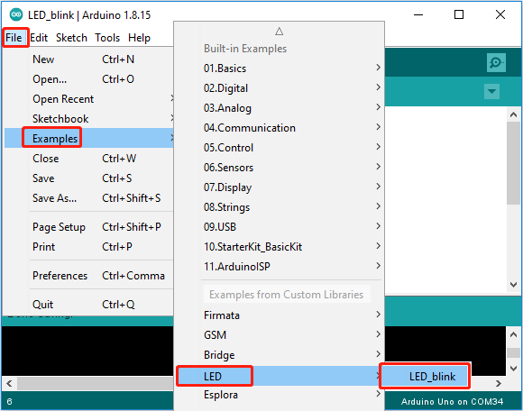       
More info: <https://docs.arduino.cc/learn/contributions/arduino-creating-library-guide>      


## Chapter3 Serial port
**1. Puzzled**
There are many serial port products on the market, such as RS232, RS485, TTL, which can be divided into simplex, half-duplex and full-duplex communication, but they cannot be used together, which can easily confuse everyone. This is because people don't know the difference between them. Now let's study them in detail and divide them into protocol layer, physical layer and communication to explain.       

**2. Protocol layer**
The serial port communication protocol mentioned here is based on UART (Universal Asynchronous Receiver-Transmitter), which specifies the format of sending and receiving data between two devices. The device has two hardware units, one is the transmitter (TX) and the other is the receiver (RX). The connection between the two devices is as follows:     
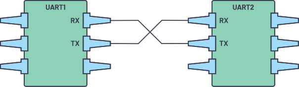       

The main purpose of each device's transmitter and receiver is to send and receive data on the serial data line.    
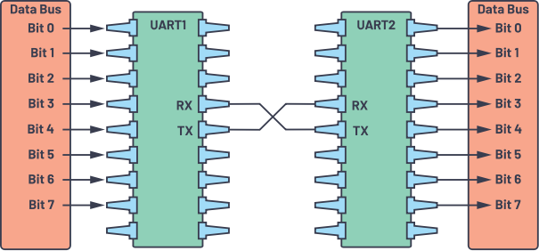       
The transmitting UART is connected to the control data bus that transmits data in parallel, and the parallel data is serially transferred bit by bit on the transmission line to the receiving UART. The receiver converts the serial data to parallel data and transmits it to the parallel device.     

For UART and most serial communications, the same baud rate needs to be set on the sending and receiving devices. In serial port communications, the baud rate determines the maximum number of bits transferred per second.    

UART summary:    
1. Number of wires: 2   
2. Baud rate: 9600, 19200, 38400, 57600, 115200, 230400, 460800, 921600, 1000000, 1500000    
3. Transmission method: asynchronous     
4. Maximum number of hosts: 1     
5. Maximum number of slaves: 1      

A UART device does not use a clock signal to synchronize the transmitter and receiver devices, it transmits data asynchronously. While the receiver uses its internal clock signal to sample the incoming data, the transmitter also generates the bit stream based on its internal clock signal, and no clock signal is required between the receiver and transmitter to synchronize the data. Use the same baud rate on both devices to manage the synchronization point, failure to do so may affect the time to send and receive data, resulting in discrepancies in data processing. Under the premise that the timing of the bits does not deviate too much, the maximum allowable difference in the baud rate is 10%.       

In UART devices, data is transferred in packets. The transmitter and receiver need to create serial data packets and control these physical hardware lines for data transfer. A data packet consists of start bits, data frames, parity bits, and stop bits.     
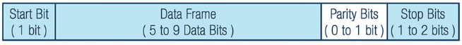       

Start bit:   
The data line of a UART device is normally held high when not transmitting data. To start a data transfer, the transmitting UART pulls the transmission line from high to low for 1 clock cycle. When the receiving UART detects a high-to-low transition, it starts reading the bits in the data frame at the set baud rate.    
       

Data frame:    
The data frame contains the actual data being transmitted. If parity bits are used, it can be 5 and up to 8 bits. If parity bits are not used, the data frame can be 9 bits. In most cases, the lowest bit of the data is sent first.     
       

Parity bits:   
The parity bit describes whether a number is even or odd. The parity bit is a way for the receiving UART to determine whether the data has changed during transmission. Bits can be altered by electromagnetic radiation or mismatched baud rates.     
After the receiving UART reads the data frame, it calculates the sum of the values of the bits in the data frame that are 1 and checks whether the sum is even or odd.  If the parity bit is 0, the sum of bits that are 1 in the data frame should be even. If the parity bit is 1, the sum of bits that are 1 in the data frame should be odd.    
       

To signal the end of a data packet, the transmitting UART drives the data transmission line from low voltage to high voltage for a duration of 1 to 2 bits.    
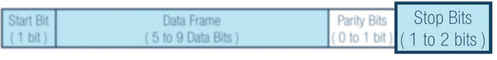       


**UART transmission steps:**
1\. The sending UART receives data from the data bus in parallel.   
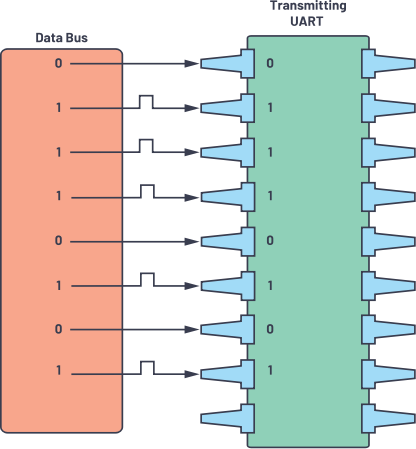       

2\. The sending UART adds the start, parity and stop bits to the data frame.    
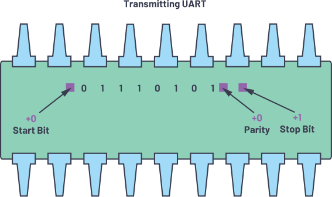       

3\. The entire data packet is sent serially to the receiving UART, which samples the data line at a preconfigured internal baud rate.   
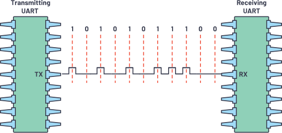       

4\. After verifying the received data successfully, the receiving UART discards the start bit, parity bit and stop bit of the data frame.     
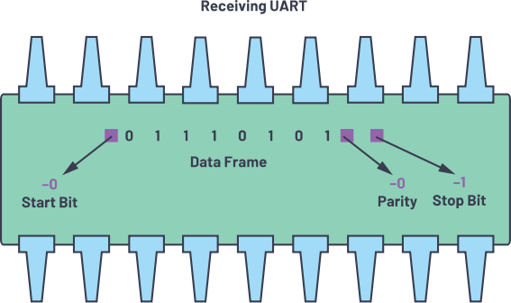       

5\. The receiving UART converts the serial data back to parallel data and transmits it to the parallel data bus on the receiving end.     
       

**3. physical layer**
The physical layer is to optimize the interface shape or communication data level voltage, so that the transmission distance is longer, and the data transmission is faster and more accurate.       

1\. RS232    
The RS-232 interface conforms to the serial data communication interface standard formulated by the Electronic Industry Alliance (EIA) of the United States, and its full name is EIA-RS-232. It defines the interface between DTE (data terminal devices such as computers) and DCE (data communication devices such as modems) devices using serial binary data exchange.     
       

The line voltage range of RS232 is -25V to +25V. They are divided into signal voltage and control voltage.      
The signal voltage between +3V and +25V represents logic "1", and the signal voltage between -3V and -25V represents logic "0". However, the control voltage signal uses negative logic, that is, logic "1" represents -3 to -25 volts and logic "0" represents +3V to +25V. The voltage from -3V to +3V is considered as an uncertain state.     
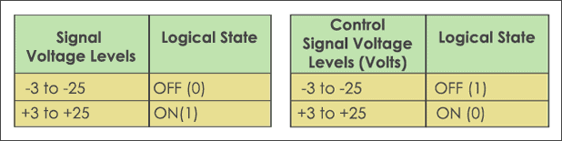       

DB9 interface:     
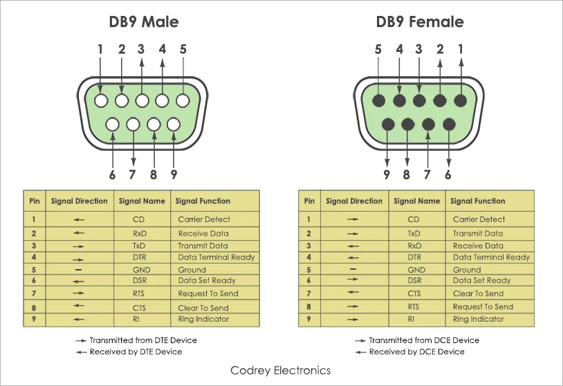       

2\. RS485
The RS-485 standard name is TIA/EIA-485-A, RS-485 makes up for the shortcomings of RS-232 short communication distance and low rate. RS-485 is differential transmission and uses A pair of twisted pair wires where one wire is defined as A and the other as B with R receiver and D transmitter inside. It is recommended to add pull-up and pull-down resistors to the terminals of the bus to eliminate interference signals generated externally when the bus is idle.      
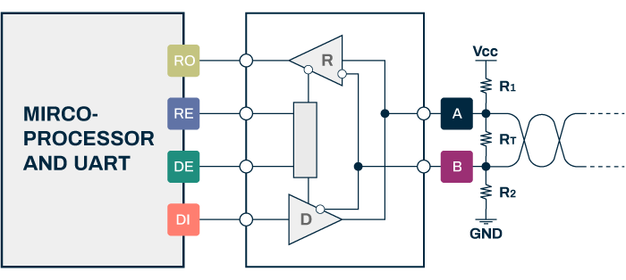       

Pin Description:     
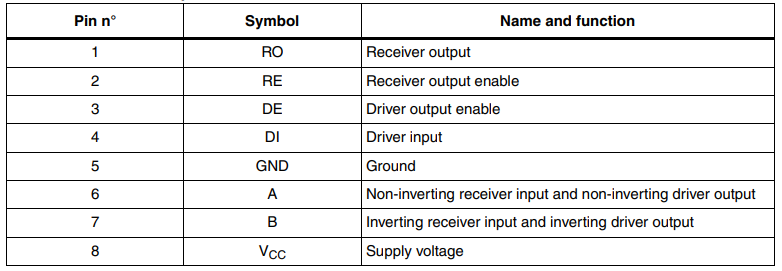       

Calculate the resistance formula (assuming that the terminal resistance Rt = 120 Ω, 200mV is the minimum threshold voltage of R receiver) :     
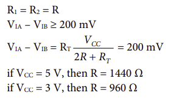       

Truth table:   
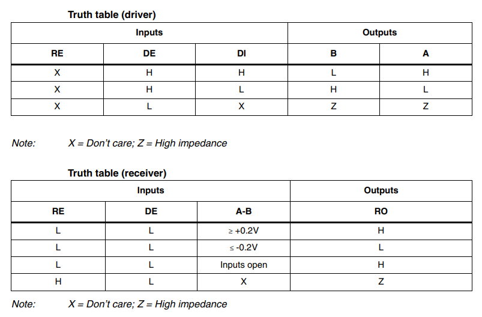       

Wiring:    
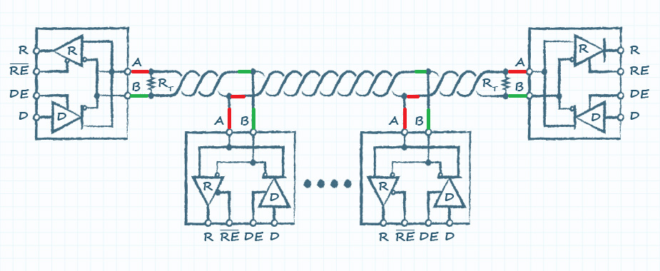       
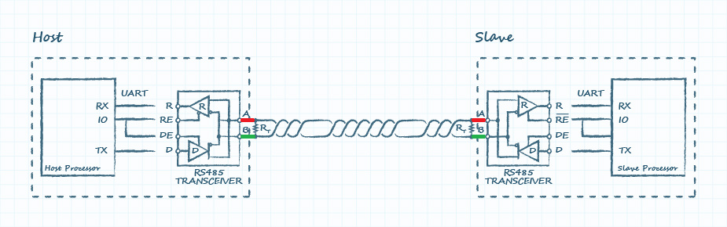       

3\. TTL Serial
TTL (Transistor-Transistor Logic) is composed of three wires, which are the data transmitting line (TXD), the data receiving line (RXD), and the common ground (GND).     
       

TTL level:     
| Output low (0) | Output high (1) | Input low (0) | Input high (1) |  
| :--: | :--: | :--: | :--: |  
| <0.8V | >2.4V	| <1.2V	| >2.0V |   

**4. Communication direction**    
With only one data line, data can only be transmitted in one direction.    
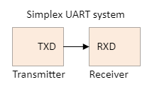        
With only one data line, two devices can send data to each other, but data can only be sent from one device to the other at the same time.       
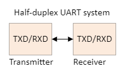     
There are two data lines, two devices can send data to each other, and the data of two devices can be sent to each other at the same time.           
       

**5. Overview**
The serial port we are talking about is an overview. The interface that can send data or receive data serially in a piece of data can be called a serial port.      
1. RS232, RS485, TTL serial ports, etc. can also send data or receive data serially in one piece of data, so they can all be called serial ports. It's just that they specify the electrical properties on the data line, and they don't specify how the data is transmitted.     
2. We can run different data transmission protocols on RS232, RS485, and TTL serial ports, such as the Universal Asynchronous Receiver-Transmitter (UART) protocol explained in the protocol layer above, and you can also run your own defined protocols.     
3. Simplex, half-duplex, and full-duplex communication only stipulate the direction of data transmission at the same time, and do not involve any data transmission protocol and electrical properties.      

Now returning to the serial port on the UNO board, it is a TTL serial port, running the Universal Asynchronous Receiver-Transmitter (UART) protocol, the communication format is XXX-8-N-1 (xxx special rate, 8 bit data, no parity bit, 1 stop bit), and it is a full-duplex serial port.     
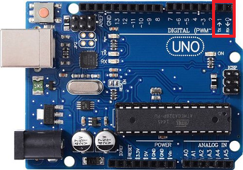       

USB port of PC can not communicate with TTL serial port of Mega328 chip directly, because their communication protocol is different, so USB to TTL serial port chip needs to be used to convert USB signal to TTL signal.    
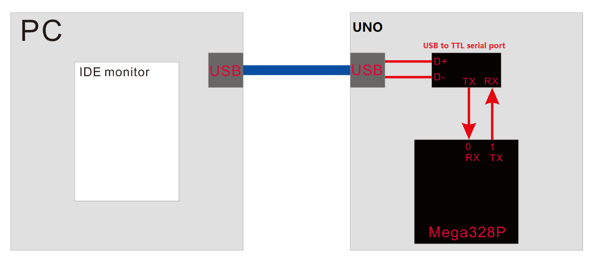       

**6. Software serial port**
In this example, we use the way of software simulation to realize a TTL serial port function, the data format of the serial port is XXx-8-N-1 (xxx: variable rate, 8-bit data, no parity check bit, 1 stop bit), the advantage of this way is that any two pins on the UNO board can be defined as a serial port.    

■ Open the "3.0.0_Soft_serial" example in the "[Mosiwi_Basic_Learning_Kit](../../../arduino/A1E0000_basic_learning_shield/A1E0000_basic_learning_shield.md#integration-library)" library file, then select the board type and port, and then upload the code.    

■ Open the serial port, adjust the baud rate of the serial port monitor to 9600, fill in "hello mosiwi" in the transmission frame, and then click send, UNO board will receive the data from the new back to the serial port monitor.     
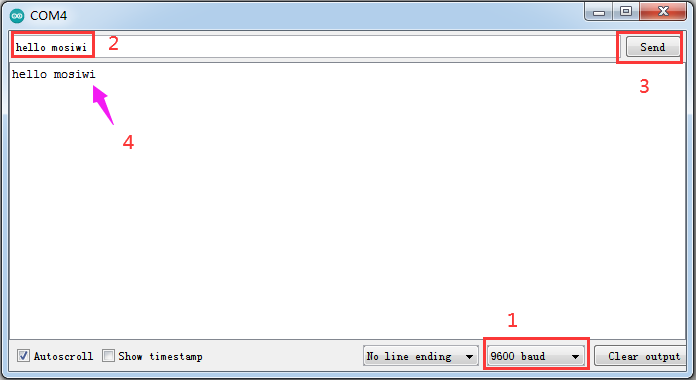       

code analysis:    
1\. Define a soft serial port class.    
```
class SoftwareSerial { ... }
```

2\. The constructor of the SoftwareSerial class initializes the receive pin as input mode and the transmit pin as output mode, and initializes the private variables of the class (after the colon and before the curly braces).    
```
SoftwareSerial::SoftwareSerial(uint8_t receivePin, uint8_t transmitPin) : ...{
  ...
}
```

3\. Set the baud rate of the serial port.   
```
void SoftwareSerial::begin(long speed){ ... }
```
The baud rate is used to calculate the time it takes to transfer a data bit:   
$$bit_time = (1/speed)/(1/F_CPU )$$

Then the bit time is divided into four parts, which is convenient for subsequent calculation of various bit delays:    
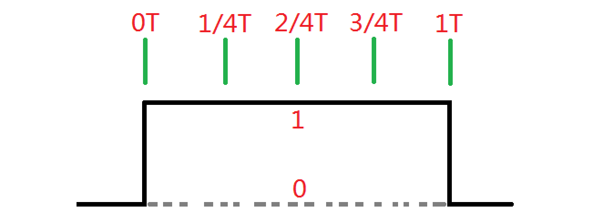        
$$bit_delay = (F_CPU / speed) / 4$$

In order to obtain the accurate delay of various transmitting bits and receiving bits, it is necessary to consider the influence of different versions of GCC compiler on the running speed of the program. See the source code for the calculation.    

4\. Set the receiving pin level change to generate an interrupt (PCINT --> PCMSK register).   
Using the PCINT function of MEGA328p, the interrupt can be generated when the level of each pin changes. The user needs to read the relevant register to determine which PCINT port has changed, and then jump into a specified program.    

5\. Then the object of soft serial port class enters the listening state.     
```
bool SoftwareSerial::listen(){ ... }  
```

6\. Enable the receiving pin of the serial port to interrupt when the level changes.    
```
void SoftwareSerial::setRxIntMsk(bool enable){ ... }
```

7\. Set interrupt vectors and functions: Interrupts generated by PCINT0--PCINT3 all call the recv() function.     
```
inline void SoftwareSerial::handle_interrupt(){
  if (active_object){
    active_object->recv();
  }
}

#if defined(PCINT0_vect)
ISR(PCINT0_vect){
  SoftwareSerial::handle_interrupt();
}
#endif

#if defined(PCINT1_vect)
ISR(PCINT1_vect, ISR_ALIASOF(PCINT0_vect));
#endif

#if defined(PCINT2_vect)
ISR(PCINT2_vect, ISR_ALIASOF(PCINT0_vect));
#endif

#if defined(PCINT3_vect)
ISR(PCINT3_vect, ISR_ALIASOF(PCINT0_vect));
#endif
```
More info: <http://www.nongnu.org/avr-libc/user-manual/group__avr__interrupts.html>    

8\. The receive function of the soft serial port that is executed if the level of the receive pin is changed.    
```
void SoftwareSerial::recv(){ ... } 
```
A 64-byte receive cache number is set and two Pointers, the receive cache header and the receive cache tail, are created. The two Pointers can point to any address in the array, and the cache tail pointer is incremented by 1 for each byte received.    
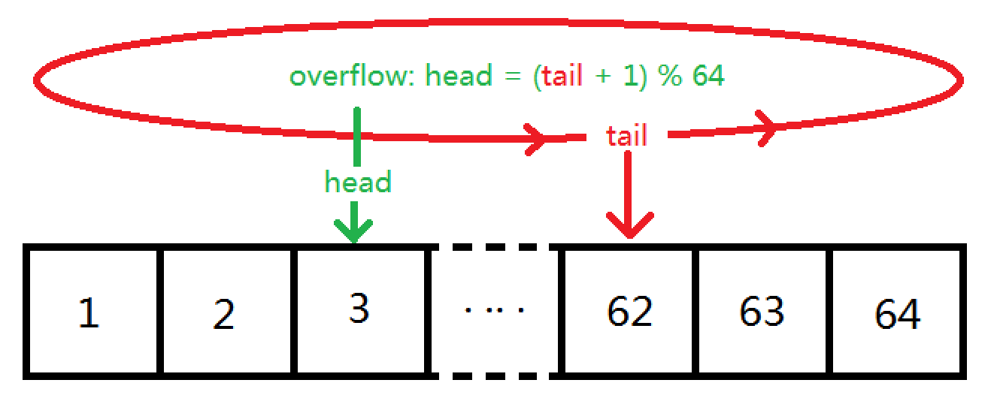        

9\. Count the number of received data in the receive cache array and return the value.     
```
int SoftwareSerial::available(){ ... }
```
Algorithm:   
$$Num = (tail + 64 - head) \% 64$$
The above algorithm can count the number of received data in the receive cache array in both cases tail > head and tail < head.     

10\. Reads all data in the receive buffer array byte by byte.     
```
int SoftwareSerial::read(){ ... }
```
The cache header pointer is incremented by 1 for each byte read, and the following is used to determine whether the cache is fully read:   
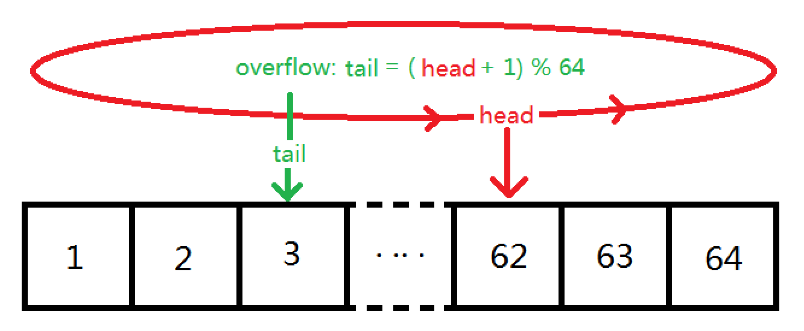        

11\. Data is sent byte-by-byte from the send pin, with all interrupts turned off.   
```
size_t SoftwareSerial::write(uint8_t b){ ... }
```

<span style="color: rgb(255, 76, 65);">Note: Since the serial port is simulated for software, the Baud range is 1200 -- 19200 bps.</span>     

**7. Hardware serial port**      
Above, we used the IO port to simulate the serial port communication protocol for communication. In the process of communication, the processor is occupied for a long time (because the main program stream is delayed or cyclic waiting for signals), and the transmission time is relatively slow (affected by the delay, cycle and IO port output speed).    
Now most single-chip microcomputers have realized the serial communication function in the chip internal hardware, and there are special hardware receiving and transmitting units inside the hardware to process data. It is more convenient for the user to use, and the transmission speed is faster, and does not occupy the processor for a long time.    

For the use of hardware serial port based on arduino, please refer to:      
<https://www.arduino.cc/reference/en/language/functions/communication/serial/>     


## Chapter4 I2C communication protocol
**1. Overview**     
I2C is a communication protocol developed by Philips Semiconductor for data transfer between a host and multiple slaves on the same circuit board using two common wires.    
This is a synchronous serial communication protocol where the data bits are transmitted one after the other according to a pulse signal set by a clock line.    

Here are some important features of the I2C communication protocol:     
1. Only two common buses are needed to control any device on the I2C network.   
2. I2C networks are easily extensible. The new device can simply be connected to two generic I2C bus lines.    
3. There is no need to agree on the data transmission rate in advance as in UART communication. Therefore, the data transfer speed can be adjusted at any time.     
4. Use 7-bit addressing to find a specific device on the I2C bus.      

**2. Wiring**     
The I2C bus consists of only two lines, called Serial Clock Line (SCL) and Serial Data line (SDA). The data to be transmitted is sent through the SDA line, and the clock signal of SCL is used to synchronize the data. All devices on the I2C network are connected to the same SCL and SDA lines as follows:    
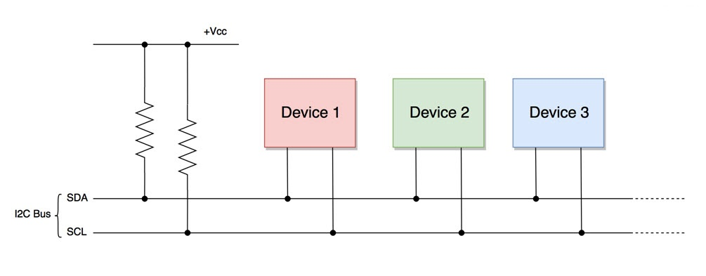        

Both I2C buses (SDA, SCL) operate as open-drain drivers. This means that any device on the I2C network can drive SDA and SCL to low, but cannot drive them to high. Therefore, a pull-up resistor is used for each bus to keep them high by default.    

Master and slave devices:    
1. Devices connected to the I2C bus are classified as master or slave. At any instant, only one host remains active on the I2C bus. It controls the SCL clock line and decides what operation to do on the SDA data line.    
2. To distinguish between multiple slaves connected to the same I2C bus, each slave is physically assigned a permanent 7-bit address.    
3. When a master device wants to transfer data to or read data from a slave device, it specifies this specific slave address on the SDA line and proceeds to transfer or read data. All other slave devices do not respond unless their address is the same as the address specified by the master device on the SDA line.   
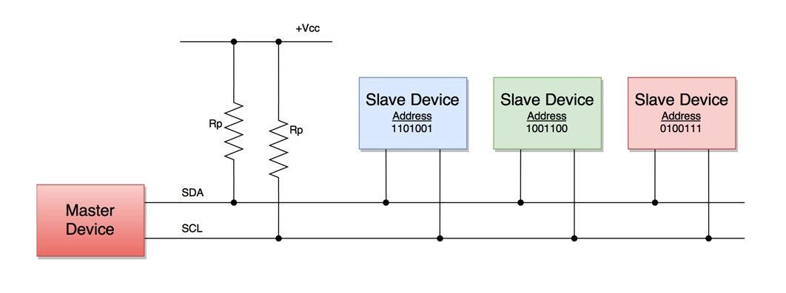        

**3. Data stream**    
The I2C data is transmitted as a data stream. The data stream is decomposed into multiple data frames. Each data stream has an address frame containing the binary address of the slave device, and one or more data frames containing the data being transferred. The data stream also includes start and stop conditions, read/write bits, and ACK/NACK bits between each data frame:    
        

Validity analysis of data:    
In the protocol, there is a special requirement for the SDA line and SCL line to transfer data bits. When the SCL line is HIGH, the state (level) on the SDA line is stable. The state (level) of the data line can be changed only if the SCL line is LOW (low level). Each data bit needs to generate a clock pulse.      
        

Starting condition:     
Whenever the master starts communication, it switches the SDA line from high to low before switching the SCL line from high to low. Once the master sends the start condition, all slave devices are activated even if they are in sleep mode and wait to receive the address bit.      
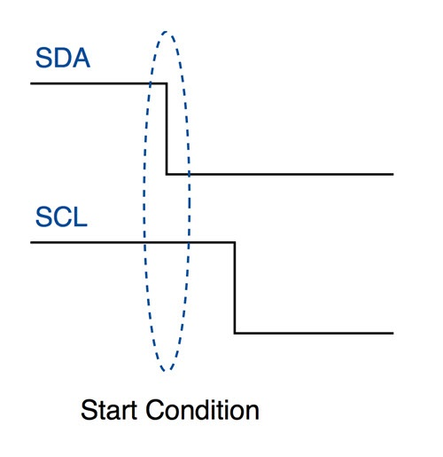        

Address frame:    
It consists of 7 bits and fills in the address of the slave device where the master device needs to send/receive data. All slave devices on the I2C bus compare these address bits to their addresses.    

Read/write bits:   
This bit specifies the direction of data transmission. This bit is set to "0" if the master device needs to send data to the slave device. Set to "1" if the master device needs to read data from the slave device.    

ACK/NACK bits:     
When the receiving device has successfully received the correct address or data frame and can send another byte, the bit is set to 0 (ACK).     

There are five cases in which the bit is NACK set by the receiving device:    
1. The receiving device received the wrong address.    
2. The receiver is busy.    
3. The receiving device receives commands or data it does not understand.    
4. The host has sent more bytes than the receiving device allows.    
5. When the host is reading a data frame (in read mode), it should generate a stop signal.   

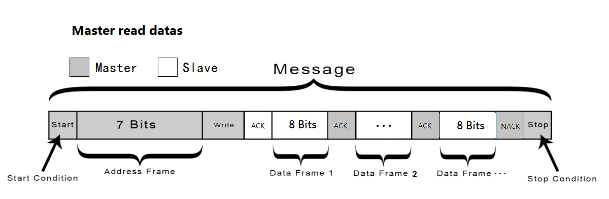        
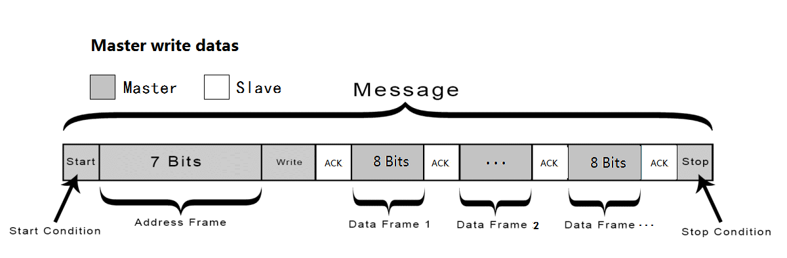        

| Master sends an ACK signal | Master sends a NACK signal | Master reads ACK/NACK signal |
| :--: | :--: | :--: |
| 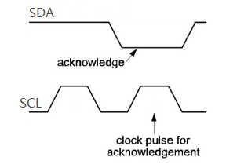 |  | 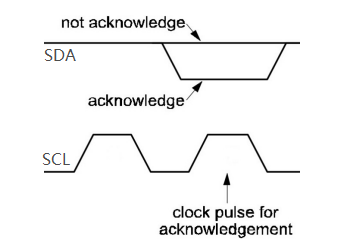 |

Data frames:    
It consists of 8 bits, which are generated by the master or slave device. This frame is followed by an ACK/NACK bit that is set to "0" if the next data frame is to be received; Otherwise, it is set to "1". Data frames are in a format followed by ACK/NACK bits so that multiple data frames can be sent or received repeatedly.     

Stop condition:    
When the SDA line has transmitted the required data block, the master switches the SCL line from low to high level, and then the SDA line from low to high level. At this point, the master is disconnected from the slave.    
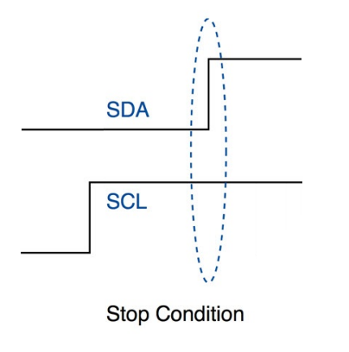        

More info: [I2C](../../../_static/pdf/communication_protocol/UM10204%28I2C_Bus_Specification_and_User_Manual_%29.pdf)

**4. Software I2C communication protocol**     
This example is based on AHT20 temperature and humidity sensor, if you need specifications, please download here link: [AHT20](../../../_static/pdf/A1E0000_basic_learing_shield/AHT20.pdf)       

AHT20 example code:    
■ Open the "3.1.0_AHT20_soft_i2c" example in the "[Mosiwi_Basic_Learning_Kit](../../../arduino/A1E0000_basic_learning_shield/A1E0000_basic_learning_shield.md#integration-library)" library file, then select the board type and port, and then upload the code.    

**5. Hardware I2C port** 
AHT20 example code:    
■ Open the "3.1.1_AHT20_i2c" example in the "[Mosiwi_Basic_Learning_Kit](../../../arduino/A1E0000_basic_learning_shield/A1E0000_basic_learning_shield.md#integration-library)" library file, then select the board type and port, and then upload the code.    
More info: [Wire](https://www.arduino.cc/reference/en/language/functions/communication/wire/)     

## Chapter5 SPI communication protocol     
**1. Overview**     
The Serial Peripheral Interface (SPI), developed by MOTOROLA in the 1980s, is a master-slave synchronous serial communication protocol. The interface of this protocol enables full-duplex communication at a very high speed, providing a simple and low-cost interface between the microcontroller and peripheral devices.     

**2. Interface**   
The SPI bus has four signal lines:   
1. Master–Out/Slave–In (MOSI)
2. Master–In/Slave–Out (MISO)
3. Serial Clock (SCLK)
4. Chip Select (CS) or Slave Select (SS)

The following diagram depicts how the SPI bus master (processor) is connected to the slave (peripheral):     
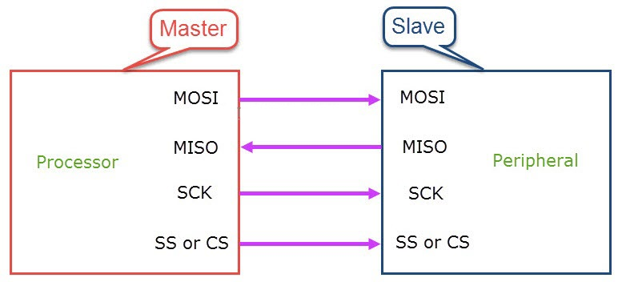        

**3. Internal principle**     
The hardware requirements for implementing SPI are very simple. For example, a master device and a slave device are connected using the SPI bus. The following figure shows the minimum configuration requirements for both devices.     
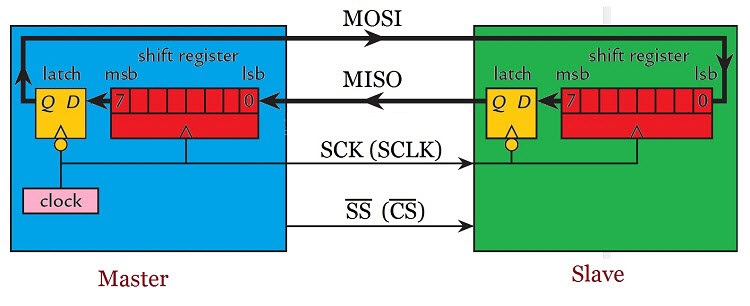          
As can be seen from the figure above, the master device consists of a shift register, a data latch, and a clock generator. Slave devices consist of similar hardware: shift registers and data latches. Two shift registers are connected to form a loop. It takes 8 clock cycles for the device to transmit one byte of data.       
During each SPI clock cycle, a full-duplex data transfer occurs. The master sends a bit on the MOSI line and the slave reads it, while the slave sends a bit on the MISO line and the master reads it. This ordering is maintained even if only one-way data transfer is intended.       

**4. Work mode**      
The job of the master device is to generate clock signals of a specific frequency and assign them to the slave devices in order to synchronize data between the master and slave devices.     

The master and slave must also agree on certain synchronization protocols. Thus, two features of the clock, namely clock polarity (CPOL or CKP) and clock phase (CPHA), enter the picture.     
■ Clock polarity determines the state of the clock. When CPOL is 0, the clock signal generated by the master device is low when idle. When CPOL is 1, the clock signal is high when idle.      
■ The clock phase determines at what time on the clock the data is sent. When CPHA is 0, the data is sent at the first edge of the periodic clock. When CPHA is 1, the second edge of the data cycle clock is sent.     
■ According to the clock polarity (CPOL) and clock phase (CPHA) values. SPI has 4 modes of operation: modes 0 to 3.      
| SPI mode | Clock polarity(CPOL/CKP) | Clock phase(CPHA) | SCK level at idle time | Sampling time |   
| :--: | :--: | :--: | :--: | :--: |   
| 0 | 0 | 0 | Low level | The first edge |  
| 1 | 0 | 1 | Low level | The second edge |  
| 2 | 1 | 0 | High level | The first edge |  
| 3 | 1 | 1 | High level | The second edge |   

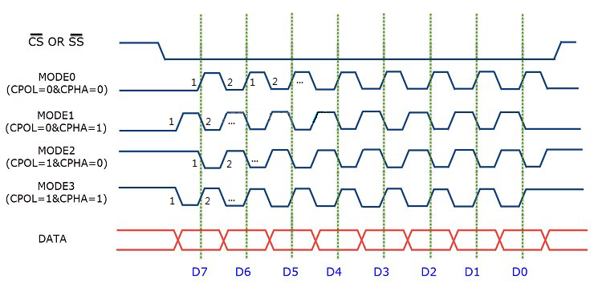        
<span style="color: rgb(255, 76, 65);">Note: The master and slave need to work in the same mode to communicate normally.</span>      

**5. Connection mode**    
Independent master-slave configuration:    
        

Daisy chain configuration:   
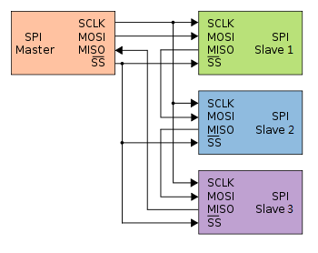        

More info: [SPI](../../../_static/pdf/communication_protocol/SPI_Block_Guide_V03.06.pdf)    

**6. Software SPI**
This example is based on BC7278 quad digital tube and button chip. If you need specifications, please download from this link: [BC7278](../../../_static/pdf/A1E0000_basic_learing_shield/BC7278.pdf)      

Because the BC7278 chip does not have SPI chip selection pin (CS), the chip is in the enabled state after power on. So the UNO board (master device) only needs 3 roots to communicate with the BC7278 chip (slave device).     

BC7278 example code:    
■ Open the "3.2.0_BC7278_spi_soft" example in the "[Mosiwi_Basic_Learning_Kit](../../../arduino/A1E0000_basic_learning_shield/A1E0000_basic_learning_shield.md#integration-library)" library file, then select the board type and port, and then upload the code.    

**7. Hardware SPI port** 
BC7278 example code:    
■ Open the "3.2.1_BC7278_spi" example in the "[Mosiwi_Basic_Learning_Kit](../../../arduino/A1E0000_basic_learning_shield/A1E0000_basic_learning_shield.md#integration-library)" library file, then select the board type and port, and then upload the code.    
More info: [SPI](https://www.arduino.cc/reference/en/language/functions/communication/spi/)        

## Chapter6 3-wire communication
**1. Overview**     
This chapter will not explain the communication protocol, is based on 74HC595 serial input parallel output chip, explain the 3-wire communication mode.   

**2. 74HC595 internal hardware**     
Pin description:     
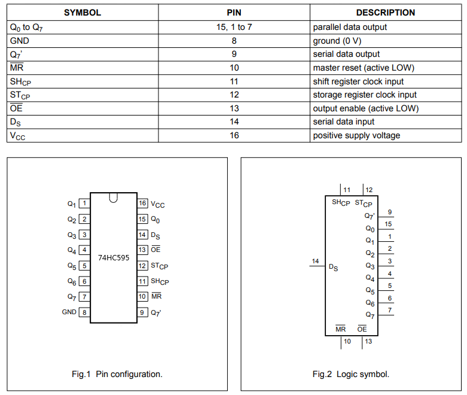        

Built-in function:    
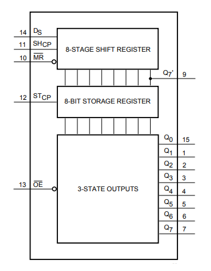        
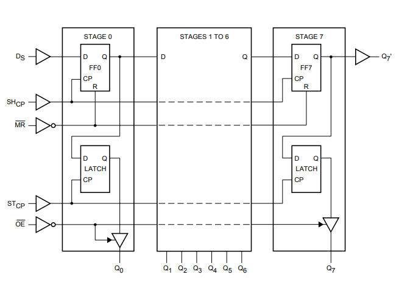        

**3. Working principle**    
The 74HC595 has one 8-bit shift register, one memory register, and one 3-state parallel output bus. When OE is enabled (low level), data on the Ds enters the shift register at the rising edge of the SHcp clock, the storage register at the rising edge of the STcp clock, and outputs to the parallel bus. When the serial output (Q7 ') pin is on the eighth rising edge of the SCHcp clock, it will output the data of the first rising edge of the SCHcp clock, and so on, and then output the data of the second rising edge of the SCHcp clock.     
        

**4. Example code**        
Open the "3.3.0_74HC595_3wire_soft" example in the "[Mosiwi_Basic_Learning_Kit](../../../arduino/A1E0000_basic_learning_shield/A1E0000_basic_learning_shield.md#integration-library)" library file, then select the board type and port, and then upload the code.    

Code analysis:       
Initialize the three IO ports of the 74HC595 chip and set them all to output mode.    
```
void Init_LED_IO(byte latchP, byte clockP, byte dataP){ ... }
```

One byte of data is sent out through the data sending IO port, and the data sending mode (MSBFIRST or LSBFIRST) is selected.    
The data are sent to the Ds (dataPin) pin, a rising edge signal is generated on the SH_CP (clockPin) pin, and the data are stored in the shift register of the 74HC595. Note that the data does not change the state of the 74HC595 pin; only when the STcp (latchPin) pin produces another rising edge signal will the data be stored in the 74HC595 storage register and change its pin state.    
```

void ShiftOut(byte dataPin, byte clockPin, byte bitOrder, byte val){ ... }
```
**MSBFIRST**: This indicates that the high bit of the data is sent first and the low bit of the data is sent later.     
**LSBFIRST**: This means that the low bit of the data is sent first, and the high bit is sent later.    

This function can turn on or off an LED.    
```
void SetLed(byte bit, byte OnOff){ ... }
```


## Chapter7 Infrared NEC communication protocol
Please refer to: [NEC communication protocol](../../../common_resource/nec_communication_protocol/nec_communication_protocol.md)      

**1. Example code**        
Open the "3.4.0_IR_NEC" example in the "[Mosiwi_Basic_Learning_Kit](../../../arduino/A1E0000_basic_learning_shield/A1E0000_basic_learning_shield.md#integration-library)" library file, then select the board type and port, and then upload the code.    


## Chapter8 OneWire communication protocol    
**1. Overview**     
1-Wire is a bidirectional, half-duplex slow serial communication standard developed by Dallas Semiconductor Corp (now Maxim Integrated) that uses a single signal data line for communication. The standard data rate is 15.4kbps. But it is possible to overdrive 1-Wire communication to up to 125kbps.    

**2. Hardware wiring**     
The slave device on the 1-Wire bus can be powered by an external power source and also by a signal line. Most 1-Wire slave devices require only very low power or no power pins, and when powered by a parasitic power supply, the current on the bus is charged through diodes inside the slave device to capacitors inside, thereby powering the slave device.      
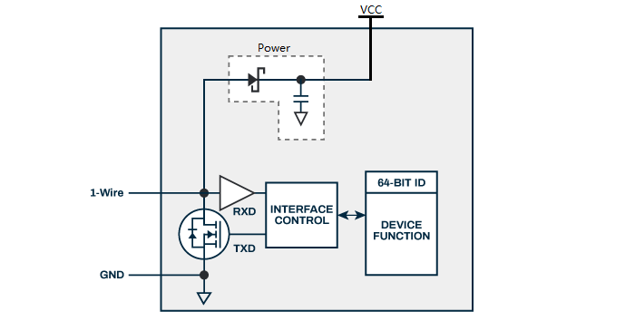        

Each slave device on the bus contains a unique 64-bit code stored in ROM. The lowest 8-bit code is used to describe the type of slave device. The next 48 bits contain a unique serial number. The highest 8 bits contain the cyclic redundancy check generated from the previous 56-bit encoding.     
        

The 1-Wire bus is a master-slave communication system in which a master device is connected to one or more slave devices via a single data line. The data line requires a resistor pull-up to the power line, typical pull-up resistor values are between 1 kΩ and 4.7 kΩ. According to the power supply method, it can be divided into two wiring methods.   
■ Power supply:     
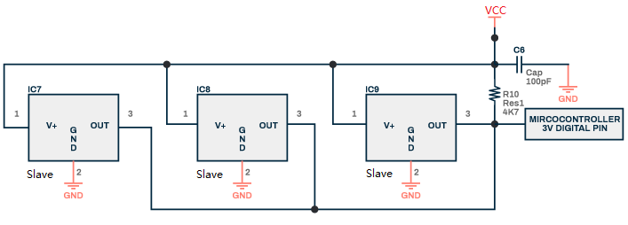        

■ Parasitic power supply:    
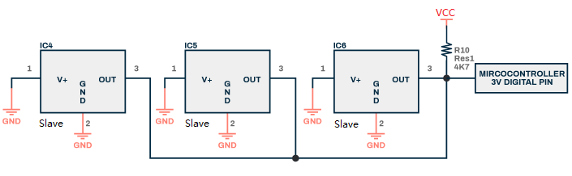        

**3. protocol analysis**     
The single-bus communication protocol defines several signal command types: reset pulse, presence pulse, write 0, write 1, read 0, read 1. Except for the presence pulse, all signal commands are initiated by the bus host.       
Let's take the DS18B20 temperature sensor as an example to explain the protocol.     

■ Initialization sequence - reset and presence pulse   
All communication with the slave starts with the initialization sequence, which consists of a reset pulse from the master followed by a presence pulse from the slave. When a slave sends a presence pulse in response to a reset pulse, it indicates to the host that it is attached to the bus and is ready to run. During the initialization sequence, the host sends a reset pulse by pulling the single bus down for at least 480 µs. The bus host then releases the bus into receive mode. When the bus is released, the 4.7kΩ pull-up resistor pulls the bus higher. When the slave detects this rising edge, it waits 15µs to 60µs and then emits a presence pulse by pulling the single bus down 60µs to 240µs.      
        

■ Write time slot    
There are two kinds of write time slots: "write 1" time slots and "write 0" time slots. The bus host writes a logical 1 to the slave device through the write 1 time slot and a logical 0 to the slave device through the write 0 slot. All write time slots must last at least 60µs and there must be a recovery time of at least 1µs between two write time slots. Both write slots are initiated by the host pulling the single-bus low. To generate a write 1 time slot, the bus host must release the single bus within 15µs after pulling it low. When the bus is released, the 4.7kΩ pull-up resistor pulls the bus higher. To generate a write 0 slot, after pulling a single bus low, the bus host must keep the bus low for the entire time slot (at least 60µs). The slave device will sample a single bus in a time window of at least 15µs to 60µs after the host initiates a write time slot. If at this sampling time the window bus is high, a 1 is written to the slave device. If the bus is low, a 0 is written to the slave device.     
        

■ Read the time slot
The slave device can transmit data to the host only during the read slot issued by the host. All read time slots must last at least 60µs and the recovery time between two write time slots must be no less than 1µs. Read time slots are generated by the host pulling down the single bus for at least 1µs and then releasing the bus (see Figure 1).    
After the host initiates a read slot, the slave starts transferring 1's or 0's on the bus. The slave sends a 1 by holding the bus high and a 0 by pulling the bus low. When 0 is transmitted, the slave device releases the bus at the end of the time slot, after which the bus is pulled back to the high idle state by the pull-up resistor. The output data of the slave device is valid for 15µs after the falling edge of the start time slot, so the host must release the bus and sample the bus state within 15µs after the start of the time slot. Figure 2 illustrates that the sum of TINIT, TRC and TSAMPL E must be less than 15µs in a read time slot. Figure 3 shows that the timing margin of the system can be maximized by keeping tINT and tRC as short as possible, and by putting the host sampling time at the end of the 15µs period of the read time slot.    
Figure 1    
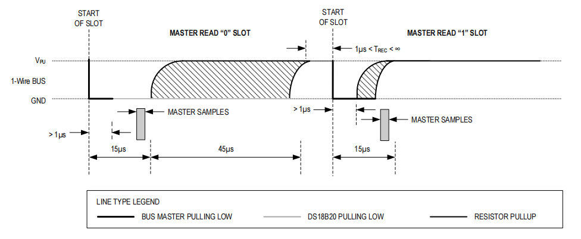        

Figure 2    
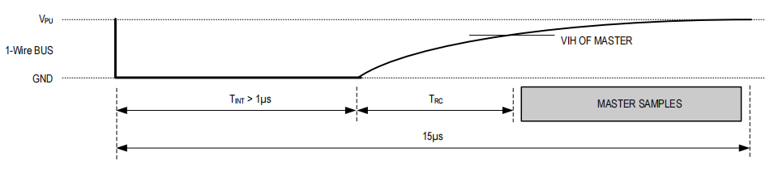        

Figure 3    
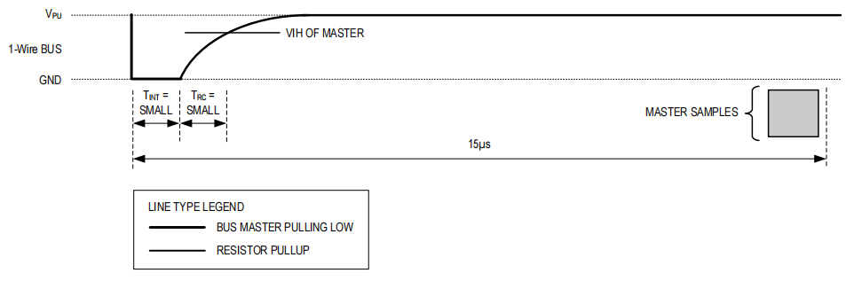        


**1. Example code**        
Open the "3.5.0_EEPROM_1wire_soft" example in the "[Mosiwi_Basic_Learning_Kit](../../../arduino/A1E0000_basic_learning_shield/A1E0000_basic_learning_shield.md#integration-library)" library file, then select the board type and port, and then upload the code.    

Datasheet of EEPROM: [EEPROM](../../../_static/pdf/A1E0000_basic_learing_shield/DS2431.pdf)   

**End!**    
