# Based tutorial   
Learn simple programming syntax based on the UNO board, and learn the most comprehensive Arduino basics in the fastest way.     

## Previous preparation   
1. Install the [**Arduino IDE**](../../../arduino/arduino_ide/arduino_ide.md).     
2. Basic operation of the [**Arduino UNO R3**](../../../arduino/A1D0000_uno_r3/A1D0000_uno_r3.md) motherboard.    
3. Learn about [**Basic learning shield**](../../../arduino/A1E0000_basic_learning_shield/A1E0000_basic_learning_shield.md).  
4. Install the [**Mosiwi basic learning kit**](../../../arduino/A1E0000_basic_learning_shield/A1E0000_basic_learning_shield.md#integration-library) library.    

## Chapter_1 Blink    

**Curriculum question:**     
1. What is LED light ?     
2. What are functions and function parameters?
3. setup() and loop() functions in Arduino program.    
4. How to set up and use digital outlet?   
5. How to use the delay() delay function?  
6. How to use the comment symbols in the code: //, /* ... */    

**Program flow diagram:**   
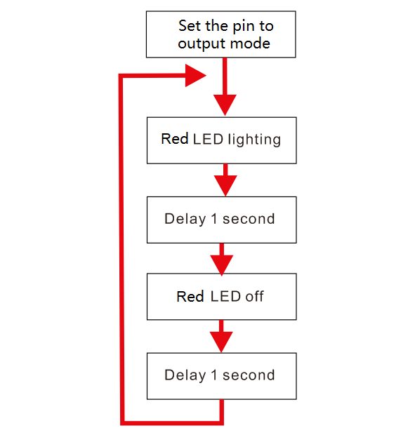     

**Open the example code: "1.0.0_Blink"**     
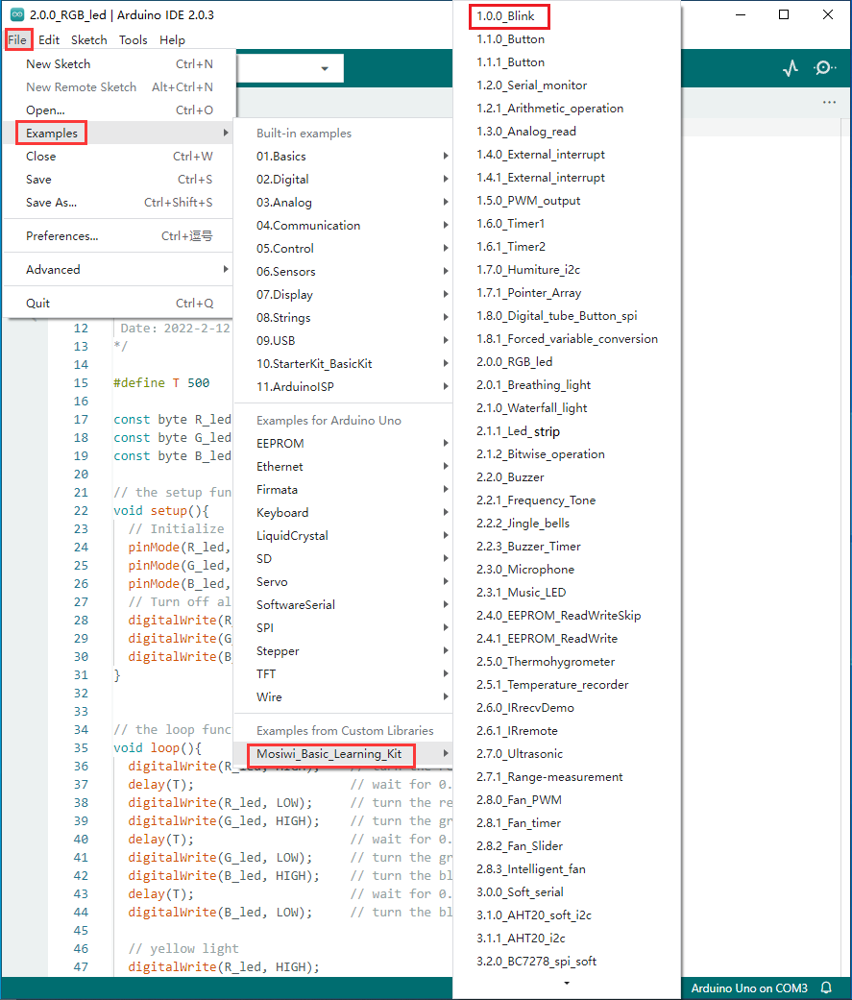    
Upload the code to the UNO board.       
<span style="color: rgb(255, 76, 65);">Note: All the sample code in the following sections is opened in the same way as in the figure above.</span>     

**Example code phenomena:**    
The RGB LED on the expansion board emits a red light every 1 second.    
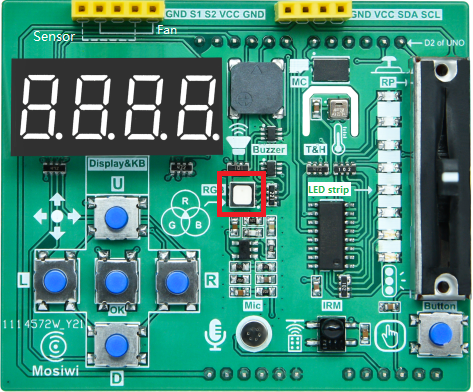    

**FAQ:**      
(1) What is LED light?    
Leds are also known as light-emitting diodes. It has positive and negative poles, generally the shorter pin or the pin near the gap is the negative pole, and the other end is the positive pole. Only when the forward current is connected, the LED light will be lit. Its current is generally required to be about 5-15ma, so resistors are often used in series with leds to achieve current limiting.     
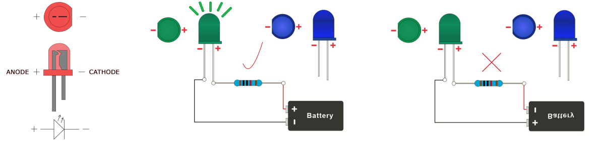     

(2)What are functions and function parameters?
When we want to program to achieve a function, we need to use a variety of programming language statements, variables, functions, etc., in order to facilitate the maintenance and reading of the code, we need to wrap them together, and then use a name to represent this function, call this name that calls these statements, variables, functions, etc., this is the concept of function.      
The inside of the function is shielded from the outside, when we need to transfer some data to the inside of the function, at this time we need to use the parameters of the function, the function parameters are the bridge between the outside and the inside of the function, and it is one-way, that is, from the outside to the inside of the function.      

(3) "setup()" and "loop()" functions in Arduino program.
"setup()" and "loop()" are two functions defined by Arduino. All Arduino programs have and only have one "setup()" and "loop()" functions. When the arduino program is running, the code inside "setup()" is executed first, and then the code inside "loop()" is looped.     

(4) How to set the I/O port to digital output mode?     
Pins 2-13，A0-A5 on the UNO board can be set to digital output mode to output logic "0" (low level, 0V) and logic "1" (high level, 5V) on the pin.     
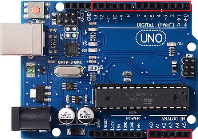      
```
Syntax:    
pinMode(pin, mode);   

Parameters:  
pin: The pin number of the arduino motherboard (2-13，A0-A5 for UNO).   
mode: INPUT, OUTPUT, or INPUT_PULLUP.   

INPUT: Digital input mode.    
OUTPUT: Digital output mode.     
INPUT_PULLUP: Digital input mode with pull resistance.        
```

When mode is set to OUTPUT mode, use the following statement to make the IO port output high or low:    
```
Syntax:
digitalWrite(pin, value);

Parameters:
pin: The pin number of the arduino motherboard (2-13，A0-A5 for UNO).
value: HIGH or LOW.

"HIGH" : High level, digital value is 1, voltage value is 5V.
LOW: Low level, digital value is 0, voltage value is 0V.   
```
(5) How to use the delay() function?    
The delay() function is used to pause the program for a period of time, which can be customized.    
```
Syntax:
delay(ms);

Parameters:
ms: The value ranges from 0 to 4294967295, in milliseconds.
```

(6) How to use the comment symbols in the code: //, /\*...\*/
When we want to parse the function and function of the code with text, we need to use the single-line comment (//) and block comment symbols(/\*...\*/). The text after the comment does not participate in the code running, but is only used to parse the code.     
```
Syntax:
// Text content that needs to be commented

/* Text content to be commented */

/ *
Text content to be commented
Text content to be commented
* /
```

## Chapter_2 Button    

**Curriculum question:**     
1. What is a button?    
2. What are variables, byte variables and global variables?    
3. How to use the assignment operator: =       
4. How to set up and use the digital input port?    
5. How to use relational operators: ==,! =   
6. How to use the judgment statement: if        

**Program flow diagram:**   
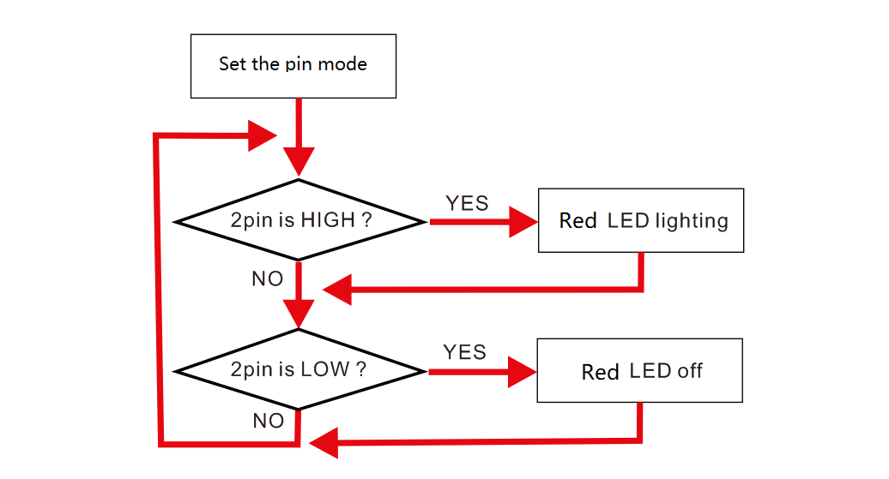     

**Open the example code: "1.1.0_Button"**     
1. Open the sample code using the methods in **"[Chapter_1](./Basic_tutorial.md#chapter-1-blink)"**.     
2. Upload the code to the UNO board.      

**Example code phenomena:**   
When the "OK" key is pressed, the red RGB LED lights up, otherwise the RGB LED does not light up.    
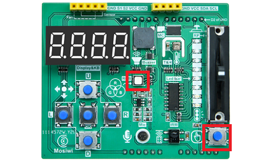     

**FAQ:**     
(1) What is a button?   
The key is A press switch, as shown in the following figure, A and B, C and D are directly connected inside, when no press, AB and CD are not connected, when the key is pressed, AB and CD are connected.    
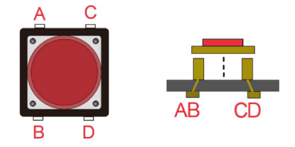     

(2) What are variables, byte variables and global variables?   
Variables come from mathematics and are abstract concepts in computer language that can store calculation results or represent values. Variables can be accessed by variable name.    
     

**byte** variable is a variable defined by the arduino programming language, and its value ranges from 0 to 255.   
```  
Syntax:
byte var = val;

Parameters:
var: Parameter name.
val: The value assigned to the var.
```

**Global variable** applies to the entire program and is defined outside the stup() and loop() functions, and not inside other functions. The "buttonPin", "ledPin", and "buttonState" variables defined in the sample code can be used in stup() and loop() functions, or in other functions.    
```
Syntax: 
byte buttonPin;          
byte ledPin;          
byte buttonState; 
```

(3) How to use the assignment operator?
The assignment symbol is "=", note that this symbol is not an equal sign, as in the example:    
```
Syntax: 
buttonPin   = 2;    
ledPin      = 5;       
buttonState = 0; 
```

(4) How to set up and use the digital input port?    
Pins 2-13, A0-A5 on the UNO board can be set to digital input mode to read the logic "0" (low level, 0V) and "1" (high level, 5V) of the pins.     
      
Set the pin to digital input mode.      
```
Syntax:    
pinMode(pin, INPUT);   

Parameters:  
pin: The pin number of the arduino motherboard (2-13, A0-A5 for UNO).           
```
Read the value on the pin:   
```
Syntax:
digitalRead(pin);

Parameters:
pin: The pin number of the arduino board (2-13, A0-A5 for UNO).

Return value:
HIGH or LOW.

HIGH: High level. The digital value is 1, and the voltage value is greater than 3V.
LOW: Low level. The digital value is 0 and the voltage is less than 1.5V.
```

(5) How to use relational operators: ==,!= 
The equal and unequal relation operators are "\==" and "!= ". Commonly used with judging conditions true and false. If variable A is assigned 10 and variable B is assigned 20, then:    
| symbol | annotation | example |    
| :--: | :--: | :--: |    
| == | Check whether the values of the two variables are equal. If equal, the condition is true, otherwise the condition is false. | (A == B) is false |   
| != | Check whether the values of the two variables are equal. If equal, the condition is true, otherwise the condition is false. | (A != B) is true |     

In the sample code:   
```
buttonState == LOW
buttonState != LOW
```

(6) How to use the judgment statement: if     
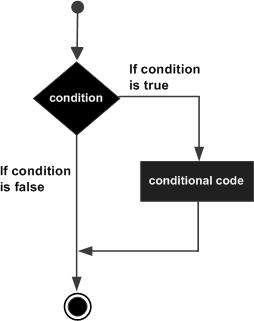    
```
Syntax:
if (condition) {
//statement(s)
}

Parameters:
condition: A boolean expression (true or false).

In the sample code:
if (buttonState == LOW) {
digitalWrite(ledPin, HIGH);
}

if (buttonState ! = LOW){
digitalWrite(ledPin, LOW);
}
```

**Extended chapter:**        
(1) What are local variables?     
(2) How to use the judgment statement: if... else... , if... else if... else...      

**Program flow diagram:**   
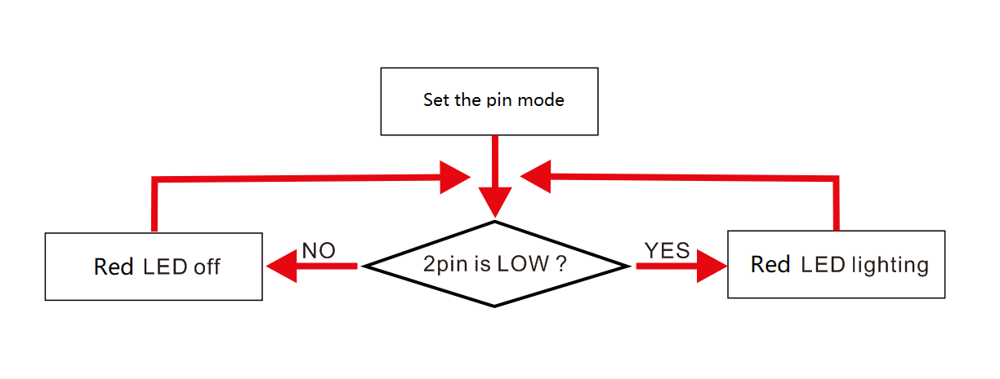     

**Open the example code: "1.1.1_Button"**     
1. Open the sample code using the methods in **"[Chapter_1](./Basic_tutorial.md#chapter-1-blink)"**.      
2. Upload the code to the UNO board.       

**Example code phenomena:**   
When the "OK" key is pressed, the red RGB LED lights up, otherwise the RGB LED does not light up.    
     

**FAQ:**     
(1) What are local variables?
Local variables are variables that are valid only in a function body or block of code.     
In the loop() function of the sample code, a "buttonState" local variable is defined and assigned to 0.     
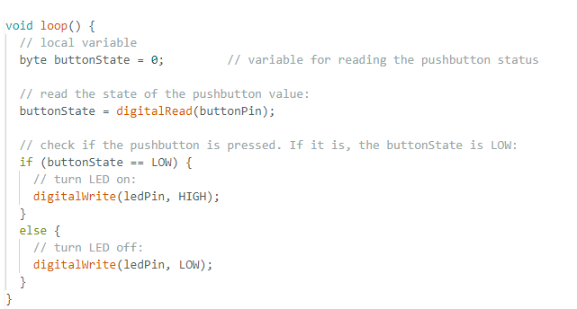     
The buttonState variable only works in the loop() function, not in other functions or code blocks.     

(2) How to use the judgment statement: if... else... , if... else if... else...    
Variables come from mathematics and are abstract concepts in computer language that can store calculation results or represent values. Variables can be accessed by variable name.    

**Program flow diagram:**  
```
if... else... 
``` 
     

```
Syntax:
if(Condition) {
// Statement to execute when the Condition is true.
} 
else {
// Statement to execute when the Condition is false.
}
```

```
if...else if... ...else...
```
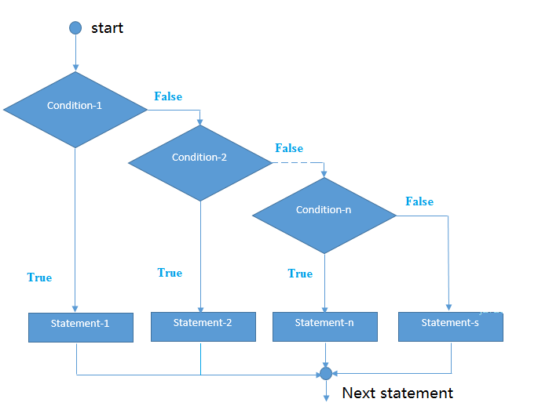     

```
Syntax:
if(Condition_1) {
// Statement to execute when the Condition_1 is true.
} 
else if (Condition_2) {
// Statement to execute when the Condition_2 is false.
}
...
else{
// Execute this statement if all conditions are not true.   
}
```

In the sample code:   
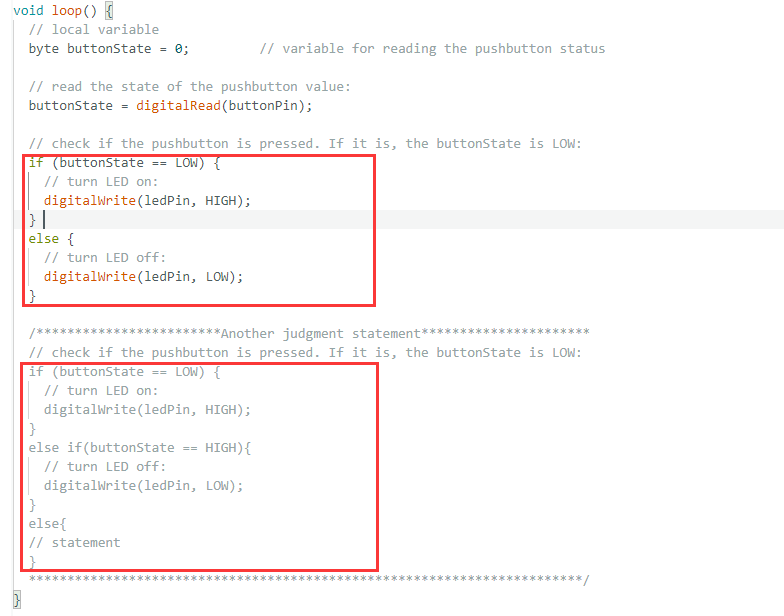     

## Chapter_3 Serial port monitor       

**Curriculum question:**     
1. What is a serial port?  
2. What is a serial port monitor?   
3. How to output information to the serial port monitor?   
4. What are variables: char and String          

**Program flow diagram:**   
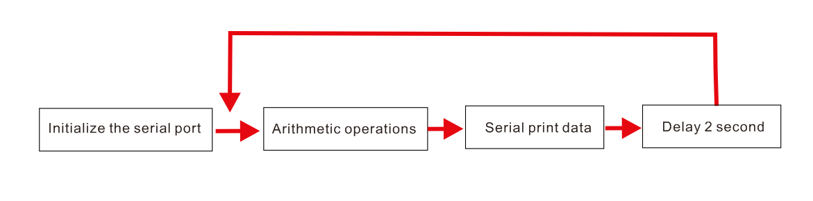     

**Open the example code: "1.2.0_Serial_monitor"**     
1. Open the sample code using the methods in **"[Chapter_1](./Basic_tutorial.md#chapter-1-blink)"**.   
2. Upload the code to the UNO board.   

**Example code phenomena:**       
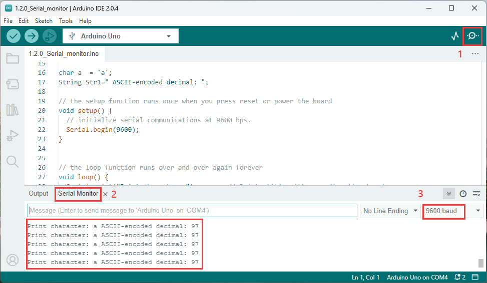     
The serial port monitor will print the ASCII code value 97 for the character "a". The ASCII code is the numeric value corresponding to the character or symbol in the computer.     
Details please refer to: <https://en.wikipedia.org/wiki/ASCII>   

**FAQ:**     
(1) What is a serial port?     
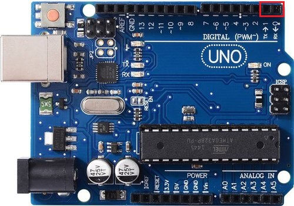     
The "0" and "1" pins on the UNO board are serial port RX (receive) and TX (transmit) pins. Serial port is a communication interface, which is characterized by a simple line, as long as two lines can achieve two-way communication, but the transmission speed is slow.       
In the advanced chapter will explain its communication protocol in detail, at this time as long as you understand what is the serial port.       
More information please refer to: <https://www.arduino.cc/reference/en/language/functions/communication/serial/>          


(2) What is a serial port monitor?    
The Arduino IDE has a serial monitor. The UNO can send data to the monitor through the USB-to-serial chip, and the monitor can also send data to the UNO.       
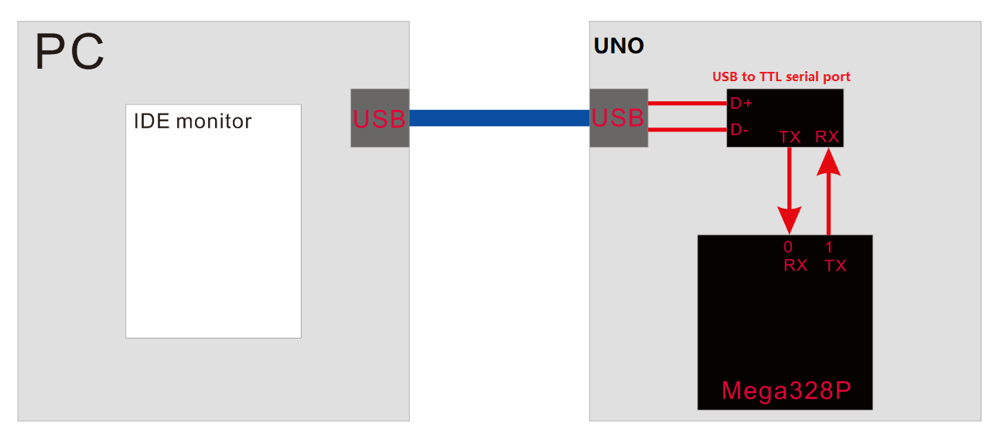     

(3) How to output information to the serial port monitor?   
When using the Arduino serial port, you must first initialize the serial port and set the baud rate. Generally, the serial port is initialized in the setup() function.   
```
Syntax:
Serial.begin(speed);
Serial.begin(speed, config);

Parameters:
speed: bits per second (baud rate). The allowed data type is long.
config: Sets the data type, parity check, and stop bit. 
```
config value:  
| SERIAL_5N1 | SERIAL_6N1 | SERIAL_7N1 | SERIAL_8N1 (default) |   
| :-- | :-- | :-- | :-- |   
| SERIAL_5N2 | SERIAL_6N2 | SERIAL_7N2 | SERIAL_8N2 |   
| SERIAL_5E1 | SERIAL_6E1 | SERIAL_7E1 | SERIAL_8E1 |   
| SERIAL_5E2 | SERIAL_6E2 | SERIAL_7E2 | SERIAL_8E2 |   
| SERIAL_5O1 | SERIAL_6O1 | SERIAL_7O1 | SERIAL_8O1 |   
| SERIAL_5O2 | SERIAL_6O2 | SERIAL_7O2 | SERIAL_8O2 |   

Two commonly used serial print functions:   
```
Description:
No new rows are generated after printing data.

Syntax:
Serial.print(val);
Serial.print(val, format);

Return parameters:
The number of bytes written. Data type :size t.

Parameters:
val: The value to be printed. Allowed type: Any data type.
Format: BIN(binary), OCT(octonary), DEC(Decimal), HEX(hexadecimal), 0(0 decimal), 1(1 decimal) ...

```
```
Description:
New rows are generated after printing data.

Syntax:
Serial.println(val);
Serial.println(val, format);

Return parameters:
The number of bytes written. Data type :size t.

Parameters:
val: The value to be printed. Allowed type: Any data type.
Format: BIN(binary), OCT(octonary), DEC(Decimal), HEX(hexadecimal), 0(0 decimal), 1(1 decimal) ...

```

(4) What are variables: char and String     
**char** is a character data type with single quotes, for example, 'a'. The value ranges from -128 to 127.  
```
Syntax:
char var = val;

Parameters:
var: variable name.
val: The value assigned to the variable.

In the sample code:
char a = ‘a’;
```

**Sring** is an object of the Arduino custom class. It is used to store strings.    
```
Syntax:
Sring str = val;

Parameters:
str: Sring variable name.
val: Sring.

In the sample code:
String Str1=" ASCII-encoded decimal: ";  
```
More information: <https://www.arduino.cc/reference/en/language/variables/data-types/stringobject/>    


## Chapter_4 Arithmetic operation            

**Curriculum question:**     
(1) How to use arithmetic operators: +, -, *, /, %              

**Program flow diagram:**   
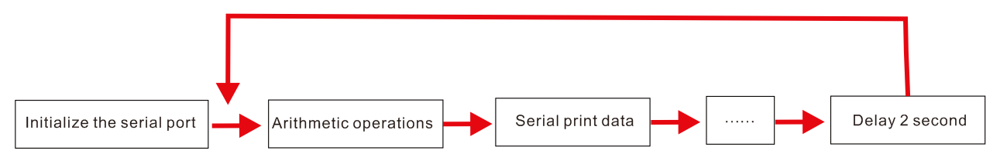     

**Open the example code: "1.2.1_Arithmetic_operation"**     
1. Open the sample code using the methods in **"[Chapter_1](./Basic_tutorial.md#chapter-1-blink)"**.   
2. Upload the code to the UNO board.   

**Example code phenomena:**     
Turn on the serial port monitor and set the baud rate to 9600. The serial port monitor prints calculation information every 2 seconds.      
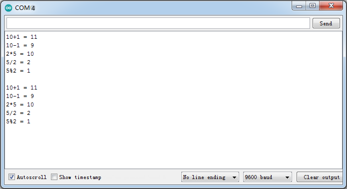     

**FAQ:**     
(1) How to use arithmetic operators: +, -, *, /, %           
Addition operation (+):    
```
Syntax:
sum = operand1 + operand2;

Parameters:
sum: variable (result).
operand1: variable or constant (addition).
operand2: variable or constant (addition).

In the sample code:
num = 10+1;
```

Subtraction operation (-):     
```
Syntax:
difference = operand1 - operand2;

Parameters:
difference: variable (result).
operand1: variable or constant (subtraction).
operand2: variable or constant (subtract).

In the sample code:
num = 10-1;
```

Multiplication (*):    
```
Syntax:
product = operand1 * operand2;

Parameters:
product: variable (result).
operand1: variable or constant (multiplicand).
operand2: variable or constant (multiplier).

In the sample code:
num = 2*5;
```

Division operation (/):   
```
Syntax:
result = numerator / denominator;

Parameters:
result: variable (result).
numerator: variable or constant (dividend).
denominator: Variable or constant (divisor), which cannot be 0.

In the sample code:
num = 2/5;
The result is 2.   
```
Attention:
If one of the operands is of type float or double, the result is a floating-point number.      
If both operands are of type float or double and the resulting variable is of type integer, only the integer part is stored and the decimal part is lost.    

Remainder operation (%):   
```
Syntax:
remainder = dividend % divisor;

Parameters:
remainder: variable (result).
dividend: Variable or constant (dividend).
divisor: Variable or constant (divisor) that cannot be 0.

In the sample code:
num = 2%5;
The result is 1. 
```

## Chapter_5 Read analog value            

**Curriculum question:**     
1. What is voltage?     
2. What is a sliding potentiometer?   
3. What is the analog input port?   
4. What are variables: int and float                 

**Program flow diagram:**   
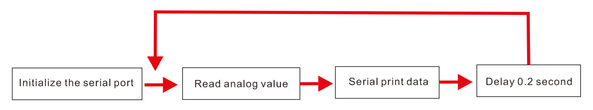     

**Open the example code: "1.3.0_Analog_read"**     
1. Open the sample code using the methods in **"[Chapter_1](./Basic_tutorial.md#chapter-1-blink)"**.   
2. Upload the code to the UNO board.   

**Example code phenomena:**     
Turn on the serial port monitor and set the baud rate to 9600. Push the potentiometer up and down, and the serial port monitor prints out the corresponding analog value and voltage value.        
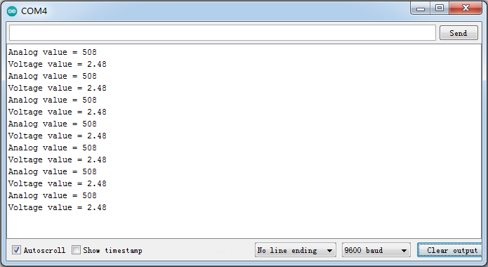     

**FAQ:**     
(1) What is voltage?             
The voltage is called potential difference or potential difference, the international unit is volts (V), and the commonly used units are millivolts (mV), microvolts (μV), and kilovolts (kV).     
$$1KV = 1000V, 1V = 1000mV, 1mV = 1000uV$$    

The relationship between voltage, current and resistance:   
$$I=U/R$$   
I: current, unit A.   
U: voltage, unit V.   
R: resistance, unit Ω.  

(2) What is a sliding potentiometer?   
Sliding potentiometer is a resistance element with adjustable resistance value and three leading ends. It usually consists of a resistive body and a removable brush. When the brush moves along the resistance body, the resistance value or voltage that is related to the displacement can be obtained at the output end.      
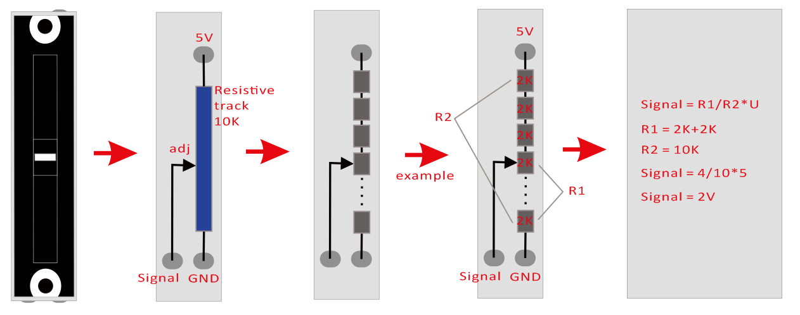     

(3) What is the analog input port?   
The analog input pin converts the voltage value to a digital value. The UNO has six analog inputs, which are A0-A5 pins. The input voltage range of the pin is 0-5V, and the mapped digital range is 0-1023. The accuracy is 4.9mV (5V/1024).     
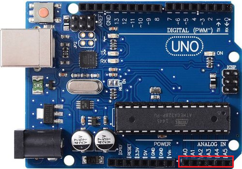         
For example, if the read digital value is 100, the analog voltage value is 490mV (100 x 4.9mV).    
```
Syntax:
analogRead(pin);

Parameters:
pin: A0-A5

Return value:
Analog reading on the pin. The value ranges from 0 to 1023. Data type :int.

In the sample code:
byte analogInPin = A3;
int analogValue = 0;
float voltageValue = 0;

analogValue = analogRead(analogInPin);
voltageValue = 5.0/1024*analogValue;
```

(4) What are variables: int and float 
**int** is an integer. The value range is -32768 -- -- 32767.  
```
Syntax:
int var = val;

Parameters:
var: variable name.
val: The value assigned to the variable.

In the sample code:
int analogValue = 0;
```
 
**Float** variable is a floating point variable and ranges from -3.4028235E+38 to -3.4028235E+38.   
```
Syntax:
float var = val;

Parameters:
var: variable name.
val: The value assigned to the variable.

In the sample code:
float voltageValue = 0;
```

## Chapter_5 External interrupt            

**Curriculum question:**     
1. What is an external interrupt?  
2. How to use logical operators:!(not)  
3. How to use variable modifiers: const and volatile   
4. How to use the loop statement: while   
5. How to write a function without parameters and return value?                   

**Program flow diagram:**   
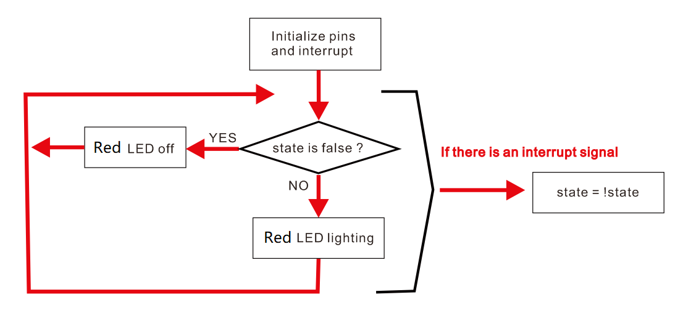     

**Open the example code: "1.4.0_External_interrupt"**     
1. Open the sample code using the methods in **"[Chapter_1](./Basic_tutorial.md#chapter-1-blink)"**.   
2. Upload the code to the UNO board.   

**Example code phenomena:**     
Press the "OK" button and the red LED will light up. Press the "OK" button again and the red LED will go out.   
     

**FAQ:**     
(1) What is an external interrupt?  
**External interrupt** means that when the system is performing a task, the outside gives a signal to the system, allowing the system to perform another more important thing, and then comes back to perform the task that was stopped before.     
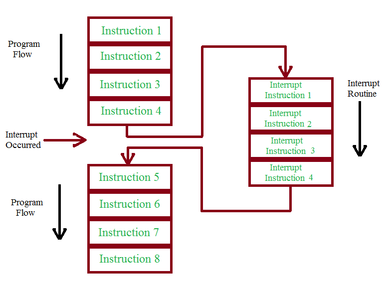     

The UNO has two external interrupt pins, pin 2 and pin 3, pin 2 corresponds to external interrupt 0, pin 3 corresponds to external interrupt 1, the priority of external interrupt 0 is higher than that of external interrupt 1. When the task of external interruption 1 is executed, if the signal of external interruption 0 is generated again, the task of external interruption 1 is stopped and the task of external interruption 0 is executed. After the task of external interruption 0 is executed, the task of external interruption 1 is executed. When the task of external interrupt 0 is executed, if the signal of external interrupt 1 is generated again, the task of external interrupt 1 is executed only after the task of external interrupt 0 is executed.     
```
Syntax:
attachInterrupt(digitalPinToInterrupt(pin), ISR, mode);  (Recommended)

Parameters:
interrupt: indicates the interrupt number (UNO is 0 or 1).
pin: Interrupt pin (UNO of 2 or 3).
ISR: Name of the interrupt function to execute, which must take no arguments and have no return value.
mode: indicates the mode of the interrupt signal. 
```
There are four interrupt modes, as follows:   
| LOW | CHANGE | RISING | FALLING |   
| :--: | :--: | :--: | :--: |
| Low level | Level change | Rising edge | Falling edge |   
| 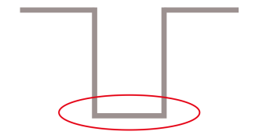 | 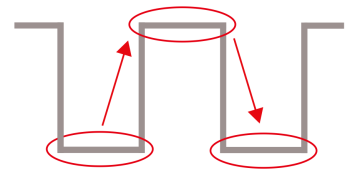 | 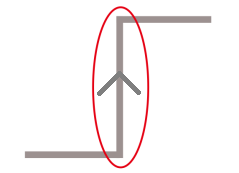 | 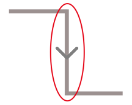 |   

```
In the sample code:
const byte interruptPin = 2;
volatile boolean state = false;
void blink(void) {
  state = !state;
}
attachInterrupt(digitalPinToInterrupt(interruptPin), blink, FALLING);
```
			
(2) How to use logical operators:!(not)  
If the variable was originally false, the not logic will make the variable true. And vice versa.      
```
Syntax:
!val

Parameters:
val: variable or operand.

In the sample code:
state = ! state;
```

(3) How to use variable modifiers: const and volatile   
**Const** keyword indicates that the variable is a constant. It is a variable qualifier that makes the variable permission "read-only," meaning that its value cannot be changed. If you try to assign a value to a const variable, the compiler will report an error.     
```
Syntax:
const type var = val;

Parameters:
type: indicates the data type, such as byte, char, int, and flaot.
var: variable name.
val: The value assigned to a variable

In the sample code:
const byte ledPin = 5;
const byte interruptPin = 2;
```

(4) How to use the loop statement: while   
First determine whether the expression inside parentheses () is true, if it is true then execute the code inside parentheses {}, then determine whether the expression inside parentheses () is true, and so on.      
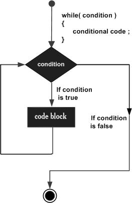        
```
Syntax:
while (condition) {
// statement(s)
}

Parameters:
condition: Boolean expression whose result is true or false.

In the sample code:  
const byte ledPin = 5;
volatile boolean state = false;
while(state == false){
digitalWrite(ledPin, LOW);
}
```

(5) How to write a function without parameters and return value?   
```
Syntax:
Type function(type val1, type val2 ...) {
// statement(s)
}

Parameters:
Type: The data type returned by the function, such as char, int, or float. The value is void if no value is returned.
type: Parameter data type, such as char, int, or float. The value is void if no parameter is specified.
function: name of a function.
val1, val2... : Parameter name; Empty when type is "void".

In the sample code:
volatile boolean state = false;
void blink(void) {
state = ! state;
}
```

**Knowledge expansion:**
1. How to use the loop statement: do... while

**Program flow diagram:**   
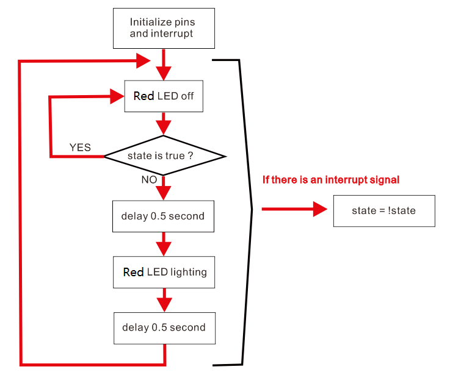     

**Open the example code: "1.4.1_External_interrupt"**     
1. Open the sample code using the methods in **"[Chapter_1](./Basic_tutorial.md#chapter-1-blink)"**.   
2. Upload the code to the UNO board.   

**Example code phenomena:**     
After power-on, the red LED on the expansion board is turned off for 0.5 seconds and turned on for 0.5 seconds. If you press the "OK" button on the expansion board, the red LED will keep going out; Press the "OK" button again to resume the loop state.     
     

**FAQ:**   
(1) How to use the loop statement: do... while  
First execute the statement inside curly braces{}, then determine whether the expression inside curly braces() is true, if so, then execute the statement inside curly braces{}, then determine whether the expression inside curly braces() is true, and so on.           
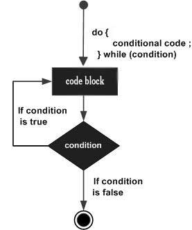     
```
Syntax:
do{
// statement(s)
}while (condition);

Parameters:
condition: Boolean expression whose result is true or false.

In the sample code:  
const byte ledPin = 5;
volatile boolean state = false;
do{
digitalWrite(ledPin, LOW);
}while(state == true);
```


## Chapter_6 PWM            

**Curriculum question:**     
1. What is PWM output?     
2. How to use the for statement?   
3. How to use operators: ++, --   
4. How to use comparison operators: >, <, >=, <=                      

**Program flow diagram:**   
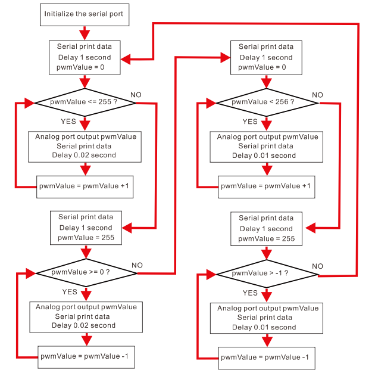     

**Open the example code: "1.5.0_PWM_output"**     
1. Open the sample code using the methods in **"[Chapter_1](./Basic_tutorial.md#chapter-1-blink)"**.   
2. Upload the code to the UNO board.   

**Example code phenomena:**     
Open the serial port monitor, the current output PWM value of pin 5 will be printed, the value from small to large, and then large to small;

The brightness of the red LED on the expansion board is also from small to large, and then large to small, so the cycle.      
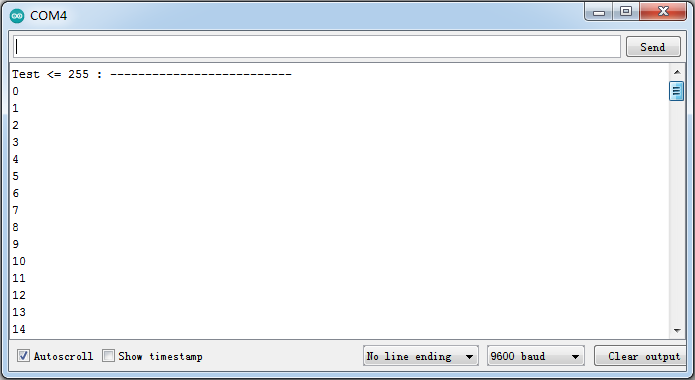     

**FAQ:**     
(1) What is PWM output?     
PWM, called pulse width modulation signal, is a square wave signal with fixed frequency and variable duty cycle time. In the figure below, T is the cycle time, which is fixed; A is high level (UNO high level is 5V); B is low level (UNO high level is 0V); The level width of A and B in the period T time is changeable, the longer the pulse time of the high level, the larger the average voltage value, and the smaller the vice versa.        
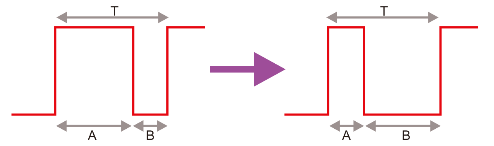     

There are 6 PWM output pins on the UNO board, which are 3, 5, 6, 9, 10 and 11 pins:    
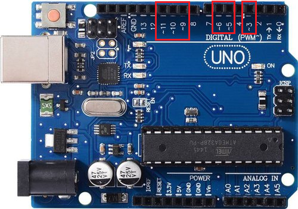     

```
Syntax:
analogWrite(pin, value);

Parameters:
pin: The pin number on the motherboard, the UNO is 3, 5, 6, 9, 10, 11.
value: high duty cycle. The value ranges from 0 to 255. The value is an int type.

In the sample code:
const byte pwmOutPin = 5;
int pwmValue = 0;
analogWrite(pwmOutPin, pwmValue);
```
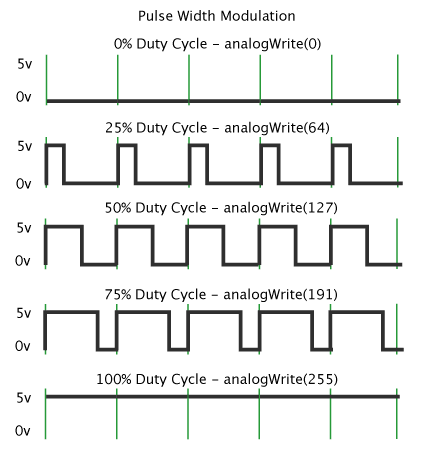     
<span style="color: rgb(255, 76, 65);">Note: Because pin 5 and 6 use timer 0 to generate PWM signal, pin 9 and 10 use timer 1 to generate PWM signal, pin 3 and 11 use timer 2 to generate PWM signal; Therefore, when using PWM signal output, it will interfere with the use of relevant timers.</span>      
More information: <https://www.arduino.cc/reference/en/language/functions/analog-io/analogwrite/>	

(2) How to use the for statement?      
A for loop statement is a conditional loop increment statement that loops the program inside braces {} if the increment condition is satisfied until the condition is not.    
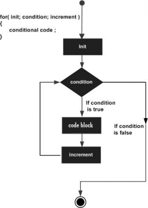     

```
Syntax:
for (initialization; condition; increment) {
// statement(s);
}

Parameters:
initialization: This parameter is performed only once in initial condition.
condition: The loop determines the condition. If true, execute the program inside curly braces {}. If not, the loop terminates.
increment: If the condition condition is true, this statement is executed once after executing the program inside curly braces {}.

In the sample code:
const byte pwmOutPin = 5;
int pwmValue = 0;

for(pwmValue = 0; pwmValue <= 255; pwmValue ++){
analogWrite(pwmOutPin, pwmValue);
delay(20);
}
```

(3) How to use operators: ++, --       
Self-adding operation: ++   
```
Description: Increments the value of a variable by 1.

Syntax:
x++; // Return x value, x plus 1.
++x; // x incremented by 1, returns the value of x incremented by 1.

Parameters:
x: variable, allowed data type :int, long.

In the sample code:
int pwmValue = 0;
for(pwmValue = 0; pwmValue <= 255; pwmValue ++){ ... }
```
More information: <https://www.arduino.cc/reference/en/language/structure/compound-operators/increment/>      

Self-decrement operation: --
```
Description: Reduces the value of a variable by 1.

Syntax:
x--; // Return x value, x minus 1.
--x; // Subtract 1 from x first, and return the value of x minus 1.

Parameters:
x: variable, allowed data type :int, long.

In the sample code:
int pwmValue = 0;
for(pwmValue = 255; pwmValue >= 0; pwmValue --){ ... }
```
More information: <https://www.arduino.cc/reference/en/language/structure/compound-operators/decrement/>     

(4) How to use comparison operators: >, <, >=, <=        
Greater-than-equal operator: >=    
```
Syntax:
x >= y; // true if x is greater than or equal to y, false if not.

Parameters:
x: variable or constant. Data types: int, float, double, byte, short, long are allowed.
y: variable or constant. Data types: int, float, double, byte, short, long are allowed.

In the sample code:
int pwmValue = 0;
for(pwmValue = 255; pwmValue >= 0; pwmValue --){ ... }
```
More information: <https://www.arduino.cc/reference/en/language/structure/comparison-operators/greaterthanorequalto/>   

Less-than-equal operator: <=  
```  
Syntax:
x < y; // true if x is less than or equal to y, false if not.

Parameters:
x: variable or constant. Data types: int, float, double, byte, short, long are allowed.
y: variable or constant. Data types: int, float, double, byte, short, long are allowed.

In the sample code:
int pwmValue = 0;
for(pwmValue = 0; pwmValue <= 256; pwmValue ++){ ... }
```
More information: <https://www.arduino.cc/reference/en/language/structure/comparison-operators/lessthanorequalto/>     

Greater-than operator: >    
```
Syntax:
x > y; // true if x is greater than y, false if not.

Parameters:
x: variable or constant. Data types: int, float, double, byte, short, long are allowed.
y: variable or constant. Data types: int, float, double, byte, short, long are allowed.

In the sample code:
int pwmValue = 0;
for(pwmValue = 255; pwmValue > -0; pwmValue --){ ... }
```
More information: <https://www.arduino.cc/reference/en/language/structure/comparison-operators/greaterthan/>    

Less-than operator: <    
```
Syntax:
x < y; // true if x is less than y, false if not.

Parameters:
x: variable or constant. Data types: int, float, double, byte, short, long are allowed.
y: variable or constant. Data types: int, float, double, byte, short, long are allowed.

In the sample code:
int pwmValue = 0;
for(pwmValue = 0; pwmValue < 256; pwmValue ++){ ... }
```
More information: <https://www.arduino.cc/reference/en/language/structure/comparison-operators/lessthan/>      


## Chapter_6 Timer1            

**Curriculum question:**     
1. How to use library files?   
2. What is a timer?   
3. How to use variable: bool                    

**Program flow diagram:**   
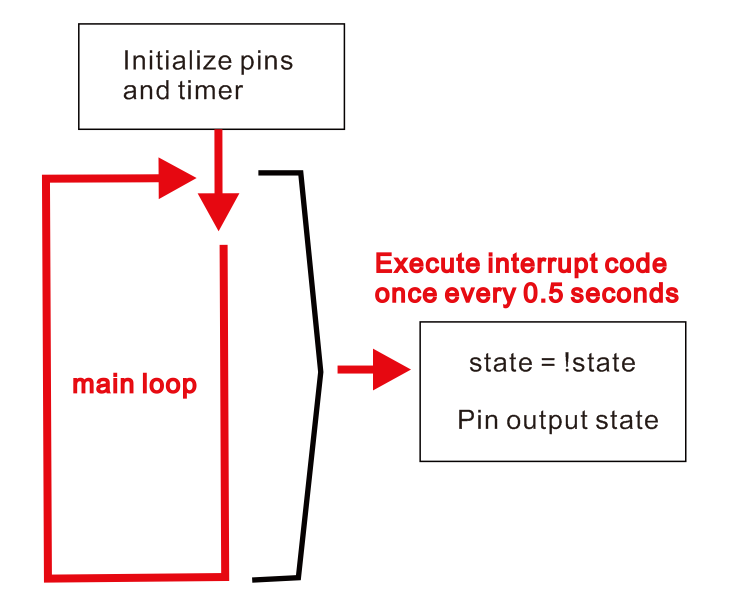     

**Open the example code: "1.6.0_Timer1"**     
1. Open the sample code using the methods in **"[Chapter_1](./Basic_tutorial.md#chapter-1-blink)"**.   
2. Upload the code to the UNO board.   

**Example code phenomena:**     
The red LED on the expansion board shines once every 0.5 seconds.       
     

**FAQ:**     
(1) How to use library files?   
See How to install library files: [Click Me](../../../arduino/A1E0000_basic_learning_shield/A1E0000_basic_learning_shield.md#integration-library)        

After loading the library file, if you want to call the library file in another file, you need to include the library file with the "include<xxx.h>" statement in the beginning line of the file, then you can use the library file. 
The operation is as follows:    
```
Syntax:
include<filename.h>

Parameters:
filename: Name of the header file in the library file.

In the sample code:
// Include timer1, which has been integrated into the Mosiwi_Basic_Learning_Kit library file.
#include <MswTimer1.h>
```

(2) What is a timer?       
A timer is equivalent to an alarm clock, which can set a time, generate a signal (equivalent to an interrupt) at every set time, and perform another thing when the signal is generated.     

Initialize timer1:   
```
Syntax:
Timer1.initialize(us);

Parameters:
us: Time, in microseconds.

In the sample code: 
Timer1.initialize(500000); // Initializes timer 1. The timer is set to 0.5 seconds
```

Set the timed interrupt function:   
```
Syntax:
Timer1.attachInterrupt(name);

Parameters:
name: function name.

In the sample code:
const byte ledPin = 5;
bool output = HIGH;

void flash(void) {
digitalWrite(ledPin, output);
output = ! output;
}

Timer1.attachInterrupt(flash);
```
<span style="color: rgb(255, 76, 65);">Note: UNO has three timers, namely timer0, timer1 and timer2, among which timer1 and timer2 are often used, while time0 is used by delay(), micros(), millis() functions, so timer0 is generally not used.</span>  

(3) How to use variable: bool            
The bool type has two values: true or false. (Each bool variable takes up one byte of memory.)   
```
Syntax:
bool var = val;

Parameters:
var: variable name.
val: The value assigned to a variable.

In the sample code:
bool output = true;
```

**Knowledge expansion:**
1. How to use the timer2?
2. How to use the variable modifier: static

**Program flow diagram:**   
     

**Open the example code: "1.6.1_Timer2"**     
1. Open the sample code using the methods in **"[Chapter_1](./Basic_tutorial.md#chapter-1-blink)"**.   
2. Upload the code to the UNO board.   

**Example code phenomena:**     
The red LED on the expansion board shines once every 1 seconds.    
     

**FAQ:**   
(1) How to use the timer2?    
Include the timer2 header file integrated in the "**Mosiwi_basic_learning_kit**" library file:    
```
#include <MswTimer2.h>
```

Initializes timer2 and timer interrupt function:          
```
Syntax:
MsTimer2::set(ms, function);   // Set the interrupt time and interrupt function.   
MsTimer2::start();             // Start timer2
MsTimer2::stop();              // Stop timer2

Parameters:
ms: Interrupt time, In milliseconds.    
function: The name of the interrupt function.      

```

(2) How to use the variable modifier: static       
The static keyword is used to create static variables that are visible to only one function. They are created and initialized only the first time a function is called, and they remain after the function is called and take up memory.      
```
Syntax:
static dataType var = val;

Parameters:
dataType: Data type, such as bool, char, and int.
var: variable name.
val: The value assigned to a variable.

In the sample code:
void flash(void) {
static bool output = HIGH;
digitalWrite(ledPin, output);
output = ! output;
}
```
More information: <https://www.arduino.cc/reference/en/language/variables/variable-scope-qualifiers/static/>    


## Chapter_7 Humiture_I2C           

**Curriculum question:**     
1. What is I2C communication?      
2. What is an array?                         

**Program flow diagram:**   
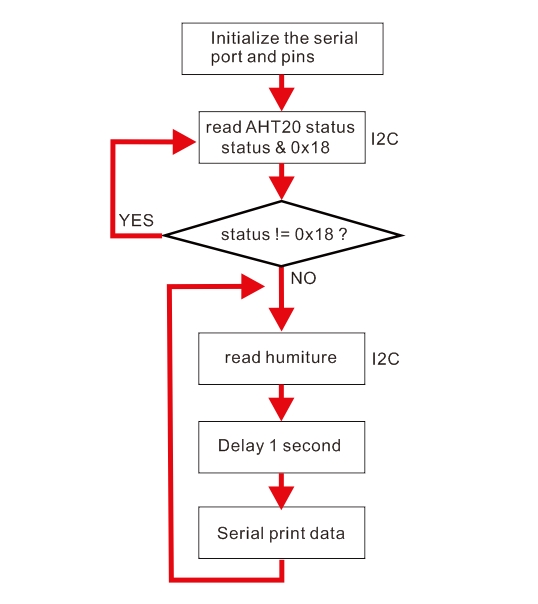     

**Open the example code: "1.7.0_Humiture_i2c"**     
1. Open the sample code using the methods in **"[Chapter_1](./Basic_tutorial.md#chapter-1-blink)"**.   
2. Upload the code to the UNO board.   

**Example code phenomena:**     
Start the serial port monitor and set the baud rate to 9600. The serial port monitor prints the temperature and humidity of the current environment every 1 second.      
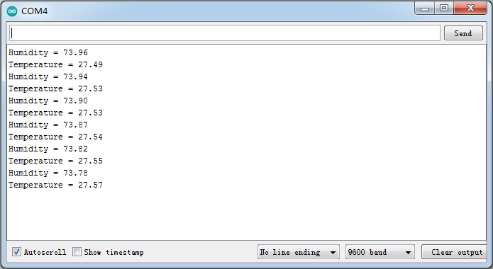     

**FAQ:**     
(1) What is I2C communication?     
The I²C (Inter-Integrated Circuit) bus is a two-wire serial synchronous communication interface developed by PHILIPS, which can realize serial synchronous communication between a master device and multiple slave devices. I²C only needs two lines, namely SDA (serial data line) and SCL (serial clock line), both of which are two-way I/O lines.    
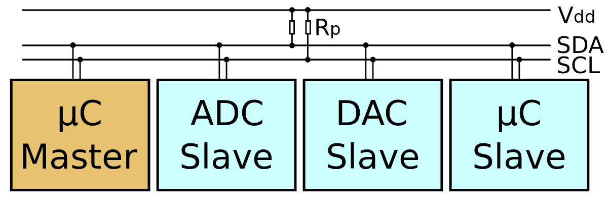     

The advantages of the I²C bus are as follows:     
1. No matter how many I²C devices are on the bus, the two lines can communicate.    
2. True multi-host support, but only one host at a time.   
3. The I2C bus has the advantages of low power consumption, strong anti-interference and long transmission distance.   
4. Serial 8-bit bidirectional data, transmission bit rate can reach 100kbit/s in standard mode, 400kbit/s in fast mode, and 3.4Mbit/s in high-speed mode.   

The A4 pin of the UNO board is also the SDA pin, and the A5 pin is the SCL pin, which can be used to communicate with other I2C devices.    
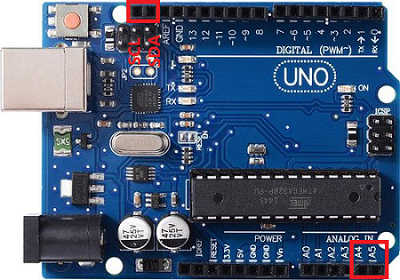     

"Basic learning shield" has an I2C interface, but also integrated a temperature and humidity sensor, it and UNO board communication is through the I2C, directly plugged in the UNO board can be used.    
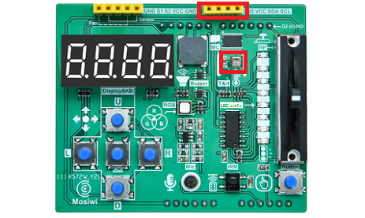     

(2)  What is an array?               
Array is in the program design, in order to deal with convenience, a number of elements with the same type in order to organize a form.     
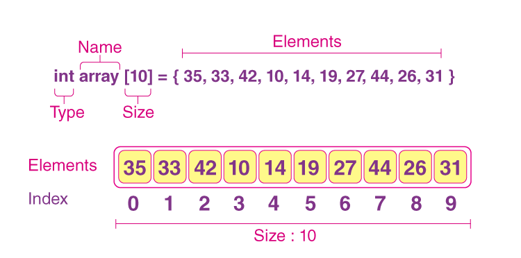     

```
Syntax:
Type Name [Num];
Type Name [Num] = {e1,e2,e3,... eN};

Parameters:
Type: The data type such as char, int, float, etc.
Name: The name of the array
Num: the length of the array, e.g., 1,2,3,...
e1,e2,e3,... eN: Array element

In the sample code:
float HT_data[2];
```

Get the array value:    
```
Syntax:
var = array-name[index];

Parameters:
var: The variable name
Array-name: The name of the array
index: Array index
```

Assign to an array:   
```
Syntax:
array-name[index] = val;

Parameters:
val: The variable name or number
Array-name: The name of the array
index: Array index
```
More information: <https://www.arduino.cc/reference/en/language/variables/data-types/array/>   


## Chapter_8 Pointer and Array           

**Curriculum question:**     
1. What is a pointer?   
2. How are Pointers related to arrays?                            

**Program flow diagram:**   
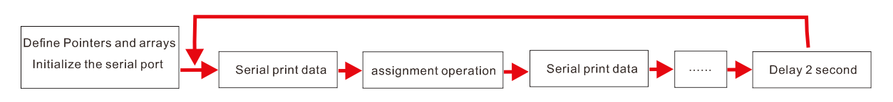     

**Open the example code: "1.7.1_Pointer_Array"**     
1. Open the sample code using the methods in **"[Chapter_1](./Basic_tutorial.md#chapter-1-blink)"**.   
2. Upload the code to the UNO board.   

**Example code phenomena:**     
Open the serial port monitor, set the baud rate to 9600, and the serial port monitor prints the array name, array index, pointer name and the data of the index every 2 seconds.    
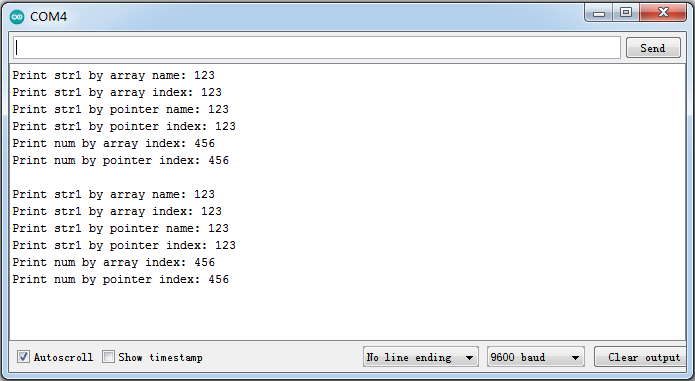     

**FAQ:**     
(1) What is a pointer?       
A pointer is a type of variable that is assigned a random address when it is defined, and then the pointer can be used to point to the address of the variable and the value of the variable can be obtained from the address of the variable.    
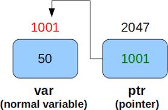     
As shown in the figure above, define a variable "var", the system assigns an address of 1001 (equivalent to the house number of a room), and the value stored in the address is 50 (equivalent to the value of 50 stored in the room); then a pointer "ptr" is defined, and the system assigns it an address of 2047 (also equivalent to the door number of a room); the value stored in the address is the address 1001 of the variable "var" (equivalent to the house number stored in the room); then you can use "ptr" (2047) --> "var" ( 1001) --> 50, find the value 50 of the "var" variable.     

Define the pointer:   
```
Syntax:
type *point-name;
type *point-name = NULL;

Parameters:
type: The data type such as char, int, float, etc.
point-name: The name of the pointer

In the sample code:
char *p1 = NULL;
byte *p2 = NULL;
```

The pointer reference operator: &    
```
Syntax:
point-name = &var-name;   //& denotes the address to fetch the variable

Parameters:
point-name: The name of the pointer
var-name: The variable name
```

Take the value of the address pointed to by the pointer: *   
```
Syntax:
var-name = *point-name; 

Parameters:
var-name: The name of the variable.
point-name: The name of the pointer.

Examples:
int *p;         // Declare a pointer to the integer data type
int i = 5;
int result = 0;
p = &i;         // Now 'p' points to the address of 'i'
result = *p;    // result = 5, 'result' gets 5 of the address pointed to by 'p'.  
```
More information: <https://www.arduino.cc/reference/en/language/structure/pointer-access-operators/dereference/>     

(2) How are Pointers related to arrays?                   
The addresses of the array in the system memory are continuous, as shown in the following figure:    
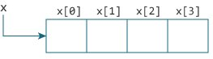     
The array is named x and has four elements: x[0], x[1], x[2], and x[3]. The array name x is also a pointer variable, and &x[0] has the same address as x because the pointer variable x points to the first element of the array.      
So:    
```
&x[0] = x，  x[0] = *(x)
&x[1] = x+1，x[1] = *(x+1)
...
&x[i] = x+i，x[i] = *(x+i)
```
The name of an array is also a pointer variable, so you can assign the name of an array to a pointer variable, like this:   
```
char *p1 = NULL;                  // Define a character pointer
byte *p2 = NULL;                  // Define a byte pointer

char str1[3] ={'1', '2', '3'};    // Define a character array
byte num[3]  ={4, 5, 6};          // Define a byte array

p1 = str1;
p2 = num;
```


## Chapter_9 Digital_tube-Button-SPI           

**Curriculum question:**     
1. What is a 4-bit 8-segment digital tube?  
2. What is SPI communication?

**Program flow diagram:**   
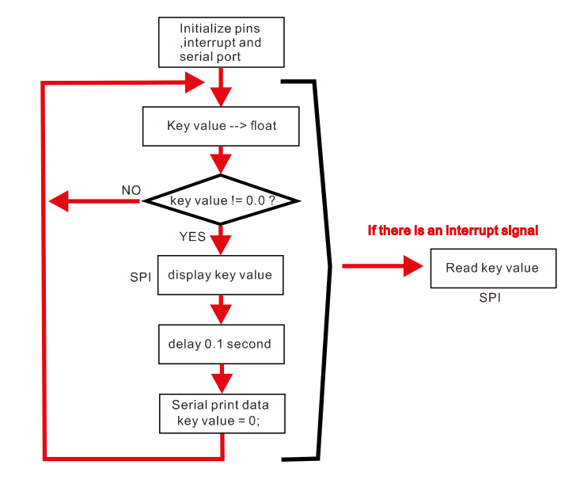     

**Open the example code: "1.8.0_Digital_tube_Button_spi"**     
1. Open the sample code using the methods in **"[Chapter_1](./Basic_tutorial.md#chapter-1-blink)"**.   
2. Upload the code to the UNO board.   

**Example code phenomena:**     
The 4-bit digital display tube displays "16.0" when the "U" key is pressed; "8.0" is displayed when the "D" key is pressed; "4.0" is displayed when the "L" key is pressed; "2.0" is displayed when the "R" key is pressed. Displays "1.0" when the "OK" key is pressed.    
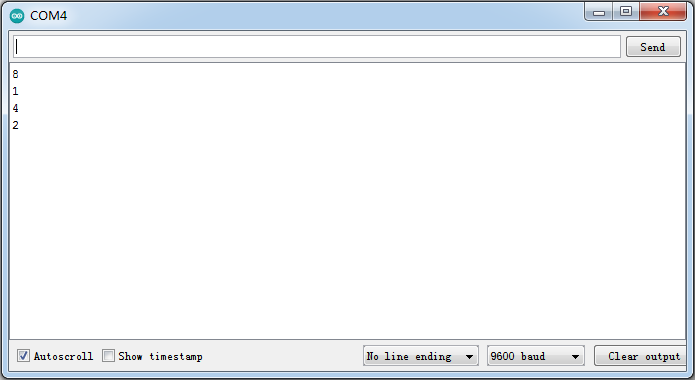     

**FAQ:**     
(1) What is a 4-bit 8-segment digital tube?     
Digital can be divided into common cathode or common anode digital, all LED cathodes are connected together called common cathode digital tube, all internal LED anodes are connected together is called common anode digital tube.                  
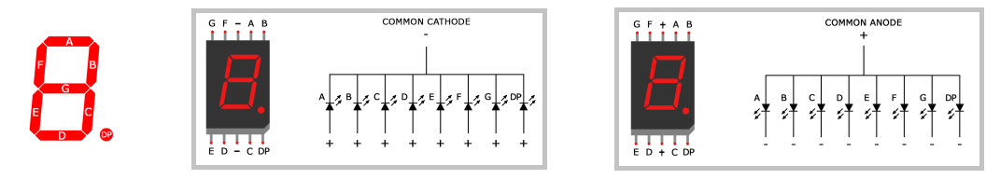     

The 4-bit 8-segment digital tube is internally composed of four 1-bit 8-segment digital tubes. We used a 4-bit 8-segment cocathode digital tube, as shown below:    
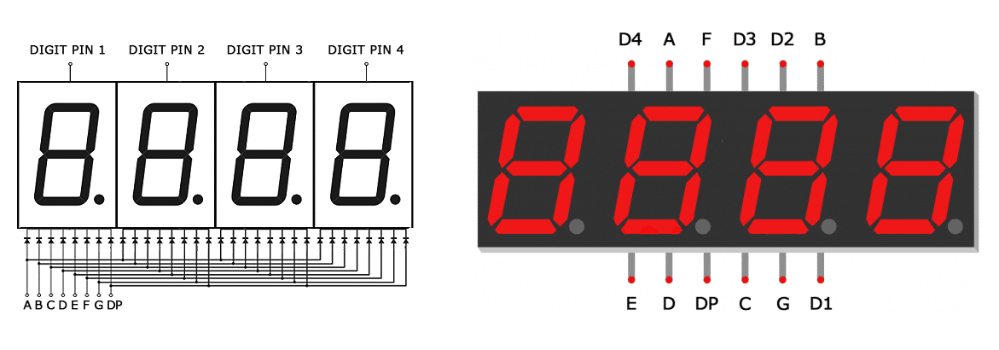     

(2) What is SPI communication?     
SPI(Serial Peripheral interface) is a synchronous serial communication interface specification for short distance communication, which is mainly used in embedded systems. It can realize serial synchronous communication between a master device and multiple slave devices.     
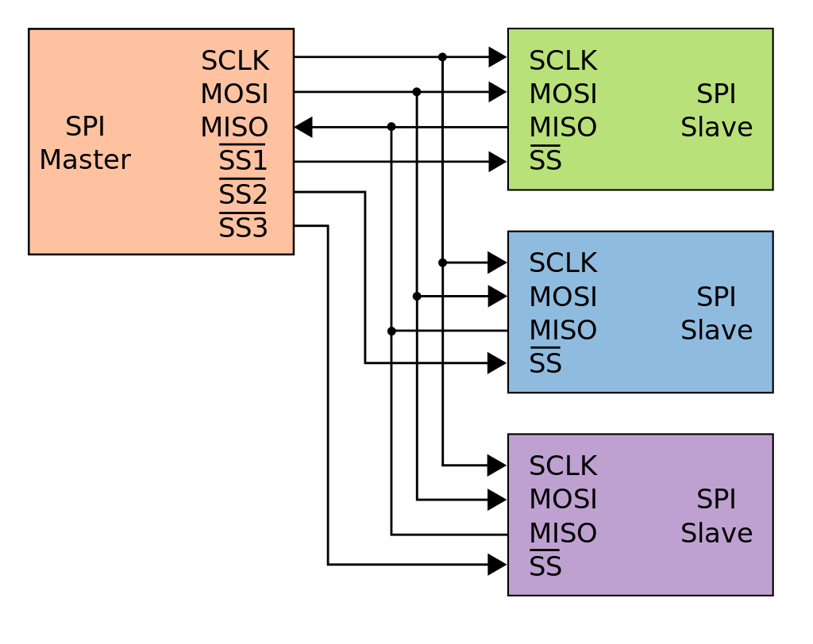     
SCLK: Serial clock (host generated)  
MOSI: The master outputs data and the slave inputs data   
MISO: The master inputs data and the slave outputs data   
CS /SS: Chip/slave selection (usually low level valid, output by the master)    

The UNO board has a hardware SPI interface with pins 10 (CS), 11 (MOSI), 12 (MISO), 13 (CLK).
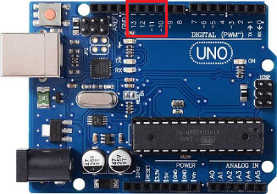     

The "Basic learning shield" is integrated with a 4-bit 8-segment display digital tube and five keys. They are controlled by the BC7278 chip, which has a slave SPI interface and a key trigger signal output. The extension board is directly inserted into the UNO board, you can control the display of the digital tube and read the key value of the 4-bit key.     
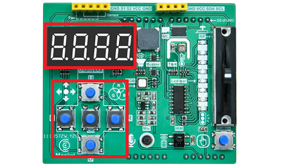     
| U | D | L | R | OK |
| :--: | :--: | :--: | :--: | :--: |
| 16 | 8 | 4 | 2 | 1 |
<span style="color: rgb(255, 76, 65);">Note: The 4-bit 8-segment digital tube and 5 keys on the "Basic learning shield" occupy pins 3 (key trigger signal output), 11 (MOSI), 12 (MISO) and 13 (CLK) of the UNO board, and the CS control pin is not required.</span>     

**Knowledge expansion:**
1. What is coercion of a variable?    
2. How do you use "while(1)"?   

**Program flow diagram:**   
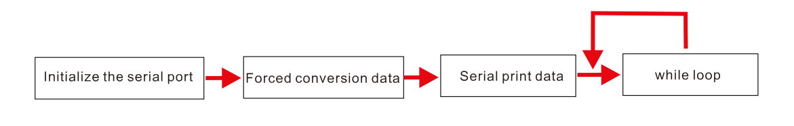     

**Open the example code: "1.8.1_Forced_variable_conversion"**     
1. Open the sample code using the methods in **"[Chapter_1](./Basic_tutorial.md#chapter-1-blink)"**.   
2. Upload the code to the UNO board.   

**Example code phenomena:**     
Turn on the serial port monitor, adjust the baud rate to 9600, and the serial port monitor prints the data information after forced conversion every 2 seconds.     
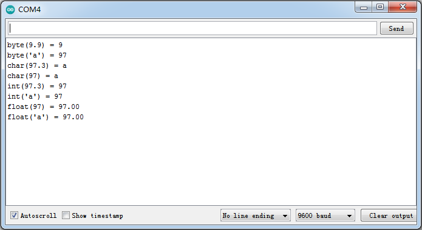     

**FAQ:**   
(1) What is coercion of a variable?      
In C or C++ language, data or variables of different types cannot be assigned to each other. Coercion is to convert data or variables of the current type into data or variables of other types.     
```
Syntax:
type(expression)
(type)expression

Parameters:
type: The cast data type (char, int, float, etc.)
expression: The data, variable, or arithmetic expression that is coerced.

In the sample code:
Serial. Println (int (97.3));
```

(2) How do you use "while(1)"?         
This is an infinite empty loop instruction. When the program executes to this statement, the program will always do an infinite empty loop here.     
```
while(1){} = while(1);
```

**End!**    
For more exciting tutorials, check out the [intermediate tutorial](./Intermediate_tutorial.md)!    
