# Intermediate tutorial   
Learn common programming syntax based on "UNO board + expansion board + peripheral module", and learn the most comprehensive arduino syntax and application with the lowest cost.     

## Previous preparation   
1. Install the [**Arduino IDE**](../../../arduino/arduino_ide/arduino_ide.md).     
2. Basic operation of the [**Arduino UNO R3**](../../../arduino/A1D0000_uno_r3/A1D0000_uno_r3.md) motherboard.    
3. Learn about [**Basic learning shield**](../../../arduino/A1E0000_basic_learning_shield/A1E0000_basic_learning_shield.md).  
4. Install the [**Mosiwi basic learning kit**](../../../arduino/A1E0000_basic_learning_shield/A1E0000_basic_learning_shield.md#integration-library) library.    

## Chapter1 RGB LED    

**Curriculum question:** 
1. What is resistance?     
2. How to control R, G, B LED?    
3. What is a preprocessing directive: #define     

**Program flow diagram:** 
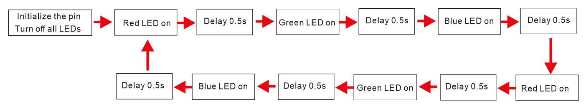    

**Open the example code: "2.0.0_RGB_led"**   
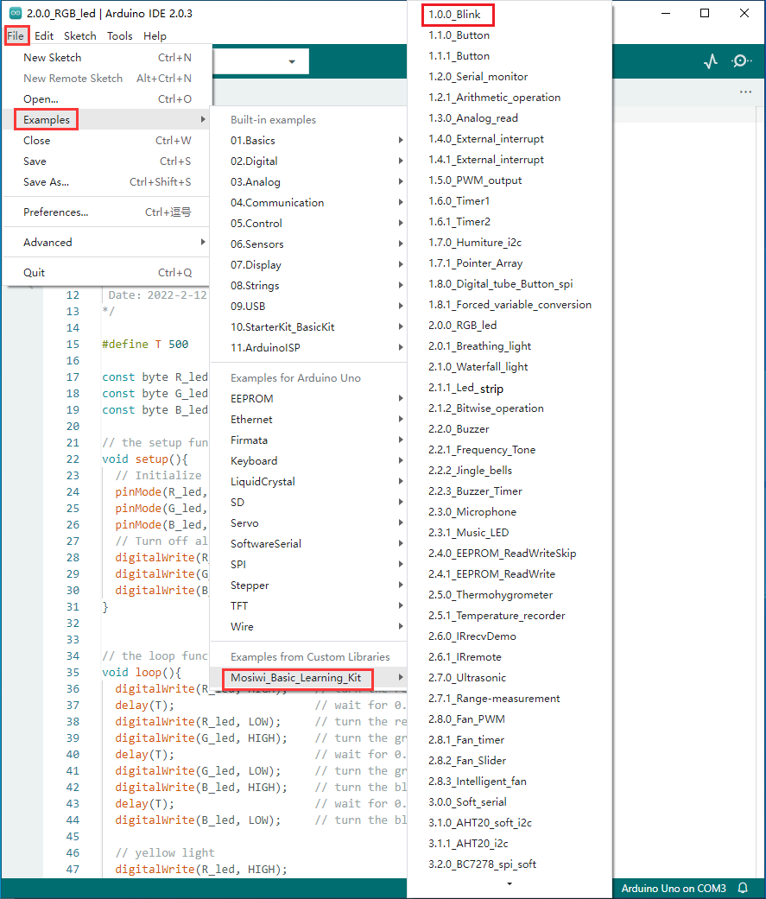    
Upload the code to the UNO board.     
<span style="color: rgb(255, 76, 65);">Note: All the sample code in the following sections is opened in the same way as in the figure above.</span>     

**Example code phenomena:**   
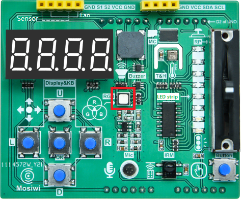    
RGB LED lights flash red, green, blue, yellow, cyan, mauve and white.   

**FAQ:** 
(1) What is resistance?   
The resistance of a conductor to the current is called its resistance. The greater the resistance of the conductor, the greater the obstruction effect of the conductor on the current. The resistance of a conductor is usually represented by the R symbol, the unit of resistance is ohms, and the symbol is Ω.     

Resistance is defined by the ratio of the voltage U at the two ends of the conductor to the current I passing through the conductor:      
$$R=U/I$$     

Color ring resistor uses different colors to show the resistance and accuracy, as shown below:    
    

(2) How to control R, G, B LED?      
RGB LED is a combination of red, green and blue LEDs. By controlling the intensity of the light emitted by the LEDs of 3 colors and fusing the 3 lights together, various light sources can be produced.     
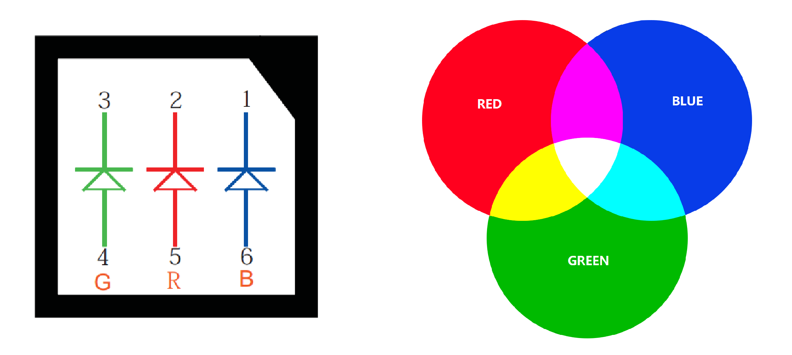    

When the expansion board is directly inserted into the UNO board, the R, G, and B leds on the expansion board are controlled by the 5, 6, and 9 pins of the UNO board. These three pins can be set to digital output mode, by output high or low level to control the LED on and off.             
Set pin mode:    
```
Syntax:
pinMode(pin, OUTPUT);

Parameters:
pin: LED pin number, 5, 6, 9
```
Set the leds on or off:    
```
Syntax:
digitalWrite(pin, state);

Parameters:
pin: LED pin number, 5, 6, 9
state: HIGH or LOW, corresponding to the LED on and off state
```

(3) What is a preprocessing directive: #define  
**\#define** allows the programmer to assign a name to a constant before compiling the program, and the compiler will replace references to these constants with defined values at compile time.    
```
Syntax:
#define name val

Parameters:
name: Constant name.
val: Constant value.

In the sample code:
#define T 500
```
More information: <https://www.arduino.cc/reference/en/language/structure/further-syntax/define/>    

## Chapter2 waterfall light   

**Curriculum question:** 
1. How to control the LED strip of the expansion board?      

**Program flow diagram:** 
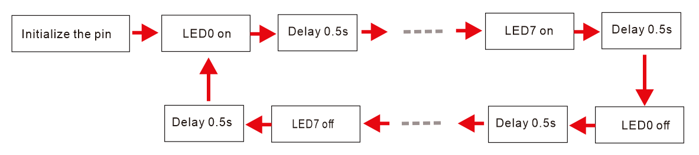    

**Open the example code: "2.1.0_Waterfall_light"**      
1. Open the sample code using the methods in **"[Chapter_1](./Basic_tutorial.md#chapter-1-blink)"**.   
2. Upload the code to the UNO board.

**Example code phenomena:**  
The LED strip on the expansion board turns on and off in cycles.   
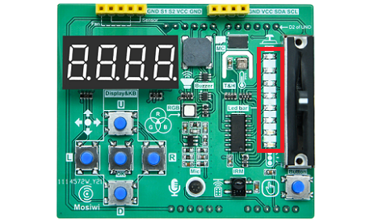    

**FAQ:** 
(1) How to control the LED strip of the expansion board?     
There is one LED strip on the expansion board, which is controlled by the 74HC595 chip on the expansion board. 74HC595 is a widely used serial input and parallel output chip.    
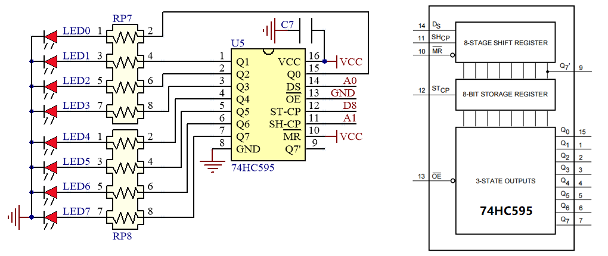    

Because the 74HC595 chip is controlled by pin 8, A0, and A1 of the UNO, the LED strip on the expansion board is ultimately controlled by the UNO board. For ease of use, the control methods have been written as functions and integrated into the library file, which must include the relevant headers:   
```
#include <MswLed.h>
```

Initialize the control pins:   
```
Init_LED_IO(8, A1, A0);
```

Control LED strip function:   
```
Syntax:
SetLed(num, state);

Parameters:
num: LED, allowed range: 0-7
state: LED state, on or off; For example: 0, 1, On, Off

In the sample code: 
int i;
for(i=0; i<=7; i++){
SetLed(i, On);
delay(500);
}
```

## Chapter3 LED strip   

**Curriculum question:** 
1. How is the map() function used?   
2. How is the break statement used?   
3. How is the switch statement used?  
4. What are binary numbers, decimal numbers, and hexadecimal numbers?     
5. How to control all leds of the LED strip at the same time?   

**Program flow diagram:** 
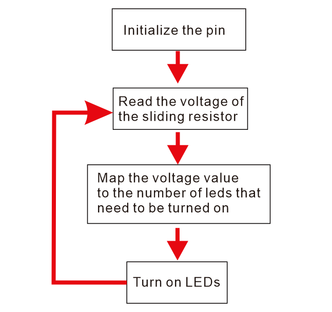    

**Open the example code: "2.1.1_Led_strip"**      
1. Open the sample code using the methods in **"[Chapter_1](./Basic_tutorial.md#chapter-1-blink)"**.   
2. Upload the code to the UNO board.

**Example code phenomena:**  
The more you push the slide resistor up, the more LEDs are turned on; the more you push the slide resistor down, the more LEDs are turned off.    
    

**FAQ:**
(1) How is the map() function used?   
map() is a mapping function that remaps numbers from one range to another, as follows:    
```
Syntax:
map(value, fromLow, fromHigh, toLow, toHigh)

parameter:
value: The value to map.
fromLow: The lower limit value of the current range.
fromHigh: The upper limit value of the current range.
toLow: The lower limit value of the target range.
toHigh: The upper limit value of the target range.

In the sample code:
int analogValue = 0;
byte ledNum = 0;
ledNum = map(analogValue, 0, 1010, 0, 8);
```
More info: <https://www.arduino.cc/reference/en/language/functions/math/map/>    

(2) How is the break statement used?   
The "break" statement is used to exit the "for", "while" and "do...while" loop. It is also used to exit the "switch case" statement.    
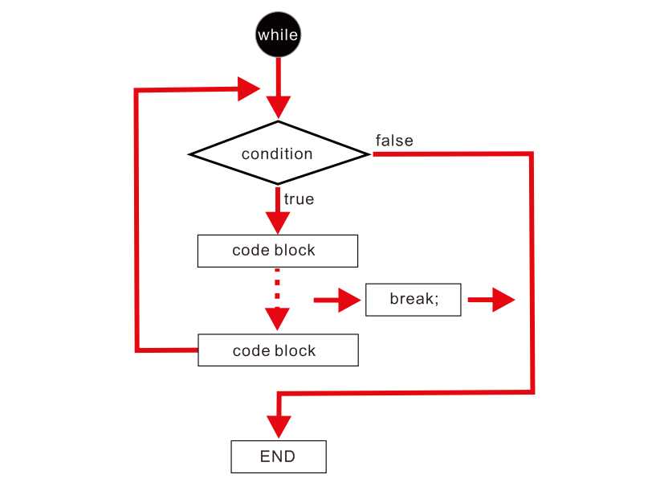    
More info: <https://www.arduino.cc/reference/en/language/structure/control-structure/break/>    

(3) How is the switch statement used?  
Like the "if" statement, the "switch case" statement allows the programmer to control the flow of the program by executing different pieces of code under specified conditions.    
```
Description:
The "switch" statement compares the value of the variable "var" to the value specified in the case statement as "label". When the value of a case statement "label" is found to match the value of the variable "var", the block after the "case" statement is run until the "break" statement is executed, and the switch statement comes out.

Syntax:
switch (var) {
    case label1:
    // statements
    break;
    case label2:
    // statements
    break;
    efault:
    // statements
    break;
}

Parameters:
var: A variable used for comparison. Allowed data types: int, char.
label1, label2: Constants. The data types are int and char.

In the sample code:
byte ledNum = 0;
switch (ledNum){
    case 0: SetLedBar(0b00000000); break;
    case 1: SetLedBar(0b00000001); break;
    case 2: SetLedBar(0b00000011); break;
    case 3: SetLedBar(0b00000111); break;
    case 4: SetLedBar(0b00001111); break;
    case 5: SetLedBar(0b00011111); break;
    case 6: SetLedBar(0b00111111); break;
    case 7: SetLedBar(0b01111111); break;
    case 8: SetLedBar(0b11111111); break;
    default: break;
}
```

(4) What are binary numbers, decimal numbers, and hexadecimal numbers?    
**Binary numbers and decimal numbers:**   
In the computer hard disk, every 1 location can only store 0 or 1 (high or low level), then the data stored in the hard disk is actually a string of 0 and 1, in other words, if we have a way to record 0 and 1 can record data. 1 position can only store 0 and 1, need many positions to store a lot of 0 and 1, we call each 1 position "bit", that is, binary numbers, binary numbers is generally "0b" or "0B" as the prefix.        

The 1 "char" variable is 8 bits, 8 consecutive locations in memory, as shown below:    
| Bit | 7 | 6 | 5 | 4 | 3 | 2 | 1 | 0 |
| :--: | :--: | :--: | :--: | :--: | :--: | :--: | :--: | :--: |
| Binary numbers | 0 or 1 | 0 or 1 | 0 or 1 | 0 or 1| 0 or 1 | 0 or 1 | 0 or 1 | 0 or 1 |
| Decimal numbers | 2\*2\*2\*2\*2\*2\*2\*（0 or 1） | 2\*2\*2\*2\*2\*2\*（0 or 1） | 2\*2\*2\*2\*2\*（0 or 1） | 2\*2\*2\*2\*（0 or 1） | 2\*2\*2\*（0 or 1） | 2\*2\*（0 or 1） | 2\*（0 or 1） | 0 or 1 |

From the figure above, we can see that the value range of "char" variable is: 0-255, please see the following calculation:       
```
Binary number ：0b00000001
Decimal number：0+0+0+0+0+0+0+1=1
```
...
```
Binary number ：0b10000001
Decimal number：2*2*2*2*2*2*2*1+0+0+0+0+0+0+1=129
```
...
```
Binary number ：0b11111111
Decimal number：2*2*2*2*2*2*2*1+64+32+16+8+4+2+1=255
```
<span style="color: rgb(255, 76, 65);">Note: You do not need to write prefixes in Decimal numbers.</span>       

**Decimal numbers and hexadecimal numbers:**   
Each digit of A hexadecimal number ranges from 1, 2, 3, 4, 5, 6, 7, 8, 9, A, B, C, D, E, and F, corresponding to the following decimal values:    
| Hexadecimal numbers | 0 | 1 | 2 | 3 | 4 | 5 | 6 | 7 | 8 | 9 | A | B | C | D | E | F |    
| :--: | :--: | :--:| :--: | :--: | :--: | :--: | :--: | :--: | :--: | :--: | :--: | :--: | :--: | :--: | :--: | :--: |   
| Decimal numbers | 0 | 1 | 2 | 3 | 4 | 5 | 6 | 7 | 8 | 9 | 10 | 11 | 12 | 13 | 14 | 15 |   

The relationship between hexadecimal numbers and decimal numbers is as follows:    
| Bit | 3 | 2 | 1 | 0 |   
| :--: | :--: | :--: | :--: | :--: | :--: |         
| Hexadecimal numbers | 0 ot F | 0 ot F | 0 ot F | 0 ot F |       
| Decimal numbers | 16\*16\*16（0 to 15） | 16\*16（0 to 15） | 16（0 to 15） | 0 to 15 |  

Hexadecimal number is usually prefixed with "0x" or "0X" as follows:   
```
Hexadecimal number：0x000F
Decimal number：0+0+0+15=15
```
```
Hexadecimal number：0x00FF
Decimal number：0+0+16*15+15=255
```
```
Hexadecimal number：0xFFFD
Decimal number：16*16*16*15+16*16*15+16*15+13=65533
```
You can open the PC calculator to verify the above calculation, first switch to the binary mode input "11111111"; You will get the decimal number "255" and the hexadecimal number "FF".    
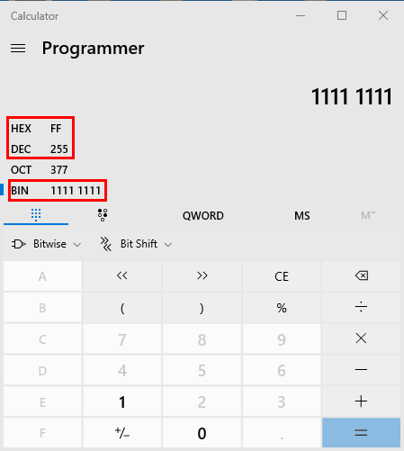    

(5) How to control all leds of the LED strip at the same time?   
In the previous chapter, we learned how to control a single LED, so we'll use another function that allows us to control the state of eight leds from bits of data.      
```
Syntax:
SetLedBar(num);

Parameters:
num: LED control value, allowed value: 0b00000000--0b11111111 (0--255).
```
Relationship between the LED state and the value of "**num**":      
| Bit | 7 | 6 | 5 | 4 | 3 | 2 | 1 | 0 |
| :--: | :--: | :--: | :--: | :--: | :--: | :--: | :--: | :--: |
| 0b | 0 or 1 | 0 or 1 | 0 or 1 | 0 or 1 | 0 or 1 | 0 or 1 | 0 or 1 | 0 or 1 |

## Chapter4 bit operation  
**Curriculum question:** 
1. How to use the bit operations: &, |, ~, ^, < <, > >        

**Program flow diagram:** 
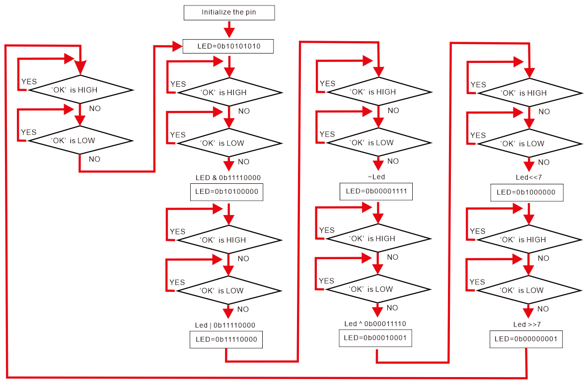    

**Open the example code: "2.1.2_Bitwise_operation"**      
1. Open the sample code using the methods in **"[Chapter_1](./Basic_tutorial.md#chapter-1-blink)"**.   
2. Upload the code to the UNO board.

**Example code phenomena:**  
Every time you press "Button" on the expansion board, the LED strip on the expansion board will be lit in the order shown below.    
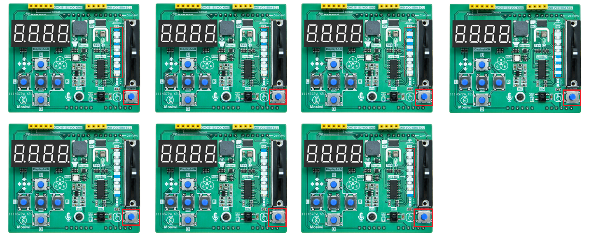    

**FAQ:**
(1) How to use the bit operations: &, |, ~, ^, < <, > >     
The bit AND operation: &      
```
Description:
Two data bits AND operations: 1&1 =1, 1&0=0, 0&1=0, 0&0=0    

Examples:

  0b11110000  --> operand1
& 0b10000001  --> operand2
--------------
  0b10000000  --> result
```
The bit OR operation: &    
```
Description:
Two data bits OR operations: 1|1=1，1|0=1，0|1=1，0|0=0

Examples:   

  0b11110000  --> operand1
| 0b10000001  --> operand2    
--------------
  0b10000000  --> result
```
The bit NOT operation: ~    
```
Description:
Two data bits NOT operations: ~0=1，~1=0  

Examples: 

~  0b10000001  --> operand
--------------
   0b01111110  --> result
```
The bit XOR(Exclusive OR) operation: ^   
```
Description:
Two data bits XOR operations: 1|1=0，1|0=1，0|1=1，0|0=0

Examples: 

  0b11110000  --> operand1
^ 0b10000001  --> operand2    
--------------
  0b01110001  --> result
```
Bit left shift operation: <<
```
Syntax:
variable << number_of_bits;

Parameters:
variable: A variable or number
number_of_bits: The number of bits shifted

Examples:
0b00000001 << 7 = 0b10000000
```
Bit right shift operation: >>
```
Syntax:
variable >> number_of_bits;

Parameters:
variable: A variable or number
number_of_bits: The number of bits shifted

Examples:
0b10000000 >> 7 = 0b00000001    
```


## Chapter5 Buzzer
**Curriculum question:** 
1. What is buzzer?    
2. What is MOS transistor?    
3. How do you use the tone() and notone() functions?       

**Program flow diagram:** 
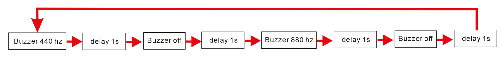    

**Open the example code: "2.2.0_Buzzer"**      
1. Open the sample code using the methods in **"[Chapter_1](./Basic_tutorial.md#chapter-1-blink)"**.   
2. Upload the code to the UNO board.

**Example code phenomena:**  
The buzzer cycle produced 440 Hz and 880 Hz sounds.     
    

**FAQ:**
(1) What is buzzer?    
The piezoelectric buzzer consists of internal piezoelectric elements and has two pins, one for the power positive and the other for the negative.    
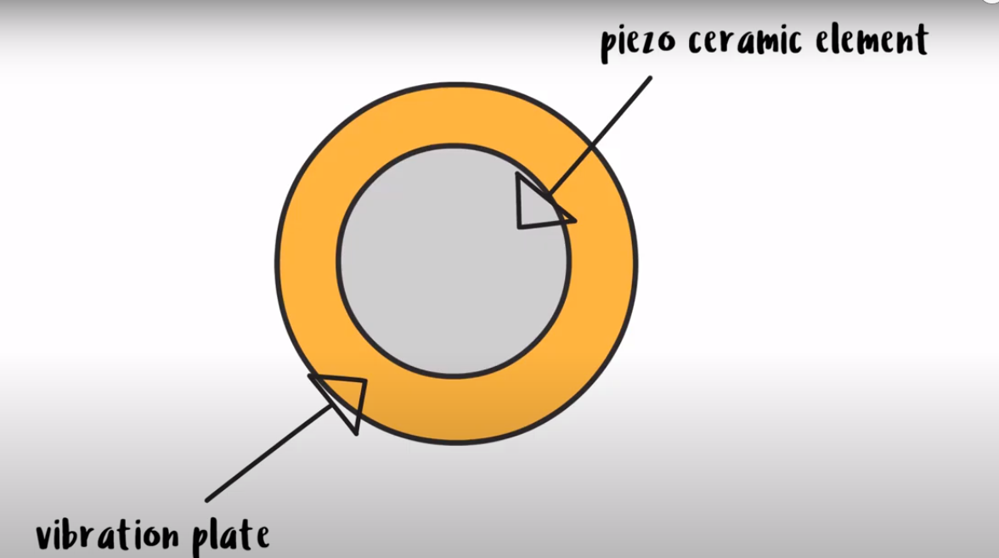    
When the buzzer is energized, an electric charge is applied to the ceramic disk of its internal piezoelectric element, resulting in vibration. The ceramic disc is attached to a vibrating disc, which vibrates along with it, producing an audible sound.    
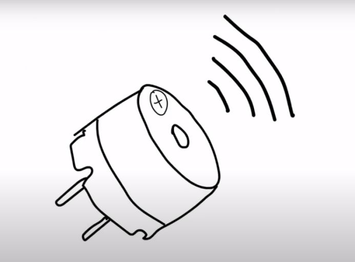    

Passive buzzer VS active buzzer:   
Active buzzers use DC power and buzzers emit sound at a fixed frequency.      
As for the passive buzzer, additional drive circuits are required. The frequency of the sound will vary with the frequency of the square wave signal. If the frequency signal is not added, the passive buzzer does not sound.     
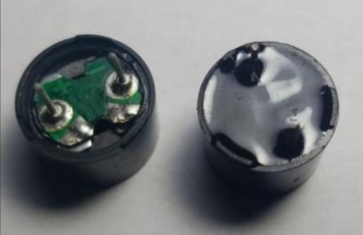    
The extension board integrates a patch passive buzzer that is controlled by the 9 pins of the UNO board when the extension board is directly inserted into the UNO board.    

(2) What is MOS transistor?    
MOS, is MOSFET (Metal-Oxide-Semiconductor Field-Effect Transistor) abbreviation.      
Mosfets are four-terminal devices with source (S), gate (G), drain (D), and body (B) terminals. Typically, the B terminal is connected to the S terminal, resulting in a three-terminal device. MOS transistors can be divided into enhanced MOS transistors and depletion MOS transistors, which can be subdivided into N-channel MOS transistors and p-channel MOS transistors. The enhanced MOS transistors are more widely used in the two types.     
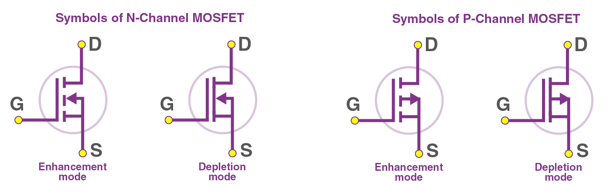    

MOS transistors are commonly used as switches. If the voltage between the drain and the source reaches the threshold voltage, the G and S poles are conducted, otherwise they are not conducted. Common circuits are as follows:   
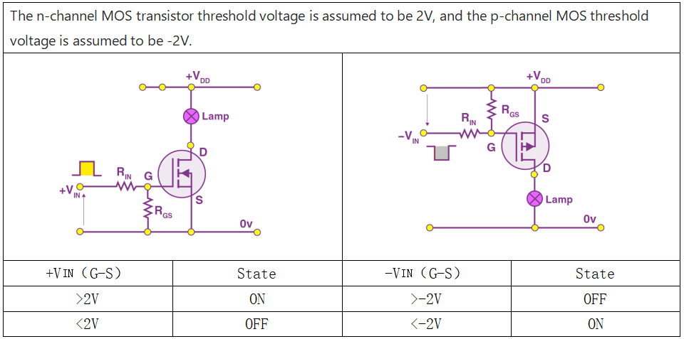    

A 2N7002 MOS is used on the extension board to drive the buzzer. It is an enhanced N-channel MOS. When a voltage greater than 2.5V is applied to its gate, the MOS drain and source electrodes are on, and therefore, the buzzer is on. Otherwise the buzzer is open.   
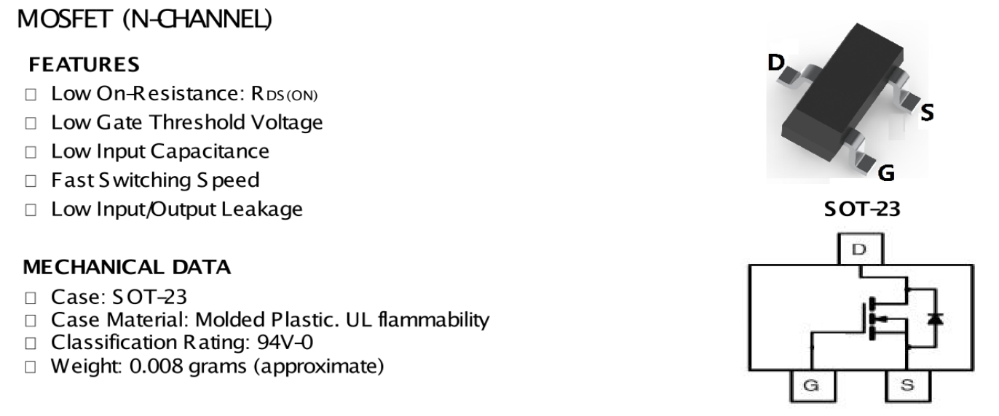    

(3) How do you use the tone() and notone() functions?   
The tone() and notone() functions are built-in libraries in the Arduino IDE that you can call directly.    

The tone() function:     
```
Description:
Produces a square wave at the specified frequency (50% duty cycle) on the UNO pin. You can specify a duration, otherwise a square wave will be generated until noTone() is called.

Syntax:
tone(pin, frequency);
tone(pin, frequency, duration);

Parameters:
pin: The pin of UNO.
frequency: The frequency of the tone, in Hertz. Allowed data type: unsigned int
duration: The duration in milliseconds (optional) Allowed data type: unsigned long.

Note:
The set frequency must be greater than 31Hz.
Using the tone() function affects the PWM output of pins 3 and 11 and affects the use of timer 2.
Only one pin can use tone() at a time.If you want to use another pin, you need to close the active pin with the notone() function.

In the sample code:
byte BuzzerPin = 9;
tone(BuzzerPin, 440, 1000);
```
More info: <https://www.arduino.cc/reference/en/language/functions/advanced-io/tone/>   

The notone() function:    
```
Description:
Stops the square wave generated by the tone() trigger.

Syntax:
noTone(pin)

Parameters:
pin: The UNO pin that needs to stop generating the tone.
```
More info: <https://www.arduino.cc/reference/en/language/functions/advanced-io/notone/>    


## Chapter6 Frequency-Tone  
**Curriculum question:** 
1. What is the relationship between the frequency and the tone of the buzzer?        

**Program flow diagram:** 
    

**Open the example code: "2.2.1_Frequency_Tone"**      
1. Open the sample code using the methods in **"[Chapter_1](./Basic_tutorial.md#chapter-1-blink)"**.   
2. Upload the code to the UNO board.

**Example code phenomena:**  
When the slider resistor is pushed, the buzzer produces the sound of "DO", "RE", "MI", "FA", "SO", "LA", "SI", and the frequency of the sound is displayed by the 4-bit digital tube.    
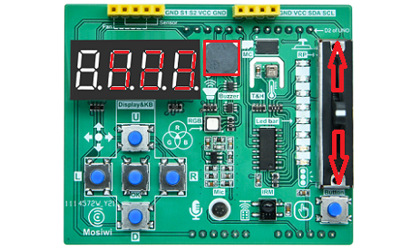    

**FAQ:**
(1) What is the relationship between the frequency and the tone of the buzzer?      
Various tones are produced by sounds of different frequencies. Because buzzers can produce sounds of different frequencies, buzzers can also produce a variety of tones.    
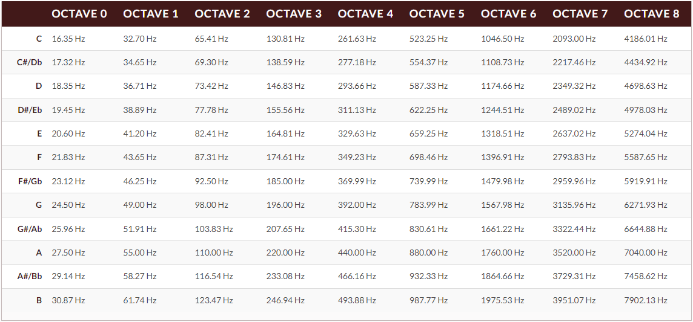    


## Chapter7 Music   
**Curriculum question:** 
1. What is music?    
2. How do you use sizeof()?    
3. How to use the store statements: PROGMEM, pgm_read_word_near(), pgm_read_float_near()       

**Program flow diagram:** 
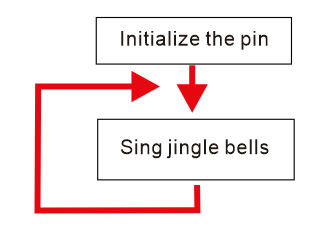    

**Open the example code: "2.2.2_Jingle_bells"**      
1. Open the sample code using the methods in **"[Chapter_1](./Basic_tutorial.md#chapter-1-blink)"**.   
2. Upload the code to the UNO board.

**Example code phenomena:**    
The buzzer keeps playing the song "Jingle bells" on a loop.    
    
  
**FAQ:**
(1) What is music?    
Music is the art of arranging sound in time through elements such as melody, harmony, rhythm, and timbre.   
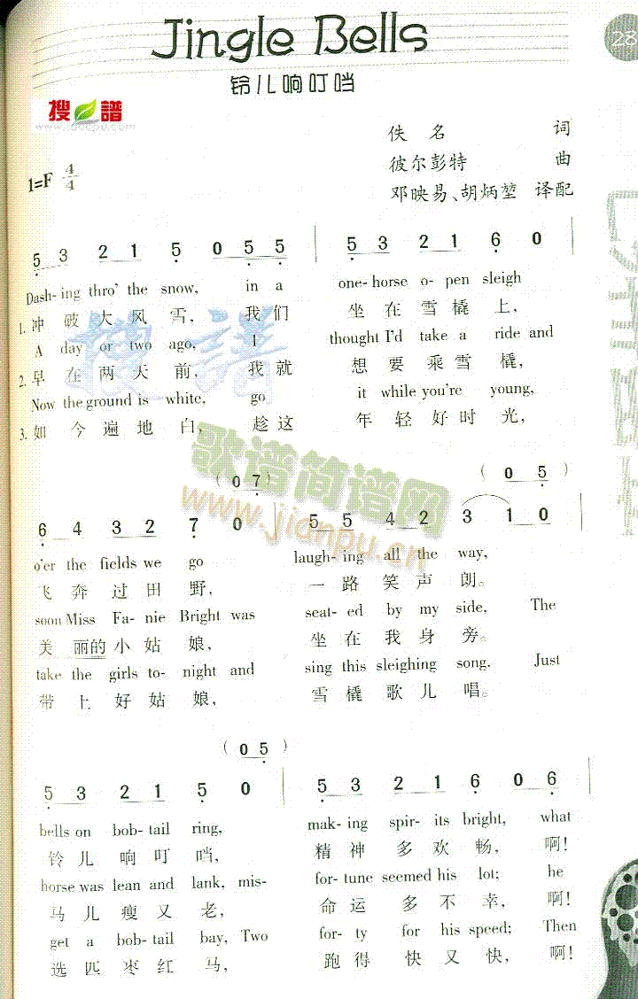    

Analysis of musical notation:     
Note rhythm is divided into one beat, half beat, 1/4 beat and 1/8 beat. We stipulate that the time of a beat note is 1, so half beat is 0.5, and 1/4 beat is 0.25. 1/8 is 0.125... For each note to be given such a time to play out, the whole tone of the music comes out.    

In the bottom left corner of the title of the song in the notation, there is a 1 = F 4/4 icon. F means that the song is in the key of F, and 4/4 means that the song is in four or four beats.    

Note type description: Take note 5 3 2 1 5 0 5 5 in the first short section of Jingle Bells notation as an example.   
1. Notes 5, 3, 2, 1, and 0 are all underlined to indicate that each note has 0.5 beat, so note 5 has 0.5 beat, note 3 has 0.5 beat, note 2, 1 has 0.5 beat, and note 0 has 0.5 beat. There are two underscores below 5, that is, 0.25 beat. Each note is 1 beat, and each underscore is the current number of beats divided by 2, so one underscore is 1/2=0.5 beats, and two underscore is 1/2/2=0.25 beats. Then, the beat of this short piece of notation (5,3,2,1,0,5,5) is 0.5 + 0.5 + 0.5 + 0.5 + 0.25 + 0.25 + 0.5 + 1 = 4, which is consistent with the 4-4 beat on the notation, indicating that the number of beats in this short piece of notation is not wrong. Remember, Jingle Bells has four beats per segment.   
2. You may also find that some notes have a dot, when the note does not have a dot, it means the middle note, for example, note 3 in the first paragraph, means the middle note 3; When a note has a dot underneath it, it's a low note, like note 5 in the first paragraph, it's a low note 5; Similarly, a note with a small dot above it indicates a high note. No high notes appear in the Jingle Bells score.     
3. Note followed by a decimal point, indicating that the note beat +0.5 beat (if the note is underlined, +0.5 beat on the basis of the underlined beat); Note is followed by -, indicating note +1 beat (+1 beat on top of the underlined beat).    
4. Two consecutive notes with an arc above, indicating the connection, you can slightly change the frequency of the following note, such as reducing or increasing the frequency, so that the sound will be smoother.    

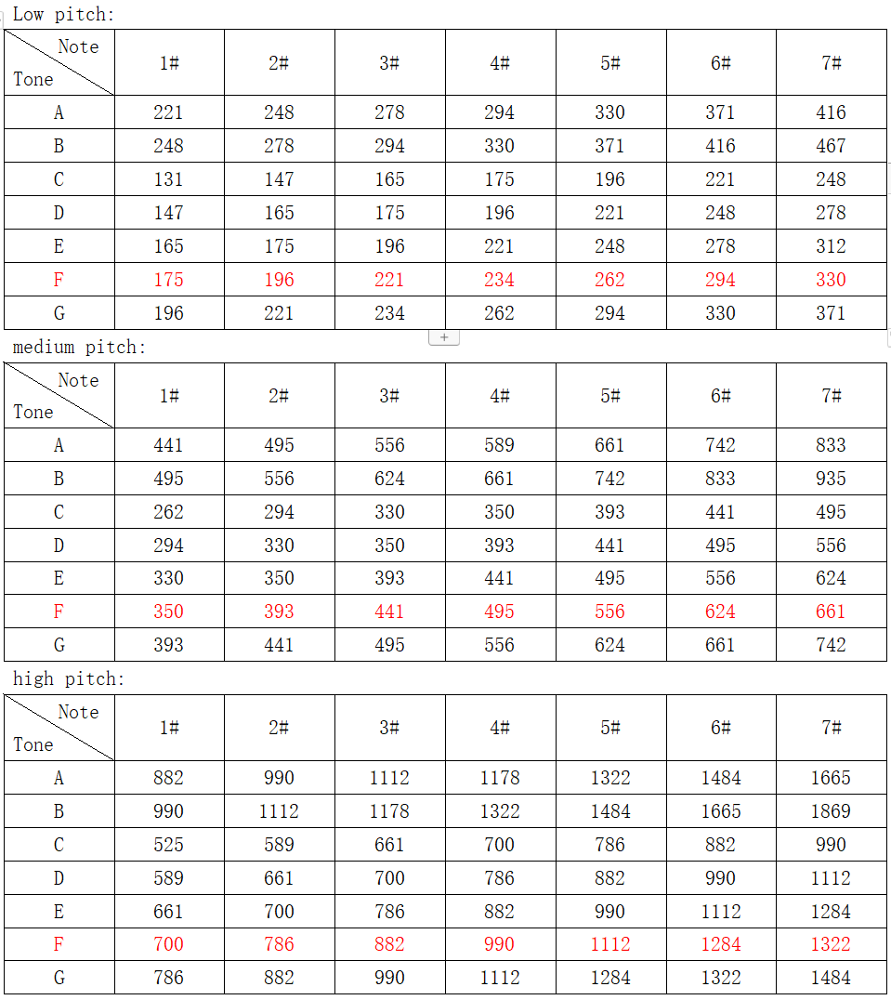    
In this case, the Jingle Bells are in the key of F, so the notes corresponding to the key of F are marked in red in the table. Please see the code in the example for the implementation of the music code!     

(2) How do you use sizeof()?    
```
Syntax:
sizeof(variable);

Parameters:
variable: Any variable type or array (e.g. int, float, byte).

Return value:
The number of bytes in a variable or in an array. Data type :size_t
```
More info <https://www.arduino.cc/reference/en/language/variables/utilities/sizeof/>    

(3) How to use the store statements: PROGMEM, pgm_read_word_near(), pgm_read_float_near()       
The PROGMEM keyword is a variable modifier that can only be used with data types defined in the "pgmspace.h" header file. It tells the compiler to "put this information in flash memory" instead of the usual SRAM.     
```
Syntax:
const dataType variableName[] PROGMEM = {data0, data1, data3… };

Parameters:
dataType: Data type; a variable of any data type.
variableName: The name of the data array
```
Flash memory data requires a specific syntax to read data, as follows:     
```
Syntax:
pgm_read_dataType_near(address_short);

Parameters:
dataType: The data type, e.g., byte, flaot, etc.
address_short: The address.

Return value:
The value in the address.
```
More info: <https://www.arduino.cc/reference/en/language/variables/utilities/progmem/>     


## Chapter8 Buzzer-Timer   

**Curriculum question:** 
1. How do you use a timer to make a buzzer sound?       

**Program flow diagram:** 
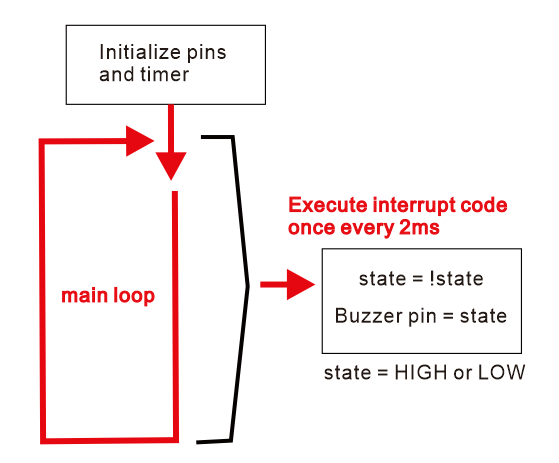    

**Open the example code: "2.2.3_Buzzer_Timer"**      
1. Open the sample code using the methods in **"[Chapter_1](./Basic_tutorial.md#chapter-1-blink)"**.   
2. Upload the code to the UNO board.

**Example code phenomena:**  
The buzzer on the extension board emits 50Hz sound all the time.     
    

**FAQ:**      
(1) How do you use a timer to make a buzzer sound?     
Instead of using the tone() function to set the buzzer to different frequencies, you can also use a timer interrupt to accomplish this. We have seen how to use timer1 and timer2 in the previous chapter, and now we can use them to generate square waves with different frequencies.      
Frequency calculation formula:      
$$f = 1/T$$           
f: Frequency in Hertz     
T: Period in seconds    

For example, if we want to generate a square wave with a frequency of 500Hz, the formula is: T=1/500=0.002 seconds =2 milliseconds      
In this case, we only need to execute the interrupt function once every 1 millisecond, and then change the level of the buzzer driver pin in the interrupt function, so that the following square wave can be generated:    
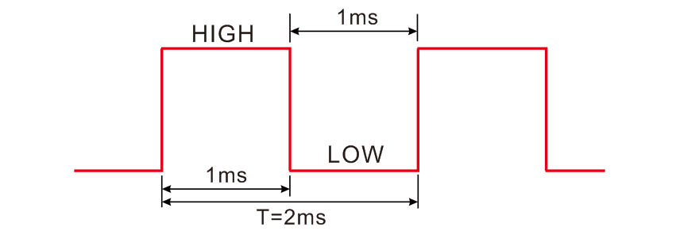    
Example code:
```  
byte BuzzerPin   = 9; 
void tone(void) {  
  static boolean output = HIGH;
  digitalWrite(BuzzerPin, output);
  output = !output;
}
void setup() {
  pinMode(BuzzerPin, OUTPUT);
  MsTimer2::set(1, tone); 
  MsTimer2::start();
}
void loop() {
}
```


## Chapter9 Microphone   
**Curriculum question:** 
1. What is a microphone?   

**Program flow diagram:** 
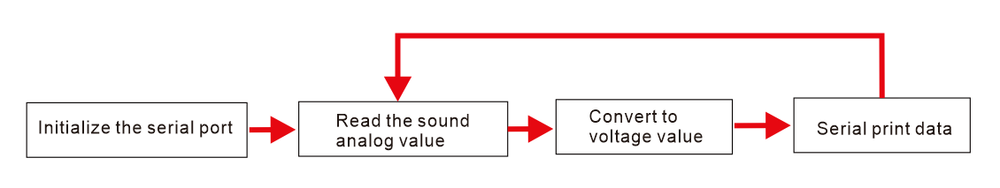    

**Open the example code: "2.3.0_Microphone"**      
1. Open the sample code using the methods in **"[Chapter_1](./Basic_tutorial.md#chapter-1-blink)"**.   
2. Upload the code to the UNO board.

**Example code phenomena:**  
When powered on, the microphone will always obtain the sound data of the current environment. Open the serial port monitor and adjust the baud rate to 9600. The serial port monitor has been printing the analog value of the amplified sound and the voltage value calculated by the program.             
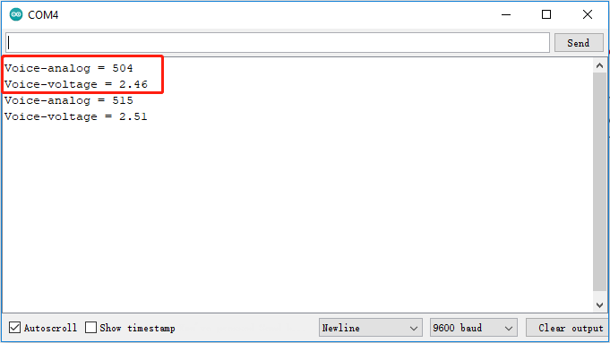    

**FAQ:**
(1) What is a microphone?  
Microphone is an energy conversion device that converts sound signals into electrical signals. It is classified as capacitive and electret. An electret microphone is used on the expansion board and a preamplifier circuit is integrated; when the expansion board is directly plugged into the UNO board, the A2 pin is used to receive the analog signal from the microphone.      
    
The microphone on the expansion board integrates a preamplifier circuit, which reads the analog voltage value of pin A2 as 2.5V when there is no sound, and fluctuates the voltage value on pin A2 up and down at 2.5V when there is sound.       
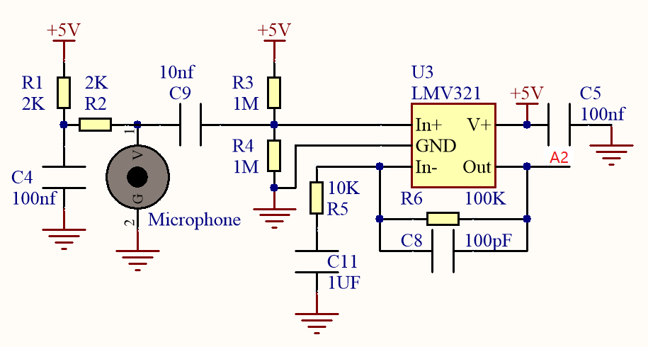    
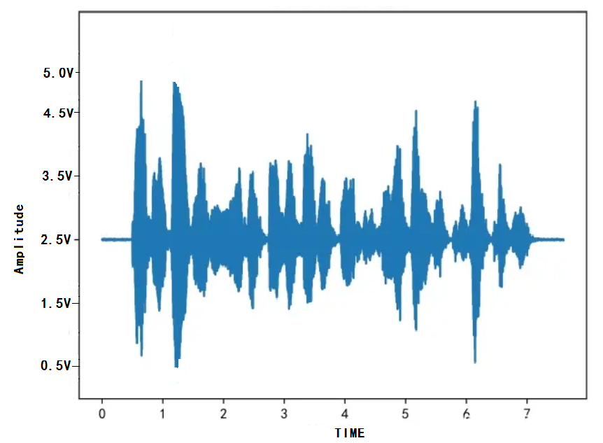    

An example of reading an analog value for a sound:      
```
Example：
int voiceAnalogValue; 
voiceAnalogValue = analogRead(A6);
```

## Chapter10 Music LED     
**Curriculum question:** 
1. What is logical and: &&    
2. What is a jump statement: goto   
3. How do you use the max() and min() functions?    

**Program flow diagram:** 
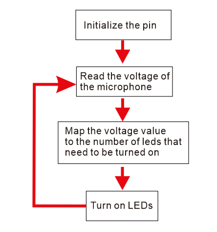    

**Open the example code: "2.3.1_Music_LED"**      
1. Open the sample code using the methods in **"[Chapter_1](./Basic_tutorial.md#chapter-1-blink)"**.   
2. Upload the code to the UNO board.

**Example code phenomena:**  
Speaking into the microphone on the extension or playing music (at a higher volume), eight yellow leds on the extension board will light up a different number of leds depending on the volume of the sound.     
    

**FAQ:**          
(1) What is logical and: &&    
When two numbers "&&" operation, the result is true only if both operands are true; Otherwise, it is false.     
```
Syntax:
operand1 && operand2 ...

Parameters:
operand1, operand2: Operands

In the sample code: 
if((up_512 <= voiceAnalogValue) && (voiceAnalogValue <= dow_1023)){
ledNum = map(voiceAnalogValue, up_512, dow_1023, 0, 7);
}
```
More info: <https://www.arduino.cc/reference/en/language/structure/boolean-operators/logicaland/>     

(2) What is a jump statement: goto   
Jump the program flow to a marked point in the program.      
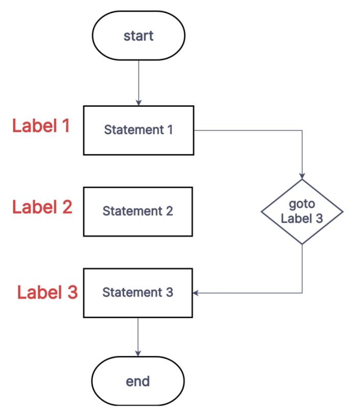    

```
Syntax:
goto label; // Program flow jumps to "lable"
//segment
label:

Examples:
for (byte r = 0; r < 255; r++){
    if (analogRead(A0) > 250) {
    goto label;
    }
    // more statements ...
}

label:
// more statements ...
```
More info: <https://www.arduino.cc/reference/en/language/structure/control-structure/goto/>     

(3) How do you use the max() and min() functions?   
max(x,y): Gets the largest of the two numbers.    
```
Syntax:
max(x, y);

Parameters:
x: The first numeric value, allowing any type of data
y: This is the second numeric value that allows any type of data

Return value:
The largest of the two numbers.

Examples:
int value;
value = max(255,200); //value is 255
```
More info: <https://www.arduino.cc/reference/en/language/functions/math/max/>    

min(x,y): Gets the minimum of two numbers.     
```
Syntax:
min(x, y);

Parameters:
x: The first numeric value, allowing any type of data
y: This is the second numeric value that allows any type of data

Return value:
The smallest of two numbers.

Examples:
int value;
value = min(255,200); //value equals 200
```
More info: <https://www.arduino.cc/reference/en/language/functions/math/min/>    

## Chapter11 EEPROM   
**Curriculum question:** 
1. EEPROM (Electrically Erasable Programmable Read-Only Memory)
2. 1-Wire protocol
3. variable: word
4. class   

**Program flow diagram:**          
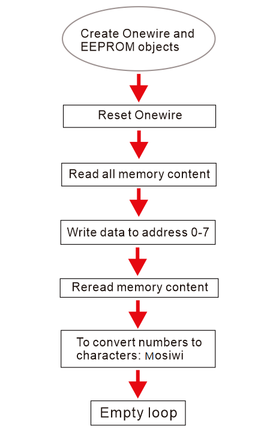    

**Open the example code: "2.4.0_EEPROM_ReadWriteSkip"**      
1. Open the sample code using the methods in **"[Chapter_1](./Basic_tutorial.md#chapter-1-blink)"**.   
2. Upload the code to the UNO board.

**Example code phenomena:**  
1. Read 128 bytes of EEPROM data.        
2. Write 8 bytes of data to EEPROM.
3. Read 128 bytes of EEPROM data.       
4. The 8-byte data written to EEPROM is read back and converted to the character: \<Mosiwi\>     

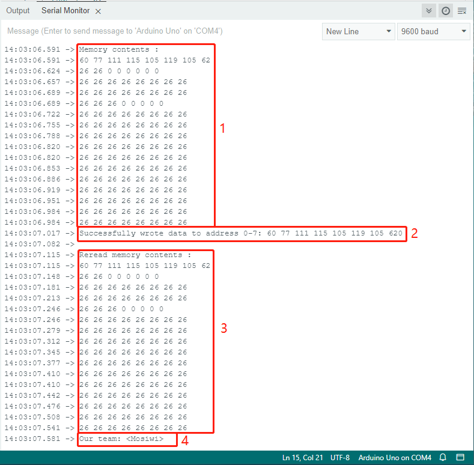    

**FAQ:**          
(1) EEPROM (Electrically Erasable Programmable Read-Only Memory)
It is a kind of memory chip that does not lose data after power failure.    

The board integrates a 128-byte EEPROM chip using the 1-wire protocol, and when plugged directly into the UNO board, the EEPROM is controlled by pin 7 of the UNO board.     
    

(2) 1-Wire protocol     
1-Wire technology is a serial protocol that uses one data wire and one ground wire to communicate. The 1-Wire master can initialize and control one or more 1-Wire slaves on the 1-Wire. Each 1-Wire slave device has a unique, immutable, factory programmed 64-bit ID as the device address on the 1-Wire. Eight bits of the 64-bit ID are family codes that identify the device type and function. Generally, the operating voltage range of the 1-Wire slave machine is 2.8V (min) to 5.25V (max). Most 1-Wire devices are not pin-powered and they harvest energy from 1-wire (parasitic power supply).     

If you are interested in learning more about 1-wire, take a look at this example code: "**2.4.1_EEPROM_ReadWrite**" 

(3) variable: word   
A word can store an unsigned number of at least 16 bits (from 0 to 65535).    
```
Syntax
word var = val;
Parameters

var: variable name.
val: the value to assign to that variable.

```

(4) Class
Class is an important part of C++ programming language, which combines data representation and methods to manipulate data into a concise package. The data and functions in the class are called class members.      
Defining a class:   
```
Syntax:
class name {
    public:
    member1;
    member2;
    ...
    private: 
    member3;  
    ... 
};

Parameters:
name -The name of the class
Member1, member2... : A member of a class that can be a variable, function, array, and so on.
```
We can think of the class as a custom data type, such as char, int... Define a variable, also called a class implementation, as follows:     
```
Syntax:
className varName;

Parameters:
className: This is the name of the class
varName: This is the implementation name of the class.It can be thought of as a variable of type className.
```
For example, all cars have wheels, engines, seats, etc. We can define a class to call a car. But the car is divided into BMW, Volkswagen, Benz and so on, these are the object of the car. They may differ in wheel size, engine power, and number of seats. After defining the object, you can assign different values to the member functions and variables of the object to distinguish their differences. Objects of each class do not affect each other, which is a good way to protect their own data.     
Define a car class:    
```
class car{
  public:
    int wheelSize;
    int power;
    int seat;
}
```
Create an object of class car:    
```
car Benz;
car VW;
car BMW
```
Give the object different parameters:    
```
Benz.wheelSize = 10;
Benz.power = 150;
Benz.seat = 4;

VW.wheelSize = 9;
VW.power = 140;
VW.seat = 5;

BMW.wheelSize = 12;
BMW.power = 160;
BMW.seat = 2;
```
After the class has been created and the members have been assigned values, we can also read their values.For example, we can read the power of the BMW:    
```
int Power = BMW.power;
```


## Chapter12 Thermohygrometer  

**Curriculum question:** 
1. What is a Thermohygrometer?   
2. How to use variables: long, unsigned long   
3. How to use the functions: millis(), abs()   
4. What are function arguments?    

**Program flow diagram:**         
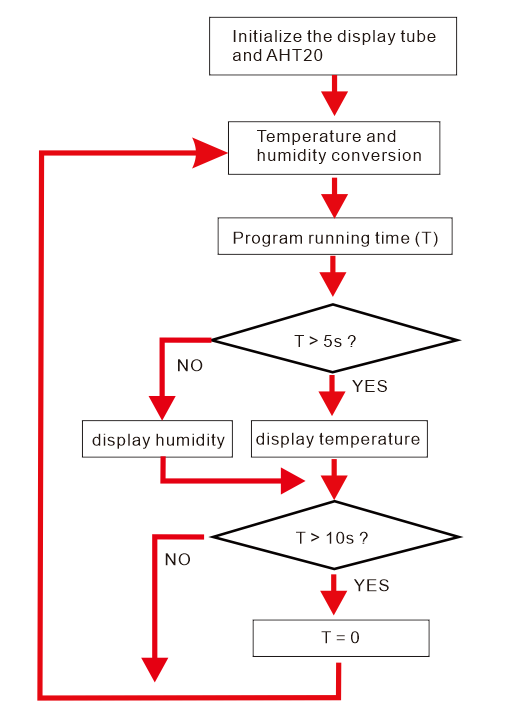    

**Open the example code: "2.5.0_Thermohygrometer"**      
1. Open the sample code using the methods in **"[Chapter_1](./Basic_tutorial.md#chapter-1-blink)"**.   
2. Upload the code to the UNO board.

**Example code phenomena:**  
The 4-bit digital tube on the expansion board displays the current ambient temperature for 5 seconds, then the current ambient humidity for 5 seconds, and so on.    
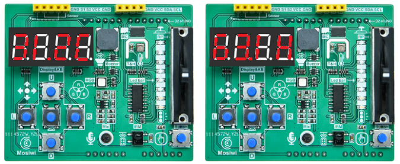    

**FAQ:**         
(1) What is a Thermohygrometer?   
A thermohygrometer is a tool that can accurately measure the current ambient temperature and humidity. In the example we used AHT20 temperature and humidity sensor and 4 digital control made a temperature and humidity meter, 4 digital tube can display temperature and humidity values.     
specification parameter: 
| Name | Measuring range | Resolution | Error range |   
| :-- | :-- | :-- | :-- |     
| Temperature | 0 to 85℃ | 0.01℃ | +/-3% |     
| Humidity | 0% to 100% | 0.024% | +/-2% |   

(2) How to use variables: long, unsigned long   
Signed long integer variable: **long**    
Long variables are extended size variables for number storage, and store 32 bits (4 bytes), from -2,147,483,648 to 2,147,483,647.     
```
Syntax:
signed long var = val;

Parameters:
signed: Can be omitted.
var: The variable name
val -The value assigned to the variable
```

unsigned long integer variable: **unsigned long**   
Unsigned long variables are extended size variables for number storage, and store 32 bits (4 bytes). Unlike standard longs unsigned longs won’t store negative numbers, making their range from 0 to 4,294,967,295 (2^32 - 1).    
```
Syntax:
unsigned long var = val;

Parameters:
var: The variable name
val -The value assigned to the variable

In the sample code:    
unsigned long oldTime = 0;
```

(3) How to use the functions: millis(), abs()   
mills():    
Returns the number of milliseconds passed since the Arduino board began running the current program. This number will overflow (go back to zero), after approximately 50 days.    
```
Syntax:
time = millis()
Parameters

None
Returns

Number of milliseconds passed since the program started. Data type: unsigned long.
```
abs(): 
Calculates the absolute value of a number.       
```
Syntax:
abs(x)
Parameters

x: the number
Returns

x: if x is greater than or equal to 0.
-x: if x is less than 0.
```

(4) What are function arguments?   
When we need to transfer some data to the function, we need to use the function parameters. Function parameters are the bridge between the outside and the inside of the function, and it is one-way, that is, from the outside to the inside of the function.    
Defined function:      
```
Syntax:
Type function(type val1, type val2 ...) {
    // statement(s)
}

Parameters:
Type: The data type (char, int, float, etc.) or "void" if no value is returned.
type: The data type, such as char, int, float, etc., or "void" when there are no arguments.
function: The name of the function
val1, val2... : parameter name; Empty when type is "void".

In the sample code:  
void displayHumidity(float H){
    int temp = int(H*10);
    //...
}
```


## Chapter13 IR receiver   

**Curriculum question:** 
1. What is an infrared receiving sensor?      

**Program flow diagram:**      
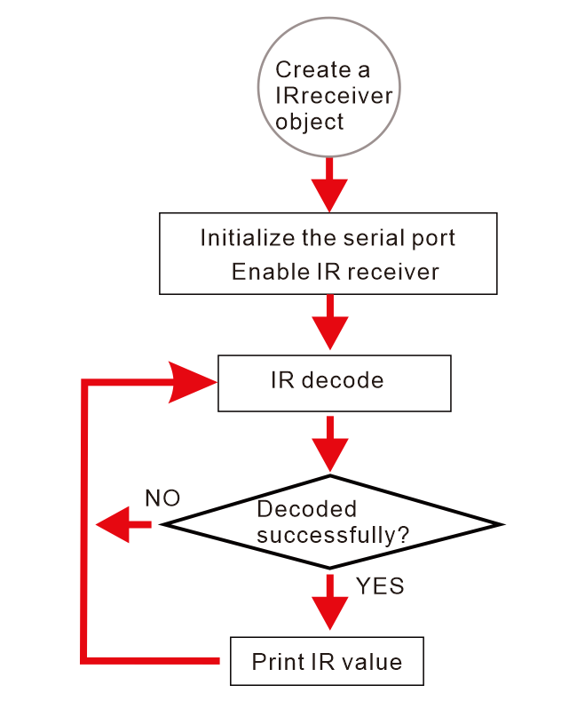    


**Open the example code: "2.6.0_IRrecvDemo"**      
1. Open the sample code using the methods in **"[Chapter_1](./Basic_tutorial.md#chapter-1-blink)"**.   
2. Upload the code to the UNO board.

**Example code phenomena:**  
Open the serial port monitor, adjust the baud rate to 9600, press "OK" on the infrared remote control against the infrared receiver, and the serial port will print "FF38C7".     
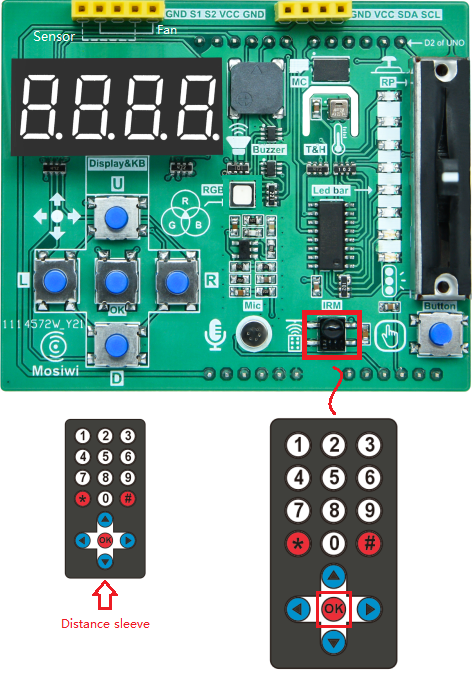    
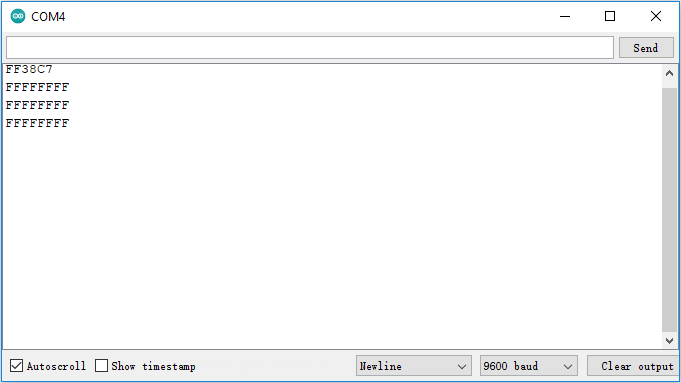    
<span style="color: rgb(255, 76, 65);">Note: If you keep pressing the button, the serial port will always print "FFFFFFFF".</span>     

Please refer to the table below for other keys:      
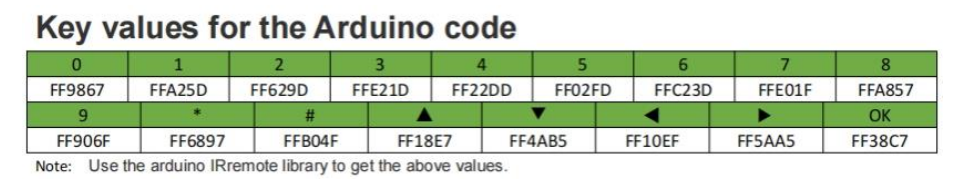    

**FAQ:**              
(1) What is an infrared receiving sensor?    
The internal circuit of the infrared receiver includes infrared monitoring diode, amplifier, limiter, band pass filter, integral circuit, comparator and so on. The infrared monitoring diode detects the infrared signal and sends it to the amplifier and limiter, which controls the pulse amplitude at a certain level regardless of the distance between the infrared transmitter and the receiver. The AC signal enters the bandpass filter, which can pass through the negative carrier of 30khz to 60khz and enter the comparator through the demodulation circuit and the integral circuit, and the comparator outputs high and low levels to restore the signal waveform of the transmitter. Note that the high and low levels of the output signal and the transmitter are reversed in order to improve the sensitivity of the reception.     
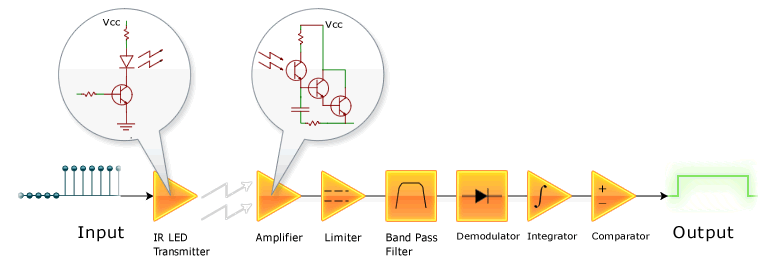    

An infrared receiving sensor is integrated on the extension board, and pin 4 can receive data from the infrared receiving sensor when directly plugged into the UNO board.    

For ease of use, we have integrated the related programs used in infrared receiver into the "Mosiwi_Basic_Learning_Kit" library. To use the relevant infrared receiver function, you must first select the timer and then include the relevant header file.     
Select the timer:    
```
Syntax:
#define timer

Parameters:
timer: IR_USE_TIMER1 or IR_USE_TIMER2.

In the sample code:
#define IR_USE_TIMER2
```

Include the infrared receiver header file:
```
Syntax:
#include <xxx.h>

Parameters:
xxx: Header name

In practice:
#include <MswIR.h>
```

Create the object:    
```
Syntax:
MswIR IR(pin);

Parameters:
pin: The pin number on the M328 PRO motherboard.

In the sample code:
byte RECV_PIN = 4;
MswIR IR(RECV_PIN);
```

Enable infrared reception:    
```
IR.enable();
```

Infrared decoding:   
```
Usage:
int var = IR.decode();

Parameters:
var: The parameter name

Return value:
0 or 1. 0 is a failed decoding and 1 is a successful decoding.

In the sample code:
if (IR.decode()) {  
  Serial.println(IR.value, HEX);
}
```

Decoding result:  
If the decoding is successful, the decoding result is stored in the "ir.value" member of the IR receiver object.   
```
In the sample code:
Serial.println(IR.value, HEX);  
```

**Extended chapter:**   
1. How to realize infrared remote control?     

**Program flow diagram:**        
    

**Open the example code: "2.6.1_IRremote"**      
1. Open the sample code using the methods in **"[Chapter_1](./Basic_tutorial.md#chapter-1-blink)"**.   
2. Upload the code to the UNO board.

**Example code phenomena:**  
Use the infrared remote control to repeatedly press the "OK" key in front of the infrared receiver on the expansion board to turn on and off the red LED light on the expansion board.     
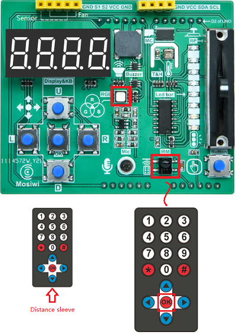    
<span style="color: rgb(255, 76, 65);">Note: Button batteries must be installed when using the infrared remote control. If the infrared remote control has been allocated with button batteries, the separator at the bottom of the remote control must be pulled out.</span>      

**FAQ:**          
(1) How to realize infrared remote control?    
Infrared remote control to send control data through the infrared transmitter to the infrared receiving sensor, and then the UNO board reads the data of the infrared receiving sensor, and then performs different functions according to different data.    
For example, we can program the UNO board to turn on the LED when it receives the value of key 1 on the remote control, and turn off the LED when the value of key 2 is received. The buzzer beeps when the value of key 3 is received, stops beeping when the value of key 4 is received, and so on. If we extend some other sensors, then we can implement more functions. For a more advanced idea, we can also make our own smart home system.    

## Chapter14 Ultrasonic   

**Curriculum question:** 
1. What is Ultrasonic module?    
2. What is pulse?     
3. How do you use the pulseIn() function?     

**Wiring diagram**
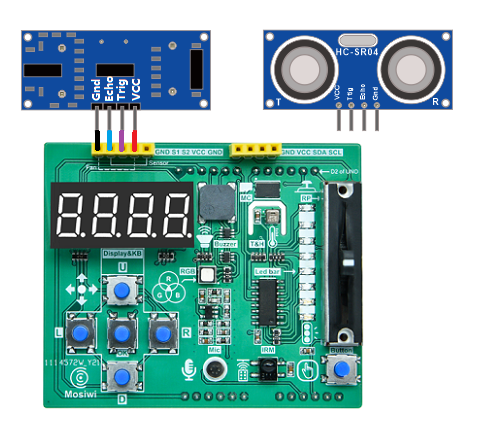    
| Ultrasonic module interface | Interface on the Extend board | Pins of UNO board|     
| :--: | :--: | :--: |   
| Vcc | V | 5V |  
| Trig | S1 | 5 |   
| Echo | S2 | 6 |   
| Gnd | GND | GND |  

**Program flow diagram:**         
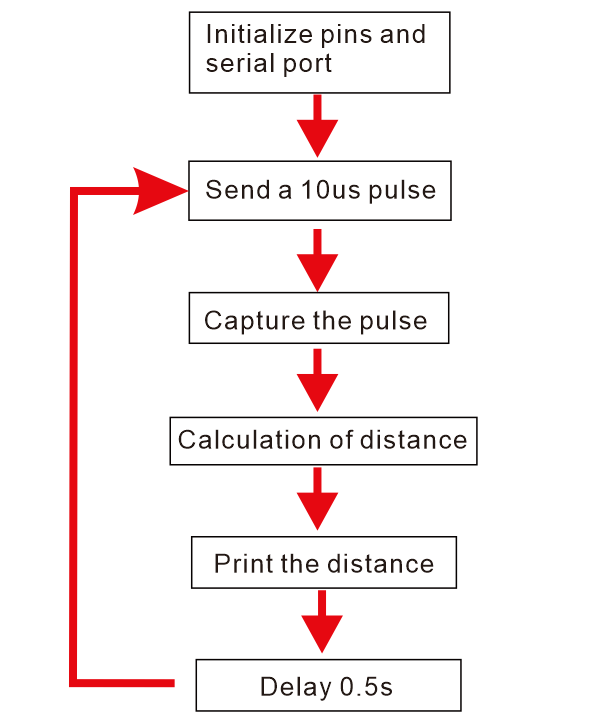    

**Open the example code: "2.7.0_Ultrasonic"**      
1. Open the sample code using the methods in **"[Chapter_1](./Basic_tutorial.md#chapter-1-blink)"**.   
2. Upload the code to the UNO board.

**Example code phenomena:**  
Turn on the serial port monitor, adjust the baud rate to 9600, put the obstacle in front of the ultrasonic sensor, and the serial port monitor prints the distance measured by the ultrasonic sensor every 0.5 seconds.     
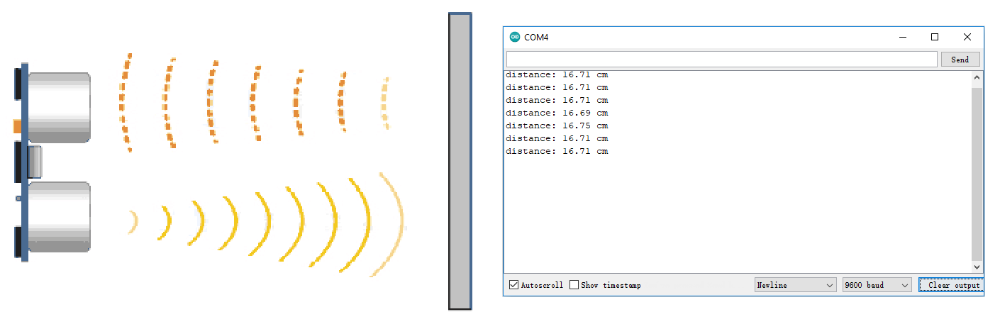    

**FAQ:**                
(1) What is Ultrasonic module?         
An ultrasonic module is provided in this kit. The distance test can be performed after the module is inserted into the interface of the expansion board according to the cable connection requirements.          
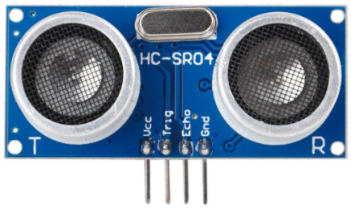    
More info: [Ultrasonic module](../../../outsourcing/O1M0000_ultrasonic_module/O1M0000_ultrasonic_module.md)        

(2) What is pulse?   
A pulse is an electrical impulse (voltage or current) that usually rises and falls like a pulse in electronics. The main features are waveform, amplitude, width and repetition rate. The pulses occur for a short time over the whole signal period relative to the continuous signal, and there is no signal during most of the signal period.    
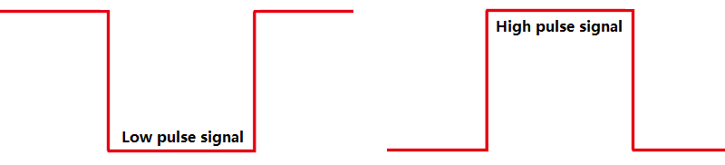    

(3) How do you use the pulseIn() function?   
Reads a pulse (either HIGH or LOW) on a pin. 
```
Syntax: 
pulseIn(pin, value)
pulseIn(pin, value, timeout)

Parameters
pin: the number of the Arduino pin on which you want to read the pulse. Allowed data types: int.
value: type of pulse to read: either HIGH or LOW. Allowed data types: int.
timeout (optional): the number of microseconds to wait for the pulse to start; default is one second. Allowed data types: unsigned long.

Returns
The length of the pulse (in microseconds) or 0 if no pulse started before the timeout. Data type: unsigned long.
```
More info: <https://www.arduino.cc/reference/en/language/functions/advanced-io/pulsein/>     

## Chapter15 Ultrasonic testing instrument  

**Curriculum question:**      
1. What is a function that returns a value?      
2. how to use the logic statements: ||       

**Wiring diagram:**      
    

**Program flow diagram:**      
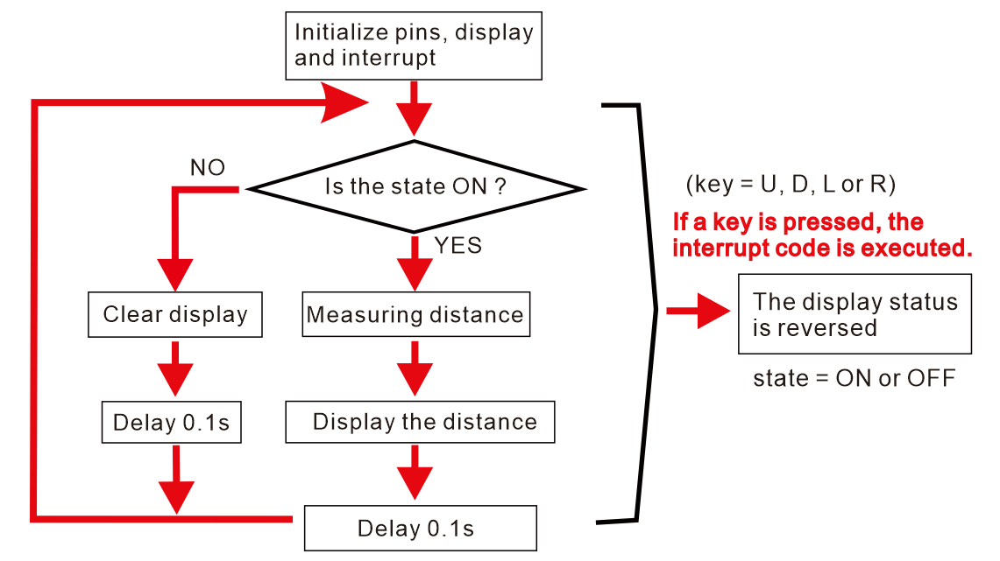    

**Open the example code: "2.7.1_Range-measurement"**      
1. Open the sample code using the methods in **"[Chapter_1](./Basic_tutorial.md#chapter-1-blink)"**.   
2. Upload the code to the UNO board.

**Example code phenomena:**     
After uploads the code, unplug the USB, and then connect the battery box, press any of the U, D, L, R and OK keys on the expansion board to start the ultrasonic ranging; Pressing any of them will turn off ultrasonic ranging. After turning on ultrasonic ranging, the 4-digit digital tube will display the distance measured by ultrasonic in real time.    
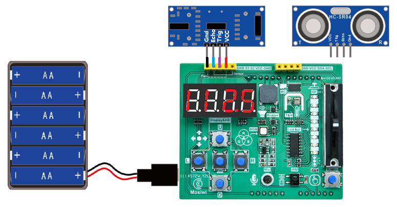    

**FAQ:**            
(1) What is a function that returns a value?    
When a function is executed, the function returns a value, called a function with a return value.    
Define a function:   
```
Syntax: 
Type function(type val1, type val2 ...) {
    // statement(s)
}

Parameters:
Type: The data type (char, int, float, etc.) or "void" if no value is returned.
type: The data type, such as char, int, float, etc., or "void" when there are no arguments.
function: The name of the function
val1, val2... : parameter name; Empty when type is "void".
```
Call the function and return a value:   
```
Syntax: 
Type var = Type function(type val1, type val2 ...) ;

Parameters:
Type: The data type such as char, int, float, etc.
type: The data type, such as char, int, float, etc., or "void" when there are no arguments.
function: The name of the function
val1, val2... : parameter name; Empty when type is "void".

In the sample code:
float distance;
distance = Measuring_distance();
```

(2) how to use the logic statements: ||   
The result is true if either of the two operands is true.   
```
Syntax:
operand1 || operand2 ...

Parameters:
operand1, operand1: Operands

In the sample code:
byte keyValue = 0;
bool OnOff = false;
if(keyValue == 8 || keyValue == 4 || keyValue == 2 || keyValue == 1){
    OnOff = ! OnOff;
}
```
More info: <https://www.arduino.cc/reference/en/language/structure/boolean-operators/logicalor/>    


## Chapter16 Fan-PWM   
**Curriculum question:**      
1. What is a fan?    
2. How to control the fan?      

**Wiring diagram**      
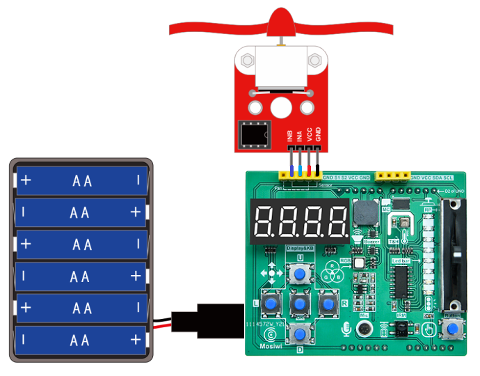    
| Fan module interface | Interface on the Extend board | Pins of UNO board|   
| :--: | :--: | :--: |   
| GND | G | GND |  
| VCC | V | VCC |  
| INA | S2 | 6 |  
| INB | S1 | 5 |     

**Program flow diagram:**     
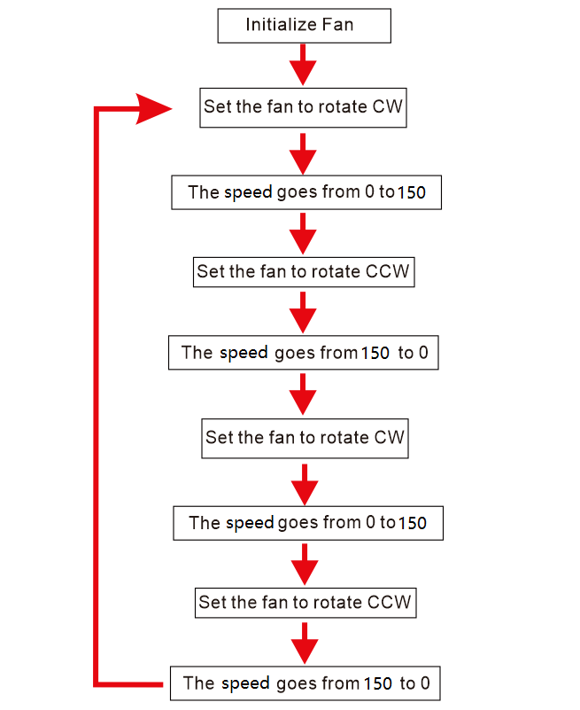    

**Open the example code: "2.8.0_Fan_PWM"**      
1. Open the sample code using the methods in **"[Chapter_1](./Basic_tutorial.md#chapter-1-blink)"**.   
2. Upload the code to the UNO board.

**Example code phenomena:**     
After uploading the code, the fan speed will change from small to large forward rotation, and then from large to small reverse, and so on.    
    

**FAQ:**             
(1) What is a fan?    
There is a fan module in the kit, with two directional control pins, can control the fan forward and reverse, directly into the interface on the expansion board can be used.     
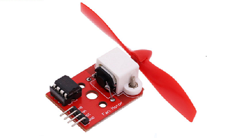    
More info: [Fan module](../../../outsourcing/O1M0001_fan_module/O1M0001_fan_module.md)      

**Extended chapter1:**      
You can also control the fan using the fan driver function from the "Mosiwi_Basic_Learning_Kit" library. When using the fan driver function in the library, you must select the timer and then include the associated header file.

Timer 1 or timer 2 is needed to drive the fan in the integration library, and the desired timer can be selected according to the requirements.    
Select the timer: 
```
Syntax:
#define timer

Parameters:
timer: FAN_USE_TIMER1 or FAN_USE_TIMER2.

In the sample code:
#define FAN_USE_TIMER1
```
Include the fan header file:   
```
#include <MswFan.h>
```
Initialize the pins that control the motor:   
```
MswFan::init(5, 6);
```
Control the direction of the fan:    
```
Syntax:
MswFan::direction(direction);

Parameters:
direction: Forward or reverse direction, CW or CCW (0 or 1).

In the sample code:
MswFan::direction(CW);
MswFan::direction(CCW);
```
Control the speed of the fan:    
```
Syntax:
MswFan::speed(S);

Parameters:
S: The speed of the fan, allowing values from 0 to 255.
```
Start the fan:   
```
MswFan::run();
```
Turn off the fan:   
```
MswFan::stop();
```

**Open the example code: "2.8.1_Fan_timer"**        
1. Open the sample code using the methods in **"[Chapter_1](./Basic_tutorial.md#chapter-1-blink)"**.   
2. Upload the code to the UNO board.

**Extended chapter2:**     
We also have an example of controlling a fan through a sliding resistor.    

**Program flow diagram:**     
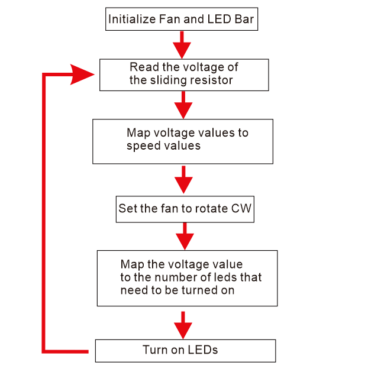    

**Open the example code: "2.8.1_Fan_timer"**        
1. Open the sample code using the methods in **"[Chapter_1](./Basic_tutorial.md#chapter-1-blink)"**.   
2. Upload the code to the UNO board. 

**Example code phenomena:**      
After power on, the more up push the potentiometer on the expansion board, the faster the fan turns, the more down push, the slower the fan turns.   
    


## Chapter17 Smart fan     
**Curriculum question:**     
1. How to Improve your programming skills?   

**Program flow diagram:**     
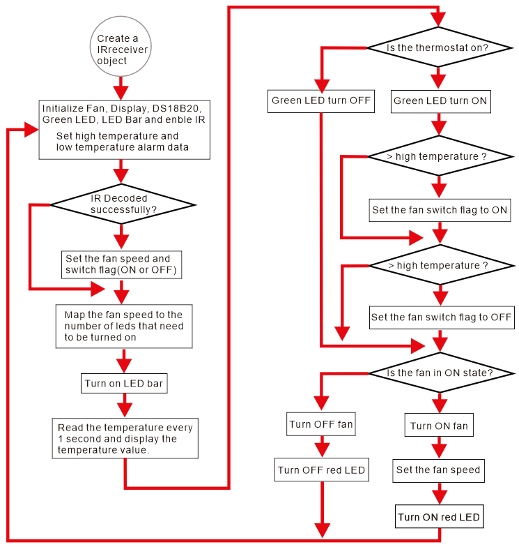    

**Open the example code: "2.8.3_Intelligent_fan"**        
1. Open the sample code using the methods in **"[Chapter_1](./Basic_tutorial.md#chapter-1-blink)"**.   
2. Upload the code to the UNO board.

**Example code phenomena:**     
This is an intelligent fan with temperature control mode and remote control mode.    
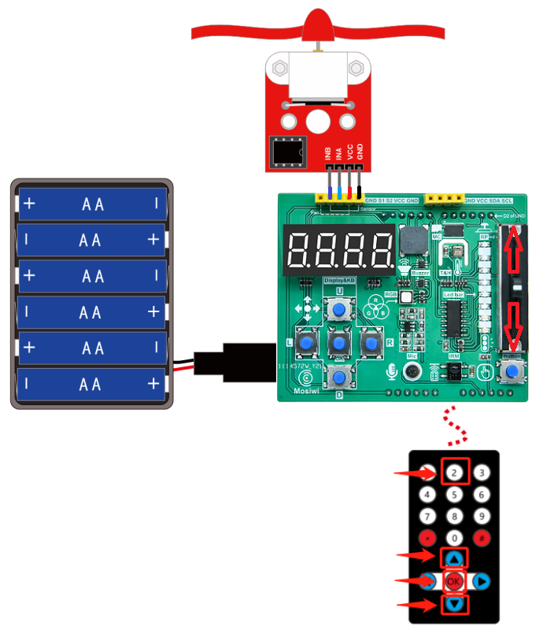    

Function of infrared remote control button:    
1. 2: Turn on and off temperature control mode    
2. ▲: Fan speed plus   
3. ▼: Fan speed minus    
4. OK: Turn on and off fan        

RGB LED function Tips:   
1. If the light is red, the fan is turned on; otherwise, the fan is turned off.          
2. If the light is green, the fan is turned on; otherwise, the fan is turned off.            

Special Notes:
1. When the temperature mode is opened, the fan will start automatically when the temperature is higher than 35 degrees; It will automatically turn off when it is below 16 degrees. If the temperature returns to 16-35 degrees, you can turn on or off the fan through the remote control.   
2. The fan speed can be controlled by remote control in both temperature control mode and remote control mode.    

**FAQ:**        
(1) How to Improve your programming skills?   
1. Follow the steps of the tutorial to see the experimental phenomenon.    
2. Look at the FQA of each section to understand the function and usage of the code.    
3. Go over the C and C++ programming language tutorials.   
4. Refer to each chapter to write a similar function of the program.   
5. Look at other people's code, learn other people's programming style and ideas.   
6. Do more programming projects, think more, and express your ideas in code.    
7. Keep learning.


**End!**      
For more exciting tutorials, check out the [advance tutorial](./Advanced_tutorial.md)!    
