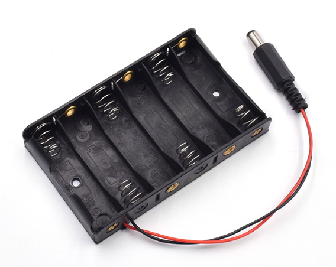
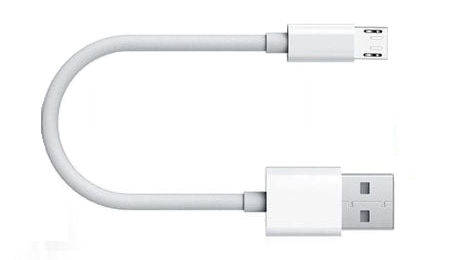
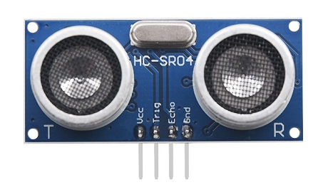
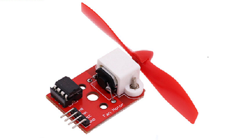
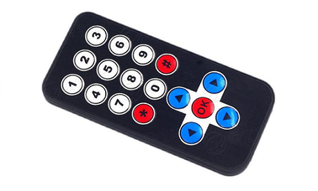
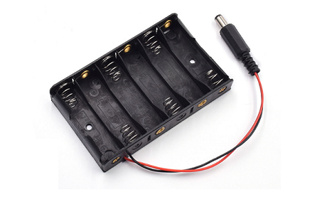
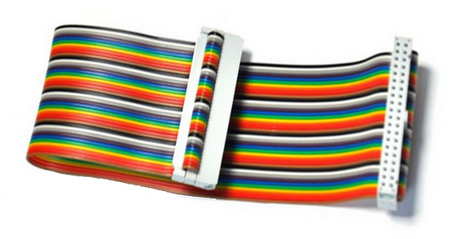

# C1K0000_4in1_basic_learing_kit

This kit is suitable for teaching and learning programming, providing tutorial materials for four development boards, including graphical, Python, and C/C++programming languages.     

## Detailed list
| 1: [Raspberry pico](../../raspberry/R1D0001_raspberry_pico/R1D0001_raspberry_pico.md) | 2: [3in1_basic learing shield](../../common_product/C1E0000_3in1_basic_learning_shield/C1E0000_3in1_basic_learning_shield.md)  | 3: [basic learning shield](../../arduino/A1E0000_basic_learing_shield/A1E0000_basic_learing_shield.md) |
| :--: | :--: | :--: |
|   |  |  |  
| 4: [Ultrasonic module](../../outsourcing/O1M0000_ultrasonic_module/O1M0000_ultrasonic_module.md) | 5: [Fan module](../../outsourcing/O1M0001_fan_module/O1M0001_fan_module.md) | 6: IR remote control |
|  |  |  |
| 7: 4 cell battery box| 8: Micro USB cable | 9: 40P cables |
|  |  |  |  
  
Note: The Arduino Uno, Microbit, and Rasoberry pi 4 motherboards are not included in this kit.  

## Course    
This kit provides tutorials based on 4 types of motherboards, but only pico motherboards are provided, and the others need to be purchased by yourself.    

| Microbit | Raspberry pico | Arduino UNO | Raspberry pi 4 |
| :--: | :--: | :--: | :--: |
| [Makecode](./Microbit_tutorial/Makecode_tutorial.md) | [Python](./Pico_tutorial/python_tutorial.md) | [Zero-based (C and C++)](./Arduino_tutorial/Zero-based_tutorial.md) | [C language](./Rpi4_tutorial/C_tutorial.md) |

