# Intermediate_tutorial    
This tutorial is based on the [C1K0001 4in1 basic learning kit](../../C1K0000_4in1_basic_learning_kit/C1K0000_4in1_basic_learning_kit.md).     

Learn common programming syntax based on "Pico board + expansion board + peripheral module", and learn the most comprehensive MicroPython syntax and application with the lowest cost.     

## What is MicroPython?
MicroPython is a full implementation of the Python 3 programming language that runs directly on embedded hardware like Raspberry Pi Pico. You get an interactive prompt (the REPL) to execute commands immediately via USB Serial, and a built-in filesystem. The Pico port of MicroPython includes modules for accessing low-level chip-specific hardware.      
1. The [MicroPython Wiki](https://github.com/micropython/micropython/wiki)
2. The [MicroPython Forums](https://forum.micropython.org/)
3. MicroPython is a language derived from Python, so it is recommended to learn [Python](https://docs.python.org/3/reference/index.html) first.   

## Prepared knowledge    
**Learn about:** [**Basic learning shield**](../../../arduino/A1E0000_basic_learning_shield/A1E0000_basic_learning_shield.md).  

**Learn about:** [**3in1 basic learning shield**](../../../common_product/C1E0000_3in1_basic_learning_shield/C1E0000_3in1_basic_learning_shield.md).  

**Pico and Thonny basics:**     
If you don't have Pico and Thonny basics, you can follow the link to learn the basics: [Click Me](../../../raspberry/R1D0001_raspberry_pico/R1D0001_raspberry_pico.md)    

**Learn about:** [**MicroPython for Pico**](https://docs.micropython.org/en/latest/rp2/quickref.html).  

**Download sample code:**    
Please download the sample code on Github: <https://github.com/Mosiwi/Mosiwi-basic-learning-kit> 
    
Unzip the file downloaded above, and the file in the "**pico->microPython**" folder is the sample code.       

## Wiring diagram      
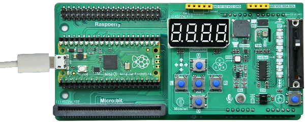    

## Basic_example Blink      
**Objective:**     
1. Open the example code.     
2. Upload and run code.   
3. Verify that the pico motherboard works.      

**Demonstration:**       
Open the "**blink\.py**" file as follows:     
    

Run the code online: (The code is not saved in pico and is not executed after repowering.)       
Make sure your Raspberry PI Pico's USB is plugged into your computer's USB via a usb cable, then click on "Python" and the version number in the bottom right corner of the Thonny window, then select "**MicroPython(Raspberry PI Pico)". COMx** ".      
    

After running the code, the LED on the pico board lights up every 1 second:      
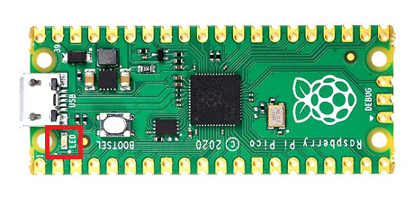    

Run the code offline: (The code is stored in pico, and the code in pico is automatically executed after being powered on.)     
Enter the code in the main panel, then click on the "**Save**" or "**File->Save as ...**" menu. Thonny will present you with a popup, click on "**Raspberry Pi Pico**" and enter "**main\.py**" to save the code to the **Raspberry Pi Pico**.  
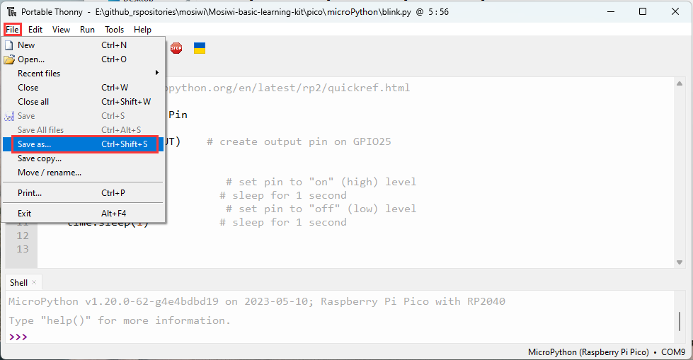    
    
    

| <span style="color: rgb(255, 76, 65);">Note</span>|  
|  :-- |
|If you "save a file to the device" and give it the special name **main\.py**, then MicroPython starts running that script as soon as power is supplied to Raspberry Pi Pico in the future. |    


## Example_1 RGB LED   
**Objective:**     
1. What is RGB LED?    
2. What is MOS transistor?

**Pins to be used:**   
1. Red RGB LED: GP8    
2. Green RGB LED: GP9
3. Bule REG LED: GP7

**Schematic diagram:**       
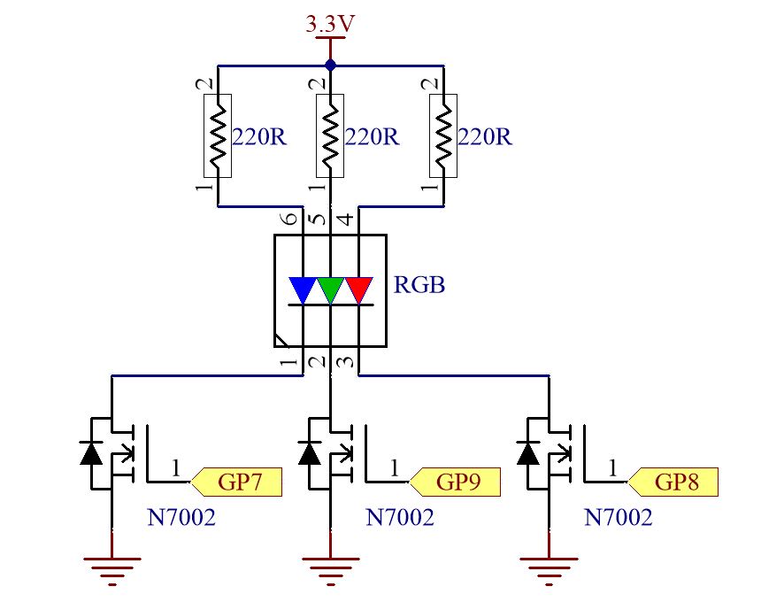    

**Open the example code: "rgb-led_pwm\.py"**     
1. Open the sample code using the methods in **"[Basic_example](./python_tutorial.md#basic-example-blink)"**.     
2. Run the example code online. 

**Example code phenomena:**         
The RGB LED light cycle emits red, green and blue lights.     
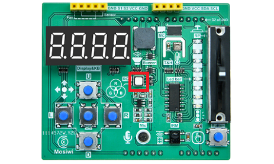    

**FQA:**   
(1) What is RGB LED?         
RGB LED is a combination of red, green and blue LEDs. By controlling the intensity of the light emitted by the LEDs of 3 colors and fusing the 3 lights together, various light sources can be produced.       
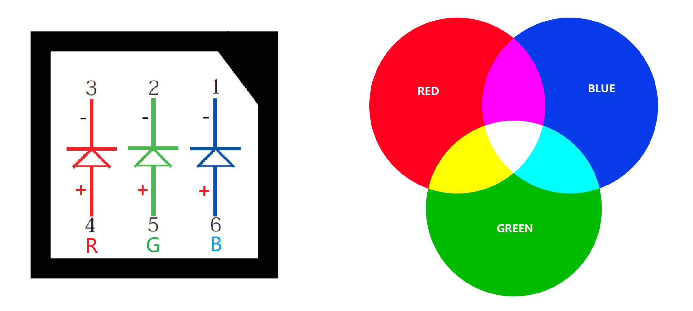    

RGB led is a combination of red, green and blue leds. It also has a positive and negative electrode, only when the positive current is switched on, the LED lamp will light up, generally requiring its current to be about 5-15ma, so it often uses a resistor in series with the LED to achieve current limiting.     
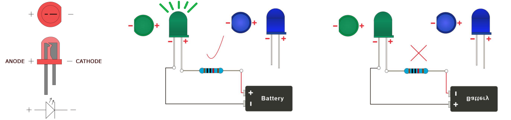    

(2) What is MOS transistor?   
MOS, is MOSFET (Metal-Oxide-Semiconductor Field-Effect Transistor) abbreviation.      
Mosfets are four-terminal devices with source (S), gate (G), drain (D), and body (B) terminals. Typically, the B terminal is connected to the S terminal, resulting in a three-terminal device. MOS transistors can be divided into enhanced MOS transistors and depletion MOS transistors, which can be subdivided into N-channel MOS transistors and p-channel MOS transistors. The enhanced MOS transistors are more widely used in the two types.     
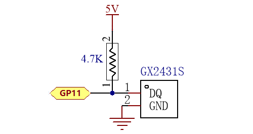    
MOS transistors are commonly used as switches. If the voltage between the drain and the source reaches the threshold voltage, the G and S poles are conducted, otherwise they are not conducted. Common circuits are as follows:   
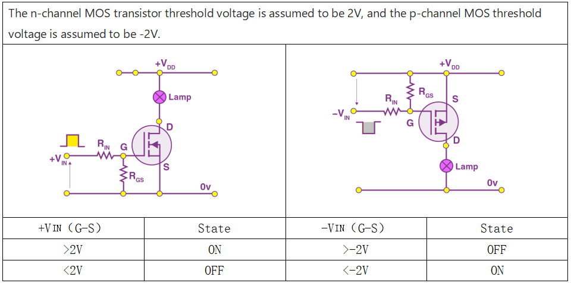      
A 2N7002 MOS is used on the extension board to drive the buzzer. It is an enhanced N-channel MOS. When a voltage greater than 2.5V is applied to its gate, the MOS drain and source electrodes are on, and therefore, the buzzer is on. Otherwise the buzzer is open.   
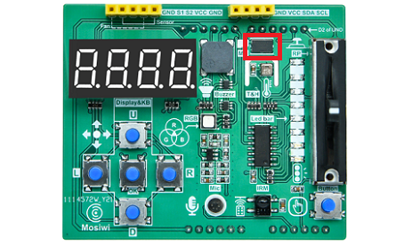       


## Example_2 Fan   
**Objective:**     
1. What is fan module?         

**Pin control table:**   
1. S1(INB): GP8    
2. S2(INA): GP9

**Schematic diagram:**       
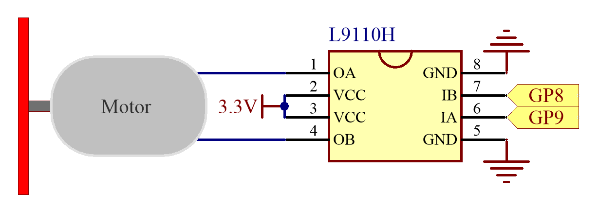    

**Wiring diagram:** 
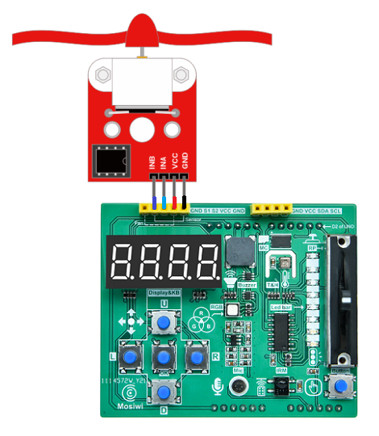    

**Open the example code: "fan_pwm\.py"**     
1. Open the sample code using the methods in **"[Basic_example](./python_tutorial.md#basic-example-blink)"**.     
2. Run the example code online. 

**Example code phenomena:**         
The fan rotates clockwise and counterclockwise, and the speed changes from small to large, and then from large to small.       
    

**FQA:**   
(1) What is fan module?       
See: [Fan module](../../../outsourcing/O1M0001_fan_module/O1M0001_fan_module.md)     


## Example_3 Microphone   
**Objective:**     
1. What is microphone?           

**Pins to be used:**   
1. Microphone: GP27_A1          

**Schematic diagram:**       
    

**Open the example code: "microphone\.py"**     
1. Open the sample code using the methods in **"[Basic_example](./python_tutorial.md#basic-example-blink)"**.     
2. Run the example code online. 

**Example code phenomena:**         
After running the code, the terminal prints the analog value of the amplified sound and the voltage value.        
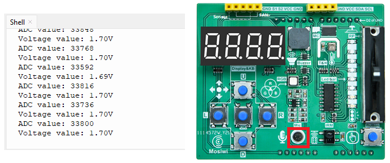    

**FQA:**   
(1) What is microphone?    
Microphone is an energy conversion device that converts sound signals into electrical signals. It is classified as capacitive and electret. An electret microphone is used on the expansion board and a preamplifier circuit is integrated. The GP27 of Pico is used to receive the analog signal from the microphone.      
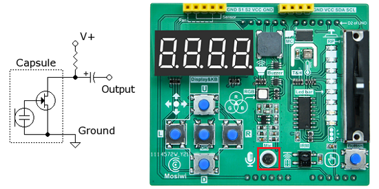    

The microphone on the expansion board integrates a preamplifier circuit, which reads the analog voltage value of GP27 as 1.65V when there is no sound, and fluctuates the voltage value on Pin27 up and down at 1.65V when there is sound.      
    
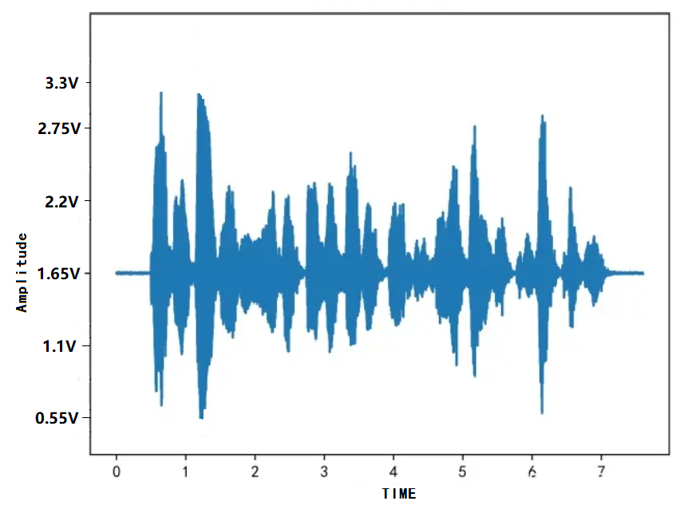    


## Example_4 Ultrasonic       
**Objective:**     
1. What is ultrasonic module?           

**Schematic diagram:**       
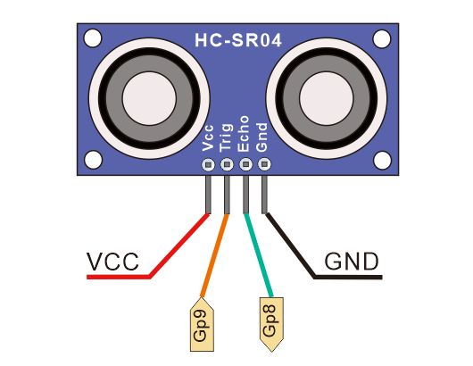    

**Pins to be used:**   
1. S1(echo of ultrasonic): GP8    
2. S2(trig of ultrasonic): GP9         

**Wiring diagram:** 
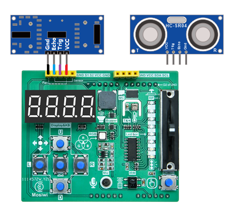    

**Open the example code: "ultrasonic\.py"**     
1. Open the sample code using the methods in **"[Basic_example](./python_tutorial.md#basic-example-blink)"**.     
2. Run the example code online. 

**Example code phenomena:**         
After the code is uploaded, the obstacle is placed in front of the ultrasonic sensor, and the distance measured by the ultrasonic sensor is printed at the terminal.         
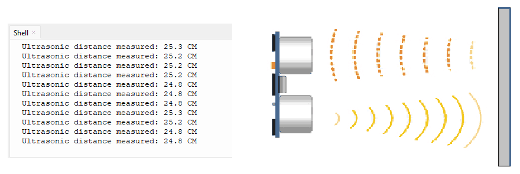    

**FQA:**   
(1) What is ultrasonic module?    
See: [Ultrasonic module](../../../outsourcing/O1M0000_ultrasonic_module/O1M0000_ultrasonic_module.md)           

**Code analysis:**         
Greater-than-equal operator: >=    
```
Syntax:
x >= y   # true if x is greater than or equal to y, false if not.

Parameters:
x: variable or constant. 
y: variable or constant. 
```

Less-than-equal operator: <=  
```  
Syntax:
x < y   # true if x is less than or equal to y, false if not.

Parameters:
x: variable or constant. 
y: variable or constant. 
```

not equal operator: ==  
```  
Syntax:   
x == y   # true if x is equal to y, false if not.

Parameters:
x: variable or constant. 
y: variable or constant. 
```

Here's some additional knowledge:  

equal operator: !=  
```  
Syntax:
x == y   # true if x is not equal to y, false if not.  

Parameters:
x: variable or constant. 
y: variable or constant. 
```

Greater-than operator: >    
```
Syntax:
x > y   # true if x is greater than y, false if not.

Parameters:
x: variable or constant. 
y: variable or constant. 
```

Less-than operator: <    
```
Syntax:
x < y   # true if x is less than y, false if not.

Parameters:
x: variable or constant. 
y: variable or constant. 
```


## Example_5 Led-strip      
**Objective:**     
1. What is led-strip?           
2. What is 74HC595?     

**Pins to be used:**   
1. DS: GP15    
2. SH_CP: GP14      
3. ST_CP: GP13   

**Schematic diagram:**       
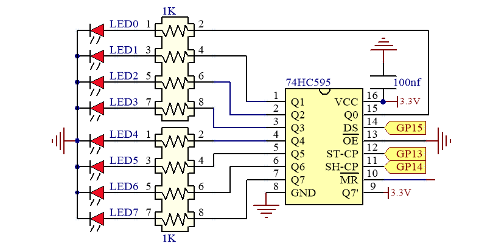    

**Open the example code: "led-strip_tw\.py"**     
1. Open the sample code using the methods in **"[Basic_example](./python_tutorial.md#basic-example-blink)"**.     
2. Run the example code online. 

**Example code phenomena:**         
The LED strip on the expansion board turns on and off in cycles.       
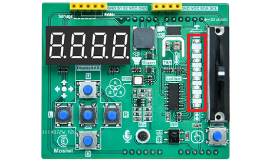    

**FQA:**   
(1) What is led-strip?    
There is one LED strip on the expansion board, which is controlled by the 74HC595 chip on the expansion board. 74HC595 is a widely used serial input and parallel output chip.      
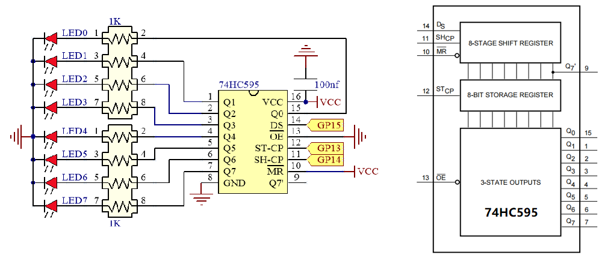    

(2) What is 74HC595? 
See: [74HC595](../Arduino_tutorial/Advanced_tutorial.md#chapter6-3-wire-communication)         

**Code analysis:**         
Defining a class:     
```
Syntax:
class ClassName:
    VariableName1                        # Define a class variable
    VariableName2
    ...

    def __init__(self, Variable1, ...):  # Constructor for a class
        self.VariableName1 = 100         # Assigning a value to a class variable
        ...
    
    def functionName(self, Variable1, Variable2; ...):   # Define a member function of a class
        self.VariableName2 = 100         # Assigning a value to a class variable
        ...
        return [expression]              #  When this statement is omitted, the function has no return value.
    ...

Define an object of class:
VariableName ClassName(Variable1, ...)
```    

The bit AND operation: &      
```
Description:
Two data bits AND operations: 1&1 =1, 1&0=0, 0&1=0, 0&0=0    

Examples:

  0b11110000  --> operand1
& 0b10000001  --> operand2
--------------
  0b10000000  --> result
```
The bit OR operation: |    
```
Description:
Two data bits OR operations: 1|1=1，1|0=1，0|1=1，0|0=0

Examples:   

  0b11110000  --> operand1
| 0b10000001  --> operand2    
--------------
  0b10000000  --> result
```
The bit NOT operation: ~    
```
Description:
Two data bits NOT operations: ~0=1，~1=0  

Examples: 

~  0b10000001  --> operand
--------------
   0b01111110  --> result
```
The bit XOR(Exclusive OR) operation: ^   
```
Description:
Two data bits XOR operations: 1|1=0，1|0=1，0|1=1，0|0=0

Examples: 

  0b11110000  --> operand1
^ 0b10000001  --> operand2    
--------------
  0b01110001  --> result
```
Bit left shift operation: <<
```
Syntax:
variable << number_of_bits

Parameters:
variable: A variable or number
number_of_bits: The number of bits shifted

Examples:
0b00000001 << 7 = 0b10000000
```
Bit right shift operation: >>
```
Syntax:
variable >> number_of_bits

Parameters:
variable: A variable or number
number_of_bits: The number of bits shifted

Examples:
0b10000000 >> 7 = 0b00000001    
```


## Example_6 keyboard       
**Objective:**     
1. What is keyboard?           
2. What is SPI communication protocol?   

**Pins to be used:**   
1. MISO: GP16    
2. MOSI: GP19     
3. CLK: GP18      
4. KEY-INT: GP20     
<span style="color: rgb(255, 76, 65);">Note: The 5 keys on the "Basic learning shield" occupy GP20 (key trigger signal output), GP19 (MOSI), GP16 (MISO) and GP18 (CLK) of the Pico board, and the CS control pin is not required.</span>     

**Schematic diagram:**       
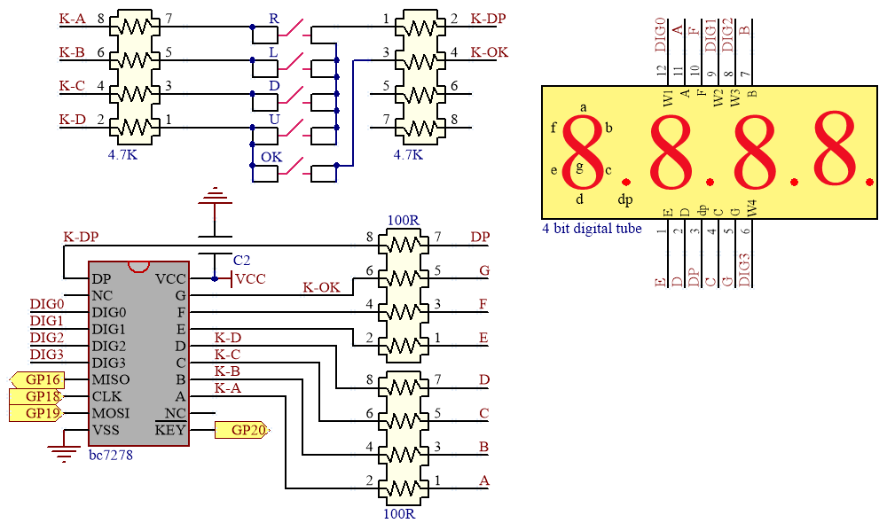    

**Open the example code: "keyboard_spi\.py"**     
1. Open the sample code using the methods in **"[Basic_example](./python_tutorial.md#basic-example-blink)"**.     
2. Run the example code online. 

**Example code phenomena:**         
Press the keyboard on the expansion board, and the terminal will print the value of the keyboard.           
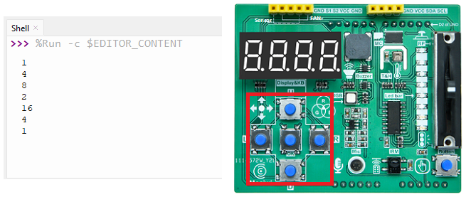    
| U | D | L | R | OK |
| :--: | :--: | :--: | :--: | :--: |
| 16 | 8 | 4 | 2 | 1 |

**FQA:**   
(1) What is Keyboard and SPI communication?  
The "Basic learning shield" is integrated with a 4-bit 8-segment display digital tube and five keys. They are controlled by the BC7278 chip, which has a slave SPI interface and a key trigger signal output.       
          
See: [SPI communication protocol](../Arduino_tutorial/Advanced_tutorial.md#chapter5-spi-communication-protocol)       
See: [SPI for Pico](https://docs.micropython.org/en/latest/rp2/quickref.html#hardware-spi-bus)    

**Code analysis:**
[bytearray()](https://docs.python.org/3/library/stdtypes.html?highlight=bytearray#bytearray)     


## Example_7 4-bit 8-segment digital tube       
**Objective:**     
1. What is 4-bit 8-segment digital tube?             

**Pins to be used:**   
1. MISO: GP16    
2. MOSI: GP19     
3. CLK: GP18           
<span style="color: rgb(255, 76, 65);">Note: The 4-bit 8-segment digital tube on the "Basic learning shield" occupy GP19 (MOSI), GP16 (MISO) and GP18 (CLK) of the Pico board, and the CS control pin is not required.</span>     

**Schematic diagram:**       
    

**Open the example code: "tube_spi\.py"**     
1. Open the sample code using the methods in **"[Basic_example](./python_tutorial.md#basic-example-blink)"**.     
2. Run the example code online. 

**Example code phenomena:**         
The 4-bit 8-segment nixie shows 0-9999, then 999.9, and so on.       
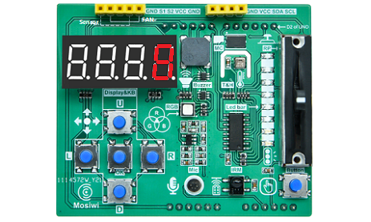    

| U | D | L | R | OK |    
| :--: | :--: | :--: | :--: | :--: |    
| 16 | 8 | 4 | 2 | 1 |     

**FQA:**   
(1) What is 4-bit 8-segment digital tube?    
See: [4-bit 8-segment digital tube](../Arduino_tutorial/Basic_tutorial.md#chapter-9-digital-tube-button-spi)       

**Data type conversion:**     
```
int(x): This converts x to an integer   

long(x): This converts x to an long integer 

float(x): Converts x to a floating point number  

str(x): Converts the object x to a string

chr(x): Converts an integer to a single character  

hex(x): Converts an integer to a hexadecimal string  

oct(x): Converts an integer to an octal string    
```


## Example_8 Ir-receiver       
**Objective:**     
1. What is Ir-receiver?      
2. What is NEC infrared communication protocol? 
3. What is I2C communication protocol? 

**Pins to be used:**   
1. SDA: GP4    
2. SCL: GP5      

**Schematic diagram:**       
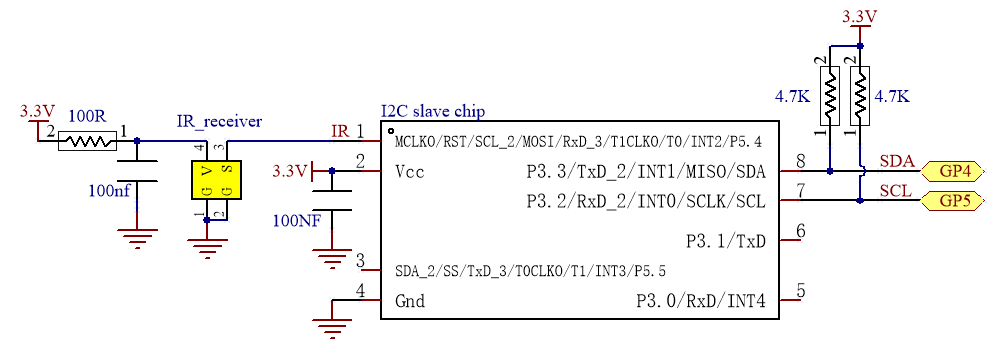      
Note: The I2C slave chip is integrated on the [3in1 Basic learning shield](../../../common_product/C1E0000_3in1_basic_learning_shield/C1E0000_3in1_basic_learning_shield.md#io-expand) board to process the data of the infrared receiving sensor.      

**Open the example code: "ir-receiver_iic\.py"**     
1. Open the sample code using the methods in **"[Basic_example](./python_tutorial.md#basic-example-blink)"**.     
2. Run the example code online. 

**Example code phenomena:**         
When the infrared remote controller presses the button, point to the infrared receiver on the expansion board, and the terminal will print the button value.       
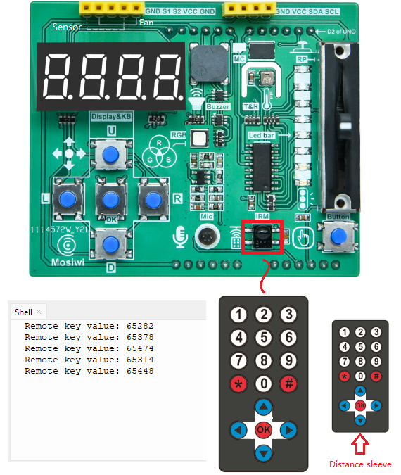    

Pico will get 2 bytes of data, the first byte is the inverse code of the address of the infrared remote control device, and the second byte is the command code of the infrared remote control device.      
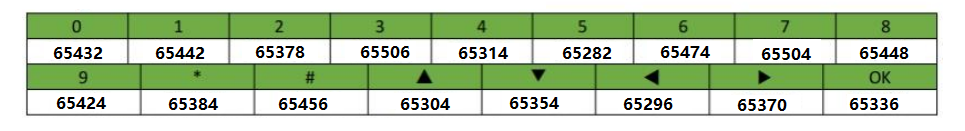    
```   
data: 65432 = 0xff98

Device inverse code:  
0xff = 0b11111111 = 255    

Device code:    
0x00 = 0b00000000 = 0        
```

**FQA:**   
(1) What is Ir-receiver?    
See: [Ir-receiver](../Arduino_tutorial/Intermediate_tutorial.md#chapter13-ir-receiver)       
See: [Ir-receiver module](../../../common_product/C1S0001_ir_receiver/C1S0001_ir_receiver.md)       

(2) What is NEC infrared communication protocol?       
See: [NEC infrared communication protocol](../../../common_resource/nec_communication_protocol/nec_communication_protocol.md)

(3) What is I2C communication?    
There is an I2C slave chip on the [3in1_basic_shield](../../C1E0000_3in1_basic_learning_shield/C1E0000_3in1_basic_learning_shield.md#io-expand), which integrates the NEC infrared communication protocol, and Pico communicates with it through the I2C protocol to read the data of the infrared receiver.     
See: [I2C](../Arduino_tutorial/Advanced_tutorial.md#chapter4-i2c-communication-protocol)     
See: [Pico use I2C](https://docs.micropython.org/en/latest/rp2/quickref.html#hardware-i2c-bus)     


## Example_9 Thermohygrometer       
**Objective:**     
1. What is Thermohygrometer?             

**Pins to be used:**   
1. SDA: GP4      
2. SCL: GP5       

**Schematic diagram:**       
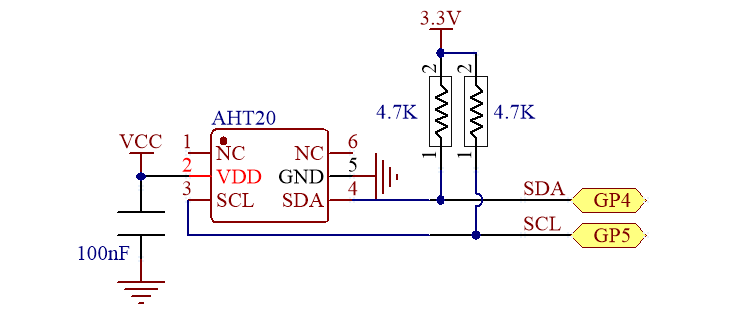      

**Open the example code: "humiture_i2c\.py"**     
1. Open the sample code using the methods in **"[Basic_example](./python_tutorial.md#basic-example-blink)"**.     
2. Run the example code online. 

**Example code phenomena:**         
The terminal will print the temperature and humidity values of the current environment.       
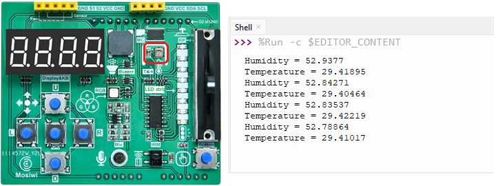    

**FQA:**   
(1) What is Thermohygrometer?    
A thermohygrometer is a tool that can accurately measure the current ambient temperature and humidity. In the example we used [AHT20](../../../_static/pdf/A1E0000_basic_learing_shield/AHT20.pdf) temperature and humidity sensor and 4 digital control made a temperature and humidity meter, 4 digital tube can display temperature and humidity values.     
specification parameter: 
| Name | Measuring range | Resolution | Error range |   
| :-- | :-- | :-- | :-- |     
| Temperature | 0 to 85℃ | 0.01℃ | +/-3% |     
| Humidity | 0% to 100% | 0.024% | +/-2% |      


## Example_10 EEPROM    
**Objective:**     
1. EEPROM    
2. 1-Wire protocol

**Pins to be used:**   
1. DQ: GP11     

**Schematic diagram:**       
      

**Open the example code: "memory_ow\.py"**     
1. Open the sample code using the methods in **"[Basic_example](./python_tutorial.md#basic-example-blink)"**.     
2. Run the example code online. 

**Example code phenomena:**         
1. Search the 1-Wire bus for a connected device.           
2. Select the first device and verify the series number with CRC8.    
3. Write data to memory.         
4. Read data from memory     

    

**FQA:**   
(1) EEPROM (Electrically Erasable Programmable Read-Only Memory)         
It is a kind of memory chip that does not lose data after power failure.          
    

(2) 1-Wire protocol
1-Wire technology is a serial protocol that uses one data wire and one ground wire to communicate. The 1-Wire master can initialize and control one or more 1-Wire slaves on the 1-Wire. Each 1-Wire slave device has a unique, immutable, factory programmed 64-bit ID as the device address on the 1-Wire. Eight bits of the 64-bit ID are family codes that identify the device type and function. Generally, the operating voltage range of the 1-Wire slave machine is 2.8V (min) to 5.25V (max). Most 1-Wire devices are not pin-powered and they harvest energy from 1-wire (parasitic power supply).     


## Example_11 Uart       
**Objective:**     
1. What is uart?             

**Pins to be used:**   
1. TX: GP0    
2. RX: GP1     

**Wiring diagram:** 
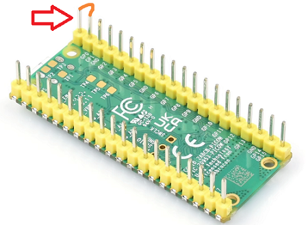    
Connect these two pins through a jumper wire or a metal wire.     
<span style="color: rgb(255, 76, 65);">Note: This wiring is equivalent to Pico's RX pin sending data to Pico's TX pin.</span>           

**Open the example code: "uart\.py"**     
1. Open the sample code using the methods in **"[Basic_example](./python_tutorial.md#basic-example-blink)"**.     
2. Run the example code online. 

**Example code phenomena:**         
Pico's serial port TX pin keeps sending data to Pico's RX pin, and the terminal prints the data received by the RX pin: **"Mosiwi!"**          
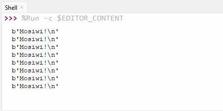    

**FQA:**   
(1) What is uart?    
See: [Uart](../Arduino_tutorial/Advanced_tutorial.md#chapter3-serial-port)    
See: [Uart for Pico](https://docs.micropython.org/en/latest/rp2/quickref.html#uart-serial-bus)       


**End!**    


