# Zero-based_tutorial         
This tutorial is based on the [C1K0001 4in1 basic learning kit](../../C1K0000_4in1_basic_learning_kit/C1K0000_4in1_basic_learning_kit.md).     

This tutorial only focuses on practical operation, without the need to understand the principles, and understands the simplest Pico programming operation, so that learners can get a sense of achievement and arouse their interest.     

## Prepared knowledge    
**Pico and Thonny basics:**     
If you don't have Pico and Thonny basics, you can follow the link to learn the basics: [Click Me](../../../raspberry/R1D0001_raspberry_pico/R1D0001_raspberry_pico.md)    

**Download sample code:**    
Please download the sample code on Github: <https://github.com/Mosiwi/Mosiwi-basic-learning-kit> 
       

Unzip the file downloaded above, and the file in the "**pico->microPython**" folder is the sample code.       
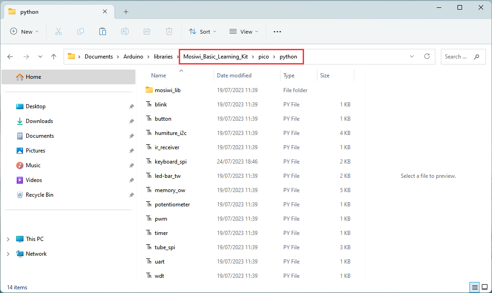      

## Wiring diagram      
      

## Basic_example Blink      
**Objective:**     
1. Open the example code.     
2. Upload and run code.   
3. Verify that the pico motherboard works.      

**Demonstration:**       
Open the "**blink\.py**" file as follows:     
      
     
Make sure your Raspberry PI Pico's USB is plugged into your computer's USB via a usb cable, then click on "Python" and the version number in the bottom right corner of the Thonny window, then select "**MicroPython(Raspberry PI Pico)". COMx** ".      
      
 
After running the code, the LED on the pico board lights up every 1 second:      
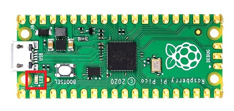      

## Example_1 Button      
**Open the example code: "button\.py"**     
1. Open the sample code using the methods in **"[Basic_example](./python_tutorial.md#basic-example-blink)"**.     
2. Run the example code.      

**Example code phenomena:**         
After uploads the code, the led on the Pico is always off, and if the "Button" on the extension board is pressed, the LED is turned on.     
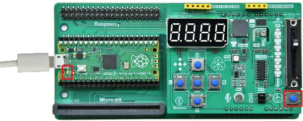      

## Example_2 Buzzer   
**Open the example code: "buzzer\.py"**     
1. Open the sample code using the methods in **"[Basic_example](./python_tutorial.md#basic-example-blink)"**.     
2. Run the example code. 

**Example code phenomena:**         
After uploading the code, the buzzer on the expansion board will keep beeping with a fixed frequency and different volumes.       
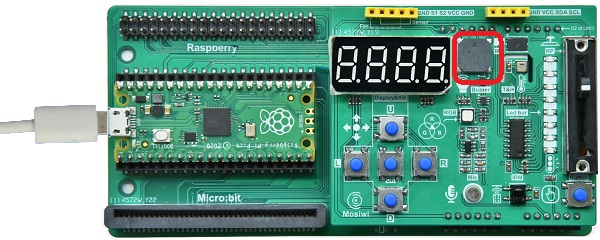      

## Example_3 RGB LED   
**Open the example code: "rgb-led_pwm\.py"**     
1. Open the sample code using the methods in **"[Basic_example](./python_tutorial.md#basic-example-blink)"**.     
2. Run the example code. 

**Example code phenomena:**         
The RGB LED light cycle emits red, green and blue lights.     
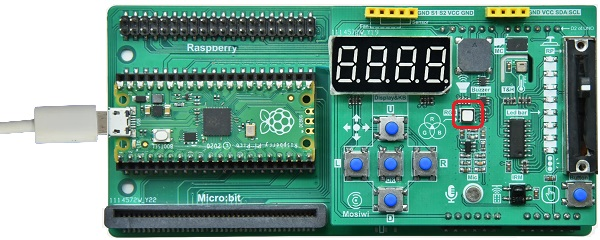      

## Example_4 Potentiometer   
**Open the example code: "potentiometer\.py"**     
1. Open the sample code using the methods in **"[Basic_example](./python_tutorial.md#basic-example-blink)"**.     
2. Run the example code. 

**Example code phenomena:**         
Push the potentiometer up and down, and the terminal prints the corresponding analog value and voltage value.          
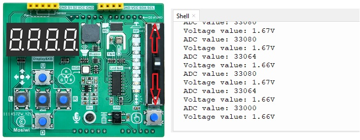      

## Example_5 Microphone   
**Open the example code: "microphone\.py"**     
1. Open the sample code using the methods in **"[Basic_example](./python_tutorial.md#basic-example-blink)"**.     
2. Run the example code. 

**Example code phenomena:**         
After running the code, the terminal prints the analog value of the amplified sound and the voltage value.        
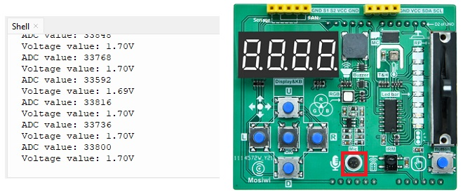      

## Example_6 Led-strip      
**Open the example code: "led-strip_tw\.py"**     
1. Open the sample code using the methods in **"[Basic_example](./python_tutorial.md#basic-example-blink)"**.     
2. Run the example code. 

**Example code phenomena:**         
The LED strip on the expansion board turns on and off in cycles.       
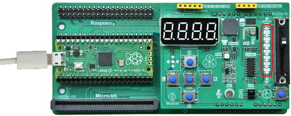      

## Example_7 Keyboard       
**Open the example code: "keyboard_spi\.py"**     
1. Open the sample code using the methods in **"[Basic_example](./python_tutorial.md#basic-example-blink)"**.     
2. Run the example code. 

**Example code phenomena:**         
Press the keyboard on the expansion board, and the terminal will print the value of the keyboard.           
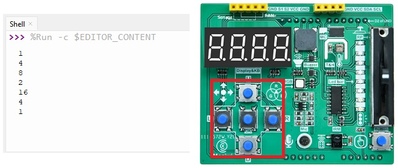            
| U | D | L | R | OK |
| :--: | :--: | :--: | :--: | :--: |
| 16 | 8 | 4 | 2 | 1 |

## Example_8 4-bit 8-segment digital tube       
**Open the example code: "tube_spi\.py"**     
1. Open the sample code using the methods in **"[Basic_example](./python_tutorial.md#basic-example-blink)"**.     
2. Run the example code. 

**Example code phenomena:**         
The 4-bit 8-segment nixie shows 0-9999, then 999.9, and so on.       
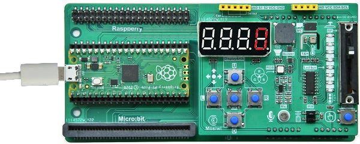            

## Example_9 Temperature and humidity sensor       
**Open the example code: "humiture_i2c\.py"**     
1. Open the sample code using the methods in **"[Basic_example](./python_tutorial.md#basic-example-blink)"**.     
2. Run the example code. 

**Example code phenomena:**         
The terminal will print the temperature and humidity values of the current environment.       
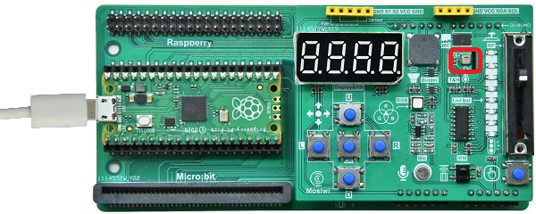            
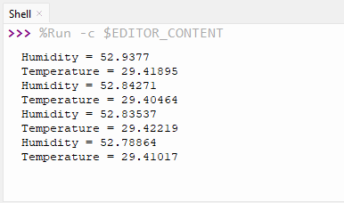    

**End!**    
