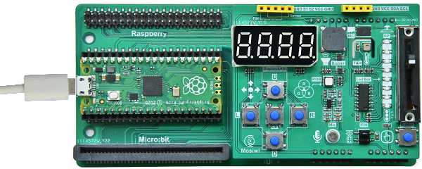
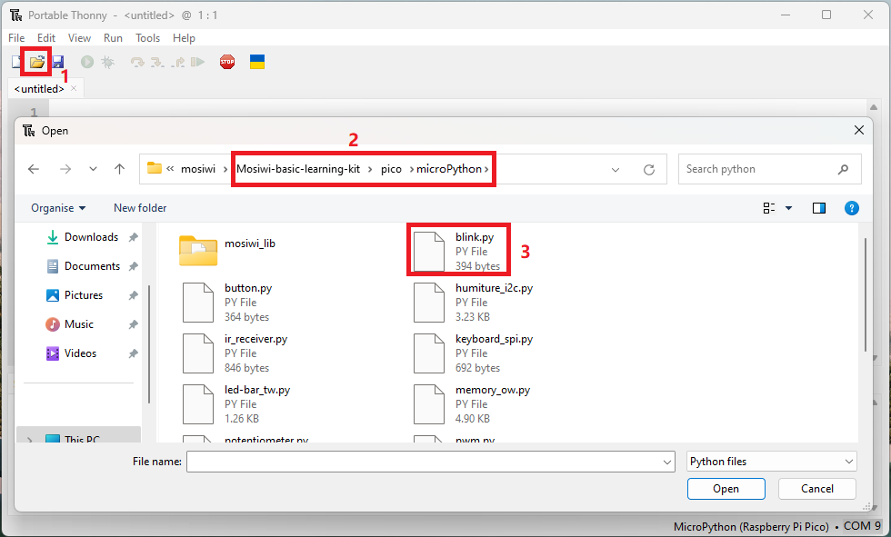
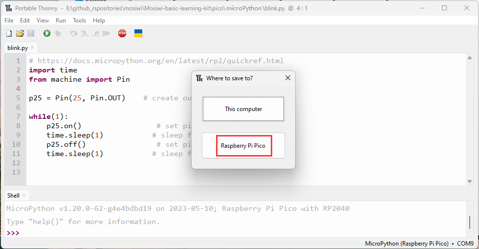
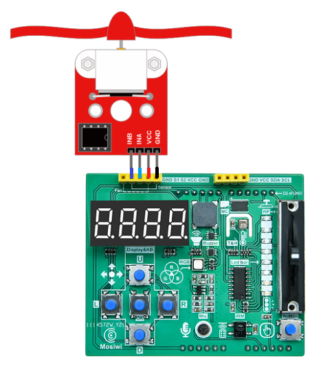
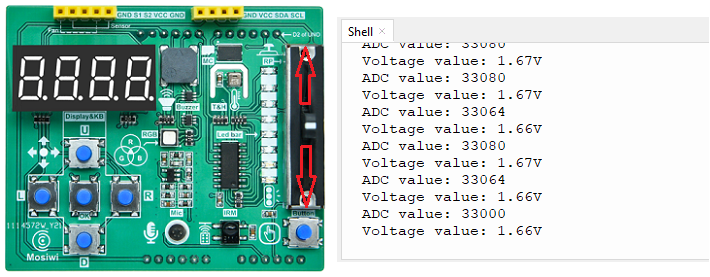
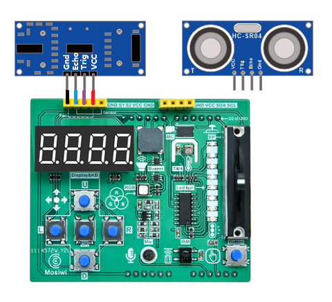

# MicroPython for Raspberry pi pico   
This tutorial is based on the [C1K0001 4in1 basic learning kit](../../C1K0000_4in1_basic_learning_kit/C1K0000_4in1_basic_learning_kit.md).     

## What is MicroPython?
MicroPython is a full implementation of the Python 3 programming language that runs directly on embedded hardware like Raspberry Pi Pico. You get an interactive prompt (the REPL) to execute commands immediately via USB Serial, and a built-in filesystem. The Pico port of MicroPython includes modules for accessing low-level chip-specific hardware.      
1. The [MicroPython Wiki](https://github.com/micropython/micropython/wiki)
2. The [MicroPython Forums](https://forum.micropython.org/)

## Prepared knowledge    
**Learn about:** [**Basic learning shield**](../../../arduino/A1E0000_basic_learning_shield/A1E0000_basic_learning_shield.md).  

**Learn about:** [**3in1 basic learning shield**](../../../common_product/C1E0000_3in1_basic_learning_shield/C1E0000_3in1_basic_learning_shield.md).  

**Pico and Thonny basics:**     
If you don't have Pico and Thonny basics, you can follow the link to learn the basics: [Click Me](../../../raspberry/R1D0001_raspberry_pico/R1D0001_raspberry_pico.md)    

**Learn about:** [**MicroPython for Pico**](https://docs.micropython.org/en/latest/rp2/quickref.html).  

**Download sample code:**    
Please download the sample code on Github: <https://github.com/Mosiwi/Mosiwi-basic-learning-kit> 
    
Unzip the file downloaded above, and the file in the "**pico->microPython**" folder is the sample code.       

## Wiring diagram      
    

## Basic_example Blink      
**Objective:**     
1. Open the example code.     
2. Upload and run code.   
3. Verify that the pico motherboard works.      

**Demonstration:**       
Open the "**blink\.py**" file as follows:     
    

Run the code online: (The code is not saved in pico and is not executed after repowering.)       
Make sure your Raspberry PI Pico's USB is plugged into your computer's USB via a usb cable, then click on "Python" and the version number in the bottom right corner of the Thonny window, then select "**MicroPython(Raspberry PI Pico)". COMx** ".      
    

After running the code, the LED on the pico board lights up every 1 second:      
    

Run the code offline: (The code is stored in pico, and the code in pico is automatically executed after being powered on.)     
Enter the code in the main panel, then click on the "**Save**" or "**File->Save as ...**" menu. Thonny will present you with a popup, click on "**Raspberry Pi Pico**" and enter "**main\.py**" to save the code to the **Raspberry Pi Pico**.  
    
    
    

| Note|  
|  :-- |
|If you "save a file to the device" and give it the special name **main\.py**, then MicroPython starts running that script as soon as power is supplied to Raspberry Pi Pico in the future. |    

## Example_1 Button      
**Objective:**     
1. Set the pins of the Pico to digital output mode or digital input mode.            
2. What is a button?     

**Pins to be used:**     
1. Button: GP21 
2. Red RGB LED: GP25

**Open the example code: "button\.py"**     
1. Open the sample code using the methods in **"[Basic_example](./python_tutorial.md#basic-example-blink)"**.     
2. Run the example code online.      

**Example code phenomena:**         
After uploads the code, the green RGB led on the expansion board is always off, and if the "Button" on the extension board is pressed, the LED is turned on.     
    

**FQA:**    
(1) Set the pins of the Pico to digital output mode or digital input mode.      
See: [Pins and GPIO](https://docs.micropython.org/en/latest/rp2/quickref.html#pins-and-gpio)      

(2) What is a button?   
See: [Button](../Arduino_tutorial/Basic_tutorial.md#Chapter-2-button)     

## Example_2 Buzzer   
**Objective:**     
1. What is PWM output?      
2. What is buzzer?    

**Pins to be used:**   
1. Buzzer: GP6  

**Open the example code: "buzzer\.py"**     
1. Open the sample code using the methods in **"[Basic_example](./python_tutorial.md#basic-example-blink)"**.     
2. Run the example code online. 

**Example code phenomena:**         
After uploading the code, the buzzer on the expansion board will keep beeping with a fixed frequency and different volumes.       
    

**FQA:**   
(1) What is PWM output?       
See: [What is PWM?](../Arduino_tutorial/Basic_tutorial.md#chapter-6-pwm)     
See: [PWM for Pico](https://docs.micropython.org/en/latest/rp2/quickref.html#pwm-pulse-width-modulation)     

(2) What is buzzer?    
See: [Buzzer](../Arduino_tutorial/Intermediate_tutorial.md#chapter5-buzzer)    

## Example_3 RGB LED   
**Objective:**     
1. What is RGB LED?         

**Pins to be used:**   
1. Red RGB LED: GP8    
2. Green RGB LED: GP9
3. Bule REG LED: GP7

**Open the example code: "rgb-led_pwm\.py"**     
1. Open the sample code using the methods in **"[Basic_example](./python_tutorial.md#basic-example-blink)"**.     
2. Run the example code online. 

**Example code phenomena:**         
The RGB LED light cycle emits red, green and blue lights.     
    

**FQA:**   
(1) What is RGB LED?       
See: [RGB LED](../Arduino_tutorial/Intermediate_tutorial.md#chapter1-rgb-led)     

## Example_4 Fan   
**Objective:**     
1. What is fan module?         

**Pin control table:**   
1. S1(INB): GP8    
2. S2(INA): GP9

**Wiring diagram:** 
    

**Open the example code: "fan_pwm\.py"**     
1. Open the sample code using the methods in **"[Basic_example](./python_tutorial.md#basic-example-blink)"**.     
2. Run the example code online. 

**Example code phenomena:**         
The fan rotates clockwise and counterclockwise, and the speed changes from small to large, and then from large to small.       
    

**FQA:**   
(1) What is fan module?       
See: [Fan module](../../../outsourcing/O1M0001_fan_module/O1M0001_fan_module.md)     

## Example_5 Potentiometer   
**Objective:**     
1. What is potentiometer?         
2. What is ADC?   

**Pins to be used:**   
1. Potentiometer: GP28_A2    

**Open the example code: "potentiometer\.py"**     
1. Open the sample code using the methods in **"[Basic_example](./python_tutorial.md#basic-example-blink)"**.     
2. Run the example code online. 

**Example code phenomena:**         
Push the potentiometer up and down, and the terminal prints the corresponding analog value and voltage value.          
    

**FQA:**   
(1) What is potentiometer?    
Sliding potentiometer is a resistance element with adjustable resistance value and three leading ends. It usually consists of a resistive body and a removable brush. When the brush moves along the resistance body, the resistance value or voltage that is related to the displacement can be obtained at the output end.      
    

(2) What is ADC? 
See: [ADC](https://docs.micropython.org/en/latest/rp2/quickref.html#adc-analog-to-digital-conversion)       

## Example_6 Microphone   
**Objective:**     
1. What is microphone?           

**Pins to be used:**   
1. Microphone: GP27_A1          

**Open the example code: "microphone\.py"**     
1. Open the sample code using the methods in **"[Basic_example](./python_tutorial.md#basic-example-blink)"**.     
2. Run the example code online. 

**Example code phenomena:**         
After running the code, the terminal prints the analog value of the amplified sound and the voltage value.        
    

**FQA:**   
(1) What is microphone?    
See: [Microphone](../Arduino_tutorial/Intermediate_tutorial.md#chapter9-microphone)       
Note: When the microphone on the expansion board is used with the Pico board, the operating voltage is 3.3V instead of 5V.      

## Example_7 Ultrasonic       
**Objective:**     
1. What is ultrasonic module?           

**Pins to be used:**   
1. S1(echo of ultrasonic): GP8    
2. S2(trig of ultrasonic): GP9         

**Wiring diagram:** 
    

**Open the example code: "ultrasonic\.py"**     
1. Open the sample code using the methods in **"[Basic_example](./python_tutorial.md#basic-example-blink)"**.     
2. Run the example code online. 

**Example code phenomena:**         
After the code is uploaded, the obstacle is placed in front of the ultrasonic sensor, and the distance measured by the ultrasonic sensor is printed at the terminal.         
    

**FQA:**   
(1) What is ultrasonic module?    
See: [Ultrasonic module](../../../outsourcing/O1M0000_ultrasonic_module/O1M0000_ultrasonic_module.md)           

## Example_9 Led-strip      
**Objective:**     
1. What is led-strip?           
2. What is 74HC595?     

**Pins to be used:**   
1. DS: GP15    
2. SH_CP: GP14      
3. ST_CP: GP13   

**Open the example code: "led-strip_tw\.py"**     
1. Open the sample code using the methods in **"[Basic_example](./python_tutorial.md#basic-example-blink)"**.     
2. Run the example code online. 

**Example code phenomena:**         
The LED strip on the expansion board turns on and off in cycles.       
    

**FQA:**   
(1) What is led-strip?    
There is one LED strip on the expansion board, which is controlled by the 74HC595 chip on the expansion board. 74HC595 is a widely used serial input and parallel output chip.      
    

(2) What is 74HC595? 
See: [74HC595](../Arduino_tutorial/Advanced_tutorial.md#chapter6-3-wire-communication)         

## Example_9 Timer   
**Objective:**     
1. What is timer?           

**Pins to be used:**   
1. Red RGB LED: GP8             

**Open the example code: "timer\.py"**     
1. Open the sample code using the methods in **"[Basic_example](./python_tutorial.md#basic-example-blink)"**.     
2. Run the example code online. 

**Example code phenomena:**         
The red LED on the expansion board shines once every 1 seconds.    
    

**FQA:**   
(1) What is timer?  
See: [Timer](../Arduino_tutorial/Basic_tutorial.md#chapter-6-timer1)  
See: [Timer of Pico](https://docs.micropython.org/en/latest/rp2/quickref.html#timers)       

## Example_10 keyboard       
**Objective:**     
1. What is keyboard?           
2. What is SPI communication protocol?   

**Pins to be used:**   
1. MISO: GP16    
2. MOSI: GP19     
3. CLK: GP18      
4. KEY-INT: GP20     
Note: The 5 keys on the "Basic learning shield" occupy GP20 (key trigger signal output), GP19 (MOSI), GP16 (MISO) and GP18 (CLK) of the Pico board, and the CS control pin is not required.     

**Open the example code: "keyboard_spi\.py"**     
1. Open the sample code using the methods in **"[Basic_example](./python_tutorial.md#basic-example-blink)"**.     
2. Run the example code online. 

**Example code phenomena:**         
Press the keyboard on the expansion board, and the terminal will print the value of the keyboard.           
    
| U | D | L | R | OK |
| :--: | :--: | :--: | :--: | :--: |
| 16 | 8 | 4 | 2 | 1 |

**FQA:**   
(1) What is Keyboard and SPI communication?    
See: [Keyboard](../Arduino_tutorial/Basic_tutorial.md#chapter-9-digital-tube-button-spi)       
See: [SPI communication protocol](../Arduino_tutorial/Advanced_tutorial.md#chapter5-spi-communication-protocol)       
See: [Pico use SPI](https://docs.micropython.org/en/latest/rp2/quickref.html#hardware-spi-bus)    

## Example_11 4-bit 8-segment digital tube       
**Objective:**     
1. What is 4-bit 8-segment digital tube?             

**Pins to be used:**   
1. MISO: GP16    
2. MOSI: GP19     
3. CLK: GP18           
Note: The 4-bit 8-segment digital tube on the "Basic learning shield" occupy GP19 (MOSI), GP16 (MISO) and GP18 (CLK) of the Pico board, and the CS control pin is not required.     

**Open the example code: "tube_spi\.py"**     
1. Open the sample code using the methods in **"[Basic_example](./python_tutorial.md#basic-example-blink)"**.     
2. Run the example code online. 

**Example code phenomena:**         
The 4-bit 8-segment nixie shows 0-9999, then 999.9, and so on.       
    

**FQA:**   
(1) What is 4-bit 8-segment digital tube?    
See: [4-bit 8-segment digital tube](../Arduino_tutorial/Basic_tutorial.md#chapter-9-digital-tube-button-spi)       

## Example_12 Ir-receiver       
**Objective:**     
1. What is Ir-receiver?      
2. What is NEC infrared communication protocol? 
3. What is I2C communication protocol? 

**Pins to be used:**   
1. SDA: GP4    
2. SCL: GP5              

**Open the example code: "ir-receiver_iic\.py"**     
1. Open the sample code using the methods in **"[Basic_example](./python_tutorial.md#basic-example-blink)"**.     
2. Run the example code online. 

**Example code phenomena:**         
When the infrared remote controller presses the button, point to the infrared receiver on the expansion board, and the terminal will print the button value.       
    
Pico will get 2 bytes of data, the first byte is the inverse code of the address of the infrared remote control device, and the second byte is the command code of the infrared remote control device.      

**FQA:**   
(1) What is Ir-receiver?    
See: [Ir-receiver](../Arduino_tutorial/Intermediate_tutorial.md#chapter13-ir-receiver)       

(2) What is NEC infrared communication protocol?       
See: [NEC infrared communication protocol](../../../common_resource/nec_communication_protocol/nec_communication_protocol.md)

(3) What is I2C communication?    
There is an I2C slave chip on the [3in1_basic_shield](../../C1E0000_3in1_basic_learning_shield/C1E0000_3in1_basic_learning_shield.md#io-expand), which integrates the NEC infrared communication protocol, and Pico communicates with it through the I2C protocol to read the data of the infrared receiver.     
See: [I2C](../Arduino_tutorial/Advanced_tutorial.md#chapter4-i2c-communication-protocol)     
See: [Pico use I2C](https://docs.micropython.org/en/latest/rp2/quickref.html#hardware-i2c-bus)     

## Example_13 Thermohygrometer       
**Objective:**     
1. What is Thermohygrometer?             

**Pins to be used:**   
1. SDA: GP4      
2. SCL: GP5       

**Open the example code: "humiture_i2c\.py"**     
1. Open the sample code using the methods in **"[Basic_example](./python_tutorial.md#basic-example-blink)"**.     
2. Run the example code online. 

**Example code phenomena:**         
The terminal will print the temperature and humidity values of the current environment.       
    

**FQA:**   
(1) What is Thermohygrometer?    
See: [Thermohygrometer](../Arduino_tutorial/Intermediate_tutorial.md#chapter12-thermohygrometer)    

## Example_14 Uart       
**Objective:**     
1. What is uart?             

**Pins to be used:**   
1. TX: GP0    
2. RX: GP1     

**Wiring diagram:** 
    
Connect these two pins through a jumper wire or a metal wire.     

**Open the example code: "uart\.py"**     
1. Open the sample code using the methods in **"[Basic_example](./python_tutorial.md#basic-example-blink)"**.     
2. Run the example code online. 

**Example code phenomena:**         
Pico's serial port TX pin keeps sending data to Pico's RX pin, and the terminal prints the data received by the RX pin: **"Mosiwi!"**          
    

**FQA:**   
(1) What is uart?    
See: [Uart](../Arduino_tutorial/Advanced_tutorial.md#chapter3-serial-port)    
See: [Pico use uart](https://docs.micropython.org/en/latest/rp2/quickref.html#uart-serial-bus)       

## Example_15 Watchdog      
**Objective:**     
1. What is Watchdog?             

**Open the example code: "wdt\.py"**     
1. Open the sample code using the methods in **"[Basic_example](./python_tutorial.md#basic-example-blink)"**.     
2. Run the example code online. 

**Example code phenomena:**         
At the beginning of the program, let the LED on the Pico board blink once, and then set the dog feeding time of the watchdog to within 30 seconds, so that the program will always loop empty. Because the dog was not fed in time, the Pico reset every 30 seconds, and the LED on the Pico class flickered every time it was reset.             
      
Note: When practicing, don't set the dog feed time so short that the Pico keeps resetting and can't communicate with Thonny. At this point you have to [re-burn the UF2 file](../../../raspberry/R1D0001_raspberry_pico/R1D0001_raspberry_pico.md#using-uicropython-in-thonny).    

**FQA:**   
(1) What is Watchdog?    
The watchdog is also a timer, and the set time must be refreshed within the set time, otherwise it will cause the chip to reset. Use this function to prevent the program from running incorrectly or out of control.      
See: [Pico use WDT](https://docs.micropython.org/en/latest/rp2/quickref.html#wdt-watchdog-timer)           

**End!**    

