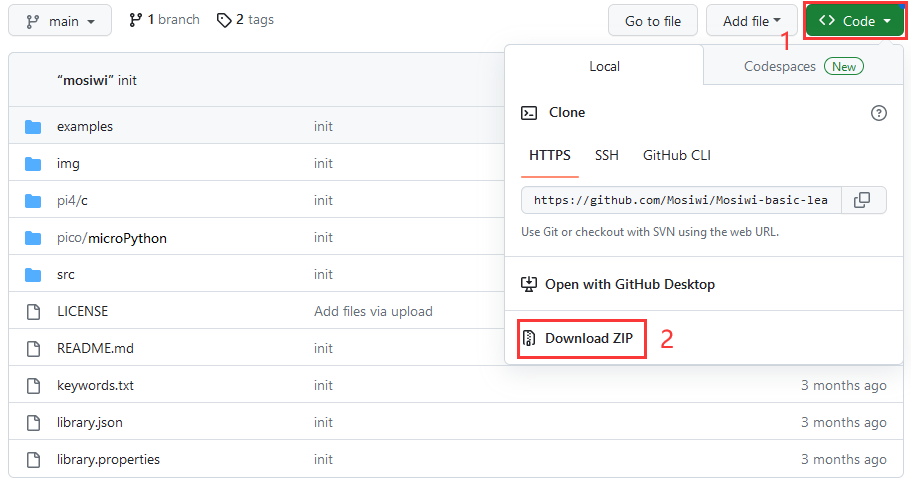
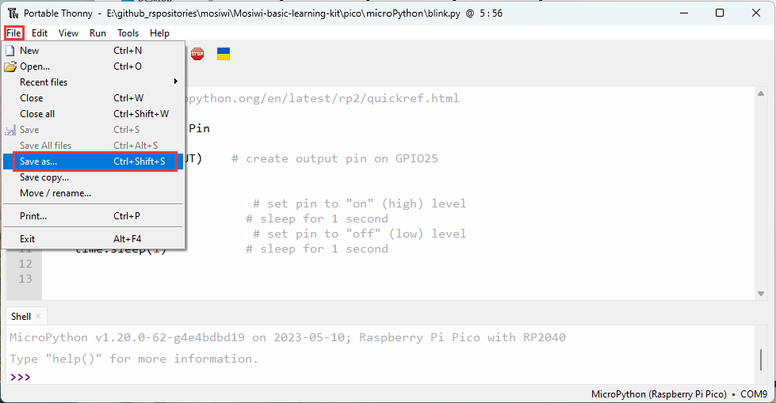

# MicroPython for Raspberry pi pico   
This tutorial is based on the [C1K0001 4in1 basic learning kit](../../C1K0000_4in1_basic_learning_kit/C1K0000_4in1_basic_learning_kit.md).     

## Prepared knowledge    
**Learn about** [**Basic learning shield**](../../../arduino/A1E0000_basic_learning_shield/A1E0000_basic_learning_shield.md).  

**Learn about** [**3in1 basic learning shield**](../../../common_product/C1E0000_3in1_basic_learning_shield/C1E0000_3in1_basic_learning_shield.md).  

**Pico and Thonny basics**     
If you don't have Pico and Thonny basics, you can follow the link to learn the basics: [Click Me](../../../raspberry/R1D0001_raspberry_pico/R1D0001_raspberry_pico.md)    

**Download sample code**    
Please download the sample code on Github: <https://github.com/Mosiwi/Mosiwi-basic-learning-kit> 
    
Unzip the file downloaded above, and the file in the "**pico->python**" folder is the sample code.       

## Wiring diagram      
    

## Basic Example: Open a sample code and light a LED      
**Objective:**     
1. Open the example code.     
2. Upload and run code.   
3. Verify that the pico motherboard works.      

**Demonstration:**       
Open the "**blink\.py**" file as follows:     
    

Run the code online: (The code is not saved in pico and is not executed after repowering.)       
Make sure your Raspberry PI Pico's USB is plugged into your computer's USB via a usb cable, then click on "Python" and the version number in the bottom right corner of the Thonny window, then select "**MicroPython(Raspberry PI Pico)". COMx** ".      
    

After running the code, the LED on the pico board lights up every 1 second:      
    

Run the code offline: (The code is stored in pico, and the code in pico is automatically executed after being powered on.)     
Enter the code in the main panel, then click on the "**Save**" or "**File->Save as ...**" menu. Thonny will present you with a popup, click on "**Raspberry Pi Pico**" and enter "**main\.py**" to save the code to the **Raspberry Pi Pico**.  
    
    
    

| Note|  
|  :-- |
|If you "save a file to the device" and give it the special name **main\.py**, then MicroPython starts running that script as soon as power is supplied to Raspberry Pi Pico in the future. |    
This method is not recommended when practicing programming.      

## Example 1:       
**Objective:**     
1. Set the pins of the Pico to digital output mode or digital input mode.            

**Pin control table:**     
| GP21 | GP25 |
| :--: | :--: |
| Buttons on the expansion board | LED on the Pico |
|  |  |

**Open the example code: "button.py"**     
1. Open the sample code using the methods in **"[Basic Example](./python_tutorial.md#Basic-Example:-Open-a-sample-code-and-light-a-LED)"**.     
2. Run the example code online.      

**Example code phenomena:**         
After uploads the code, the LED on the Pico board is always on, and if the "Button" on the extension board is pressed, the LED is turned off.     
    

## Example 2:    
...

**End!**    

