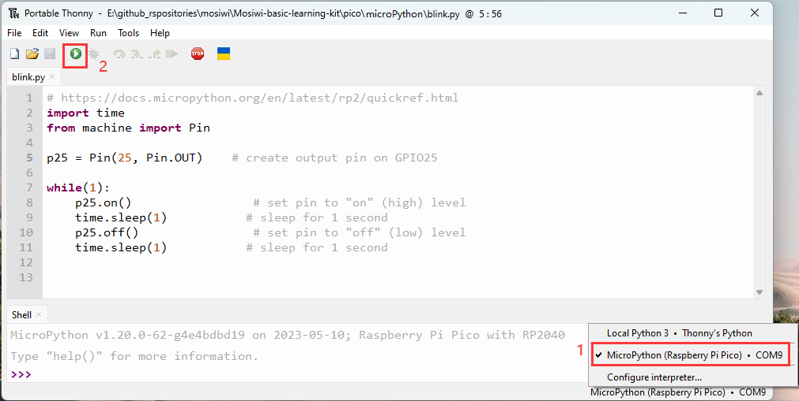

# MicroPython for Raspberry pi pico   
This tutorial is based on the [C1K0001 4in1 basic learning kit](../../C1K0000_4in1_basic_learning_kit/C1K0000_4in1_basic_learning_kit.md).     

## What is MicroPython?
MicroPython is a full implementation of the Python 3 programming language that runs directly on embedded hardware like Raspberry Pi Pico. You get an interactive prompt (the REPL) to execute commands immediately via USB Serial, and a built-in filesystem. The Pico port of MicroPython includes modules for accessing low-level chip-specific hardware.      
1. The [MicroPython Wiki](https://github.com/micropython/micropython/wiki)
2. The [MicroPython Forums](https://forum.micropython.org/)

## Prepared knowledge    
**Learn about:** [**Basic learning shield**](../../../arduino/A1E0000_basic_learning_shield/A1E0000_basic_learning_shield.md).  

**Learn about:** [**3in1 basic learning shield**](../../../common_product/C1E0000_3in1_basic_learning_shield/C1E0000_3in1_basic_learning_shield.md).  

**Pico and Thonny basics:**     
If you don't have Pico and Thonny basics, you can follow the link to learn the basics: [Click Me](../../../raspberry/R1D0001_raspberry_pico/R1D0001_raspberry_pico.md)    

**Learn about:** [**MicroPython for Pico**](https://docs.micropython.org/en/latest/rp2/quickref.html).  

**Download sample code:**    
Please download the sample code on Github: <https://github.com/Mosiwi/Mosiwi-basic-learning-kit> 
    
Unzip the file downloaded above, and the file in the "**pico->python**" folder is the sample code.       

## Wiring diagram      
    

## Basic_example Blink      
**Objective:**     
1. Open the example code.     
2. Upload and run code.   
3. Verify that the pico motherboard works.      

**Demonstration:**       
Open the "**blink\.py**" file as follows:     
    

Run the code online: (The code is not saved in pico and is not executed after repowering.)       
Make sure your Raspberry PI Pico's USB is plugged into your computer's USB via a usb cable, then click on "Python" and the version number in the bottom right corner of the Thonny window, then select "**MicroPython(Raspberry PI Pico)". COMx** ".      
    

After running the code, the LED on the pico board lights up every 1 second:      
    

Run the code offline: (The code is stored in pico, and the code in pico is automatically executed after being powered on.)     
Enter the code in the main panel, then click on the "**Save**" or "**File->Save as ...**" menu. Thonny will present you with a popup, click on "**Raspberry Pi Pico**" and enter "**main\.py**" to save the code to the **Raspberry Pi Pico**.  
    
    
    

| Note|  
|  :-- |
|If you "save a file to the device" and give it the special name **main\.py**, then MicroPython starts running that script as soon as power is supplied to Raspberry Pi Pico in the future. |    

## Example_1 Button      
**Objective:**     
1. Set the pins of the Pico to digital output mode or digital input mode.            
2. What is a button?     

**Pins to be used:**     
1. Button: GP21 
2. Red RGB LED: GP25

**Open the example code: "button.py"**     
1. Open the sample code using the methods in **"[Basic_example](./python_tutorial.md#basic-example-blink)"**.     
2. Run the example code online.      

**Example code phenomena:**         
After uploads the code, the green RGB led on the expansion board is always off, and if the "Button" on the extension board is pressed, the LED is turned on.     
    

**FQA:**    
(1) Set the pins of the Pico to digital output mode or digital input mode.      
See: [Pins and GPIO](https://docs.micropython.org/en/latest/rp2/quickref.html#pins-and-gpio)      

(2) What is a button?   
See: [Button](../Arduino_tutorial/Basic_tutorial.md#Chapter-2-button)     

## Example_2 Buzzer   
**Objective:**     
1. What is PWM output?      
2. What is buzzer?    

**Pin control table:**   
1. Buzzer: GP6  

**Open the example code: "buzzer.py"**     
1. Open the sample code using the methods in **"[Basic_example](./python_tutorial.md#basic-example-blink)"**.     
2. Run the example code online. 

**Example code phenomena:**         
After uploading the code, the buzzer on the expansion board will keep beeping with a fixed frequency and different volumes.       
    

**FQA:**   
(1) What is PWM output?       
See: [What is PWM?](../Arduino_tutorial/Basic_tutorial.md#chapter-6-pwm)     
See: [PWM for Pico](https://docs.micropython.org/en/latest/rp2/quickref.html#pwm-pulse-width-modulation)     

(2) What is buzzer?    
See: [Buzzer](../Arduino_tutorial/Intermediate_tutorial.md#chapter5-buzzer)    

## Example_3 RGB LED   
**Objective:**     
1. What is RGB LED?         

**Pin control table:**   
1. Red RGB LED: GP8    
2. Green RGB LED: GP9
3. Bule REG LED: GP7

**Open the example code: "rgb-led_pwm.py"**     
1. Open the sample code using the methods in **"[Basic_example](./python_tutorial.md#basic-example-blink)"**.     
2. Run the example code online. 

**Example code phenomena:**         
The RGB LED light cycle emits red, green and blue lights.     
    

**FQA:**   
(1) What is RGB LED?       
See: [RGB LED](../Arduino_tutorial/Intermediate_tutorial.md#chapter1-rgb-led)     

## Example_4 Fan   
**Objective:**     
1. What is fan module?         

**Pin control table:**   
1. Red RGB LED: GP8    
2. Green RGB LED: GP9
3. Bule REG LED: GP7

**Open the example code: "fan_pwm.py"**     
1. Open the sample code using the methods in **"[Basic_example](./python_tutorial.md#basic-example-blink)"**.     
2. Run the example code online. 

**Example code phenomena:**         
The RGB LED light cycle emits red, green and blue lights.     
    

**FQA:**   
(1) What is fan module?       
See: [Fan module](../Arduino_tutorial/Intermediate_tutorial.md#chapter16-fan-pwm)     

**End!**    

