# C-language for Raspberry pi4    
This tutorial is based on [C1K0001 4in1 basic learning kit](../C1K0000_4in1_basic_learning_kit.md) and C language, if you do not have knowledge of the C language, it is recommended to learn the [Arduino tutorial](../../C1K0000_4in1_basic_learning_kit/C1K0000_4in1_basic_learning_kit.md) first.     

## Prepared knowledge <span style="color: rgb(255, 76, 65);">(Important)</span>     
**Learn about** [**Basic learning shield**](../../../arduino/A1E0000_basic_learning_shield/A1E0000_basic_learning_shield.md).  

**Learn about** [**3in1 basic learning shield**](../../../common_product/C1E0000_3in1_basic_learning_shield/C1E0000_3in1_basic_learning_shield.md).  

**Raspberry pi4 basics**     
If you don't have Raspberry pi4 basics, you can follow the link to learn the basics: [Click Me](../../../raspberry/R1D0000_raspberry_pi4/R1D0000_raspberry_pi4.md)      

**Install the GPIO library**
1. Install the [Wiringpi](../../../raspberry/wiringpi/wiringpi.md)   
2. Install the [BCM2835](../../../raspberry/bcm2835/bcm2835.md)      

**Download sample code**   
[Login to Raspberry pi4 using PUTTY](../../../raspberry/R1D0000_raspberry_pi4/R1D0000_raspberry_pi4.md#remote-access), then use the following command to download the sample code:      
```   
git clone https://github.com/Mosiwi/Mosiwi-basic-learning-kit     
```    
    

The file in the "**Mosiwi-basic-learning-kit-for-arduino -> pi4 -> c**" folder is the sample code：           
```
cd ~/Mosiwi-basic-learning-kit/pi4/c

ls
```
    

Document architecture:   
      
1. If you are a newbie, the files in the "**src**" folder are not recommended to modify them, which may cause the code in the "**examples**" folder to compile incorrectly.    
2. Each example folder contains a "Makefile", "xxx.o", and "xxx.c" files, as well as an execution file.     
3. The "xxx.o" and execution files are generated from the "Makefile" file.    
4. If you are a newbie, it is not recommended to modify the contents of the "Makefile" and the name of the "xxx.c" file, which may cause compilation errors.    
5. If the content of the xxx.c file is modified, you need to compile it again to generate an executable file.    
```
sudo make
```
6. Run the execution file with the following command:   
```
sudo ./xxx
```

Resource: [GNU Make](https://www.gnu.org/software/make/)(Makefile) 

## Basic Example <span style="color: rgb(255, 76, 65);">(Important)</span>: Terminal    
**Objective:**       
1. Run the sample code.   
2. Recompile the sample code. 
3. Modify and recompile the sample code.      

**Objective_1:**       
Terminal into the **"1.0.0_Terminal"** folder:    
```
cd ~/Mosiwi-basic-learning-kit/pi4/c/examples/1.0.0_Terminal/    
```
Permission to view execution files:   
```
ls -al   
```
      
r: Read permission. &ensp;&ensp; w: Write permission. &ensp;&ensp; x: Execute permission.     

If the file does not have execution permissions as shown in the figure above, you need to add execution permissions:    
```
chmod 777 terminal   
ls -al   
```
     

Run the compiled sample code:     
```
sudo ./terminal     
```
      

**Objective_2:**       
Delete the latest executable file and then view the files in the folder:     
```
rm terminal   
ls   
```
     

The "terminal" executable is no longer visible from the image above, now re-run the "Makefile" file to generate the executable "terminal" file.    
```
sudo make  
ls   
```
      

**Objective_3:**    
Edit the sample code using the [nano tool](https://www.nano-editor.org/) that comes with the Raspberry PI system:  
```
sudo nano terminal.c   
```
When the editing is complete, save the file by typing the following command on the keyboard and exit the nano editor:  
```terminal
Ctrl+O
Ctrl+C
```
Recompile the "terminal.c" source file:   
```
sudo make  
ls
```
      


## Wiring diagram   
Turn off the Raspberry PI and connect the Raspberry PI to the expansion board with a 40P color cable:    
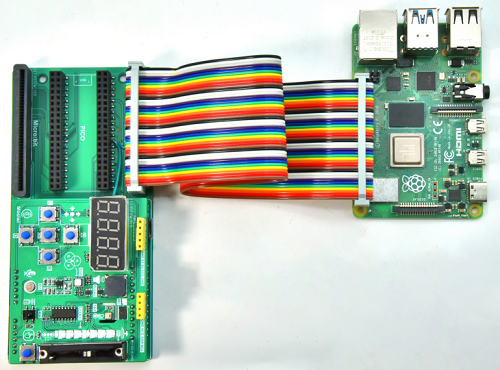      
Then restart Raspberry PI and TUTTY.     

## Example1: Arithmetic operator             
Run the following command on the terminal:       
```
cd ~/Mosiwi-basic-learning-kit/pi4/c/examples/1.0.1_Arithmetic_operation/     
chmod 777 arithmetic_operation     
sudo ./arithmetic_operation
```
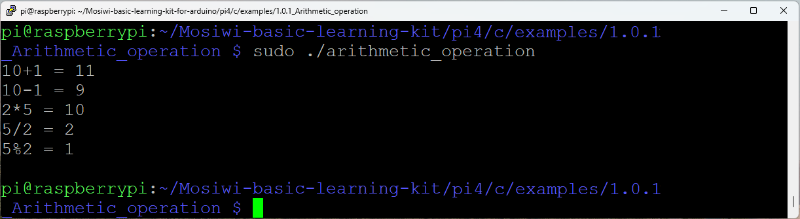     

## Example2 Blink     
**Pins to be used:**   
1. Red RGB LED: 23(Wiringpi) or 13(BCM)  

**Schematic diagram:**       
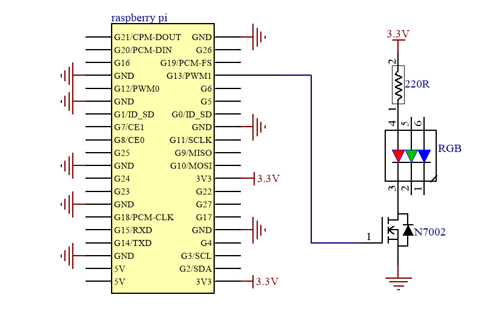    

**Demonstration:**       
Run the following command on the terminal:       
```
cd ~/Mosiwi-basic-learning-kit/pi4/c/examples/1.1.0_Blink/     
chmod 777 blink     
sudo ./blink
```
The red LED lights on the expansion board are lit at one-second intervals.    
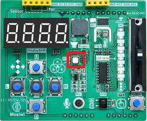     

## Example3 Button   
**Pins to be used:**   
1. Red RGB LED: 23(Wiringpi) or 13(BCM) 
2. Button: 22(Wiringpi) or 6(BCM)  

**Schematic diagram:**       
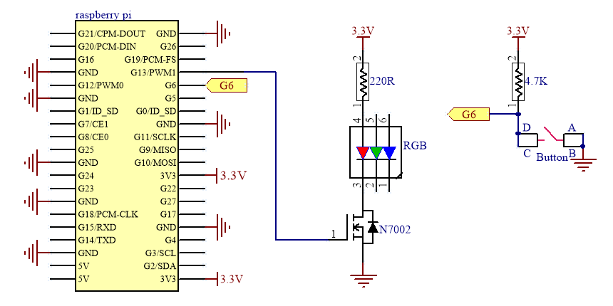    

**Demonstration:**       
Run the following command on the terminal:       
```
cd ~/Mosiwi-basic-learning-kit/pi4/c/examples/1.2.0_Button/     
chmod 777 button     
sudo ./button
```
After uploads the code, the green RGB led on the expansion board is always off, and if the "Button" on the extension board is pressed, the LED is turned on.     
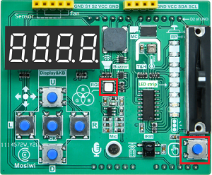     


## Example4 Buzzer   
**Pins to be used:**   
1. Buzzer: 1(Wiringpi) or 18(BCM) 

**Schematic diagram:**       
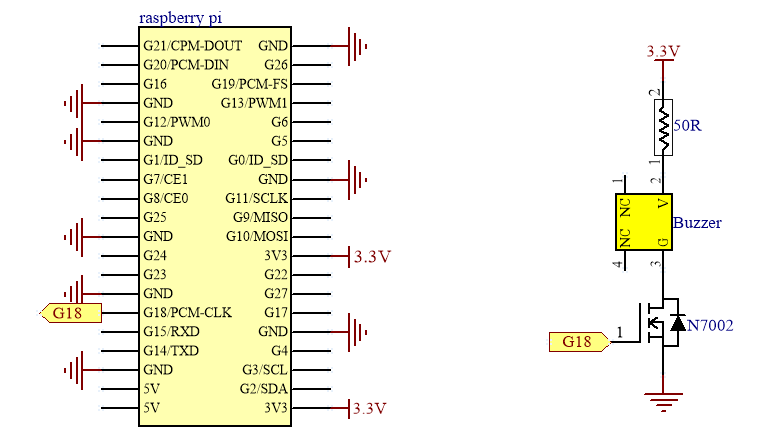    

**Demonstration:**       
Run the following command on the terminal:       
```
cd ~/Mosiwi-basic-learning-kit/pi4/c/examples/2.2.0_Buzzer/     
chmod 777 buzzer     
sudo ./buzzer
```
After uploading the code, the buzzer on the expansion board will keep beeping with a fixed frequency and different volumes.       
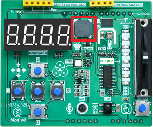     


## Example5 RGB LED   
**Pins to be used:**   
1. Red RGB LED: 23(Wiringpi) or 13(BCM)  
2. Green RGB LED: 24(Wiringpi) or 19(BCM)  
3. Blue RGB LED: 26(Wiringpi) or 12(BCM)  

**Schematic diagram:**       
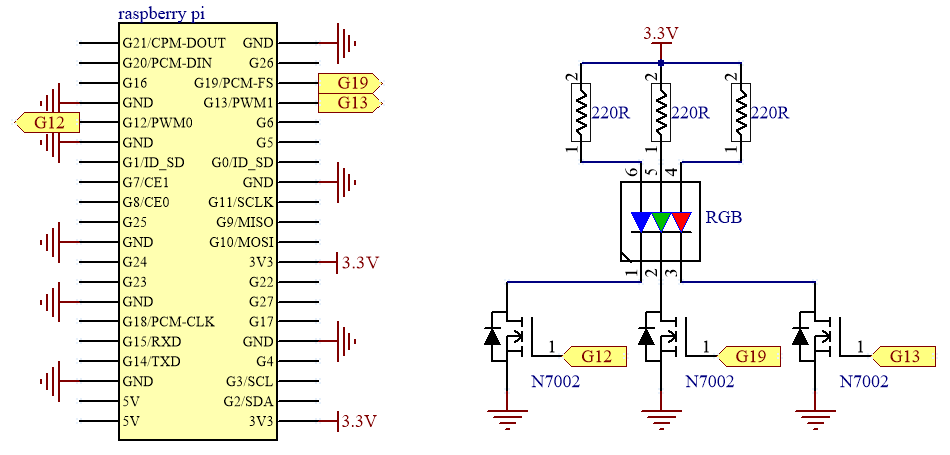    

**Demonstration:**       
Run the following command on the terminal:       
```
cd ~/Mosiwi-basic-learning-kit/pi4/c/examples/2.2.0_Buzzer/     
chmod 777 buzzer     
sudo ./buzzer
```
After uploading the code, the buzzer on the expansion board will keep beeping with a fixed frequency and different volumes.       
     


## Example6 Fan   
**Pins to be used:**   
1. S1(INB): 23(Wiringpi) or 13(BCM)  
2. S2(INA): 24(Wiringpi) or 19(BCM)  

**Schematic diagram:**       
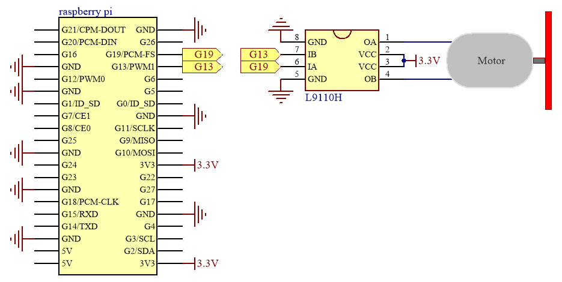    

**Wiring diagram:**   
     

**Demonstration:**       
Run the following command on the terminal:       
```
cd ~/Mosiwi-basic-learning-kit/pi4/c/examples/2.8.0_Fan_PWM/     
chmod 777 fan_pwm     
sudo ./fan_pwm
```
The fan rotates clockwise and counterclockwise, and the speed changes from small to large, and then from large to small.       
     
More info: [Fan module](../../../outsourcing/O1M0001_fan_module/O1M0001_fan_module.md)    

## Example7 Potentiometer      
**Pins to be used:**   
1. SDA: 8(Wiringpi) or 2(BCM)  
2. SCL: 9(Wiringpi) or 3(BCM)   

**Schematic diagram:**       
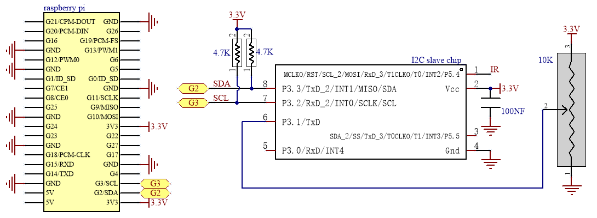    
Note: The I2C slave chip is integrated on the [3in1 Basic learning shield](../../../common_product/C1E0000_3in1_basic_learning_shield/C1E0000_3in1_basic_learning_shield.md#io-expand) board to process the data of the potentiometer.      

**Demonstration:**       
Run the following command on the terminal:       
```
cd ~/Mosiwi-basic-learning-kit/pi4/c/examples/1.3.0_Analog_sr/     
chmod 777 analog_sr     
sudo ./analog_sr
```
Push the potentiometer up and down, and the terminal prints the corresponding analog value and voltage value.          
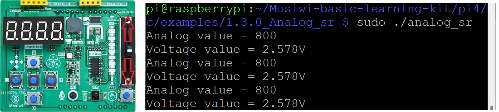     
<span style="color: rgb(255, 76, 65);">Note: Raspberry Pi4 reads the analog value of the potentiometer through the I2C expansion chip on the "3in1_basic_learning_shield".</span>         

## Example8 Microphone      
**Pins to be used:**   
1. SDA: 8(Wiringpi) or 2(BCM)  
2. SCL: 9(Wiringpi) or 3(BCM)   

**Schematic diagram:**       
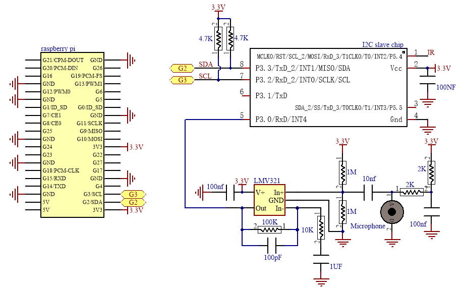    
Note: The I2C slave chip is integrated on the [3in1 Basic learning shield](../../../common_product/C1E0000_3in1_basic_learning_shield/C1E0000_3in1_basic_learning_shield.md#io-expand) board to process the data of the microphone.      

**Demonstration:**       
Run the following command on the terminal:       
```
cd ~/Mosiwi-basic-learning-kit/pi4/c/examples/2.3.0_Microphone/     
chmod 777 microphone     
sudo ./microphone
```
After running the code, the terminal prints the analog value of the amplified sound and the voltage value.        
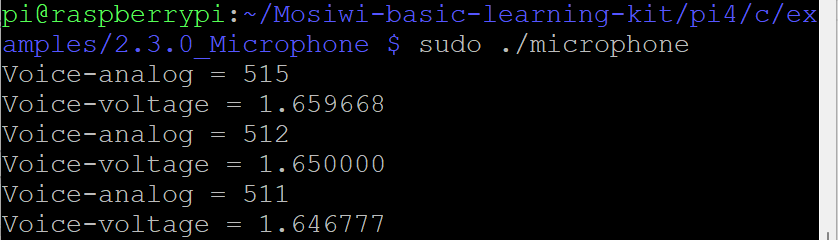     
<span style="color: rgb(255, 76, 65);">Note: Raspberry Pi4 reads the analog value of the microphone through the I2C expansion chip on the "3in1_basic_learning_shield".</span>        


## Example9 Ultrasonic     
**Pins to be used:**   
1. S1(echo of ultrasonic): 23(Wiringpi) or 13(BCM)  
2. S2(trig of ultrasonic): 24(Wiringpi) or 19(BCM)  

**Schematic diagram:**       
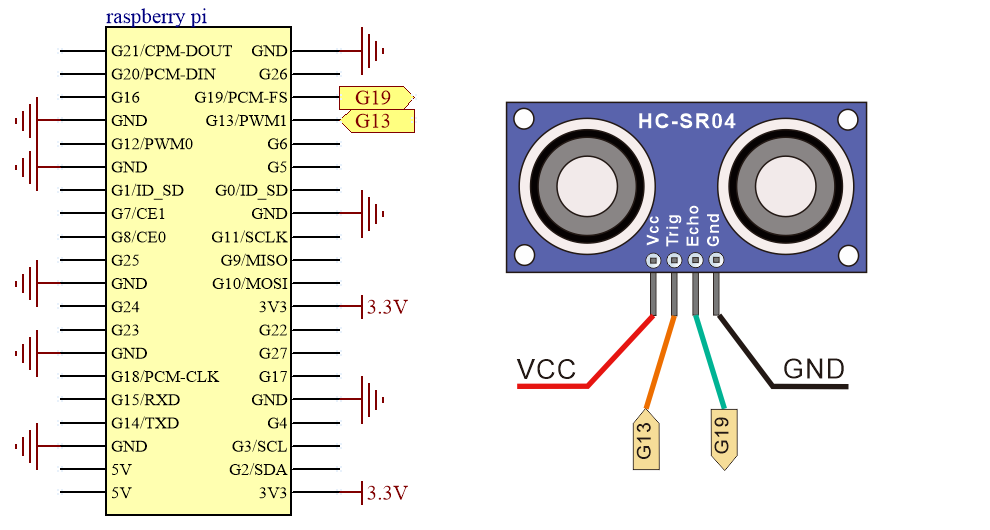    

**Wiring diagram:**   
     

**Demonstration:**       
Run the following command on the terminal:       
```
cd ~/Mosiwi-basic-learning-kit/pi4/c/examples/2.7.0_Ultrasonic/     
chmod 777 ultrasonic     
sudo ./ultrasonic
```
After the code is uploaded, the obstacle is placed in front of the ultrasonic sensor, and the distance measured by the ultrasonic sensor is printed at the terminal.         
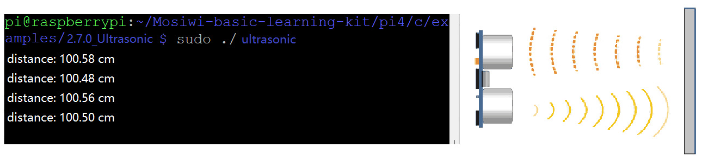     
More info: [Ultrasonic sensor](../../../outsourcing/O1M0000_ultrasonic_module/O1M0000_ultrasonic_module.md)      


## Example10 Led-strip      
**Pins to be used:**     
Led-strip
1. DS: 0(Wiringpi) or 17(BCM)    
2. SH_CP: 2(Wiringpi) or 27(BCM)      
3. ST_CP: 3(Wiringpi) or 22(BCM)  

Microphone
1. SDA: 8(Wiringpi) or 2(BCM)  
2. SCL: 9(Wiringpi) or 3(BCM)   

**Wiring diagram:**      
Led-strip
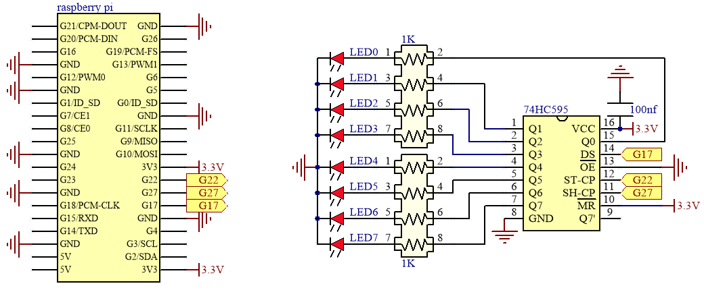     

Microphone
    
Note: The I2C slave chip is integrated on the [3in1 Basic learning shield](../../../common_product/C1E0000_3in1_basic_learning_shield/C1E0000_3in1_basic_learning_shield.md#io-expand) board to process the data of the microphone.      


**Demonstration:**       
Run the following command on the terminal:       
```
cd ~/Mosiwi-basic-learning-kit/pi4/c/examples/2.1.2_Led_strip/     
chmod 777 led_strip     
sudo ./led_strip
```
The more you push the slide resistor up, the more LEDs are turned on; the more you push the slide resistor down, the more LEDs are turned off.    
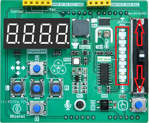     


## Example11 Thread    
**Pins to be used:**   
1. Red RGB LED: 23(Wiringpi) or 13(BCM)    

**Demonstration:**       
Run the following command on the terminal:       
```
cd ~/Mosiwi-basic-learning-kit/pi4/c/examples/1.6.0_Thread/     
chmod 777 thread     
sudo ./thread
```
The red LED lights on the expansion board are lit at one-second intervals.      
     


## Example12 Digital_tube_Keyboard       
**Pins to be used:**         
1. MISO: 13(Wiringpi) or 9(BCM)  
2. MOSI: 12(Wiringpi) or 10(BCM)
3. CLK: 14(Wiringpi) or 11(BCM)  
4. KEY-INT: 21(Wiringpi) or 5(BCM)

**Wiring diagram:**      
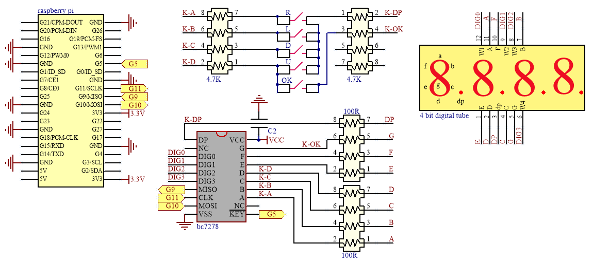     

**Demonstration:**       
Run the following command on the terminal:       
```
cd ~/Mosiwi-basic-learning-kit/pi4/c/examples/1.8.0_Digital_tube_Button_spi/     
chmod 777 digital_tube_button_spi     
sudo ./ldigital_tube_button_spi
```
The 4-bit digital display tube displays "16.0" when the "U" key is pressed; "8.0" is displayed when the "D" key is pressed; "4.0" is displayed when the "L" key is pressed; "2.0" is displayed when the "R" key is pressed. Displays "1.0" when the "OK" key is pressed.    
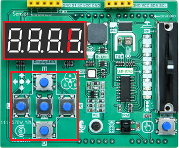     

| U | D | L | R | OK |    
| :--: | :--: | :--: | :--: | :--: |    
| 16 | 8 | 4 | 2 | 1 |        

<span style="color: rgb(255, 76, 65);">Note: The 4-bit 8-segment digital tube and 5 keys on the "Basic learning shield" occupy pins 5(key trigger signal output), 10(MOSI), 9(MISO) and 11(CLK) of the Pi4, and the CS control pin is not required.</span>     


## Example13 Ir-receiver      
**Pins to be used:**   
1. SDA: 8(Wiringpi) or 2(BCM)  
2. SCL: 9(Wiringpi) or 3(BCM)   

**Schematic diagram:**       
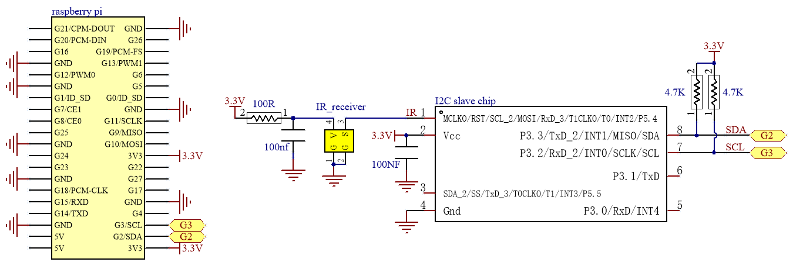            
Note: The I2C slave chip is integrated on the [3in1 Basic learning shield](../../../common_product/C1E0000_3in1_basic_learning_shield/C1E0000_3in1_basic_learning_shield.md#io-expand) board to process the data of the infrared receiving sensor.      

**Demonstration:**       
Run the following command on the terminal:       
```
cd ~/Mosiwi-basic-learning-kit/pi4/c/examples/2.6.0_IRrecvDemo/     
chmod 777 ir_recvDemo     
sudo ./ir_recvDemo
```
When the infrared remote controller presses the button, point to the infrared receiver on the expansion board, and the terminal will print the button value.        
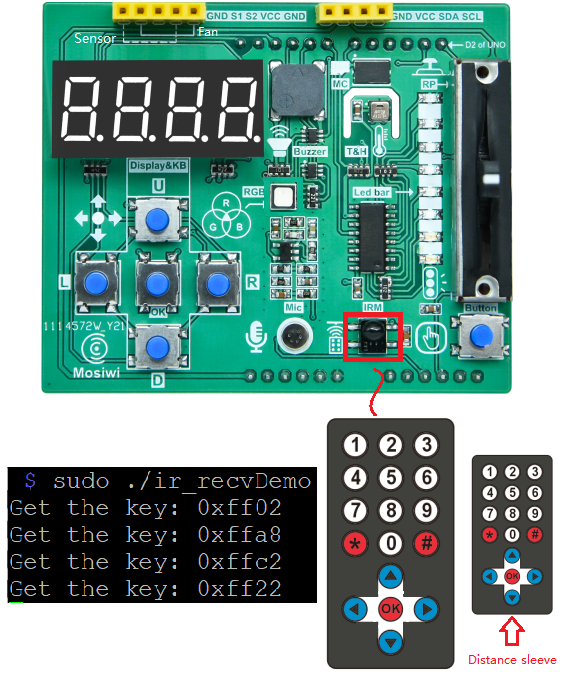     

Pi4 will get 2 bytes of data, the first byte is the inverse code of the address of the infrared remote control device, and the second byte is the command code of the infrared remote control device.      
    
```   
data: 65432 = 0xff98

Device inverse code:  
0xff = 0b11111111 = 255    

Device code:    
0x00 = 0b00000000 = 0        
```

<span style="color: rgb(255, 76, 65);">Note: Raspberry Pi4 reads the value of the Ir-receiver through the I2C expansion chip on the "3in1_basic_learning_shield".</span>        


## Example14 Thermohygrometer      
**Pins to be used:**      
AHT20
1. SDA: 8(Wiringpi) or 2(BCM)  
2. SCL: 9(Wiringpi) or 3(BCM)   

Display
1. MISO: 13(Wiringpi) or 9(BCM)  
2. MOSI: 12(Wiringpi) or 10(BCM)
3. CLK: 14(Wiringpi) or 11(BCM)  
4. KEY-INT: 21(Wiringpi) or 5(BCM)

**Schematic diagram:**       
AHT20     
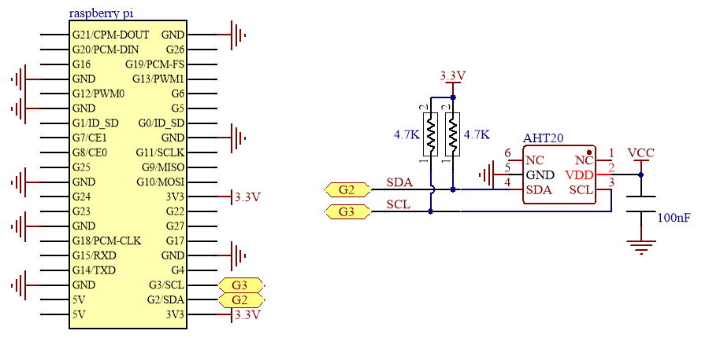            

Display
     

**Demonstration:**       
Run the following command on the terminal:       
```
cd ~/Mosiwi-basic-learning-kit/pi4/c/examples/2.5.0_Thermohygrometer/     
chmod 777 thermohygrometer     
sudo ./thermohygrometer
```
The 4-digit digital tube displays the temperature and humidity in a cycle with a period of 10 seconds.      
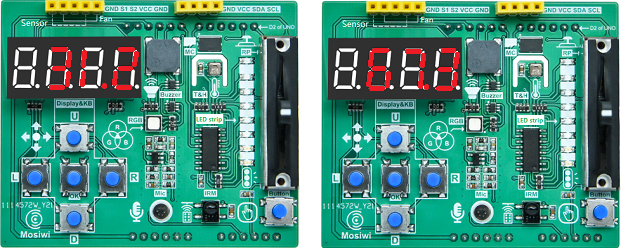     


## Example15 EEPROM      
**Pins to be used:**   
1. EEPROM: 27(Wiringpi) or 16(BCM)   

**Schematic diagram:**       
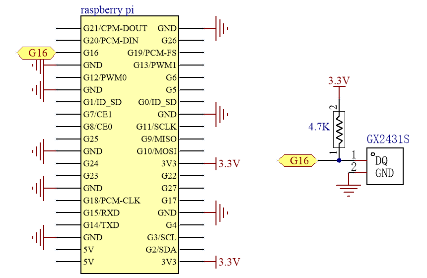            

**Demonstration:**       
Run the following command on the terminal:       
```
cd ~/Mosiwi-basic-learning-kit/pi4/c/examples/2.4.0_EEPROM_ReadWriteSkip/     
chmod 777 eeprom_ReadWriteSkip     
sudo ./eeprom_ReadWriteSkip
```
1. Read 128 bytes of EEPROM data.        
2. Write 8 bytes of data to EEPROM.
3. Read 128 bytes of EEPROM data.       
4. The 8-byte data written to EEPROM is read back and converted to the character: \<Mosiwi\>     

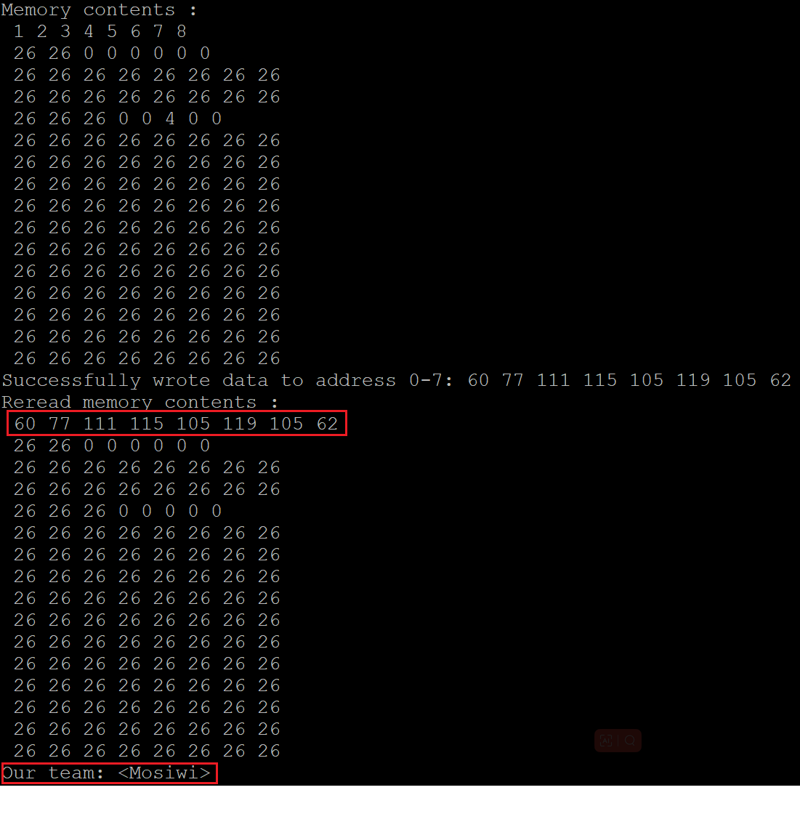     


## Example16 Smart fan      
**Demonstration:**       
Run the following command on the terminal:       
```
cd ~/Mosiwi-basic-learning-kit/pi4/c/examples/2.8.2_Intelligent_fan/     
chmod 777 intelligent_fan     
sudo ./intelligent_fan
```
This is an intelligent fan with temperature control mode and remote control mode.    
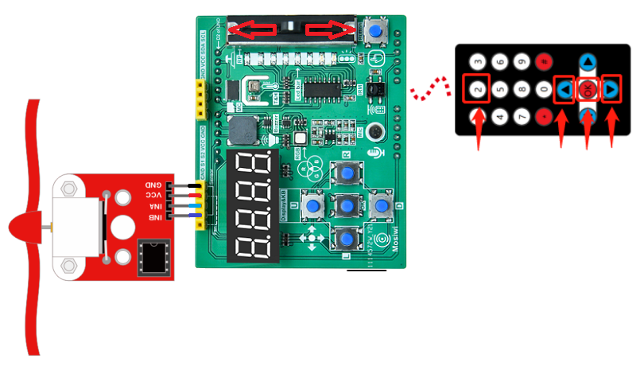     

Function of infrared remote control button:    
1. 2: Turn on and off temperature control mode    
2. ▲: Fan speed plus   
3. ▼: Fan speed minus    
4. OK: Turn on and off fan      

RGB LED function Tips:   
1. If the light is red, the fan is turned on; otherwise, the fan is turned off.          
2. If the light is green, the fan is turned on; otherwise, the fan is turned off.            

Special Notes:
1. When the temperature mode is opened, the fan will start automatically when the temperature is higher than 35 degrees; It will automatically turn off when it is below 16 degrees. If the temperature returns to 16-35 degrees, you can turn on or off the fan through the remote control.   
2. The fan speed can be controlled by remote control in both temperature control mode and remote control mode.    


**End!**    
  