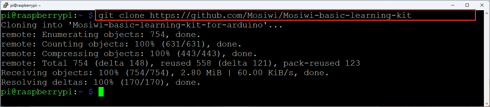
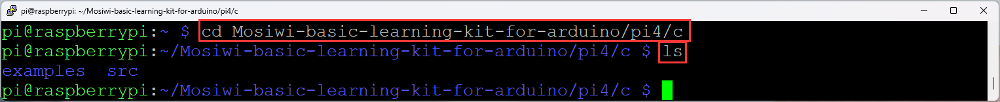
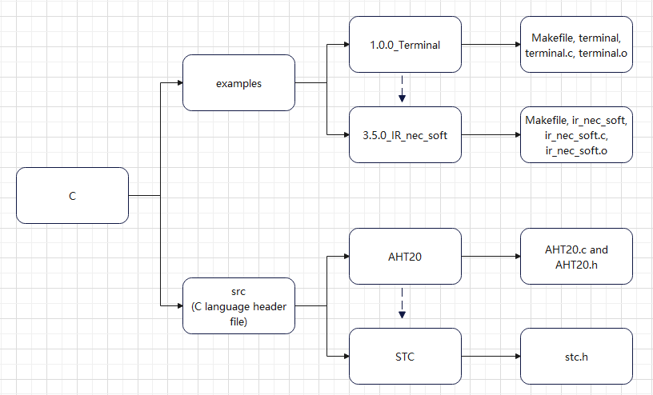
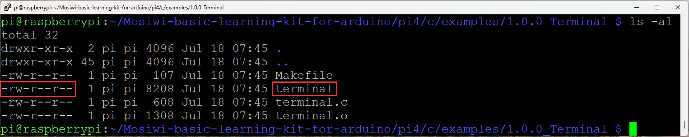
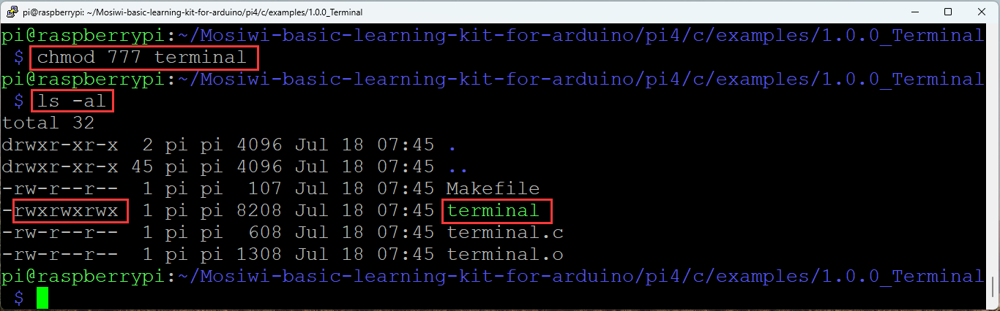
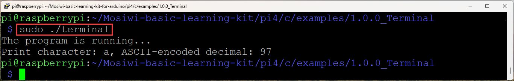
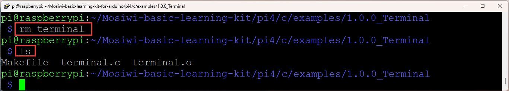

# C-language for Raspberry pi4    
This tutorial is based on the [C1K0001 4in1 basic learning kit](../../C1K0000_4in1_basic_learning_kit/C1K0000_4in1_basic_learning_kit.md).     

## Prepared knowledge
**Raspberry pi4 basics**     
If you don't have Raspberry pi4 basics, you can follow the link to learn the basics: [Click Me](../../../raspberry/R1D0000_raspberry_pi4/R1D0000_raspberry_pi4.md)      

**Install the GPIO library**
1. Install the [Wiringpi](../../../raspberry/wiringpi/wiringpi.md)   
2. Install the [BCM2835](../../../raspberry/bcm2835/bcm2835.md)      

**Download sample code**   
[Login to Raspberry pi4 using PUTTY](../../../raspberry/R1D0000_raspberry_pi4/R1D0000_raspberry_pi4.md#Remote-Access), then use the following command to download the sample code:      
```   
git clone https://github.com/Mosiwi/Mosiwi-basic-learning-kit-for-arduino     
```    
    

The file in the "**Mosiwi-basic-learning-kit-for-arduino -> pi4 -> c**" folder is the sample code：           
```
cd Mosiwi-basic-learning-kit-for-arduino/pi4/c

ls
```
    

Document architecture:   
      
1. If you are a newbie, the files in the "**src**" folder are not recommended to modify them, which may cause the code in the "**examples**" folder to compile incorrectly.    
2. Each example folder contains a "Makefile", "xxx.o", and "xxx.c" files, as well as an execution file.     
3. The "xxx.o" and execution files are generated from the "Makefile" file.    
4. If you are a newbie, it is not recommended to modify the contents of the "Makefile" and the name of the "xxx.c" file, which may cause compilation errors.    
5. If the content of the xxx.c file is modified, you need to compile it again to generate an executable file.    
```
sudo make
```
6. Run the execution file with the following command:   
```
sudo ./xxx
```

## Basic Example: Terminal    
**Objective:**       
1. Run the sample code.   
2. Recompile the sample code. 
3. Modify and recompile the sample code.      

**Objective_1:**       
Terminal into the **"1.0.0_Terminal"** folder:    
```
cd ~/Mosiwi-basic-learning-kit-for-arduino/pi4/c/examples/1.0.0_Terminal/    
```
Permission to view execution files:   
```
ls -al   
```
      
r: Read permission. &ensp;&ensp; w: Write permission. &ensp;&ensp; x: Execute permission.     

If the file does not have execution permissions as shown in the figure above, you need to add execution permissions:    
```
chmod 777 terminal   

ls -al   
```
     

Run the compiled sample code:     
```
sudo ./terminal     
```
      

**Objective_2:** 
Delete the latest executable file and then view the files in the folder:     
```
rm terminal   
    
ls   
```
     

The "terminal" executable is no longer visible from the image above, now re-run the "Makefile" file to generate the executable "terminal" file.    
```
sudo make  

ls   
```
      

**Objective_3:**    
Edit the sample code using the [nano tool](https://www.nano-editor.org/) that comes with the Raspberry PI system:  
```
sudo nano terminal.c   
```
When the editing is complete, save the file by typing the following command on the keyboard and exit the nano editor:  
```terminal
Ctrl+O
Ctrl+C
```
Recompile the "terminal.c" source file:   
```
sudo make  
  
ls
```
      


## Wiring diagram   
Turn off the Raspberry PI and connect the Raspberry PI to the expansion board with a 40P color cable:    

Then restart Raspberry PI and TUTTY.     

## Example1:    
...

**End!**    
  


