# C1K0001_4x4x4led_cube_kit

## Overview
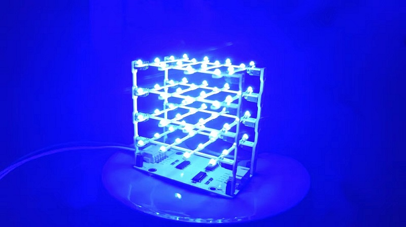  
This is a very interesting light cube that can be used for learning programming or as an ambient light. When used for learning programming, <span style="color: rgb(255, 76, 65);">we provide rich sample code such as Arduino, Raspberry pi 4B, Micro:bit, and Raspberry pi pico</span>. This light cube also has an excellent feature, which is that multiple light cubes can be connected together in series, and they can be controlled simultaneously or independently using the MCU.    
<span style="color: rgb(255, 76, 65);">(No welding, can be assembled in 10 minutes.)</span>   

## Specification  
1. Operating Voltage: 3.3 to 5V  
2. Operating Current: Max 220mA/1pcs  
3. Interface: 3-Wire or SPI  
4. Lighting frequency: ≥ 50Hz  
5. Weight: about ?g  
6. Dimensions: 79\*79\*85.4mm  

## List
| PCB cube | Acrylic cube | HX-2.54 4P to male duport wire | HX-2.54 4P to female duport wire |
| :--: | :--: | :--: | :--: |
| 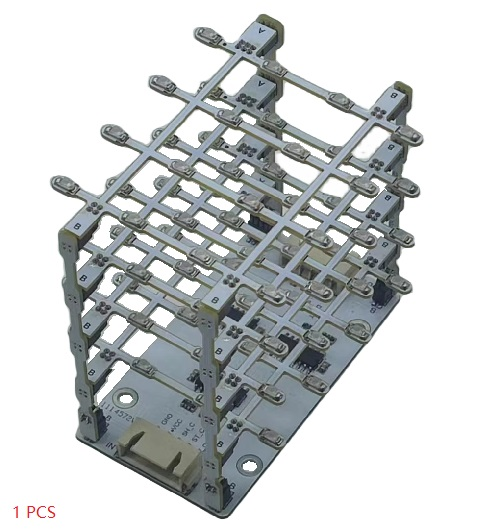 | 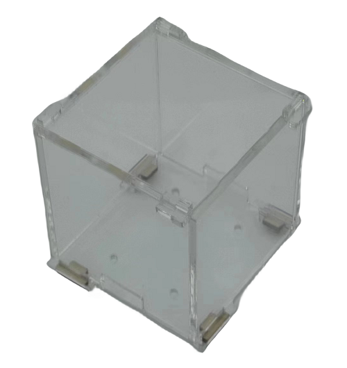 | 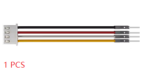 | 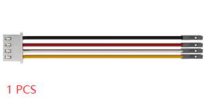 |    
| HX-2.54 4P duport wire | M3\*8mm flat-head screw | M3 nuts |  |    
| 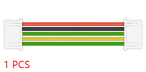 | 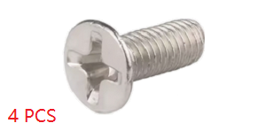 | 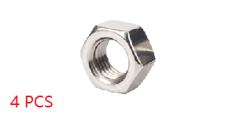 |  |   

## Assembly steps        
Please refer to: [Link]()  

## Series method  
If you have multiple cubes, you can string them together as follows.    
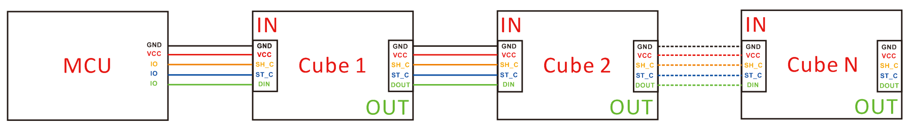    
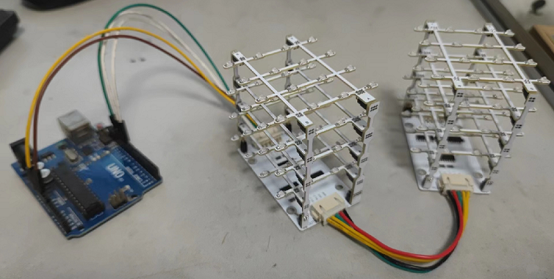

## Download library file
This library package is available for Arduino: UNO and NANO, Raspberry pi 4B, and Raspberry pi pico.  
Download resource: <https://github.com/mosiwi/Mosiwi-4x4x4cube>  
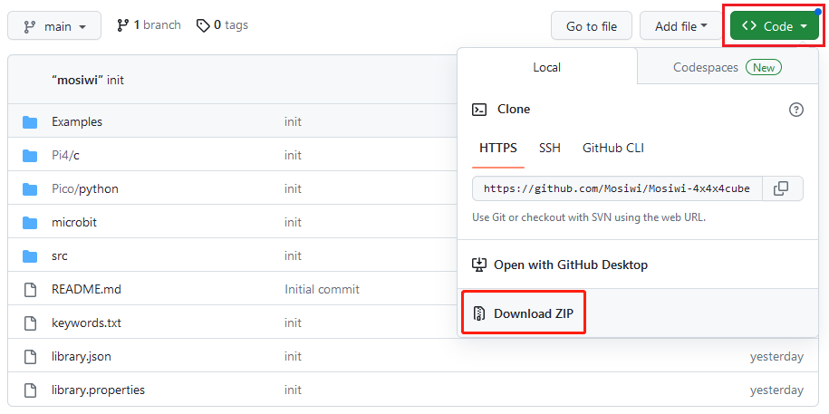  
For Arduino UNO and NANO: C++ && C_language  
For Raspberry pi4: C_language    
For Raspberry pi pico: Python    

## For Arduino    
**Arduino basics  (Important):**  
If you don't have Arduino basics, you can follow the link to learn the basics: [Click Me](../../arduino/A1D0000_uno_r3/A1D0000_uno_r3.md)  

**Wiring diagram:**  
|  UNO or nano  |   Cube   |  
|      :--:     |   :--:   |  
|   5V or 3V3   |   VCC    |  
|      GND      |   GND    |  
|      13       |   SH_C   |  
|      10       |   ST_C   |  
|      11       |   DIN    |  

**Install the Arduino library file:**  
Load the "Mosiwi-4x4x4cube.zip" file downloaded above into the arduino IDE:          
       
Select the compressed library file to load:       
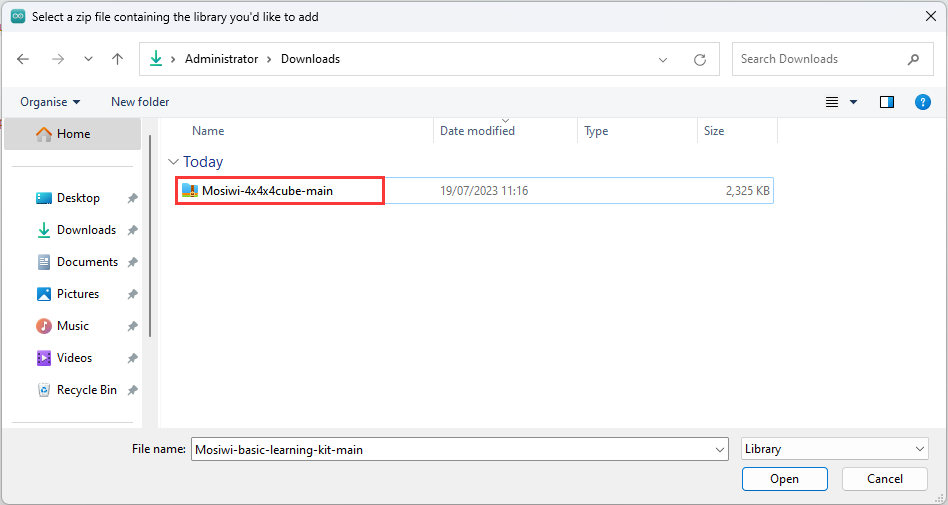

For other methods, see (Option): <https://www.arduino.cc/en/Guide/Libraries>      

**Use the example code in the library file:**    
If you have successfully loaded the library file, you can open the sample code in the library file in the arduino IDE as follows.   
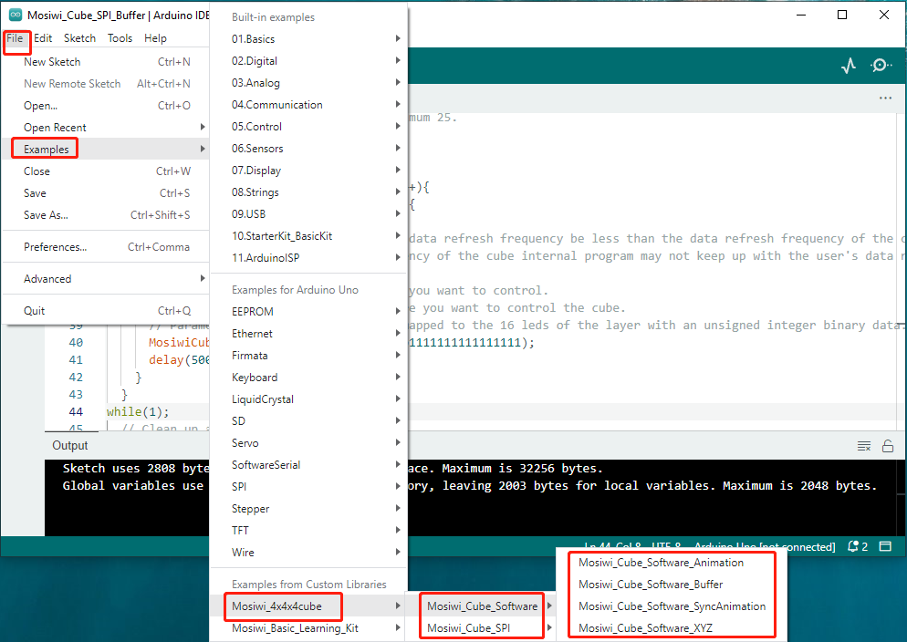   

After opening the sample, select the "Arduino UNO" or "Arduino nano" development board, then select the COMx port, and then upload the code to the development board.  

## For Raspberry pi pico    
**Pico and Thonny basics (Important):**        
If you don't have Pico and Thonny basics, you can follow the link to learn the basics: [Click Me](../../raspberry/R1D0001_raspberry_pico/R1D0001_raspberry_pico.md)  
 
**Wiring diagram:**   
|      pico     |   Cube   |  
|      :--:     |   :--:   |   
|  VBUS or 3V3  |   VCC    |  
|      GND      |   GND    |  
|      18       |   SH_C   |  
|      17       |   ST_C   |  
|      19       |   DIN    |   

**Use the pico example code in the library file:**        
Unzip the "Mosiwi-4x4x4cube.zip" file you downloaded above:            
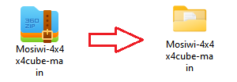        

Open one of the sample code as follows.  
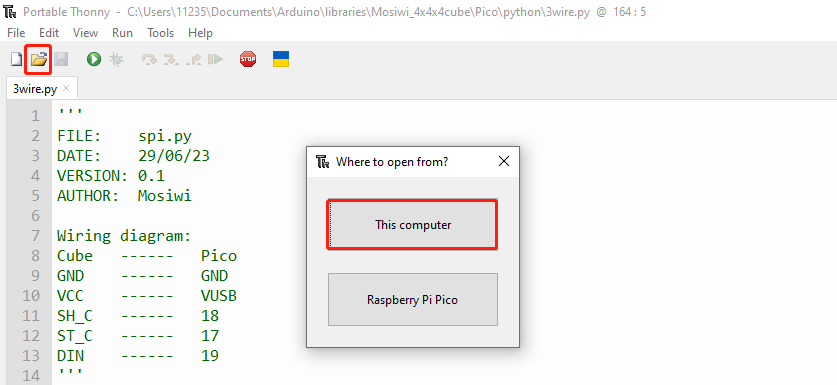   
   
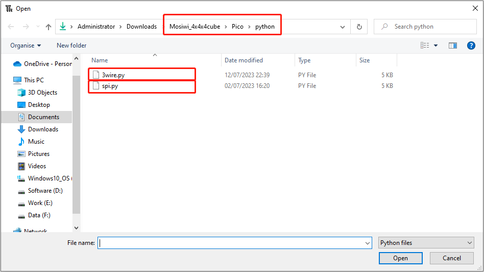   

Run the code online. (The code is not saved in pico and is not executed after repowering.)    
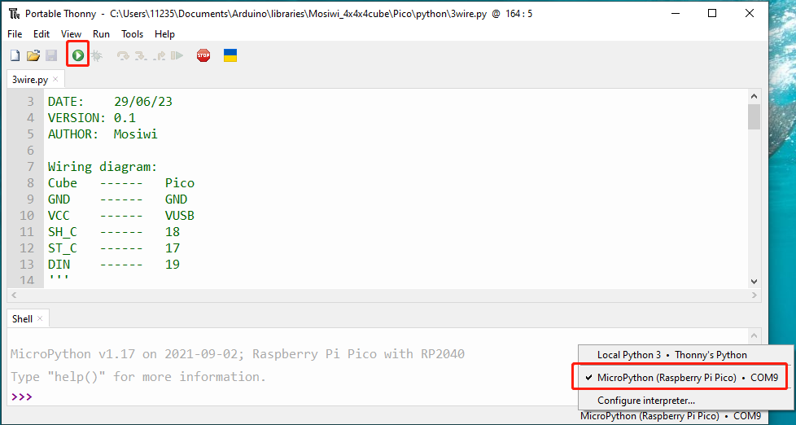

Run the code offline. (The code is stored in pico, and the code in pico is automatically executed after being powered on.)   
| 1 | 2 | 3 |
|:---:|:---:|:---:|
| 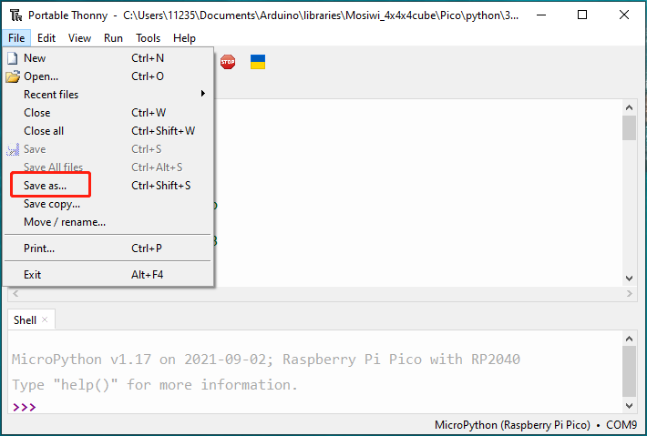 | 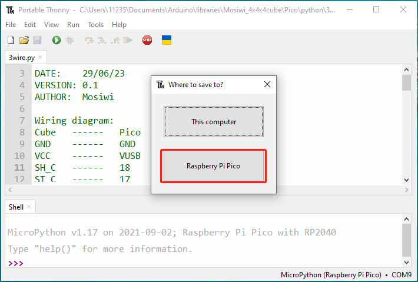 |  |


## For Raspberry pi4    
**Pi4 basics (Important):**   
If you don't have Pi4 basics, you can follow the link to learn the basics: [Click Me](../../raspberry/R1D0000_raspberry_pi4/R1D0000_raspberry_pi4.md)  
Install the GPIO library for Raspberry pi4 (<span style="color: rgb(255, 76, 65);">Necessary condition</span>):                 
1. Install the [Wiringpi](../../raspberry/wiringpi/wiringpi.md)   
2. Install the [BCM2835](../../raspberry/bcm2835/bcm2835.md)     

**Wiring diagram:**   
| pi4(Wiringpi) |   pi4(BCM)    |   Cube   |  
|     :--:      |      :--:     |   :--:   |    
|   5V or 3V3   |   5V or 3V3   |    VCC   |  
|      GND      |    GND        |    GND   |  
|      14       |    GPIO 11    |    SH_C  |  
|      10       |    GPIO 8     |    ST_C  |  
|      12       |    GPIO 10    |    DIN   |  

**Get source code:**    
Method 1.   
Use **WinSCP** to upload the downloaded library file to Raspberry Pi4: [Link](../../raspberry/R1D0000_raspberry_pi4/R1D0000_raspberry_pi4.md#transfer-files-from-your-pc-to-raspberry-pi-4)     

Method 2.     
Open the Raspberry pi4 or [Git](https://git-scm.com/) terminal and run the following command to download it from github.     
```    
 git clone https://github.com/mosiwi/Mosiwi-4x4x4cube    
```   
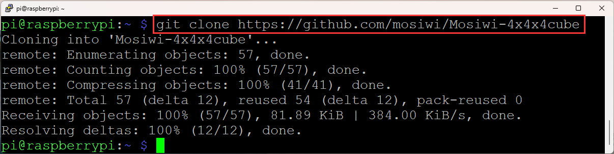           
(Terminal of Raspberry pi4)

**Add execute permissions for the files:**     
```
 cd ~/Mosiwi-4x4x4cube/Pi4/c/examples/3wire/
 sudo chmod 777 cube Makefile

 cd ~/Mosiwi-4x4x4cube/Pi4/c/examples/spi/
 sudo chmod 777 cube Makefile
```


**Run code:**     
3wire example.      
```   
cd ~/Mosiwi_4x4x4cube\Pi4\c\examples\3wire    

sudo ./cube   
```   

SPI example.     
```   
cd ~/Mosiwi_4x4x4cube\Pi4\c\examples\spi   

sudo ./cube   
```   

If you update the execution file or modify the source code, you need to recompile the code.     
```   
sudo make    
```   


## For Micro:bit   
**Microbit basics (Important):**   
If you don't have microbit basics, you can follow the link to learn the basics: [Click Me](../../microbit/M1D0000_microbit_mainboard/M1D0000_microbit_mainboard.md)  

**Wiring diagram:**  
|    Microbit   |   Cube   |  
|      :--:     |   :--:   |   
|      3V       |   VCC    |  
|      GND      |   GND    |  
|      13       |   SH_C   |  
|      16       |   ST_C   |  
|      15       |   DIN    | 

**Create a new project:**    
Open the link to create a new online project: <https://makecode.microbit.org>     
  

**Load extension library:** 
  

Fill in the link on the right in the search field to search for extension packs: <https://github.com/Mosiwi/Mosiwi-4x4x4Cube-for-microbit>     
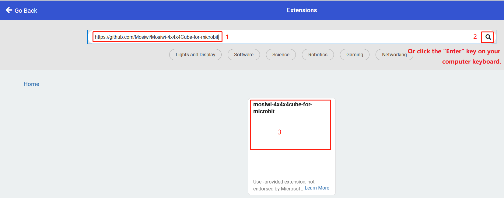    
Wait for the loading of the library. After the loading is successful, the following figure is shown:   
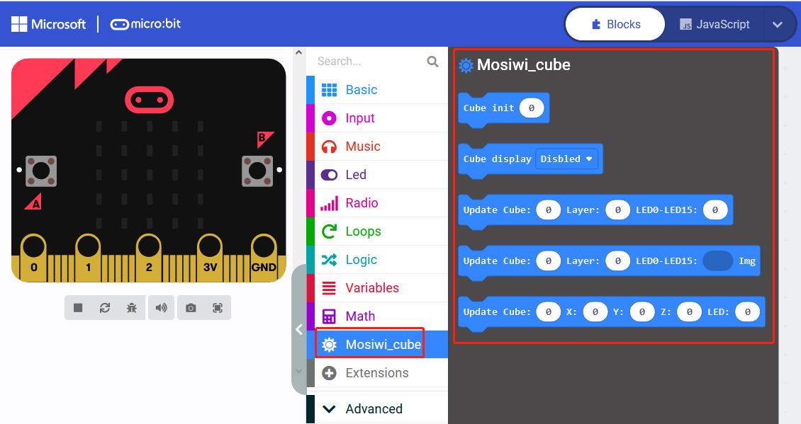    

**Block code parsing:**         
1. Initialize and enable   
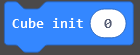    
Initializes the total number of concatenated cubes. A maximum of 3 cubes can be concatenated.     
      
Enable all cubes to be concatenated.     
Usage:  
         

2. Light up some leds in the cube by converting a base-2 number to a base-10 number.    
        
Cube: Select a cube in all concatenations. The value can be 0 to 3.     
Layer: Select a layer in the cube. The value can be 0 to 3.   
LED0-LED15: The 16 leds in one layer are mapped to a 16-bit binary number: 0bxxxxxxxxxxxxxxxx. Convert to a decimal number from 0 to 65535.    

3. Light a layer of leds through images.   

Cube: Select a cube in all concatenations. The value can be 0 to 3.      
Layer: Select a layer in the cube. The value can be 0 to 3.   
LED0-LED15: A 5\*5 lattice image uses only its 4\*4 lattice.   
Usage:  
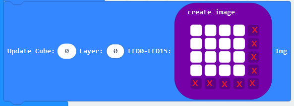        
"x": invalid      

4. Light an LED in the cube through the coordinates.   
      
Cube: Select a cube in all concatenations. The value can be 0 to 3.        
X, Y, Z: 0 to 3. 
LED: 0 or 1, 0: OFF, 1: ON.  
 


## Internal operating principle (Option)     
**schematic diagram**      
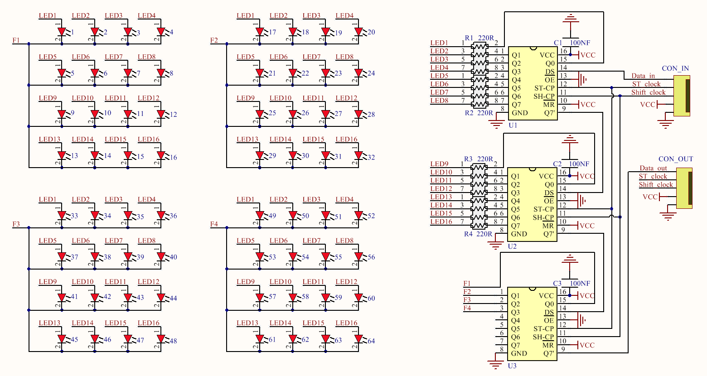     
The light cube has 4 layers (F1, F2, F3, F4), each layer has 16 leds with common cathode wiring, which are controlled by 3 74HC595 serial to parallel data chips. Use the MCU's timing interrupt function to turn on and off the leds in each layer (frequency ≥50Hz) to achieve control of all the leds in the cube.    

**Communication data format**    
A data stream:   
| LEDs | LEDs | Layers |  
| :--: | :--: |  :--:  | 
| 16-15-14-13-12-11-10-9 | 8-7-6-5-4-3-2-1 | F1-F2-F3-F4-1-1-1-1 |   
| D0-D1-D2-D3-D4-D5-D6-D7 | D0-D1-D2-D3-D4-D5-D6-D7 | D0-D1-D2-D3-1-1-1-1 |  

"Dx": 0 or 1.  

A data stream entry protocol:  
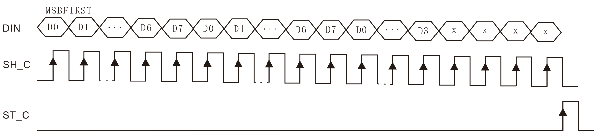  
DIN  = Data_in  
ST_C = ST_clock  
SH_C = Shift_clock, the recommended frequency is less than 25MHz.  

**Timing display format**  
A cube:  
|      t        |      t        |      t        |      t        |      t        |      ....     |      t        |      ....     |  
|     :--:      |     :--:      |     :--:      |     :--:      |     :--:      |      :--:     |     :--:      |      :--:     |  
|    Laye 4     |    Laye 3     |    Laye 2     |    Laye 1     |    Laye 4     |      ....     |    Laye 1     |      ....     |  
| A data stream | A data stream | A data stream | A data stream | A data stream |      ....     | A data stream |      ....     |  

t: MCU timer interrupt time.  
Cube display frequency: It must be ≥ 50Hz, f = 1s/(t \* 4)  

Series multiple cubes:   
|      T        |      T        |     ....      |      T        |      T        |       T       |      ....     |  
|     :--:      |     :--:      |     :--:      |     :--:      |     :--:      |      :--:     |      :--:     |  
|    Cube N     |   Cube N-1    |     ....      |    Cube 2     |    Cube 1     |     Cube N    |      ....     |  

T: The MCU timer displays the time of a cube, T = (t\*4).  
Cube display frequency: It must be ≥ 50Hz, f = 1s/(T \* N)   

**End!**    
