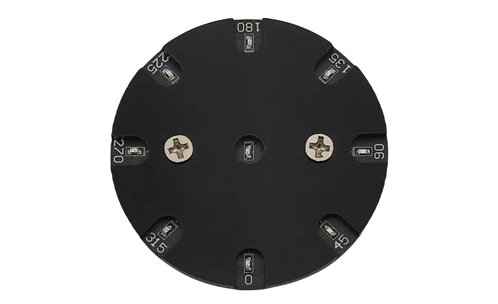
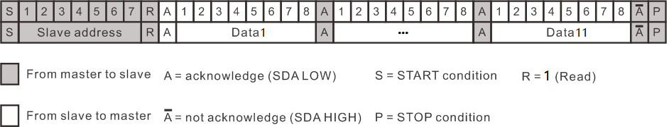

# C1S0000_light_sensor

## Overview
     
This sensor detects the intensity of the light and the relative angle of the light source.      

## Specification    
• Operating voltage: 3.0V-5.0V   
• Operating current: < 15mA 
• Light angle value: 0°-337.5°, 0xffff(Directly above)   
• Light angle accuracy: +/- 22.5°
• Light intensity value: Just the relative analog voltage value of the light intensity.
• Communication: IIC 
• Connector: XH2.54-4P  
• Size: 64\*64\*10mm    

## IIC communication   
Protocol:    
        
<span style="color: rgb(255, 76, 65);">Maximum clock speed: 100K</span> 

| Slave address | 1: 0 | ... | 8: 315 | 9: Centre | 10: H_Angle | 11: L_Angle |    
| :--: | :--: | :--: | :--: | :--: | :--: | :--: |    
| 0x2c | 0-255 | ... | 0-255 | 0-255 | 0-255 | 0-255 |           
   
Light angle value: H_angle*256 + L_angle, if it is 0xffff, the light source is directly above.   

The standard I2C communication protocol can be referred to: [Link](../../_static/pdf/communication_protocol/UM10204%28I2C_Bus_Specification_and_User_Manual_%29.pdf)  


## Sample code     
For [Raspberry pi Pico](../../raspberry/R1D0001_raspberry_pico/R1D0001_raspberry_pico.md) (MicroPython)     
```microPython
# https://docs.micropython.org/en/latest/rp2/quickref.html
import time
from machine import Pin, I2C 

"""
Wiring: 
Pico         Sensor
GND          GND
VCC          3V3 
GP4          SDA 
GP5          SCL 
"""

class Ph_iic:
    address = 0x2c
    data = [0,0,0,0,0,0,0,0,0,0,0]
    
    def __init__(self, scl=5, sda=4):
        self.i2c = I2C(0, scl=Pin(5), sda=Pin(4), freq=100_000)
    
    def read(self):
        buf = bytearray(11)
        self.i2c.readfrom_into(self.address, buf)
        for i in range(11):
            self.data[i] = buf[i]
    
    # Read the directional value of the light.
    # resolution ratio: 22.5degree
    # return: 22.5*i, i=0--15
    def readDegree(self):
        self.read();
        return self.data[9]*256+self.data[10]
    
    # index: 0--8, Map to 9 light-sensitive sensors on the module.
    def readPh(self, index):
        self.read();
        return self.data[index]

if __name__ == '__main__':
    ph = Ph_iic()

    while True:
        ph.read()
        print(ph.data)
        # print(ph.readPh(8))
        # print(ph.readDegree())
        time.sleep_ms(200)
```


## Application example    
[R1K0000_space_station_kit_for_pico](../../raspberry/R1K0000_space_station_kit/R1K0000_space_station_kit.md)     

