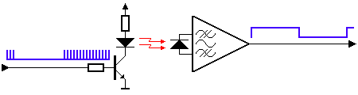
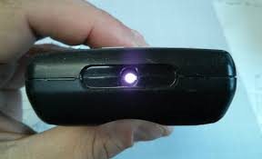

# C1S0001_ir_receiver
       

## Specification    
• Operating voltage: 3.0V-5.0V   
• Operating current: < 15mA 
• Light angle value: 0°-337.5°, 0xffff(Directly above)   
• Light angle accuracy: +/- 22.5°
• Light intensity value: Just the relative analog voltage value of the light intensity.
• Communication: IIC 
• Connector: XH2.54-4P  
• Size: 30\*23.2mm     
• Hole distance: 16mm

## How the module works    
An [IR remote control](../../outsourcing/nec_ir_remote_control/nec_ir_remote_control.md) and receiver communicate with each other by transmitting and decoding a signal in the form of pulsed IR radiation.       
      

Infrared radiation (IR), or infrared light, is a type of electromagnetic radiation with wavelengths ranging from 700 nm to 1 mm. Because humans can only see light with wavelengths of roughly 400 (violet) to 700 (red) nanometers, IR radiation is invisible to the human eye.     
     
Since IR transmission is a wireless protocol based on a type of light, it requires a clear line of sight between the transmitter (the remote) and the receiver. This means it can’t transmit through walls or ceilings, unlike WiFi or Bluetooth.     

**IR communication basics:**   
Unfortunately, the IR LED in your remote is not the only source of IR radiation. Any object that has a temperature also radiates in the infrared spectrum. This phenomenon is also used by thermal cameras to detect heat.    
       

All this ambient IR can interfere with the communication between the remote and the receiver. So how does the receiver only detect the IR signal coming from the remote? The answer is signal modulation.

With signal modulation, the IR light source at the end of the remote is blinked with a specific frequency. In consumer electronics, this carrier frequency is usually around 38 kHz.     

This specific frequency is used for commercial IR transmission because it is rare in nature and, therefore, it can be distinguished from the ambient IR.     

The receiver is built in such a way that it only lets IR through that is coming in at 38 kHz. This is done using a bandpass filter and amplifier. The demodulated binary signal is then sent to the microcontroller (the Arduino) where it is decoded.    

The NEC protocol is one of the most popular infrared transmission protocols, please refer to:  
[NEC protocol](../../common_resource/nec_communication_protocol/nec_communication_protocol.md)       

## Sample code     
[Arduino IRremote library](https://www.arduino.cc/reference/en/libraries/irremote/)        

For [Raspberry pi Pico](../../raspberry/R1D0001_raspberry_pico/R1D0001_raspberry_pico.md) (MicroPython)     
```microPython
"""
Protocol: NEC IR receiver
Programmer: Mosiwi
Date: 29/08/2023
Wiki: https://mosiwi-wiki.readthedocs.io/en/latest/common_resource/nec_communication_protocol/nec_communication_protocol.html
"""
import time
import rp2
import array
from machine import Pin
from machine import Timer

@rp2.asm_pio()
def pulses():
    wrap_target()              
    
    label("setup")
    mov(osr, invert(null))   #Copy 0xffffffff to output shift register (OSR)
    out(x, 12)               #Shift n number of bits to X register from OSR - n is determined by the timeout value passed in as 
                             #a parameter to PulseReader. 2**13 - 1 => 4095 => 0b111111111111 => 12bits
    mov(y, x)                #Copy value that is now in the x register over to the y register
    
    label("wait_low")
    jmp(pin, "wait_low")     #Default state of IR receiver is HIGH. If the value of the pin stays high, loop back to beginning
                             #of wait_low subroutine. If it goes LOW, move to next instruction
    jmp("while_low")         #Jump to while_low subroutine
    
    label("while_low")
    jmp(pin, "while_high")   #The pin connected to IR Receiver is now LOW indicating it has received a signal from the remote.
                             #Once pin goes HIGH, we move to the while_high subroutine otherwise we continue to next instruction
    jmp(x_dec, "while_low")  #If the X register is not zero, decrement 1 from its value and jump back to top of while_low subroutine.
                             #The timeout is reached once the value in the X register reaches 0. If the X register reaches 0, move
                             #to next instruction
    jmp("timeout")           #Jump to the timeout subroutine
    
    label("while_high")
    jmp(pin, "still_high")   #While the pin is HIGH, jump to still_high subroutine. Once it goes back to LOW, go to next instruction
    jmp("write")             #Jump to write subroutine
    
    label("still_high")
    jmp(y_dec, "while_high") #While the Y register is not 0, decrement the Y register by 1 and jump to while_high subroutine. Once it
                             #hits zero, jump to the timeout subroutine
    jmp("timeout")           #Jump to timeout
    
    label("write")
    in_(x, 32)               #Shift all the bits in the X register to the Input Shift Register (ISR)
    push()                   #Push the contenst of the ISR to the RX FIFO so the main program can receive it. PUSH clears the ISR
    #irq(0)
    in_(y, 32)               #Shift all the bits in the Y register to the Input Shift Register (ISR)
    push()                   #Push the contenst of the ISR to the RX FIFO so the main program can receive it. PUSH clears the ISR
    #irq(0)
                             #This duration of the HIGH and LOW puslses are now in the RX FIFO. The program can determine if those pulses
                             #represent a start of code, a zero, a one, or a timeout indicating the IR receiver is not receiving any more
                             #pulses from the remote control.
    jmp("setup")             #Jump back to setup subroutine to reset the X and Y registers
    
    label("timeout")
    mov(isr, invert(null))   #This sets the value of ISR to 0xffffffff
    push()                   #Push the ISR to the RX FIFO so the user knows that the code is done
    #irq(0)
    jmp("setup")             #Jump back to setup subroutine to reset the X and Y registers
    
    wrap()


class PulseReader:
    rawPulsesBuf = []
    rawRepeatTimeBuf = []
    rawCommandTimeBuf = []
    pulseTimeout = 2**12-1    #4095
    newRepeatFlag = False
    newCommandFlag = False
    
    def __init__(self, p, f):
        self.smFreq = f
        Pin(p, Pin.IN, Pin.PULL_UP)
        # Instantiate a state machine with the pluses program, at fHz, with set bound to pin
        self.sm = rp2.StateMachine(0, pulses, freq=f, jmp_pin=Pin(p))
        self.sm.active(1)
        Timer(freq=4000, mode=Timer.PERIODIC, callback=self.getPulses)
        
    def convertToMS(self, code):    # Convert to microseconds
        self.rawRepeatTimeBuf = []
        factor = 2 * 1000000 / self.smFreq
        if len(code) == 2:
            for i in code: self.rawRepeatTimeBuf.append(int(i * factor))
            self.newRepeatFlag = True
        else:
            self.rawCommandTimeBuffer = []
            for i in code: self.rawCommandTimeBuf.append(int(i * factor))
            self.newCommandFlag = True

    def getPulses(self, t):
        if self.sm.rx_fifo():
            pulse = self.sm.get()
            #print("0x"+f'{pulse:>00x}')
            if pulse == 0xffffffff:
                self.convertToMS(self.rawPulsesBuf)
                self.rawPulsesBuf = []
            else: self.rawPulsesBuf.append(self.pulseTimeout - pulse)


# https://mosiwi-wiki.readthedocs.io/en/latest/common_resource/nec_communication_protocol/nec_communication_protocol.html
class necDecoder:
    def __init__(self, irPin, commandRepeat: int=False):
        self.necData = 0
        self.commandRepeat = commandRepeat
        self.__DATA_PULSE_WIDTH = 560
        self.pulseReader = PulseReader(irPin, 256000)

    def match(self, val, expectedVal, ALLOWED_DEVIATION=0.20):
        return abs(val-expectedVal) < val * ALLOWED_DEVIATION

    def checkZero(self, p1, p2):
        return self.match(p1, self.__DATA_PULSE_WIDTH) and self.match(p2, self.__DATA_PULSE_WIDTH)

    def checkOne(self, p1, p2):
        return self.match(p1, self.__DATA_PULSE_WIDTH) and self.match(p2, self.__DATA_PULSE_WIDTH * 3)
    
    def decodeCommand(self, rawPulses):
        if len(rawPulses) > 1:
            self.necData = 0
            self.pulseReader.newCommandFlag = False
            if not self.match(rawPulses[0], 9000) and not self.match(rawPulses[1], 4500):
                #print("invalid code - Starting pulse error")
                return False
            
            for i in range(2, len(rawPulses)-1, 2):
                if (rawPulses[i] + rawPulses[i+1]) > self.__DATA_PULSE_WIDTH * 3:
                    if self.checkOne(rawPulses[i], rawPulses[i+1]):
                        self.necData |= 1 << (31 - (int(i/2) - 1))
                    else:
                        #print(f"Invalid Code - One: {rawPulses[i]} {rawPulses[i+1]}")
                        return False
                else:
                    if not self.checkZero(rawPulses[i], rawPulses[i+1]):
                        #print(f"Invalid Code - Zero: {rawPulses[i]} {rawPulses[i+1]}")
                        return False
            return True
        return False
        
    def decode(self):
        if self.pulseReader.newCommandFlag:
            rawPulses = self.pulseReader.rawCommandTimeBuf.copy()
            self.pulseReader.rawCommandTimeBuf = []
            if self.decodeCommand(rawPulses):
                self.err = 0
                return True        
        if self.pulseReader.newRepeatFlag:
            rawRepeat = self.pulseReader.rawRepeatTimeBuf.copy()
            self.pulseReader.rawRepeatTimeBuf = [] 
            if len(rawRepeat):
                self.pulseReader.newCommandFlag = False
                if self.match(rawRepeat[0], 9000) and self.match(rawRepeat[1], 2250):
                    if not self.commandRepeat: self.necData = 0xffffffff # Repeat data
                    return True
        return False


if __name__ == '__main__':
    # Returns 0xffffffff when you hold the key down.
    ir = necDecoder(2)
    # Returns the key value when holding down the key. 
    #ir = necDecoder(2, True)
    
    while True:
        if ir.decode():
            print(f"0x{ir.necData:>00x}")
        time.sleep(0.1)

```


## Application example      
[C1K0000_4in1_basic_learing_kit](../../common_product/C1K0000_4in1_basic_learning_kit/C1K0000_4in1_basic_learning_kit.md)     
[R1K0000_space_station_kit_for_pico](../../raspberry/R1K0000_space_station_kit/R1K0000_space_station_kit.md)     

