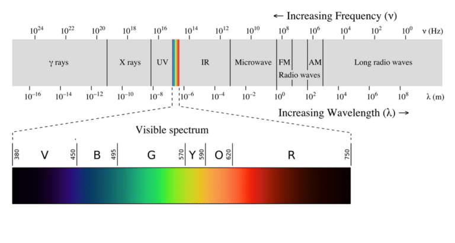

# C1S0001_ir_receiver      
---------------------
       

## Specification     
---------------- 
• Operating voltage: 3.0V-5.0V       
• Operating current: < 15mA      
• Light angle value: 0°-337.5°, 0xffff(Directly above)       
• Light angle accuracy: +/- 22.5°       
• Light intensity value: Just the relative analog voltage value of the light intensity.        
• Communication: IIC      
• Connector: XH2.54-4P      
• Size: 30\*23.2mm       
• Hole distance: 16mm       

## How the module works     
-----------------------  
An [IR remote control](../../outsourcing/nec_ir_remote_control/nec_ir_remote_control.md) and receiver communicate with each other by transmitting and decoding a signal in the form of pulsed IR radiation.       
      

Infrared radiation (IR), or infrared light, is a type of electromagnetic radiation with wavelengths ranging from 700 nm to 1 mm. Because humans can only see light with wavelengths of roughly 400 (violet) to 700 (red) nanometers, IR radiation is invisible to the human eye.     
     
Since IR transmission is a wireless protocol based on a type of light, it requires a clear line of sight between the transmitter (the remote) and the receiver. This means it can’t transmit through walls or ceilings, unlike WiFi or Bluetooth.     

**IR communication basics:**   
Unfortunately, the IR LED in your remote is not the only source of IR radiation. Any object that has a temperature also radiates in the infrared spectrum. This phenomenon is also used by thermal cameras to detect heat.    
       

All this ambient IR can interfere with the communication between the remote and the receiver. So how does the receiver only detect the IR signal coming from the remote? The answer is signal modulation.

With signal modulation, the IR light source at the end of the remote is blinked with a specific frequency. In consumer electronics, this carrier frequency is usually around 38 kHz.     

This specific frequency is used for commercial IR transmission because it is rare in nature and, therefore, it can be distinguished from the ambient IR.     

The receiver is built in such a way that it only lets IR through that is coming in at 38 kHz. This is done using a bandpass filter and amplifier. The demodulated binary signal is then sent to the microcontroller (the Arduino) where it is decoded.    

The NEC protocol is one of the most popular infrared transmission protocols, please refer to:  
[NEC protocol](../../common_resource/nec_communication_protocol/nec_communication_protocol.md)       

## Sample code       
--------------   
[Arduino IRremote library](https://www.arduino.cc/reference/en/libraries/irremote/)        

For [Raspberry pi Pico](../../raspberry/R1D0001_raspberry_pico/R1D0001_raspberry_pico.md): [MicroPython](https://github.com/Mosiwi/Mosiwi-space-station-kit-for-pico/blob/main/MicroPython/Mosiwi_lib_examples/Mosiwi_nec_ir.py)         

## Application example    
----------------------   
[C1K0000_4in1_basic_learing_kit](../../common_product/C1K0000_4in1_basic_learning_kit/C1K0000_4in1_basic_learning_kit.md)     
[R1K0000_space_station_kit_for_pico](../../raspberry/R1K0000_space_station_kit/R1K0000_space_station_kit.md)     

