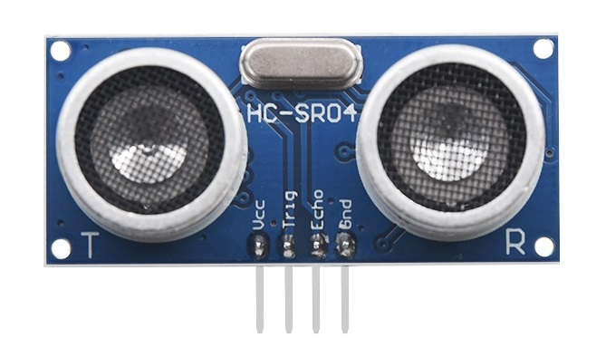

# Common product index
Arduino is an open-source electronics platform based on easy-to-use hardware and software.  It's intended for anyone making interactive projects.

## Kit
| [C1K0000_4in1_basic_learning_kit](../C1K0000_4in1_basic_learning_kit/C1K0000_4in1_basic_learning_kit.md) | updating ... | updating ... |
| :--: | :--: | :--: |
|  | updating ... | updating ... |

## Expansion board
| [C1E0000_3in1_basic_learning_shield](../C1E0000_3in1_basic_learning_shield/C1E0000_3in1_basic_learning_shield.md) | updating ... | updating ... |
| :--: | :--: | :--: |
|  | updating ... | updating ... |

## Sensor
| [O1M0000_ultrasonic_module](../../outsourcing/O1M0000_ultrasonic_module/O1M0000_ultrasonic_module.md) | [O1M0001_fan_module](../../outsourcing/O1M0001_fan_module/O1M0001_fan_module.md) | updating ... |
| :--: | :--: | :--: |
|  |  | updating ... |

