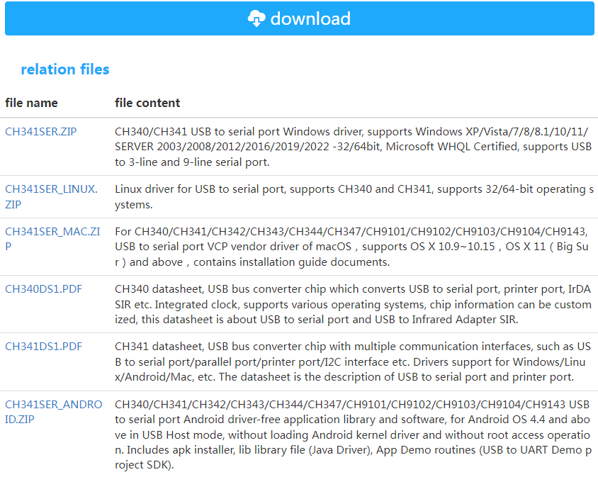
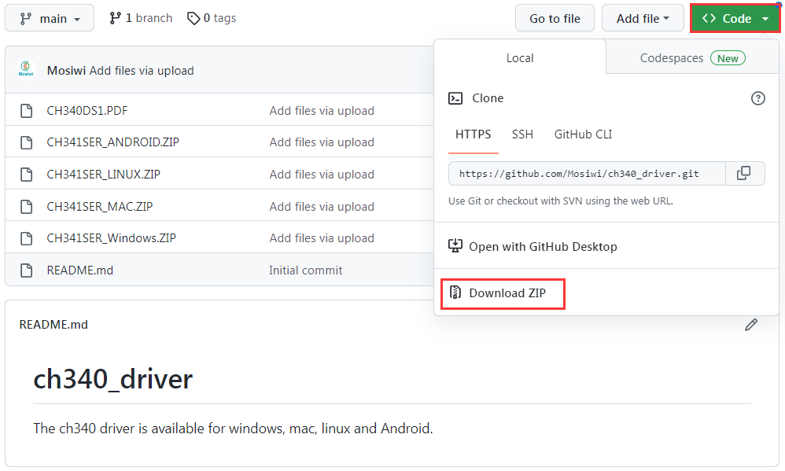
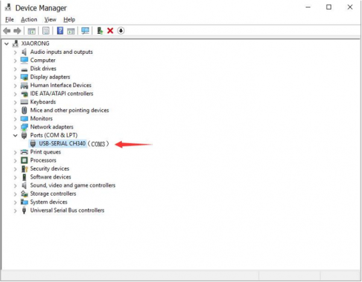
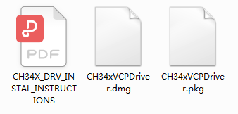
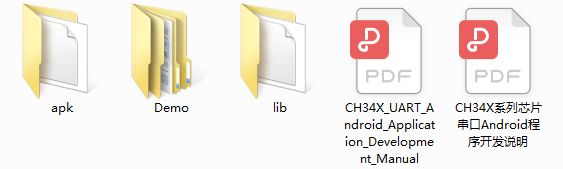

# Install the CH340 driver
## 1. Download the driver file
**Download link 1：**
Go to the official website to download the driver file you need: http://www.wch-ic.com/downloads/CH341SER_EXE.html

**Download link 2：**
Go to github and download all the driver files：https://github.com/Mosiwi/ch340_driver

## 2. Install the driver on your Windows system
Unzip the file and double-click **"SETUP"** to run the installer

If the driver is successfully installed, when the mainboard is connected to the computer through the USB cable, under the path **"Computer" -> "Properties" -> "Device manager"**, you can find **"USB-SERIAL CH340 (COM3)"**, as shown below:

**Note:** Driver display symbol is "USB-SERIAL CH340 (COMx)", "x" can be any number, different computer display may be different.

## 3. Install the driver on your MAC system
Download the driver from the website and unzip the file to a local installation directory. You will get a PDF installation guide and two installation packages in different formats. For details, see the PDF installation guide.

## 4. Install the driver on your Linux system
Drivers are almost certainly built into your Linux kernel already and it will probably just work as soon as you plug it in.  If not you can download the Linux CH340 Driver (but I’d recommend just upgrading your Linux install so that you get the  “built in” one).
If you must install it by yourself, check the "README\.md" file in the zip package.

## 5. Install the driver on your Android system
Android drivers need to be developed by users. The compressed package provides sample code and development guidelines in both Chinese and English.
