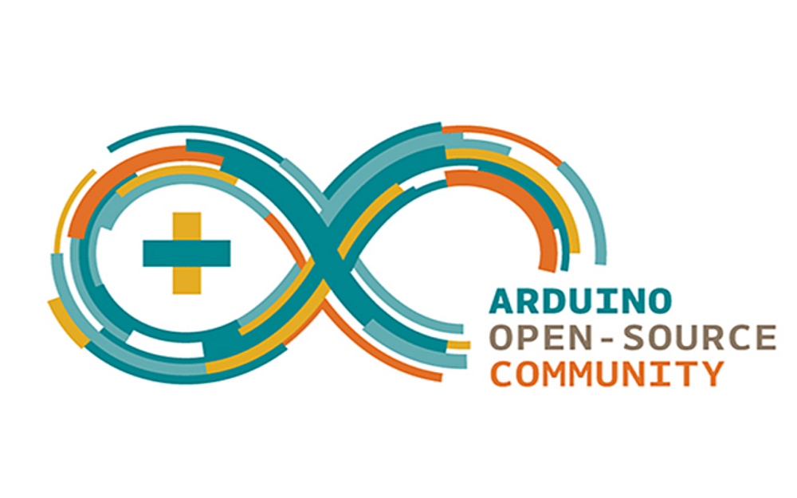
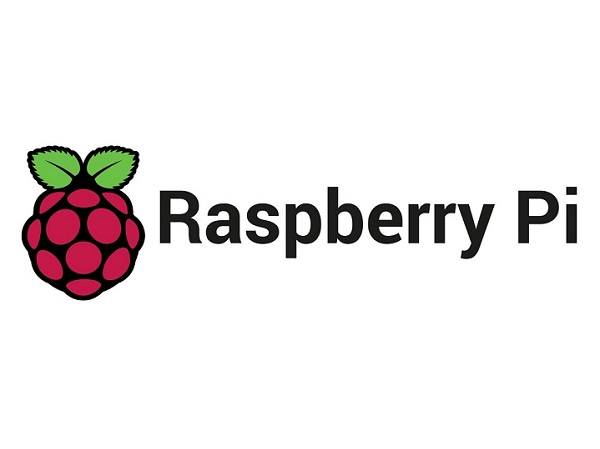
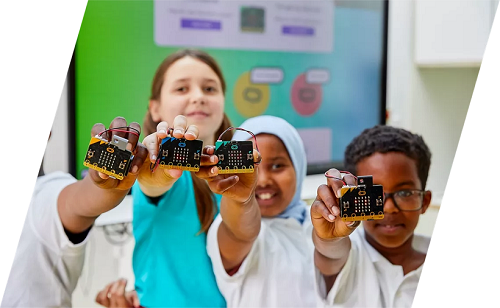

.. Mosiwi Wiki documentation master file, created by
   sphinx-quickstart on Sun Mar 19 01:29:09 2023.
   You can adapt this file completely to your liking, but it should at least
   contain the root `toctree` directive.

Welcome to Mosiwi Wiki's documentation!
=======================================

**Mosiwi  --- Plan, think, act.**
 | Welcome to the Mosiwi Wiki.  We benefit from technology and we are fascinated by it.  We want to present our findings to the world and be recognized by the world.  We are planning, thinking, implementation, is to share with you the convenience and happiness brought by science and technology!
 | E-mail: 354568001@qq.com 

==========  ============  ===========
|Arduino|_  |Raspberry|_  |Microbit|_
----------  ------------  -----------
`Arduino`_  `Raspberry`_  `Microbit`_
==========  ============  ===========

.. _Arduino: arduino/arduino_index/arduino_index.html

.. _Raspberry: raspberry/raspberry_index/raspberry_index.html

.. _Microbit: microbit/microbit_index/microbit_index.html

.. toctree::
   :maxdepth: 2
   :caption: Contents:
   
   Arduino <arduino/arduino_index/arduino_index.rst>
   Raspberry <raspberry/raspberry_index/raspberry_index.rst>
   Micro:bit <microbit/microbit_index/microbit_index.rst>

