# M1D0000_microbit_mainboard    
----------------------------   

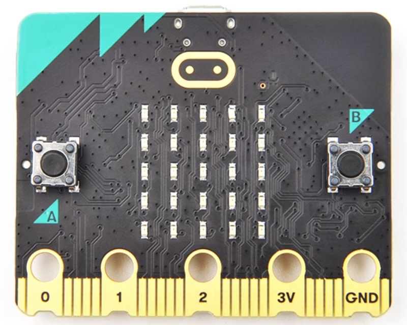
     

The micro:bit is an easily programmable Single Board Computer (SBC) that contains an application processor with a variety of on-chip peripherals. Other peripherals are connected to this chip.  
An interface processor is connected to the application processor and manages communications via the USB interface, including the drag-and-drop code flashing process. The interface processor does not connect to any of the micro:bit peripherals.  
Official website: <https://www.microbit.org>    

## Specification           
----------------
|     |     |
| :-- | :-- |
|Operating voltage| 1.8---3.6V|
|Max source current from edge |14mA |
|Max sink current into edge |15mA |
|Main control chip |Nordic nRF52833 |
|Flash ROM |512KB |
|RAM |128KB |
|Speed |64MHz |

## Meet microbit v2.2          
---------------------
   

## Pinout Diagram         
-----------------
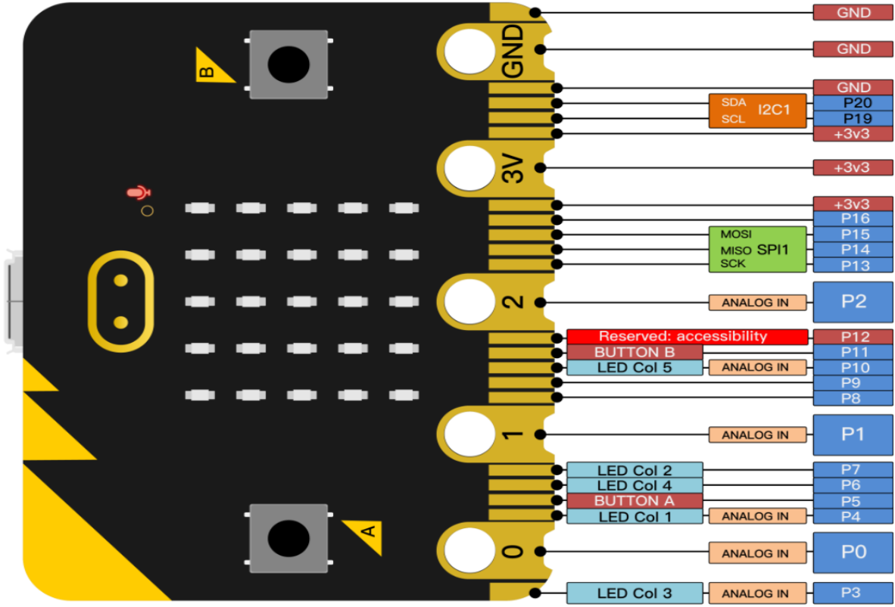  

## More detailed information         
----------------------------
Please refer to the link: <https://tech.microbit.org>  

## Programming platform          
-----------------------
It is recommended to use Microsoft Edge and Google Chrome to open programming web pages:  
  
Please refer to the link: <https://www.microbit.org/code/>  
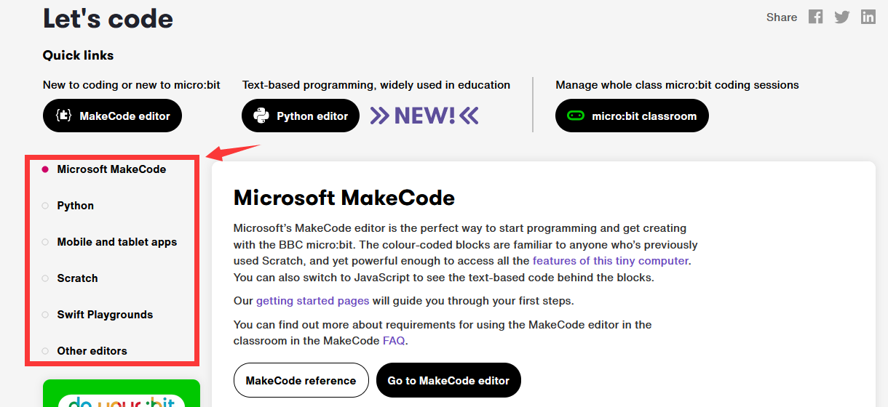  

## Makecode           
-----------
**New makecode project**  
1. Open link: <https://makecode.microbit.org>  
2. Build a new project  
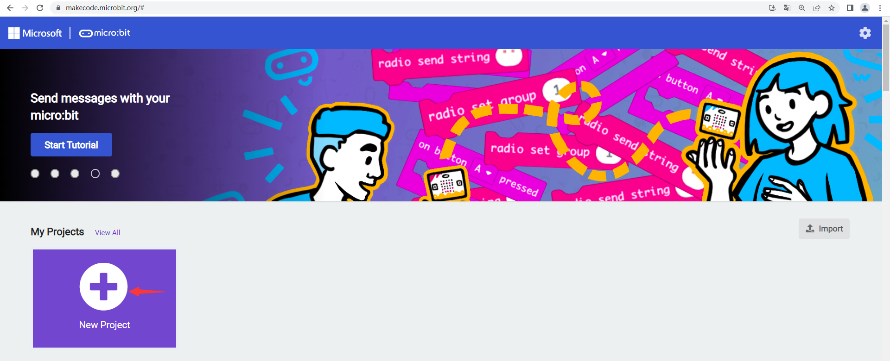  
3. programming  
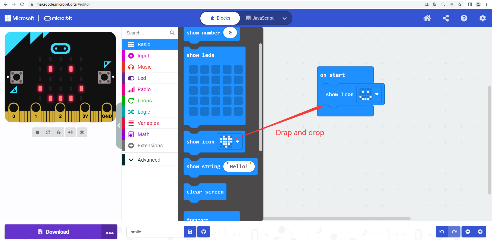  
4. Connect the Micro:bit to your computer via a Micro USB cable.  
When you plug the micro:bit into your computer's USB socket, it will appear on your computer like a USB memory stick called **MICROBIT**.  
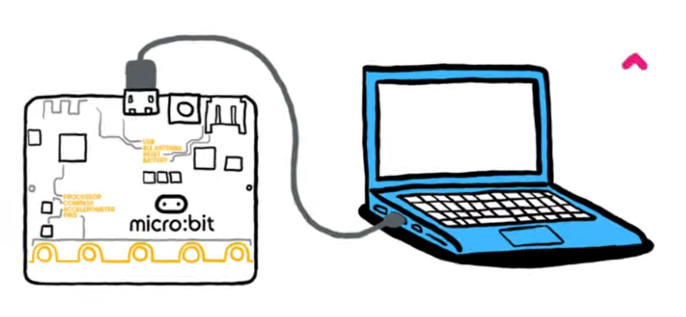    
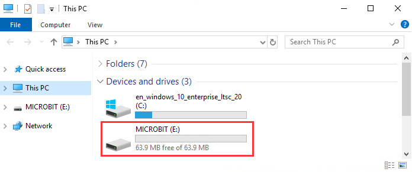   
5. Transfer from a computer  
Download your program as a **.hex** file from the code editor to your computer, usually to your downloads folder. Then drag and drop the **.hex** file on to the **MICROBIT** drive.  
After you transfer your .hex file, the MICROBIT drive will disconnect and reconnect as the micro:bit resets. The .hex file will not be listed on the MICROBIT drive after this. This is expected. Your micro:bit is not a flash storage device, but your computer shows it as one to make it easy to transfer .hex files.  
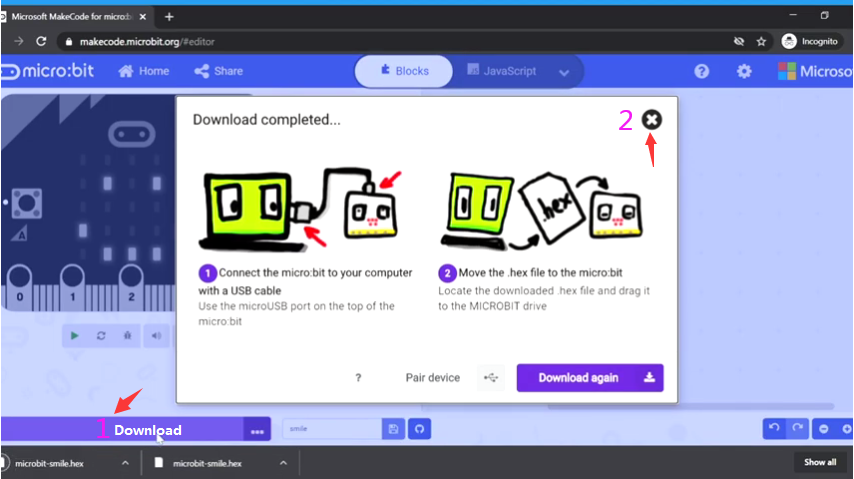    
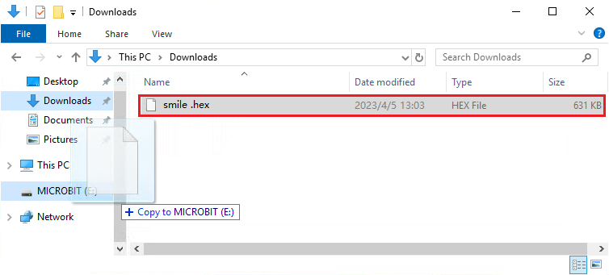   
**or**  
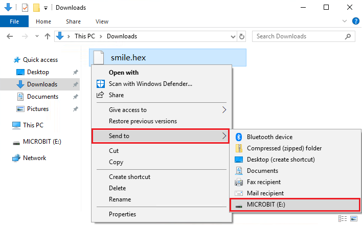   
End!  
Official first use tutorial: <https://www.microbit.org/get-started/first-steps/set-up/>  

**makecode programming learning**  
Please refer to the link: <https://makecode.microbit.org/docs>  
&ensp;&emsp;&emsp;&emsp;&emsp;&emsp;&emsp;&emsp;&emsp;&emsp;&emsp;<https://www.microbit.org/get-started/user-guide/overview/>  

## Common problems and solutions         
--------------------------------
1. The wrong operation causes the microbit firmware to be lost and the microbit cannot be recognized or the code to be uploaded.  
Update the firmware: <https://www.microbit.org/get-started/user-guide/firmware/>  

2. During normal use, do not hold down the reset button while powering on the microbit. Otherwise, micorbit enters the firmware update mode, resulting in failure to upload code.  
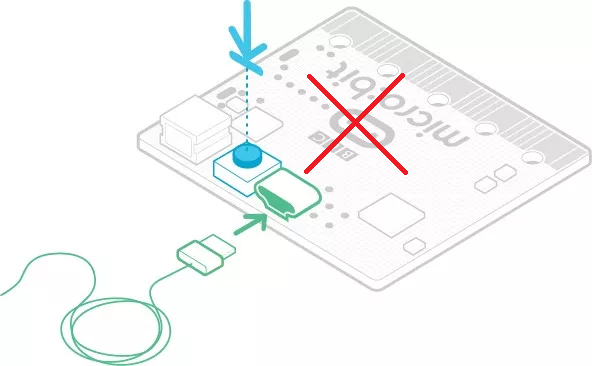  

3. Micro:bit does not connect in Windows  
When connecting the micro:bit to a computer, it will automatically install a driver to your machine that enables it to communicate as a serial device via USB. There are some cases in which the driver being missing (Windows 7) or a legacy driver being present (Windows 8.1+) could cause an issue with the serial function or with WebUSB.  
You should always start with our [article on fault finding](https://support.microbit.org/en/support/solutions/articles/19000024000-fault-finding-with-a-micro-bit) that covers common issues like USB cables not working.  
**Windows 7 (serial not working)**  
In Windows 7, you had to manually install the Mbed serial driver to enable the serial port. [The legacy mBed driver is still available](https://os.mbed.com/docs/mbed-os/v6.8/program-setup/windows-serial-driver.html), but as [Windows 7 reaches end of life](https://www.microsoft.com/en-gb/windows/windows-7-end-of-life-support-information) you should upgrade your operating system accordingly.  
**Windows 8.1/10 (WebUSB not working)**  
If the Mbed Serial driver has been manually installed it might interfere with the Windows 8.1/10 automatic installation of the WebUSB driver.   
It is possible that a driver was previously installed on the Windows machine if you have upgraded from Windows 7.  
To check if you have this driver already:  
----Open Windows Device Manager and see if the micro:bit USB device is shown. If it is.  
----find the mbed Composite Device entry, right click on it and select Uninstall device.    
----A new window will open, mark the Delete the driver software for this device box and click Uninstall.  
----Unplug and replug your micro:bit and it should appear under USB devices.  
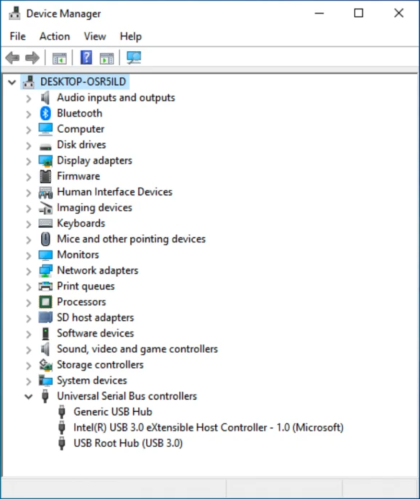  

4. Mciro:bit Help & Support  
Link：<https://support.microbit.org/support/home>  

----
End!