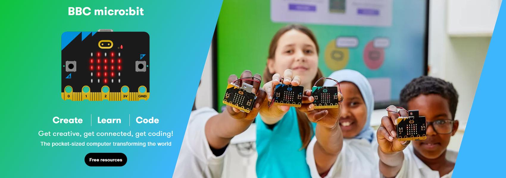
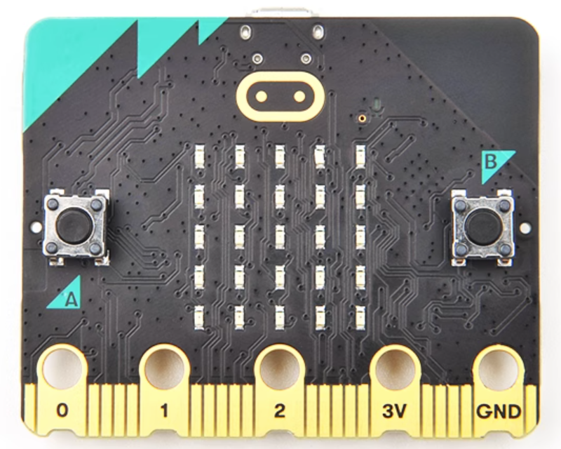

Microbit index
==============

| The Micro:bit Educational Foundation is a not-for-profit organisation that aims to inspire every child to create their best digital future.

| They do this by:  
| ● developing hardware and software that inspires young people to get excited about technology and the opportunities it presents for them.  
| ● creating free, user-friendly educational resources to support teachers in delivering engaging and creative lessons.  
| ● working with like-minded partners to deliver high-impact educational programmes across the globe. 

===
Kit
===
updating …

===========
Motherboard
===========

===================  ============  ============
|M1D0000 microbit|_  updating ...  updating ...
-------------------  ------------  ------------
`M1D0000 microbit`_  updating ...  updating ...
===================  ============  ============

.. _M1D0000 microbit: ../../microbit/M1D0000_microbit_mainboard/M1D0000_microbit_mainboard.html

===============
Expansion board
===============

============  ============  ============
updating ...  updating ...  updating ...
------------  ------------  ------------
updating ...  updating ...  updating ...
============  ============  ============

========
Resource
========
| Microbit official website: Link1_    
| Developer community: Link2_    

.. _Link1: https://www.microbit.org
.. _Link2: https://tech.microbit.org

============
General list
============

.. toctree::
   :maxdepth: 2
   :caption: Contents:
   
   Microbit <../../microbit/M1D0000_microbit_mainboard/M1D0000_microbit_mainboard.md>
