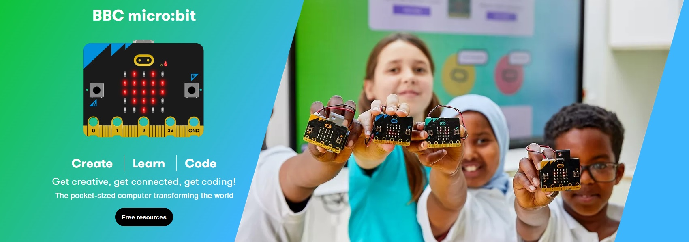

# Microbit index     
----------------    
      

The Micro:bit Educational Foundation is a not-for-profit organisation that aims to inspire every child to create their best digital future.  

They do this by:  
● developing hardware and software that inspires young people to get excited about technology and the opportunities it presents for them.  
● creating free, user-friendly educational resources to support teachers in delivering engaging and creative lessons.  
● working with like-minded partners to deliver high-impact educational programmes across the globe.  

## Kit  
------
| updating | updating | updating |
| :--: | :--: | :--: |
|  |  |  |
 
## Motherboard      
--------------
| [M1D0000 microbit](../../microbit/M1D0000_microbit_mainboard/M1D0000_microbit_mainboard.md) | updating | updating |
| :--: | :--: | :--: |
|  |  |  |

## Expansion board        
------------------
| updating | updating | updating |
| :--: | :--: | :--: |
|  |  |  |

## Resource    
-----------
Microbit official website: [Link](https://www.microbit.org)  
Developer community: [Link](https://tech.microbit.org)  

