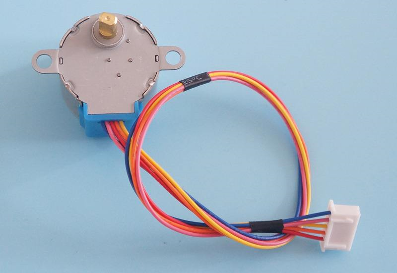
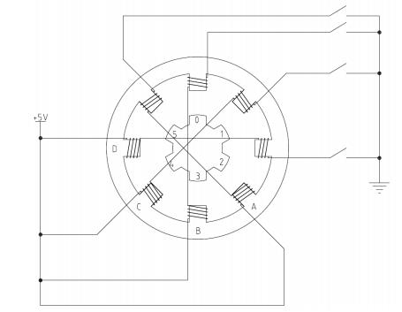
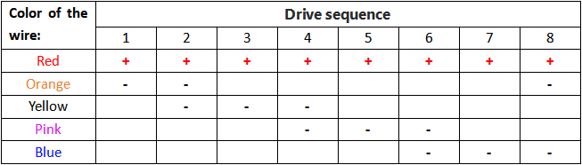
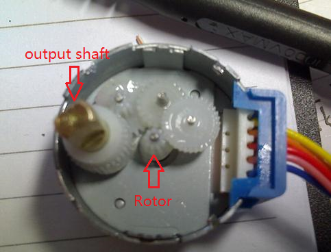
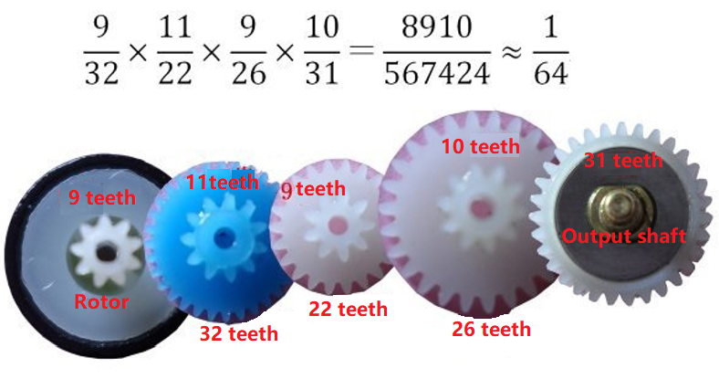
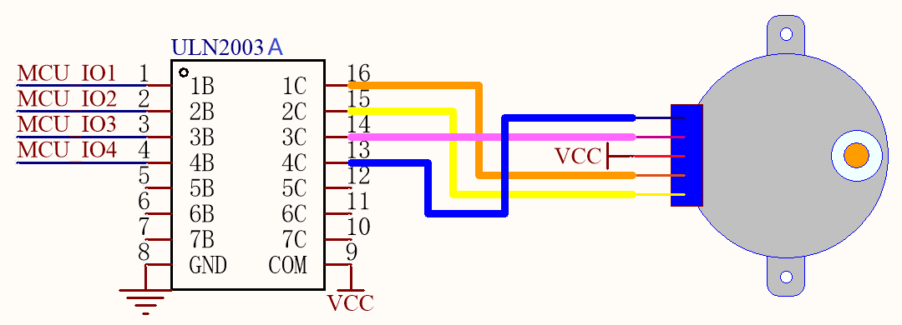

# 28BYJ-48 stepper motor      
------------------------
    
28: The maximum outside diameter of the stepper motor is 28mm    
B: Indicates a stepper motor   
Y: indicates a permanent magnet    
J: indicates deceleration type (deceleration ratio 1:64)    
48: Can be four beats, eight beats running     
[Datasheet](../../_static/pdf/28byj-48/28byj-48.pdf)     

## 1. Internal coil structure      
-----------------------------
The internal structure diagram of the 28BYJ-48 stepper motor is shown below. There are six teeth on the rotor, labeled 0 to 5, and each tooth of the rotor has a permanent magnet.       

The stator is fixed with the shell of the motor, it has 8 teeth, and each tooth is wrapped with A coil winding, the winding on the two teeth are connected in series, the two windings will always be on or off at the same time, so that the formation of 4 phases, respectively marked in the figure A-B-C-D, this is the concept of 4 phases.     


## 2. Driving method        
--------------------
**4-beat drive:**          
      
After 32 beats, the rotor rotates 360°, and the angle of a single beat rotor rotation is: 360° / (8 * 4) = 11.25°, this value is called the step angle.     

**8-beat drive:**     

After 64 beats, the rotor rotates 360°, and the angle of a single beat rotor rotation is: 360° / (8 * 8) = 5.625°, this value is called the step angle.     

## 2. Parameter explanation     
---------------------------  
The 28BYJ-48 is a decelerating stepper motor with multiple decelerating gears inside. As shown below:      
      
   

**8-beat drive:**    
| Speed Variation Ratio | Stride Angle | Idle In-traction Frequency | Idle Out-traction Frequency |
| :--: | :--: | :--: | :--: |
| 1/64 | 5.625°/64 | > 600Hz | > 1000Hz |
  
1/64: When the rotor rotates 64 cycles(64*360°), the output shaft rotates 360°, that is, it takes 64×64=4096 beats for the output shaft to rotate 360°.         

5.625°/64: Represents the rotation Angle of a beat, also equal to: 360°/4096   

\> 600Hz: Maximum frequency of no-load starting of stepper motor. (The frequency is too high to cause the stepper motor to fail to start)      

\> 1000Hz: The maximum frequency that can be reached when the stepper motor is working normally.    

## 3. Commonly used driver chip     
------------------------------- 
   
[ULN2003A datasheet](../../_static/pdf/28byj-48/ULN2003A.pdf)

## 4. Sample code      
-----------------
[For arduino](https://www.arduino.cc/reference/en/libraries/stepper/)       

For [raspberry pi 4B](../../raspberry/R1D0000_raspberry_pi4/R1D0000_raspberry_pi4.md) (C language)
```C language
/* 
 * A program to control a stepper motor through the GPIO on Raspberry Pi.   
 * The program uses blocking mode to drive the stepper motor.          
 * Author: Mosiwi    
 */
 
#include <wiringPi.h>
#include <stdio.h>
#include <unistd.h>
#include <stdlib.h>
 
#define CLOCKWISE 1
#define COUNTER_CLOCKWISE 2
 
void delayMS(int x);
void rotate(int* pins, int direction);
 
int main(int argc,char* argv[]) {
  if (argc < 4) {
    printf("Usage example: ./motor 0 1 2 3 \n");
    return 1;
  }
 
  /* number of the pins which connected to the stepper motor driver board */
  int pinA = atoi(argv[1]);
  int pinB = atoi(argv[2]);
  int pinC = atoi(argv[3]);
  int pinD = atoi(argv[4]);
 
  int pins[4] = {pinA, pinB, pinC, pinD};
 
  if (-1 == wiringPiSetup()) {
    printf("Setup wiringPi failed!");
    return 1;
  }
 
  /* set mode to output */
  pinMode(pinA, OUTPUT);
  pinMode(pinB, OUTPUT);
  pinMode(pinC, OUTPUT);
  pinMode(pinD, OUTPUT);
 
  delayMS(50);    // wait for a stable status 
  for (int i = 0; i < 500; i++) {
    rotate(pins, CLOCKWISE);
  }
  return 0;
}
 
/* Suspend execution for x milliseconds intervals.
 *  @param ms Milliseconds to sleep.
 */
void delayMS(int x) {
  usleep(x * 1000);
}
 
/* Rotate the motor.
 *  @param pins     A pointer which points to the pins number array.
 *  @param direction  CLOCKWISE for clockwise rotation, COUNTER_CLOCKWISE for counter clockwise rotation.
 */
void rotate(int* pins, int direction) {
  for (int i = 0; i < 4; i++) {
    if (CLOCKWISE == direction) {
      for (int j = 0; j < 4; j++) {
        if (j == i) {
          digitalWrite(pins[3 - j], 1); // output a high level 
        } else {
          digitalWrite(pins[3 - j], 0); // output a low level 
        }
      }
    } else if (COUNTER_CLOCKWISE == direction) {
      for (int j = 0; j < 4; j++) {
        if (j == i) {
          digitalWrite(pins[j], 1); // output a high level 
        } else {
          digitalWrite(pins[j], 0); // output a low level 
        }
      }
    }
    delayMS(4);
  }
}
```

For [Raspberry pi Pico](../../raspberry/R1D0001_raspberry_pico/R1D0001_raspberry_pico.md) (MicroPython)
```python
"""
Module containing code to run a stepper motor via the ULN2003 driver board.
The program uses timed interrupt mode to drive the stepper motor.   
Programmer: Mosiwi
"""
import time, utime
from machine import Pin
from machine import Timer

__HALF_STEP_TABLE = [
    [0, 0, 0, 1],
    [0, 0, 1, 1],
    [0, 0, 1, 0],
    [0, 1, 1, 0],
    [0, 1, 0, 0],
    [1, 1, 0, 0],
    [1, 0, 0, 0],
    [1, 0, 0, 1],
]

__FULL_STEP_TABLE = [
 [1, 0, 1, 0],
 [0, 1, 1, 0],
 [0, 1, 0, 1],
 [1, 0, 0, 1]
]

class ULN2003(object):
    """
    Class representing an ULN2003 stepper driver.
    The default settings are made to work with the 28byj-48 5V DC stepper motor.
    """
    pins = list()
    steps_pr_rotation = 0
    step_table = list()
    steps_sum = 1
    direction = 1
    index = 0

    def __init__(self, pins: list[int], half_step: bool=True, steps_pr_rotation: int=None):
        """
        - pins : list[int]
          A list of integers representing the IO pins used to control the stepper motor.
        - half_step : bool (Default: True)
          Should movements be in half-steps or whole-steps.
        - interval : float (Default: 0.001)
          Number of seconds to sleep between each sub-step. Smaller values give faster movement.
          If this becomes too low, the motor might just stop moving.
        - full_rotation : int (Default: None)
          How many steps are in a full rotation. If set to None, a default based on the 28byj-48.
        """

        # Create GPIO pin objects.
        self.pins = [Pin(p, Pin.OUT, 0) for p in pins]

        # Set the correct step table.
        self.step_table = __HALF_STEP_TABLE if half_step else __FULL_STEP_TABLE

        # Set how many steps in a rotation.
        # The step Angle is 5.625° and the reduction ratio is 1/64
        # 4096 = 360/5.625 * 64
        self.steps_pr_rotation = steps_pr_rotation if steps_pr_rotation else 4096

        # Set the timer interrupt frequency to 800hz for stepper motor.
        Timer(freq=800, mode=Timer.PERIODIC, callback=self._step)
    
    # Interrupt function of timer
    def _step(self, t):
        if self.steps_sum > 0:
            self.index = self.index + 1  if self.direction == 1 else self.index - 1
            if self.direction == -1 and self.index < 0: self.index = len(self.step_table) - 1
            if self.direction == 1 and self.index > len(self.step_table) - 1: self.index = 0
            state = self.step_table[self.index]
            for p in range(4):
                self.pins[p].value(state[p])
            self.steps_sum -= 1
            #print(self.index)
        else: self.__reset()


    def __reset(self):
        """ Set all output pins to 0. """
        for pin in self.pins:
            pin.value(0)

    def move(self, steps: int=0, direction: int=1):
        """
        Move the stepper motor a specific number of steps in one direction.
        - steps : int (Default: 0)
          How many steps to move in the specified direction.
        - direction : int (Default: 1)
          The direction to move. Must be either: 1 for forward, or -1 for backwards.
        """
        self.steps_sum = steps
        self.direction = direction

    def degree(self, degree: int=0, direction: int=1):
        """
        - degree : int (Default: 0)
          How many degrees to move in the specified direction.
        - direction : int (Default: 1)
          The direction to move. Must be either: 1 for forward, or -1 for backwards.
        """
        self.move(self.steps_pr_rotation/360*degree, direction)


if __name__ == '__main__':
    stepper = ULN2003([6,7,8,9])
    '''
    stepper.move(4096, 1)
    while stepper.steps_sum > 0: pass
    stepper.move(4096, -1)
    while stepper.steps_sum > 0: pass
    '''

    while True:
        stepper.degree(360, 1)
        while stepper.steps_sum > 0: pass
        stepper.degree(360, -1)
        while stepper.steps_sum > 0: pass

```
