# O1M0000_ultrasonic_module 
---------------------------
Ultrasonic wave is a part of sound wave, it is a kind of human ear can not hear, the frequency is higher than 20KHZ sound wave, it and sound wave have in common, that is, are generated by material vibration, and can only propagate in the medium; It is also widespread in nature, and many animals can emit and receive ultrasonic waves, the most prominent of which is bats, which can use weak ultrasonic echoes to fly in the dark and catch prey.     
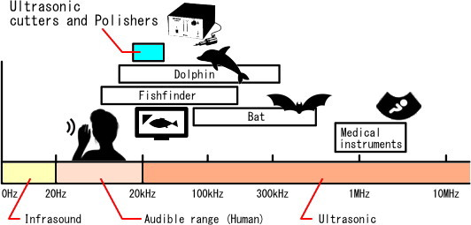       
The ultrasonic distance measurement module is developed using the above principles:         
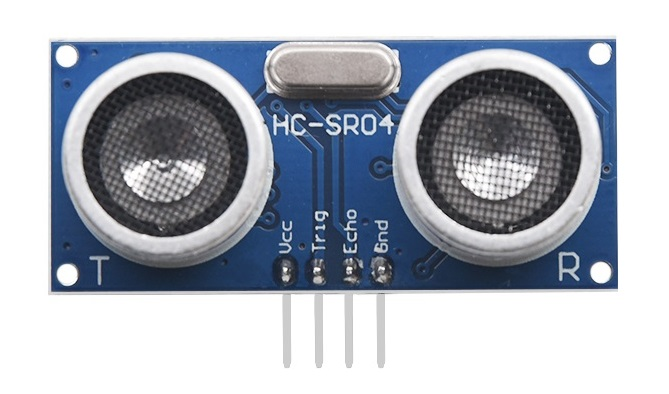


## Specification     
----------------
1. Operating Voltage: 3 to 5V  
2. Operating Current: Max 5.3mA  
3. Detection range: 2 -- 600cm  
4. Detecting precision：± (0.1cm + 1%)  
5. Detection angle: < 15 degree  
6. Ultrasonic frequency: 40KHz  
7. Operating temperature range: -30 -- 65℃  
8. Weight: about 8g  
9. Dimensions: 45\*26\*15mm  

## Meet ultrasonic module    
-------------------------
| 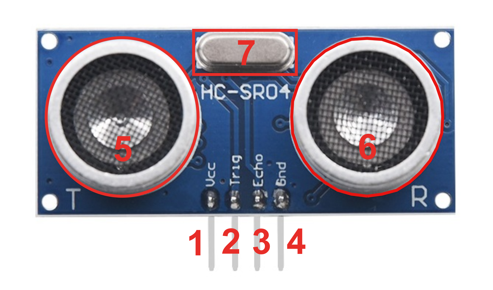 |
| :-- |
| 1. VCC: 3-5V, input the positive terminal of the power supply. |
| 2. Trig: Trigger pulse input pin, 10 microsecond pulse signal will trigger the module to work. |
| 3. Echo: Pulse output pin, pulse width and test distance as a function. |
| 4. GND: Input the negative terminal of the power supply. |
| 5. Ultrasonic emission probe. |
| 6. Ultrasonic receiving probe. |
| 7. Crystal oscillator of the module. |

## Dimensional drawing           
----------------------
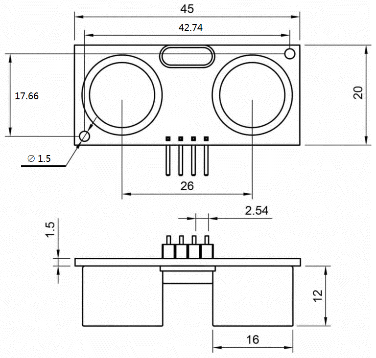  

## Working principle             
--------------------
The ultrasonic frequency propagated in the air is about 20~200KHz, and its attenuation is proportional to the frequency (that is, the higher the frequency, the shorter the propagation distance). In the environment of room temperature 20°C, the transmission speed of sound wave is about 344m/s. Therefore, the distance can be calculated by the function:  
<center>Distance = (344(m/s)*T(s))/2</center>   

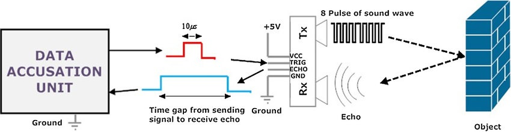    
The Trig pin of the ultrasonic module receives a 10us high level pulse signal. The transmitting probe of the ultrasonic module emits 8 of 40KHz ultrasonic waves. The receiving probe of the ultrasonic module captures the ultrasonic waves reflected back after hitting the obstacles. The Echo pin of the ultrasonic module outputs a high level signal related to the distance.     

**Distance calculation:**
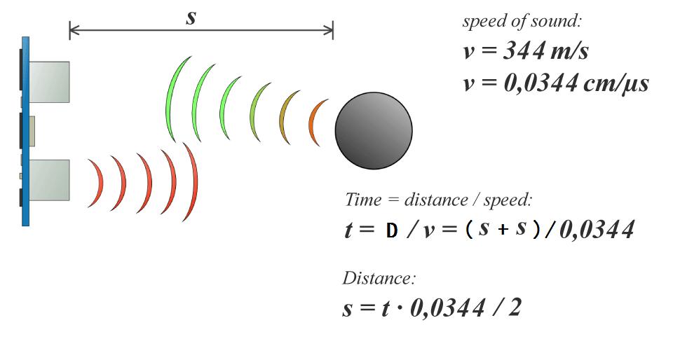    
Note: t is the high level time of the ultrasonic Echo pin output, D is the emission distance plus the reflection distance, so D=s+s.    

**Measurement period:**  
The next measurement can be carried out after receiving the high level pulse output by HC-SR04 through the Echo pin. Therefore, the measurement period depends on the measurement distance. When the distance from the measured object is very close, the pulse width returned by Echo is narrow, and the measurement period is very short. When the distance from the measured object is relatively far, the pulse width returned by Echo is wider, and the measurement period is correspondingly longer.  
In the worst case, the measured object is beyond the measurement range of the ultrasonic module. At this time, the pulse width returned is the longest, about 66ms, so the measurement period in the worst case is slightly larger than 66ms (70ms is sufficient).  
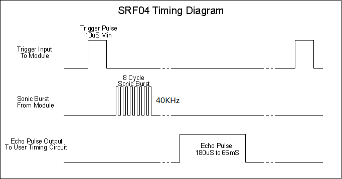  

**Matters need attention**  
|      |      |
| :--: | :--: |
| 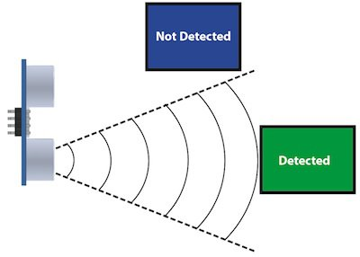 | 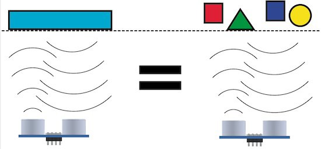 |
| 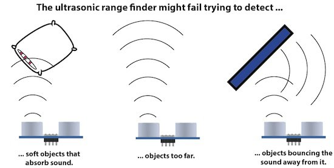 | 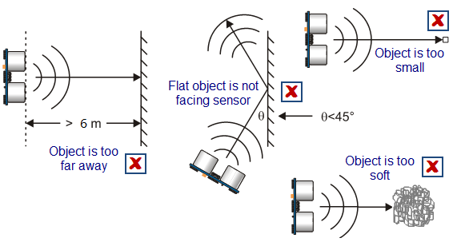 |

## Example Code            
---------------
**Arduino IDE:**  
Please refer to the link to use Arduino IDE: [Link](../../arduino_ide/arduino_ide.md)  

**wiring diagram:**  
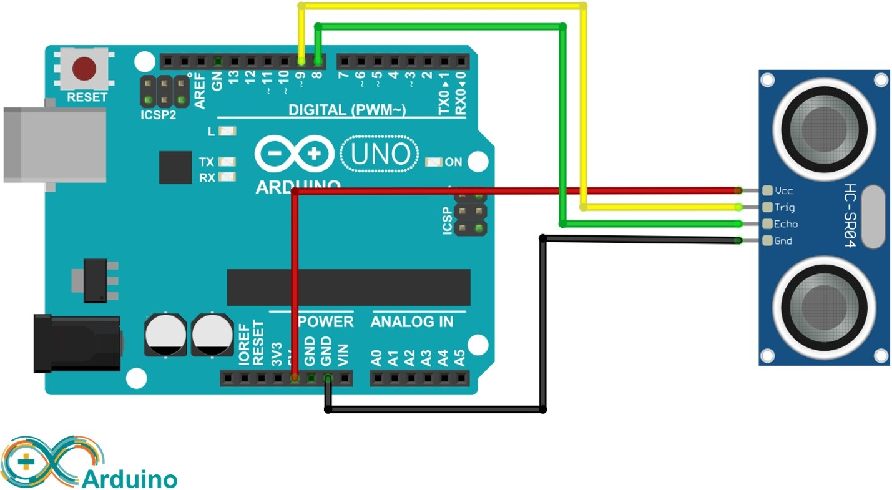  

**Code:**
```c++
const int trigPin = 9;              // Trigger Pin of Ultrasonic Sensor
const int echoPin = 8;              // Echo Pin of Ultrasonic Sensor
long duration, inches, cm;

void setup() {
   Serial.begin(9600);              // Starting Serial Terminal

   pinMode(trigPin, OUTPUT);
   pinMode(echoPin, INPUT);

   digitalWrite(trigPin, LOW);
   delay(10);
}

void loop() {
   digitalWrite(trigPin, HIGH);     // Emit a 10-microsecond trigger signal.
   delayMicroseconds(10);
   digitalWrite(trigPin, LOW);
   
   duration = pulseIn(echoPin, HIGH);           // Capture the pulse width of the echo pin, return the time in microseconds.
   inches = microsecondsToInches(duration);
   cm = microsecondsToCentimeters(duration);

   Serial.print(inches);
   Serial.print("in, ");
   Serial.print(cm);
   Serial.print("cm");
   Serial.println();
   delay(500);
}

/*****************************************************
1. Distance(meter) = 344(m/s)*seconds/2  
2. Distance(centimeter) = 34400(cm/s)*seconds/2 
3. Distance(centimeter) = 0.0344(cm/us)*microseconds/2 
4. Distance(centimeter) = microseconds/29/2
5. 1 inch = 2.54 cm
6. Distance(inch) = microseconds/29/2*2.54
7. Distance(inch) = microseconds/74/2
******************************************************/
long microsecondsToInches(long microseconds) {
   return microseconds / 74 / 2;
}

/*****************************************************
1. Distance(meter) = 344(m/s)*seconds/2  
2. Distance(centimeter) = 34400(cm/s)*seconds/2 
3. Distance(centimeter) = 0.0344(cm/us)*microseconds/2 
4. Distance(centimeter) = microseconds/29/2 
******************************************************/
long microsecondsToCentimeters(long microseconds) {
   return microseconds / 29 / 2;       
}

```
