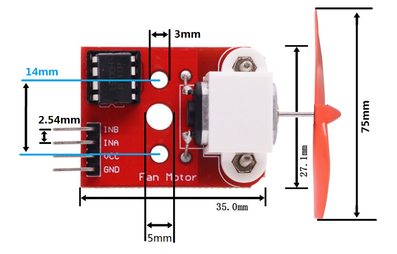
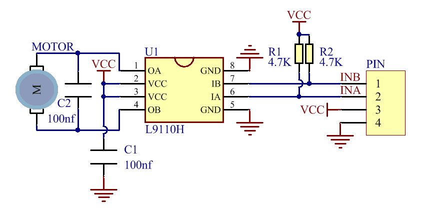

# O1M0001_fan_module

## Overview
  


## Specification
1. Operating Voltage: 3 to 5V  
2. Operating Current: Max 45mA  
3. Rotate speed: Max 8300  
9. Dimensions: 35\*27.1mm  

## Dimensional drawing
  

## Schematic diagram
  

## Logical table
|Input Pin|Input Pin|Output Pin|Output Pin| Motor |
|  :--:   |  :--:   |   :--:   |   :--:   |  :--: |
|   IBA   |   INB   |    OA    |    OB    | State |
|    L    |    L    |    L     |    L     | Brake |
|    L    |    H    |    L     |    H     |Positive turn/reverse |
|    H    |    L    |    H     |    L     |Reverse/positive turn |
|    H    |    H    |    H     |    H     |Brake |
## Example Code
**Arduino IDE:**  
Please refer to the link to use Arduino IDE: [Link](../../arduino/arduino_ide/arduino_ide.md)  

**wiring diagram**  
  

**Digital pin code:**  
```c++
const int ina = 9;            
const int inb = 10;             

void setup() {
   pinMode(ina, OUTPUT);
   pinMode(inb, INPUT);
}

void loop() {
   digitalWrite(ina, HIGH);    
   digitalWrite(inb, LOW);
   delay(2000);
   digitalWrite(ina, LOW);    
   digitalWrite(inb, HIGH);
   delay(2000);
}
```

**PWM pin code:**
```c++
const char ina = 9;            
const char inb = 10;             

void setup() {
   pinMode(ina, OUTPUT);
   pinMode(inb, INPUT);
}

void loop() {
   char i=0;
   for(i=0; i<256; i++>){
      analogWrite(ina, i);    
      analogWrite(inb, 0);
      delay(10);
   }

   for(i=0; i<256; i++>){
      analogWrite(ina, 0);    
      analogWrite(inb, i);
      delay(10);
   }
}
```