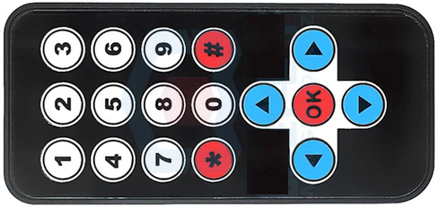
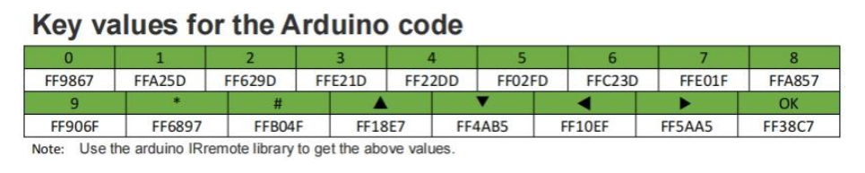
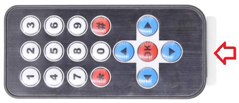

# nec_ir_remote_control       
    

## 1. Specification     
1. Remote control range: 8-10 meters (the quality of the infrared receiver itself, whether there are obstacles in the middle and other factors will affect the remote control distance)       
2. Type of battery used: CR2025 3V lithium-manganese battery 
3. Communication protocol: [NEC infrared communication protocol](../../common_resource/nec_communication_protocol/nec_communication_protocol.md)      
4. Infrared carrier frequency: 38KHz  
5. Effective launching Angle: 60°    
6. Size: 86\*40\*6.0mm 

## 2. CR2025 3V lithium-manganese battery      

Insert battery:   

## 3. Key value           

[Arduino IRremote library](https://www.arduino.cc/reference/en/libraries/irremote/)        

## 4. Notes           
1. Before use, you need to pull out the insulating plastic sheet at the bottom.      
     
2. Before use, ensure that the CR2025 3V lithium-manganese battery is installed in the remote control.     
3. Before use, ensure that the CR2025 3V lithium manganese battery has sufficient power.      

