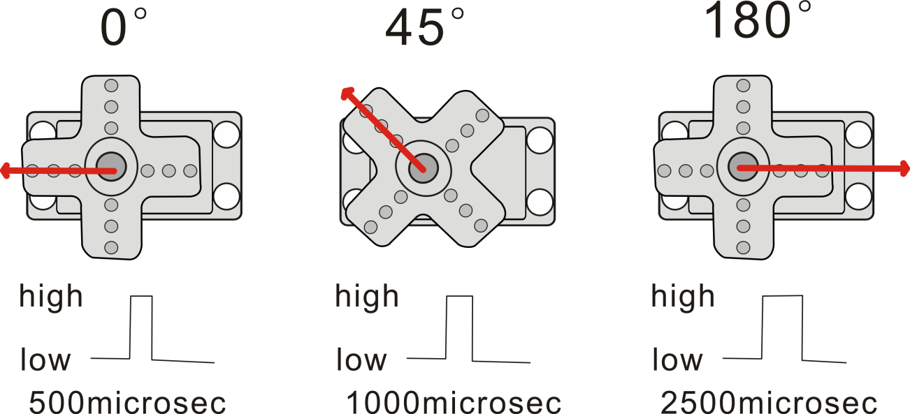

# SG90 servo       
------------
    
The servo can be programmed to rotate at different angles, which is different from ordinary motors that can only rotate at a certain speed when powered on. The function of the servo is not to rotate in a cycle, but to rotate at a certain Angle. Through the servo axis disk can drive the external mechanical structure, we can be used to control the direction of the car, the arm control of the robot and so on.      
     
## 1. Wiring   
------------
     

## 2. Usage       
----------- 
The servo is controlled by a PWM signal with a period of 20ms and a pulse width of 0.5ms- 2.5ms. The pulse width is 0.5ms- 2.5ms maps to 0°- 180°, and their relationship is as follows:     
    

## 3. Sample code       
----------------- 
[For arduino](https://reference.arduino.cc/reference/en/libraries/servo/)       

For [raspberry pi 4B](../../raspberry/R1D0000_raspberry_pi4/R1D0000_raspberry_pi4.md) (C language)
```C language
/*    
 * The program uses blocking mode to drive the servo.       
 * Author: Mosiwi    
 */
#include <wiringPi.h>

int main(){
	wiringPiSetup();
	pinMode(1,OUTPUT);
	int i;
	for(;;){
		for(i=0;i<50;i++){    // 0 degree
		    digitalWrite(1,HIGH);
		    delayMicroseconds(500);
		    digitalWrite(1,LOW);
            delayMicroseconds(19500);
		}
		delay(1000);

		for(i=0;i<50;i++){    // 180 degree
		    digitalWrite(1,HIGH);
		    delayMicroseconds(2500);
		    digitalWrite(1,LOW);
	        delayMicroseconds(17500);	
		}
        delay(1000);	
	}
	return 0;
}
```

For [Raspberry pi Pico](../../raspberry/R1D0001_raspberry_pico/R1D0001_raspberry_pico.md) (MicroPython)
```python
import time
from machine import Pin, PWM

"""
# create PWM object from a pin and set the frequency of slice 0
# and duty cycle for channel A
pwm0 = PWM(Pin(0))      # create PWM object from a pin
pwm0.freq()             # get the current frequency of slice 0
pwm0.freq(1000)         # set/change the frequency of slice 0
pwm0.duty_u16()         # get the current duty cycle of channel A, range 0-65535
pwm0.duty_u16(200)      # set the duty cycle of channel A, range 0-65535
pwm0.duty_u16(0)        # stop the output at channel A
print(pwm0)             # show the properties of the PWM object.
pwm0.deinit()           # turn off PWM of slice 0, stopping channels A and B

servo:
0.5ms ——— 0 degree；
1.0ms ——— 45 degree；
1.5ms ——— 90 degree；
2.0ms ——— 135 degree；
2.5ms ——— 180 degree；
11.111us = (2.5ms - 0.5ms)/180

20000us = 1s/50 
0.305us = 20000us/65535
1639 = 0.5ms/0.305us
36.43 = 11.111/0.305
"""

class Servo:
    def __init__(self, pin):
        self.servo = PWM(Pin(pin))
        self.servo.freq(50)
        self.degree = 0

    def setDegree(self, degree):
        self.degree = degree
        self.servo.duty_u16(int(1639 + degree*36.43))
        
    def readDegree(self):
        return self.degree

if __name__ == '__main__':
    servo = Servo(15)

    while True:
        servo.setDegree(0)
        time.sleep(2)
        servo.setDegree(90)
        time.sleep(2) 
        servo.setDegree(180)
        time.sleep(2)

```

--------
**End!**