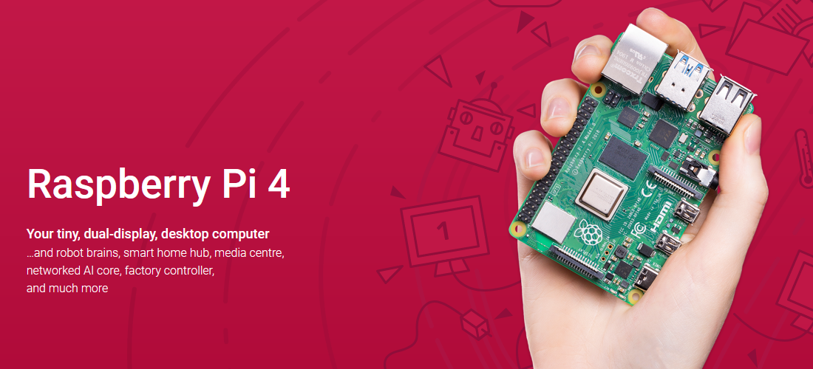
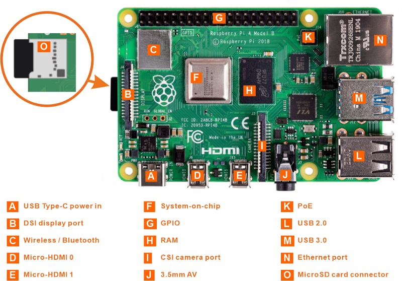
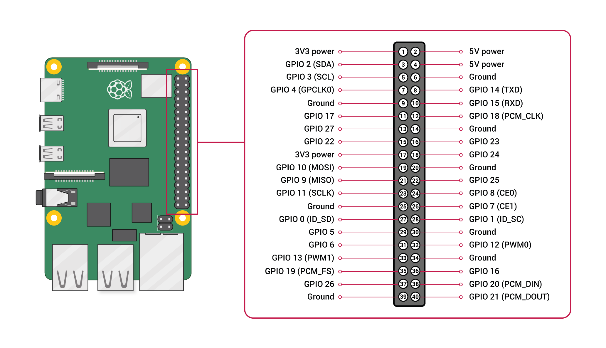

# R1D0000_raspberry_pi4
-----------------------
       

Official website: <https://www.raspberrypi.com/products/raspberry-pi-4-model-b>  

## Specification        
----------------
- Broadcom BCM2711, Quad core Cortex-A72 (ARM v8) 64-bit SoC @ 1.8GHz  
- 1GB, 2GB, 4GB or 8GB LPDDR4-3200 SDRAM (depending on model)  
- 2.4 GHz and 5.0 GHz IEEE 802.11ac wireless, Bluetooth 5.0, BLE  
- Gigabit Ethernet  
- 2 USB 3.0 ports; 2 USB 2.0 ports.  
- Raspberry Pi standard 40 pin GPIO header (fully backwards compatible with previous boards)  
- 2 × micro-HDMI ports (up to 4kp60 supported)  
- 2-lane MIPI DSI display port 
- 2-lane MIPI CSI camera port  
- 4-pole stereo audio and composite video port  
- H.265 (4kp60 decode), H264 (1080p60 decode, 1080p30 encode)   
- OpenGL ES 3.1, Vulkan 1.0  
- Micro-SD card slot for loading operating system and data storage  
- 5V DC via USB-C connector (minimum 3A*)  
- 5V DC via GPIO header (minimum 3A*)  
- Power over Ethernet (PoE) enabled (requires separate PoE HAT)  
- Operating temperature: 0 – 50 degrees C ambient    

Note: A good quality 2.5A power supply can be used if downstream USB peripherals consume less than 500mA in total.  

## Meet raspberry pi4      
---------------------
  

## Dimensional drawing       
----------------------
  
Note: all dimensions in mm  

## Get started with raspberry pi     
--------------------------------
Please refer to: [Click me](../resources/get_started_with_raspberry_pi/get_started_with_raspberry_pi.md)

## GPIO Diagram        
---------------
   
For more details on the advanced capabilities of the GPIO pins see gadgetoid’s [interactive pinout diagram](http://pinout.xyz/).  

**GPIO in C**  
Use [WiringPi](../wiringpi/wiringpi.md) or [BCM2835](../bcm2835/bcm2835.md) library to control Raspberry PI GPIO.  

**GPIO in Python**  
Using the [GPIO Zero](https://gpiozero.readthedocs.io/) library makes it easy to get started with controlling GPIO devices with Python. The library is comprehensively documented at [gpiozero.readthedocs.io](https://gpiozero.readthedocs.io/).  

## Resource   
-----------
[Raspberry Pi 4 Model B product brief](https://datasheets.raspberrypi.com/rpi4/raspberry-pi-4-product-brief.pdf)  
[Raspberry Pi 4 Model B schematic diagrams](https://datasheets.raspberrypi.com/rpi4/raspberry-pi-4-reduced-schematics.pdf)  
[Raspberry Pi 4 Model B mechanical drawing](https://datasheets.raspberrypi.com/rpi4/raspberry-pi-4-mechanical-drawing.pdf)  
[Documentation including hardware and configuration](https://www.raspberrypi.com/documentation/)  

## Troubleshooting    
------------------
Forums: <https://forums.raspberrypi.com/>  

--------
**End!**