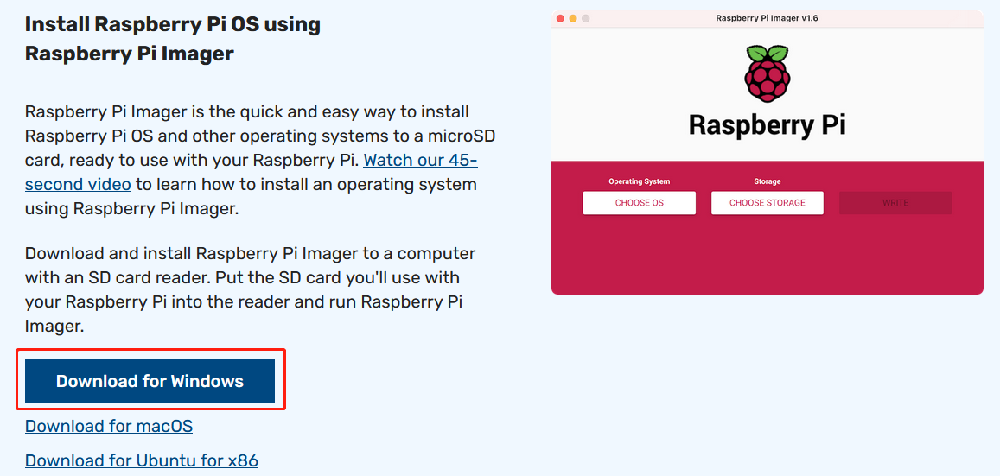
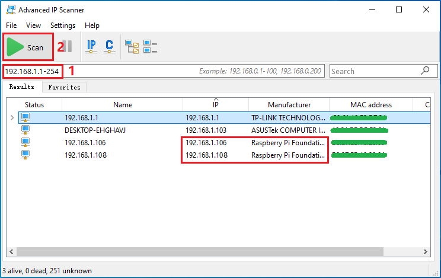
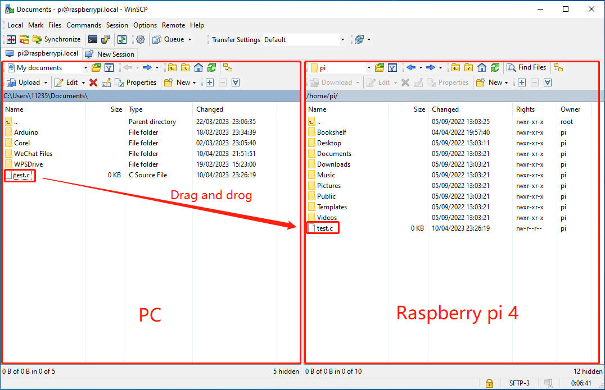

# R1D0000_raspberry_pi4

## Overview
  

Official website: <https://www.raspberrypi.com/products/raspberry-pi-4-model-b>  

## Specification
- Broadcom BCM2711, Quad core Cortex-A72 (ARM v8) 64-bit SoC @ 1.8GHz  
- 1GB, 2GB, 4GB or 8GB LPDDR4-3200 SDRAM (depending on model)  
- 2.4 GHz and 5.0 GHz IEEE 802.11ac wireless, Bluetooth 5.0, BLE  
- Gigabit Ethernet  
- 2 USB 3.0 ports; 2 USB 2.0 ports.  
- Raspberry Pi standard 40 pin GPIO header (fully backwards compatible with previous boards)  
- 2 × micro-HDMI ports (up to 4kp60 supported)  
- 2-lane MIPI DSI display port 
- 2-lane MIPI CSI camera port  
- 4-pole stereo audio and composite video port  
- H.265 (4kp60 decode), H264 (1080p60 decode, 1080p30 encode)   
- OpenGL ES 3.1, Vulkan 1.0  
- Micro-SD card slot for loading operating system and data storage  
- 5V DC via USB-C connector (minimum 3A*)  
- 5V DC via GPIO header (minimum 3A*)  
- Power over Ethernet (PoE) enabled (requires separate PoE HAT)  
- Operating temperature: 0 – 50 degrees C ambient    

Note: A good quality 2.5A power supply can be used if downstream USB peripherals consume less than 500mA in total.  

## Meet raspberry pi4
  

## GPIO Diagram
   
For more details on the advanced capabilities of the GPIO pins see gadgetoid’s [interactive pinout diagram](http://pinout.xyz/).  

**GPIO in C**  
Use [WiringPi](../wiringpi/wiringpi.md) or [BCM2835](../bcm2835/bcm2835.md) library to control Raspberry PI GPIO.  

**GPIO in Python**  
Using the [GPIO Zero](https://gpiozero.readthedocs.io/) library makes it easy to get started with controlling GPIO devices with Python. The library is comprehensively documented at [gpiozero.readthedocs.io](https://gpiozero.readthedocs.io/).  

## Dimensional drawing
  
Note: all dimensions in mm  

## Set up raspberry pi4
Accessories to be prepared in advance:  
|  |  |  |
| :--: | :--: | :--: |
| 1 | 2 | 3 |
1. **USB power supply** – A 5 V power supply rated at 3 amps (3 A) and with a USB Type-C connector.  
2. **MicroSD card** – The microSD card acts as Raspberry Pi's permanent storage.  An 8GB card will get you started, though a 16GB one offers more room to grow.  
3. **MicroSD card reader** - It connects the MicroSD card to the USB port of your computer, and then installs the raspberry image system into the MicroSD using other tools.  


**Step1**: Install Raspberry pi OS
Download [Raspberry Pi Imager](https://www.raspberrypi.com/software/) and install it.  
  

Insert the MicroSD card into the MicroSD card reader and insert the MicroSD card reader into the USB port on your computer, then run Raspberry Pi Imager to install raspberry pi OS.  
| 1 | 2 | 3 | 4 |
|:---:|:---:|:---:|:---:|
|  |  |  |  |
| 5 | 6 | 7 | 8 |
|  |  | |  |
| 9 | 10 | 11 | 12 |
|  |  | | Succeed & End! |

**Step2**: Setting up the hardware  
| 1: Connecting the microSD card | 2: Connecting a network cable | 3: Connecting a power supply | 4 |
| :--: | :--: | :--: | :--: |
|  |  |  | Wait for the system to start successfully! |

## Remote Access      
Download [Putty.exe](https://www.putty.be/latest.html).  
  

Use Putty to remotely access raspberry pi 4.  
  
```
raspberrypi.local  
```
  
<span style="color: rgb(255, 76, 65);">Note: The above operations must be on the same LAN.</span>  

## Find the IP address of raspberry pi 4
On Raspberry Pi OS, multicast DNS is supported out-of-the-box by the Avahi service.  
If your PC supports mDNS, you can reach your Raspberry Pi by using its hostname and the .local suffix. The default hostname on a fresh Raspberry Pi OS install is raspberrypi, so by default any Raspberry Pi running Raspberry Pi OS responds to:  

Open the **command prompt** on your PC and run the following command:  
```command line
ping -4 raspberrypi.local
```
or  
```command line
ping -6 raspberrypi.local
```
| ipv4 | ipv6 |
| :--: | :--: |
|  |  |  

<span style="color: rgb(255, 76, 65);">Note: The above method only applies to windows10 or later.</span>  

&emsp; 

**Another way:**  
If you are using windows7 or have multiple raspberry pi 4 devices on your LAN, you can use the following method to get the IP address of raspberry pi 4.  

Download [Advanced IP Scanner](https://www.advanced-ip-scanner.com/) and install it.  
  

Fill in the range of IP addresses to scan, and then scan.  
  

<span style="color: rgb(255, 76, 65);">Note: The above operations must be on the same LAN.</span>  

## Transfer files from your PC to Raspberry pi 4.
Download [WinSCP](https://winscp.net/eng/index.php) and install it.  
  

Log in to raspberry pi 4 using WinSCP.  
  

Drag and drop a file on your PC to raspberry pi 4.  
  

## Installing VNC on Raspberry Pi --> (Option)
VNC is already installed on the full Raspberry Pi OS image, and can be installed via **Recommended Software** from the **Preferences** menu on other versions.  
If you are not using a desktop you can install it from the command line as follows:  
```command line
sudo apt update
sudo apt install realvnc-vnc-server realvnc-vnc-viewer
```

**Enabling the VNC Server**  
You can do this graphically or at the command line.  

<span style="color: rgb(255, 76, 65);">Enabling VNC Server graphically</span>   

----On your Raspberry Pi, boot into the graphical desktop.  
----Select **Menu › Preferences › Raspberry Pi Configuration › Interfaces**.  
----Ensure **VNC** is **Enabled**.  

<span style="color: rgb(255, 76, 65);">Enabling VNC Server at the command line</span>   

You can enable VNC Server at the command line using raspi-config:  
```command line
sudo raspi-config
```
Now, enable VNC Server by doing the following:  
----Navigate to **Interfacing Options**.  
----Scroll down and select **VNC › Yes**.  


**Creating a Virtual Desktop**  
If your Raspberry Pi is headless (i.e. not plugged into a monitor) or controlling a robot, it is unlikely to be running a graphical desktop.  

VNC Server can create a **virtual desktop** for you, giving you graphical remote access on demand. This virtual desktop exists only in your Raspberry Pi’s memory.  

To create and connect to a virtual desktop:  
----On your Raspberry Pi (using Terminal or via SSH), run **vncserver**. Make note of the IP address/display number that VNC Server will print to your Terminal (e.g. 192.167.5.149:1).  
----On the device you’ll use to take control, enter this information into [VNC Viewer](https://www.realvnc.com/download/viewer/).  

To destroy a virtual desktop, run the following command:  
```command line
vncserver -kill :<display-number>  
```
This will also stop any existing connections to this virtual desktop.  

## Resource
[Raspberry Pi 4 Model B product brief](https://datasheets.raspberrypi.com/rpi4/raspberry-pi-4-product-brief.pdf)  
[Raspberry Pi 4 Model B schematic diagrams](https://datasheets.raspberrypi.com/rpi4/raspberry-pi-4-reduced-schematics.pdf)  
[Raspberry Pi 4 Model B mechanical drawing](https://datasheets.raspberrypi.com/rpi4/raspberry-pi-4-mechanical-drawing.pdf)  
[Documentation including hardware and configuration](https://www.raspberrypi.com/documentation/)  

## Troubleshooting
Forums: <https://forums.raspberrypi.com/>  

