# R1D0001_raspberry_pico 
------------------------   
<center>     
      
</center>   

Raspberry Pi Pico is the debut microcontroller-class board from Raspberry Pi. Built around our RP2040 silicon platform, Pico brings our signature values of high performance, low cost, and ease of use to the microcontroller space.  
Official website: <https://www.raspberrypi.com/products/raspberry-pi-pico>  


## Specification       
----------------
• [RP2040](https://datasheets.raspberrypi.com/rp2040/rp2040-datasheet.pdf) microcontroller with 2MB Flash  
• System operating voltage  
&emsp;&emsp;◦ 3.3V DC   
• Micro-USB B port for power and data (and for reprogramming the Flash)  
• 40 pin 21×51 'DIP' style 1mm thick PCB with 0.1" through-hole pins also with edge castellations  
&emsp;&emsp;◦ Exposes 26 multi-function 3.3V General Purpose I/O (GPIO)    
&emsp;&emsp;◦ 23 GPIO are digital-only and 3 are ADC capable  
&emsp;&emsp;◦ Can be surface mounted as a module  
• Various digital peripherals  
&emsp;&emsp;◦ 2 × UART, 2 × I2C, 2 × SPI, 16 × PWM channels  
&emsp;&emsp;◦ 1 × Timer with 4 alarms, 1 × Real Time Counte  
• 3-pin ARM Serial Wire Debug (SWD) port  
• Simple yet highly flexible power supply architecture   
&emsp;&emsp;◦ Various options for easily powering the unit from micro-USB, external supplies or batteries  
• High quality, low cost, high availability   
• Comprehensive SDK, software examples and documentation    

More: <https://datasheets.raspberrypi.com/pico/pico-datasheet.pdf>  

## Pinout Diagram      
-----------------
  

## Dimensional drawing         
---------------------- 
      

Note: all dimensions in mm  

## Programming platform           
-----------------------
**C/C++:** <https://www.raspberrypi.com/documentation/microcontrollers/c_sdk.html>  
**MicroPython:** <https://docs.micropython.org/en/latest/rp2/quickref.html>     

## Using MicroPython in Thonny           
------------------------------
**Burning micropython firmware**    
1. Raspberry Pi Pico official website: <https://www.raspberrypi.com/documentation/microcontrollers/>    
Click "Micropython"
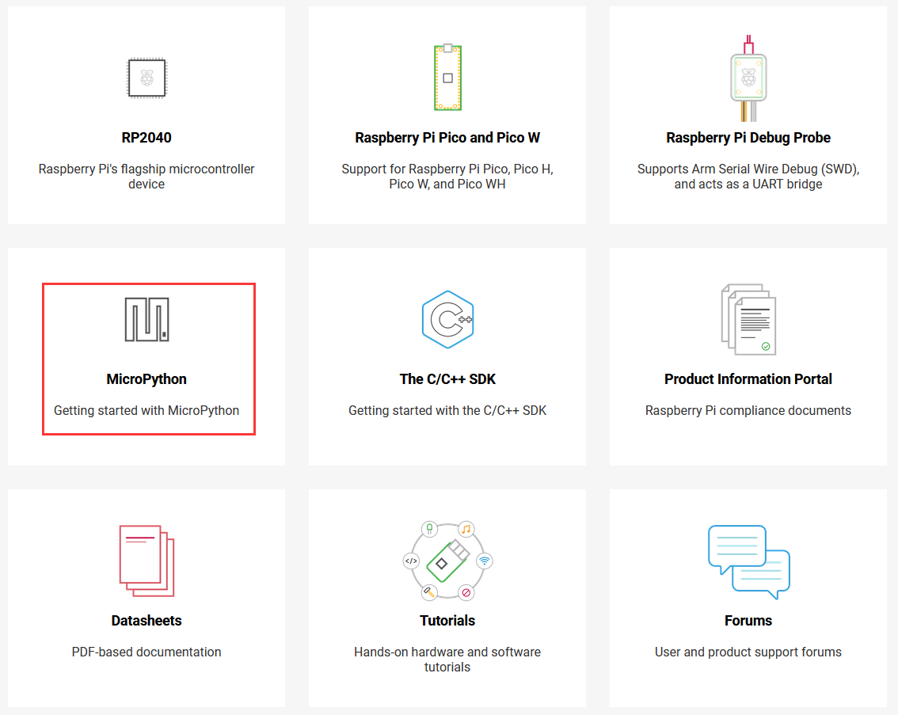

2. Download the correct MicroPython [UF2](https://micropython.org/download/rp2-pico/rp2-pico-latest.uf2) file for Raspberry Pi Pico.  
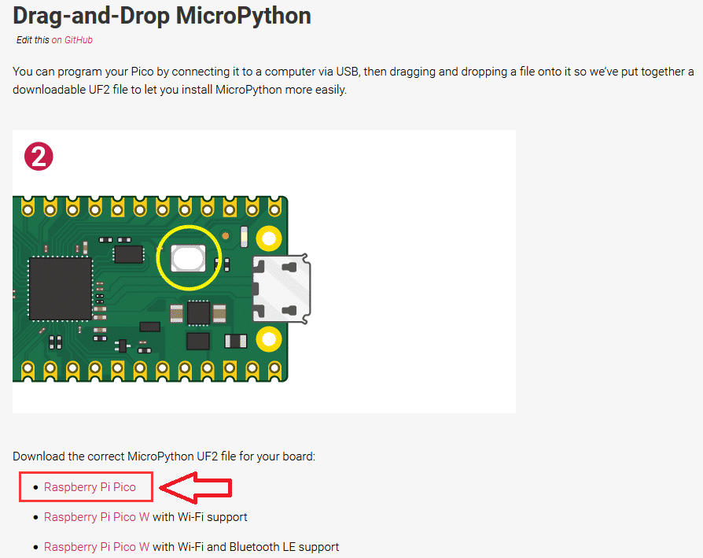     
    

3. Push and hold the BOOTSEL button and plug your Pico into the USB port of your computer. Release the BOOTSEL button after your Pico is connected.  
  

4. It will mount as a Mass Storage Device called RPI-RP2.  
    

5. Drag and drop the MicroPython UF2 file onto the RPI-RP2 volume. Your Pico will reboot. You are now running MicroPython.  
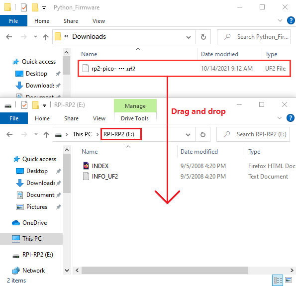    

6. You can access the REPL via USB Serial.  

**Install Thonny**  
[Download](https://thonny.org/) the Thonny installation package and install it.  
      
<span style="color: rgb(255, 76, 65);"> Note: Please select the appropriate software version according to your computer model. </span>    

**Use Thonny**  
1. Launch the Thonny  
When opening Thonny for the first time select "Standard Mode." For some versions this choice will be made via a popup when you first open Thonny.  
  
2. Make sure your Raspberry PI Pico's USB is plugged into your computer's USB via a usb cable, then click on "Python" and the version number in the bottom right corner of the Thonny window, then select "**MicroPython(Raspberry PI Pico)". COMx** ".       
  
<span style="color: rgb(255, 76, 65);">Note: If there is no port selection, see the troubleshooting section below.</span>   
3. You can now access the REPL from the Shell panel.  
   

```python  
>>> print('Hello Pico!')  
Hello Pico!
>>>
```

**Blinking the LED from Thonny**    
Create a new file:   
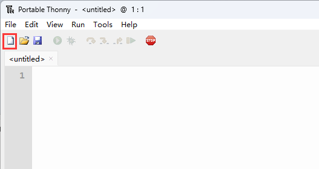      

Fill the file with the following code:      

```python
from machine import Pin, Timer

led = Pin("LED", Pin.OUT)
tim = Timer()
def tick(timer):
    global led
    led.toggle()

tim.init(freq=2.5, mode=Timer.PERIODIC, callback=tick)  
```
Run the code online: (The code is not saved in pico and is not executed after repowering.)      
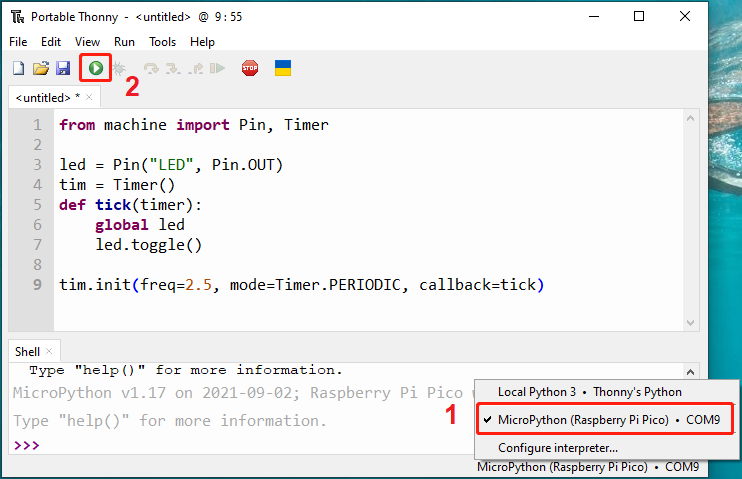

Exiting Running Online:    
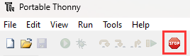     

Run the code offline: (The code is stored in pico, and the code in pico is automatically executed after being powered on.)     
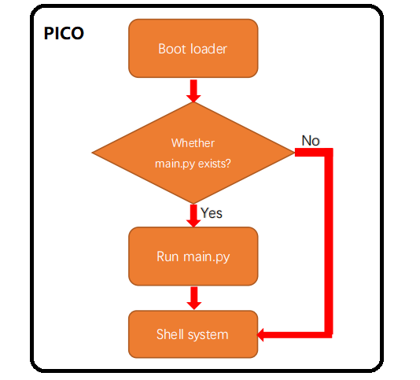     

Enter the code in the main panel, then click on the "**Save**" or "**File->Save as ...**" menu. Thonny will present you with a popup, click on "**Raspberry Pi Pico**" and enter "**main\.py**" to save the code to the **Raspberry Pi Pico**.  
  
 

<span style="color: rgb(255, 76, 65);">Note: </span>      

If you save a file to the Pico and give it the special name **main\.py**, then MicroPython starts running that script as soon as power is supplied to Raspberry Pi Pico in the future.                          

The program should uploaded to the Raspberry Pi Pico using the REPL, and automatically start running. You should see the on-board LED start blinking.  
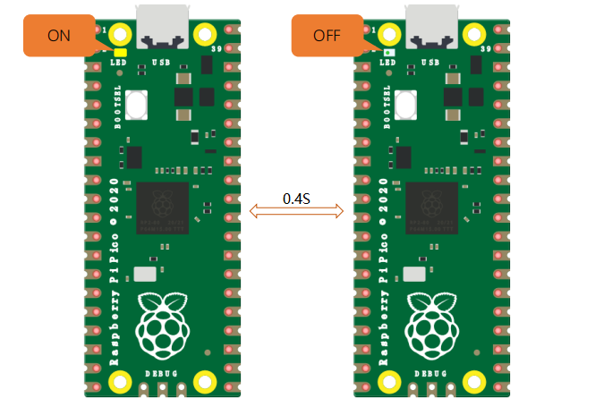          


## Save existing files or folders to Pico    
-----------------------------------------          
Make sure Thonny checked **"View -> Files"**:  
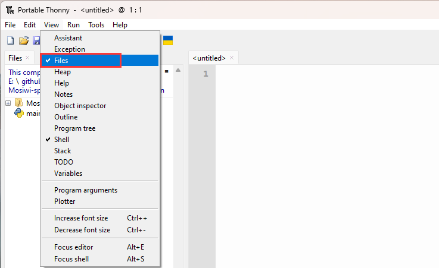    

Select any python folder or file, then right-click and select the **"Upload to/"** menu to upload the code to Pico:      
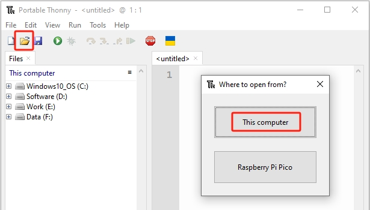      
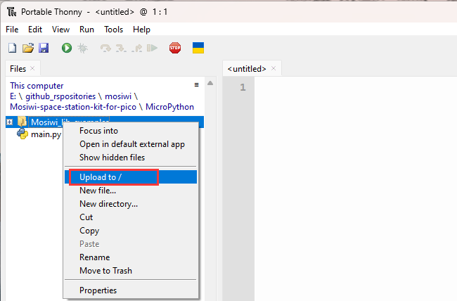      

Follow the same method to upload the **"main\.py"** file to Pico:    
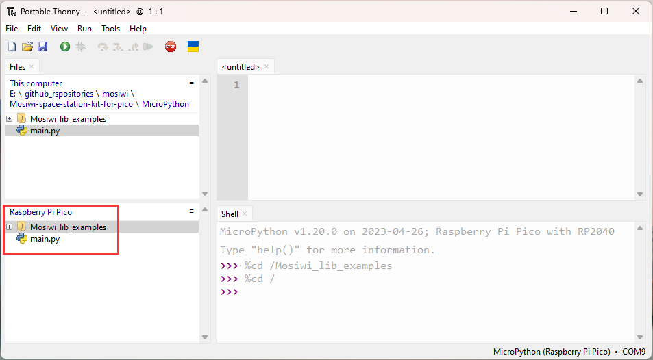   

Select the file and right-click to open the file in Pico.       
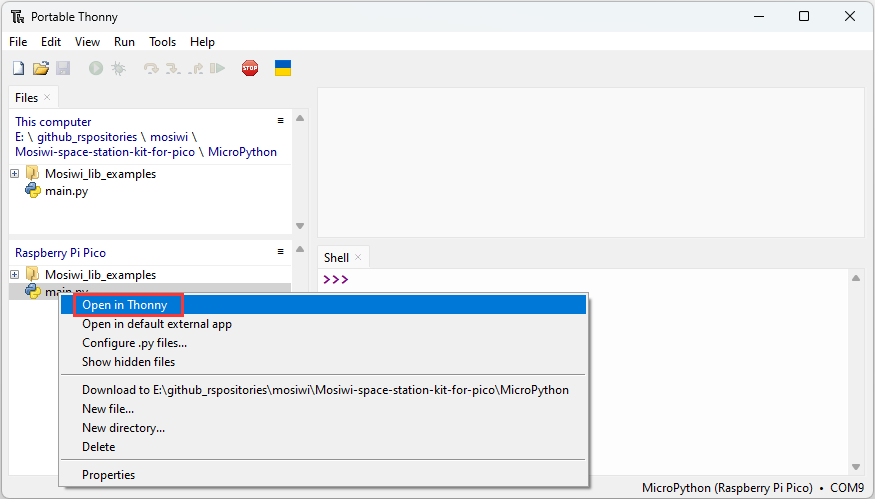      

End!  

## Resource          
-----------
[Raspberry Pi Pico product brief](https://datasheets.raspberrypi.com/pico/pico-product-brief.pdf)  
[Hardware design with RP2040](https://datasheets.raspberrypi.com/rp2040/hardware-design-with-rp2040.pdf)  
[Raspberry Pi Pico design files](https://datasheets.raspberrypi.com/pico/RPi-Pico-R3-PUBLIC-20200119.zip)  
[Raspberry Pi Pico STEP file](https://datasheets.raspberrypi.com/pico/Pico-R3-step.zip)  
[3-pin debug connector](https://datasheets.raspberrypi.com/debug/debug-connector-specification.pdf)  

## Troubleshooting          
------------------
1\. Thonny's **Run** menu is unavailable after Raspberry Pi Pico is powered on again.  
Reply: You need to click on Thonny's **stop/restart backend** menu to solve the problem.  
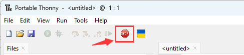      

2\. Thonny does not automatically install USB drivers in windows7 and 8. The following error was found in the PC's Device Manager:   
  
Create a text file and add the following code file. The save file name is "**Board_CDC_RP2_pico-serial**" and the file format is "**.inf**". The file format is the driver file. Then manually add the driver to the unrecognized device in the device Manager.  

<style> pre{ overflow-y: auto; max-height: 300px;} </style>     

```css
; Windows 2000, XP, Vista, 7 and 8 (x32 and x64) setup file for Atmel CDC Devices  
; Copyright (c) 2000-2013 ATMEL, Inc.  

[Version]
Signature   = "$Windows NT$"
Class       = Ports
ClassGuid   = {4D36E978-E325-11CE-BFC1-08002BE10318}

Provider    = %Manufacturer%
LayoutFile  = layout.inf
CatalogFile = atmel_devices_cdc.cat
DriverVer   = 01/08/2013,6.0.0.0

;----------------------------------------------------------
; Targets
;----------------------------------------------------------
[Manufacturer]
%Manufacturer%=DeviceList, NTAMD64, NTIA64, NT

[DeviceList]
%PI_CDC_PICO%=DriverInstall, USB\VID_2E8A&PID_0005&MI_00

[DeviceList.NTAMD64]
%PI_CDC_PICO%=DriverInstall, USB\VID_2E8A&PID_0005&MI_00

[DeviceList.NTIA64]
%PI_CDC_PICO%=DriverInstall, USB\VID_2E8A&PID_0005&MI_00

[DeviceList.NT]
%PI_CDC_PICO%=DriverInstall, USB\VID_2E8A&PID_0005&MI_00

;----------------------------------------------------------
; Windows 2000, XP, Vista, Windows 7, Windows 8 - 32bit
;----------------------------------------------------------
[Reader_Install.NTx86]


[DestinationDirs]
DefaultDestDir=12
DriverInstall.NT.Copy=12

[DriverInstall.NT]
include=mdmcpq.inf
CopyFiles=DriverInstall.NT.Copy
AddReg=DriverInstall.NT.AddReg

[DriverInstall.NT.Copy]
usbser.sys

[DriverInstall.NT.AddReg]
HKR,,DevLoader,,*ntkern
HKR,,NTMPDriver,,usbser.sys
HKR,,EnumPropPages32,,"MsPorts.dll,SerialPortPropPageProvider"

[DriverInstall.NT.Services]
AddService = usbser, 0x00000002, DriverService.NT

[DriverService.NT]
DisplayName = %Serial.SvcDesc%
ServiceType = 1 ; SERVICE_KERNEL_DRIVER
StartType = 3 ; SERVICE_DEMAND_START
ErrorControl = 1 ; SERVICE_ERROR_NORMAL
ServiceBinary = %12%\usbser.sys
LoadOrderGroup = Base

;----------------------------------------------------------
; Windows XP, Vista, Windows 7, Windows 8 - 64bit
;----------------------------------------------------------

[DriverInstall.NTamd64]
include=mdmcpq.inf
CopyFiles=DriverCopyFiles.NTamd64
AddReg=DriverInstall.NTamd64.AddReg

[DriverCopyFiles.NTamd64]
usbser.sys,,,0x20

[DriverInstall.NTamd64.AddReg]
HKR,,DevLoader,,*ntkern
HKR,,NTMPDriver,,usbser.sys
HKR,,EnumPropPages32,,"MsPorts.dll,SerialPortPropPageProvider"

[DriverInstall.NTamd64.Services]
AddService=usbser, 0x00000002, DriverService.NTamd64

[DriverService.NTamd64]
DisplayName=%Serial.SvcDesc%
ServiceType=1
StartType=3
ErrorControl=1
ServiceBinary=%12%\usbser.sys

;----------------------------------------------------------
; String
;----------------------------------------------------------

[Strings]
Manufacturer = "ATMEL, Inc."
PI_CDC_PICO = "Pi Pico Serial Port"

Serial.SvcDesc = "Pi Pico Serial Driver"
```  

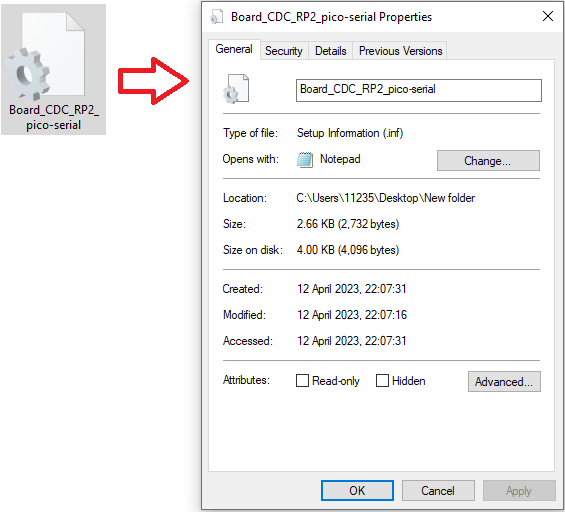  

Refer to other sources: [Link](https://picockpit.com/raspberry-pi/raspberry-pi-pico-and-micropython-on-windows/#Windows_81)  


--------
**End!**