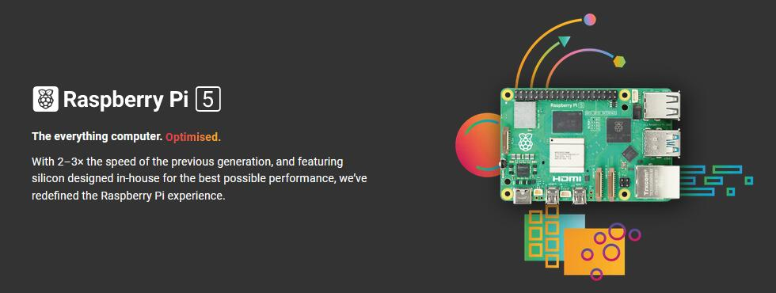
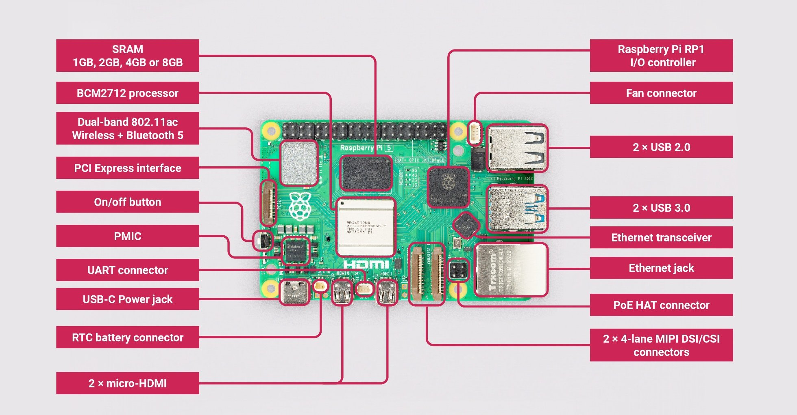
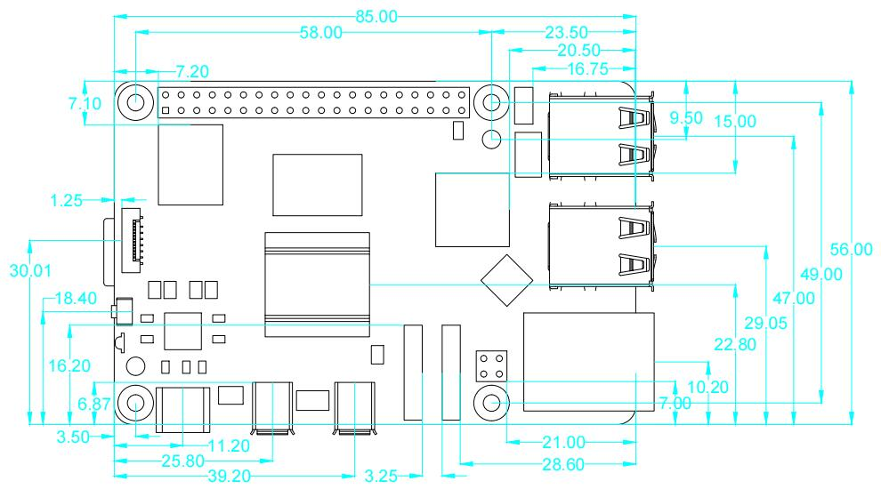

# R1D0002_raspberry_pi5
-----------------------
       

Official website: <https://www.raspberrypi.com/products/raspberry-pi-5/>  

## Specification        
----------------
- Quad Arm Cortex-A76 @ 2.4GHz    
&ensp;&ensp; 1. Cryptographic Extension support (AES on hardware)    
&ensp;&ensp; 2. 512KB per-core L2 caches   
&ensp;&ensp; 3. 2MB L3 cache   
- 4GB or 8GB LPDDR4X-4267 SDRAM   
- Dual 4kp60 HDMI display output with HDR support    
- 4kp60 HEVC decoder   
- VideoCore VII graphics, with OpenGL-ES 3.1, Vulkan 1.2   
- Raspberry Pi Image Sensor Processor (ISP)   
- Raspberry Pi connector for PCIe (1 x 2.0 port, additional HAT required)    
- 802.11ac dual-band Wi-Fi   
- Bluetooth 5.0 (with BLE support)   
- Gigabit Ethernet   
- 2x USB 3.0 (capable of simultaneous full throughput)   
- 2x USB 2.0   
- PoE support (additional HAT required)   
- Dual 4-lane MIPI CSI/DSI transceivers, supporting   
&ensp;&ensp; 1. 2x display; or       
&ensp;&ensp; 2. 2x camera; or    
&ensp;&ensp; 3. 1x display + 1x camera      
- Raspberry Pi 40-pin GPIO header    
- Fan connector    
- Real Time Clock (RTC) -- RTC battery connector    
- Power button    

## Meet raspberry pi5      
---------------------
  

## Dimensional drawing       
----------------------
  
Note: all dimensions in mm  

## Get started with raspberry pi     
--------------------------------
Please refer to: [Click me](../resources/get_started_with_raspberry_pi/get_started_with_raspberry_pi.md)

## GPIO Diagram        
---------------
   
For more details on the advanced capabilities of the GPIO pins see gadgetoid’s [interactive pinout diagram](http://pinout.xyz/).  

**GPIO in C**  
Use [WiringPi](../wiringpi/wiringpi.md) or [BCM2835](../bcm2835/bcm2835.md) library to control Raspberry PI GPIO.  

**GPIO in Python**  
Using the [GPIO Zero](https://gpiozero.readthedocs.io/) library makes it easy to get started with controlling GPIO devices with Python. The library is comprehensively documented at [gpiozero.readthedocs.io](https://gpiozero.readthedocs.io/).  

## Resource   
-----------  
[Raspberry Pi5 mechanical drawing](../../_static/raspberry/R1D0002/mechanical_drawing/RaspberryPi5.dxf)  
[Raspberry Pi5 documentation](https://www.raspberrypi.com/documentation/computers/raspberry-pi-5.html)  

## Troubleshooting    
------------------
Forums: <https://forums.raspberrypi.com/>  

--------
**End!**