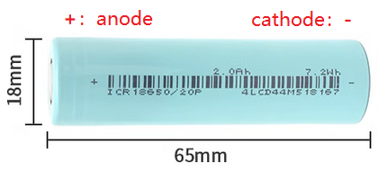
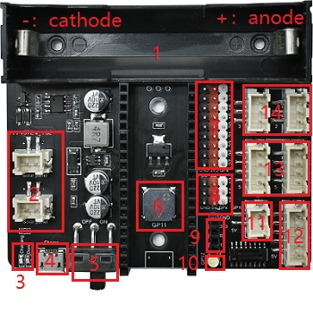

# R1E0000_solar_charging_shield_for_pico          
----------------------------------------
Based on the [Raspberry pi Pico](../R1D0001_raspberry_pico/R1D0001_raspberry_pico.md) design, this expansion board is very convenient for external connection of various sensors, integrated solar energy, USB charging function and 28BYJ-48 stepper motor drive function, and the power output is more powerful.         

## Specification    
----------------
• Output voltage and current: 3.3V/Max 0.8A and 5.0V/Max 1.5A        
• Solar panel input voltage and current: 2-6V/Max 1A (Sum of port charging current of two solar panels)       
• Micro-USB B port input voltage and current: 5V/Max 1A       
• Size: 84\*72.5\*23.14mm       

## Recommended battery specifications      
-------------------------------------
• Model: 18650 lithium battery    
• Capacity: >1000mAh, recommended 2000mAh    
• Maximum charging voltage: 4.2V    
• Nominal voltage: 3.7V   
• End-off voltage: 2.75V    
• Minimum charging current: >1A     
• Minimum discharge current: >4A     
     

## Function diagram           
-------------------
    
1. Single-cell 18650 lithium battery holder     
2. Two solar panels connect ports(XH2.54-2P), they are connected in parallel.      
3. Charging indicator, charging bright red, full charge bright green.    
4. Micro USB charging port.    
5. Power switch.       
6. Passive buzzer, controlled by the GP11 of the PICO, high level on, level off.       
7. 2.54mm pin headers, red pin headers are 3.3V, black pin headers are GND, white pin headers are PICO GPIO ports.     
8. 2.54mm pin headers, red pin headers are 5V, black pin headers are GND, white pin headers are PICO GPIO ports.     
9. TTL serial port, 2.54mm-4P female header(GND-3V3-GP1-GP0).     
10. F3 white LED, controlled by the GP12 of the PICO, high level off, low level lit.     
11. 5V switching interface, controlled by GP10 of the PICO, high level off, low level on.             
12. XH2.54-5P 28BYJ-48 5V stepper motor interface(5V-GP6-GP7-GP8-GP9).        
13. XH2.54-4P I2C Interface(GND-3V3-GP4-GP5).        
14. XH2.54-3P IO ports(GND-3V3-GP2 and GND-3V3-GP3).     
15. (Not identified) Battery voltage read pin: GP28, the analog value of the voltage read by the pin is 1/2 of the battery.     

## Resource          
-----------
[SCH](../../_static/pdf/R1E0000_solar_charging_shield_for_pico/Sch.PDF)  
[Sample code](https://github.com/Mosiwi/Mosiwi-space-station-kit-for-pico)

