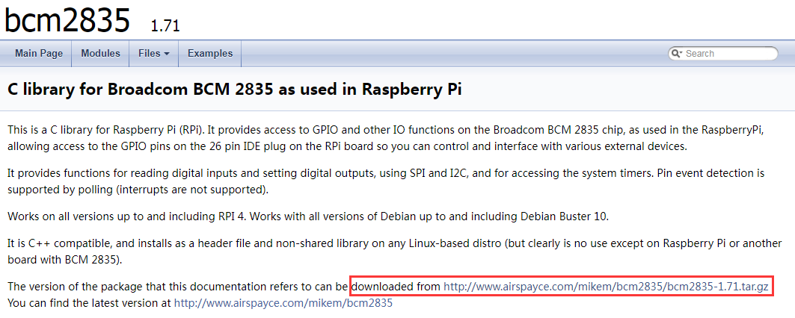
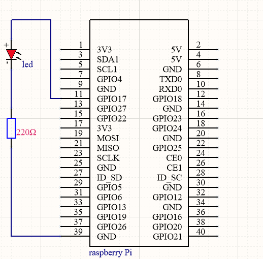

# BCM2835 library          
-----------------
This is a C library for Raspberry Pi (RPi). It provides access to GPIO and other IO functions on the Broadcom BCM 2835 chip, as used in the RaspberryPi, allowing access to the GPIO pins on the 26 pin IDE plug on the RPi board so you can control and interface with various external devices.  

It provides functions for reading digital inputs and setting digital outputs, using SPI and I2C, and for accessing the system timers. Pin event detection is supported by polling (interrupts are not supported).  

Works on all versions up to and including RPI 4. Works with all versions of Debian up to and including Debian Buster 10.  

Official website: http://www.airspayce.com/mikem/bcm2835  

## Install   
----------
Go to the [official website](http://www.airspayce.com/mikem/bcm2835) to download the library package.     

```bash
wget http://www.airspayce.com/mikem/bcm2835/bcm2835-1.71.tar.gz
```

Download the latest version of the library, say bcm2835-1.xx.tar.gz, then:  
```bash
tar zxvf bcm2835-1.xx.tar.gz
cd bcm2835-1.xx
./configure
make
sudo make check
sudo make install
```

## Example            
----------
Run the following command on the terminal to create the **"blin.c"** file:  
```bash
sudo nano blink.c  
```

Enter the following code in the file:  
```c
#include <bcm2835.h>
#include <stdio.h>
 
// Blinks on RPi Plug P1 pin 11 (which is GPIO pin 17)
#define PIN RPI_GPIO_P1_11
 
int main(void){
    if (!bcm2835_init())
      return 1;
 
    // Set the pin to be an output
    bcm2835_gpio_fsel(PIN, BCM2835_GPIO_FSEL_OUTP);
 
    // Blink
    while (1)
    {
        // Turn it on
        bcm2835_gpio_write(PIN, HIGH);
        
        // wait a bit
        bcm2835_delay(500);
        
        // turn it off
        bcm2835_gpio_write(PIN, LOW);
        
        // wait a bit
        bcm2835_delay(500);
    }
    bcm2835_close();
    return 0;
}
```
When the editing is complete, save the file by typing the following command on the keyboard and exit the nano editor:  
```bash
Ctrl+O
Ctrl+C
```

then to compile and run, you would enter:  
```bash
gcc -o blink blink.c -lbcm2835
sudo ./blink
```

To see the output of this, you would need to connect a single LED to the GPIO connector of the Raspberry Pi as follows:    
   

The LED attached to pin 11 of the RPi GPIO blinks.  

