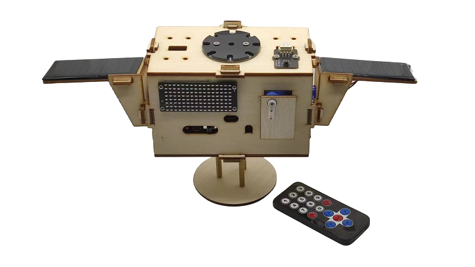
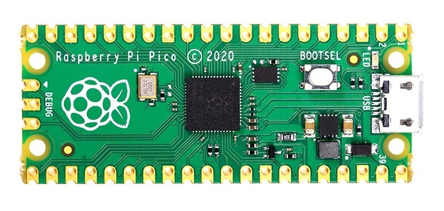
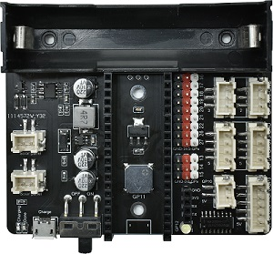

# Raspberry index    
-----------------
      

The Raspberry Pi Foundation is a UK-based charity with the mission to enable young people to realise their full potential through the power of computing and digital technologies.             

## Kit    
------
| <a href="https://docs.mosiwi.com/projects/r1k0000/en/latest/" target="_blank">R1K0000_space_station_kit</a> | updating | updating |
| :--: | :--: | :--: |
|  |  |  |

## Motherboard    
--------------
| [Raspberry pi 4](../R1D0000_raspberry_pi4/R1D0000_raspberry_pi4.md) | [Rapberry pico](../R1D0001_raspberry_pico/R1D0001_raspberry_pico.md) | updating |
| :--: | :--: | :--: |
|  |  |  |

## Expansion board          
------------------
| [R1E0000_Solar_charging_shield](../R1E0000_solar_charging_shield_for_pico/R1E0000_solar_charging_shield_for_pico.md) | updating | updating |
| :--: | :--: | :--: |
|  |  |  |

## Resource    
-----------
Official website: 
1. <https://www.raspberrypi.org>  
2. <https://www.raspberrypi.com>  

