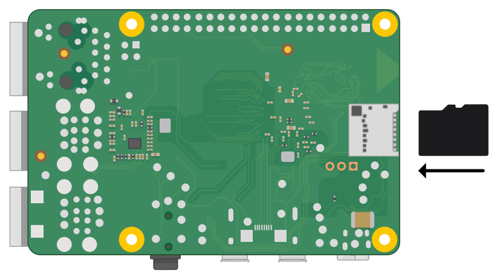
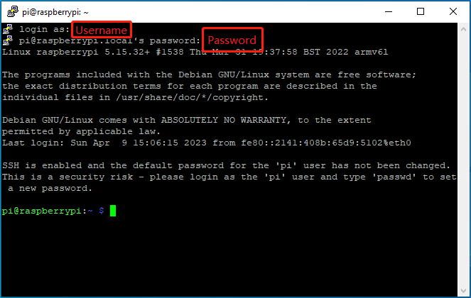
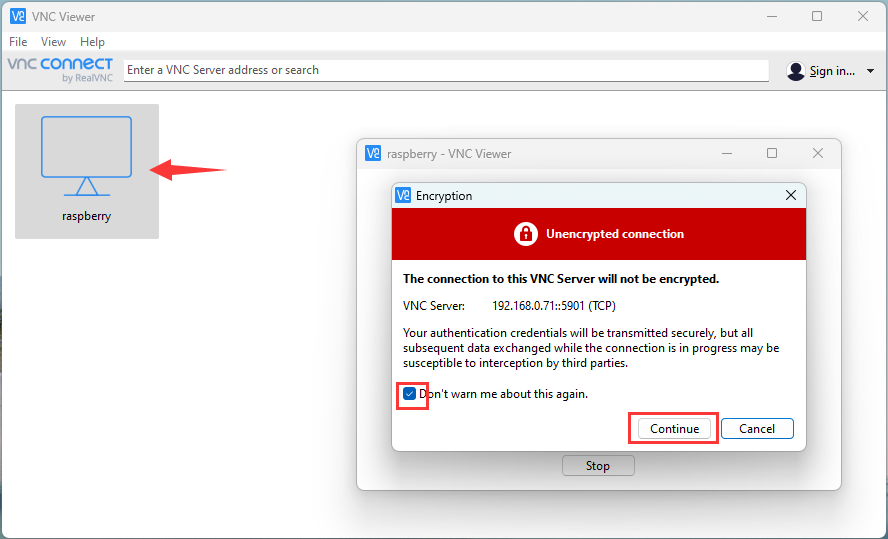

# Get_started_with_raspberry_pi
-------------------------------

## Install Raspberry pi OS     
--------------------------
**Accessories to be prepared in advance:**  
|  |  |  |
| :--: | :--: | :--: |
| 1 | 2 | 3 |
1. **PC** – Windows or MacOS operating system (Access to the Internet).          
2. **MicroSD card** – The microSD card acts as Raspberry Pi's permanent storage.  An 8GB card will get you started, though a 16GB one offers more room to grow.  
3. **MicroSD card reader** - It connects the MicroSD card to the USB port of your computer, and then installs the raspberry image system into the MicroSD using other tools.  


```{tip}  
Here are two ways to install the Raspberry PI system, choose the one that suits you!   
```
### Method 1: Install Raspberry Pi OS using Raspberry Pi Imager      
Download [Raspberry Pi Imager](https://www.raspberrypi.com/software/) and install it.           
  

Insert the MicroSD card into the MicroSD card reader and insert the MicroSD card reader into the USB port on your computer, then run Raspberry Pi Imager to install raspberry pi OS.  

| 1 | 2 | 
|:---:|:---:|      
|  |  |       
| 3 (Choose the right system) | 4 |   
|  |  |    
| 5 | 6 |  
|  |  |   
| 7 | 8 |     
|  |  |      
| 9 | 10 |
|  |  |
| 11 | 12 |
|  |  |     
| 13 | 14 |
|  |  |  
| 13 | 14 |
|  |  |    

### Method 2: Manually install an operating system image          
Download [Raspberry Pi Imager](https://www.raspberrypi.com/software/) and install it:           
  

Download the [Raspberry PI OS image](https://www.raspberrypi.com/software/):     
        

[Select](https://www.raspberrypi.com/software/operating-systems/) the operating system image you need:           
      

Insert the MicroSD card into the MicroSD card reader and insert the MicroSD card reader into the USB port on your computer, then run Raspberry Pi Imager to install raspberry pi OS.    

| 1 | 2 | 
|:---:|:---:|      
|  |  |       
| 3 (Choose the right system) | 4 |   
|  |  |    
| 5 (<span style="color: rgb(255, 76, 65);">Select the image file</span>) | 6 |  
|  |  |   
| 7 | 8 |     
|  |  |      
| 9 | 10 |
|  |  |
| 11 | 12 |
|  |  |     
| 13 | 14 |
|  |  |  
| 13 | 14 |
|  |  | 
    

## Start the Raspberry pi        
-------------------------   
```{tip}  
Here are two ways to start the Raspberry pi, choose the one that suits you!   
```

### Method 1: Start the Raspberry pi with monitor
Accessories to be prepared in advance:  
|  |  |  |  |
| :--: | :--: | :--: | :--: |
| 1 | 2 | 3 | 4 |
1. **USB power supply** – A 5 V power supply rated at 3 amps (3 A) and with a USB Type-C interface.     
2. **Mouse** – USB interface.        
3. **Keyboard** - USB interface.       
4. **Monitor** - Micro hdmi interface.    

First, unplug your Raspberry Pi’s power supply to ensure that the Raspberry Pi is powered down while you connect peripherals. If you installed the operating system on a microSD card, you can plug it into your Raspberry Pi’s card slot now.    
     

Then, plug in any other peripherals, such as your mouse, keyboard, and monitor.     
    

Finally, connect the power supply to your Raspberry Pi. You should see the status LED light up when your Pi powers on. You should see the boot screen within minutes.   


### Method 2: Start the Raspberry pi without monitor  
Accessories to be prepared in advance:  
|  |  |
| :--: | :--: |
| 1 | 2 |
1. **USB power supply** – A 5 V power supply rated at 3 amps (3 A) and with a USB Type-C interface.     
2. **PC** – Windows or MacOS operating system (Access to the Internet).       

Setting up the hardware:      
| 1: Insert SD card | 2: Plug in the network cable | 3: Plug in power |    
| :--: | :--: | :--: |        
|  |  |  |    

Finally, connect the power supply to your Raspberry Pi. You should see the status LED light up when your Pi powers on.      

```{tip}
After the Raspberry PI is started, through the next section (Remote access to Raspberry Pi), you can control your Raspberry PI on your PC!
```

## Remote access to the Raspberry pi    
------------------------------------
If you don't have a spare monitor, mouse and keyboard for your RPi, you can use a remote terminal to share a display, keyboard, and mouse with your PC.   

```{tip}  
Here are two ways (SSH and VNC) to remote access to the Raspberry pi, choose the one that suits you!   
```

### Remote terminal (SSH)
Download [Putty.exe](https://www.putty.be/latest.html).  
  

Use Putty to remotely access raspberry pi. ([Find the IP of raspberry pi](#find-the-ip-address-of-the-raspberry-pi))            
  
```
raspberrypi.local  
```
  
<span style="color: rgb(255, 76, 65);">Note: The above operations must be on the same LAN.</span>  


### Remote desktop (VNC)       
VNC Server can create a **virtual desktop** for you, giving you graphical remote access on demand. This virtual desktop exists only in your Raspberry Pi’s memory. 

VNC is already installed on the full Raspberry Pi OS image, and can be installed via **Recommended Software** from the **Preferences** menu on other versions.  
If you are not using a desktop you can install it from the command line as follows:  
```bash
sudo apt update
sudo apt install realvnc-vnc-server realvnc-vnc-viewer
```

**Enabling the VNC Server**  
You can do this graphically or at the command line.  

<span style="color: rgb(255, 76, 65);">Enabling VNC Server graphically</span>   

----On your Raspberry Pi, boot into the graphical desktop.  
----Select **Menu › Preferences › Raspberry Pi Configuration › Interfaces**.  
----Ensure **VNC** is **Enabled**.  

<span style="color: rgb(255, 76, 65);">Enabling VNC Server at the command line</span>   

You can enable VNC Server at the command line using raspi-config:  
```bash
sudo raspi-config
```

Now, enable VNC Server by doing the following:  
----Navigate to **Interfacing Options**.  
----Scroll down and select **VNC › Yes**.  

 
**To create and connect to a virtual desktop:**  
----On your Raspberry Pi (using Terminal or via SSH), run **vncserver**. Make note of the **IP address/display number** that VNC Server will print to your Terminal (e.g. 192.167.5.149:1).  
```bash
vncserver   
```     


----Install [VNC Viewer](https://www.realvnc.com/download/viewer/), [find the IP of the Raspberry Pi](#find-the-ip-address-of-the-raspberry-pi), and then run VNC Viewer:            
      

On the VNC Viewer panel, double-click new connection you just created, and the following dialog box pops up.    
        
The password is the login password of the Raspberry Pi, and the default login password of the original system is: <span style="color: rgb(255, 76, 65);">**raspberry**</span>          
         
Succeed!

     

To destroy a virtual desktop, run the following command:  
```command line
vncserver -kill :<display-number>  
```
    

This will also stop any existing connections to this virtual desktop.  

## Find the IP address of the raspberry pi          
------------------------------------------  
On Raspberry Pi OS, multicast DNS is supported out-of-the-box by the Avahi service.  
If your PC supports mDNS, you can reach your Raspberry Pi by using its hostname and the .local suffix. The default hostname on a fresh Raspberry Pi OS install is raspberrypi, so by default any Raspberry Pi running Raspberry Pi OS responds to:  

```{tip}  
Here are two ways to find the IP address of the raspberry pi, choose the one that suits you!   
```

### Method 1:    
Open the **command prompt** on your PC and run the following command:  
```bash
ping -4 raspberrypi.local
```
or  
```bash
ping -6 raspberrypi.local
```
| ipv4 | ipv6 |
| :--: | :--: |
|  |  |  

<span style="color: rgb(255, 76, 65);">Note: The above method only applies to windows10 or later.</span>  

### Method 2:       
If you are using windows7 or have multiple raspberry pi 4 devices on your LAN, you can use the following method to get the IP address of raspberry pi 4.  

Download [Advanced IP Scanner](https://www.advanced-ip-scanner.com/) and install it.  
  

Fill in the range of IP addresses to scan, and then scan.  
  

<span style="color: rgb(255, 76, 65);">Note: The above operations must be on the same LAN.</span>  

## Transfer files from your PC to Raspberry pi           
-----------------------------------------------
Download [WinSCP](https://winscp.net/eng/index.php) and install it.  
  

Log in to raspberry pi 4 using WinSCP.  
  

Drag and drop a file on your PC to raspberry pi 4.  
  


## Linux command              
----------------
Raspberry Pi OS is based on the Linux Operation System. Now we will introduce you to some frequently used Linux commands and rules.
First, open the Terminal. All commands are executed in Terminal.   
       
<span style="color: rgb(255, 76, 65);"> **Note: Linux commands are case sensitive.** </span>        

First, type “ls” into the Terminal and press the “Enter” key. The result is shown below:     
       
The ”ls” command lists information about the files (the current directory by default).      

Content between “\$” and ”pi@raspberrypi:” is the current working path. “~” represents the user directory, which refers to “/home/pi” here.       
     

“cd” is used to change directory. “/” represents the root directory.      
     

Many frequently used commands and instructions can be found in the following reference table.     
    

There are many commands, which will come later. For more details about commands. You can refer to:   
<http://www.linux-commands-examples.com>

**Shortcut Key:**   
Now, we will introduce several commonly used shortcuts that are very useful in Terminal.     

1. Up and Down Arrow Keys: Pressing “↑” (the Up key) will go backwards through the command history and pressing “↓” (the Down Key) will go forwards through the command history.      

2. Tab Key: The Tab key can automatically complete the command/path you want to type. When there is only one eligible option, the command/path will be completely typed as soon as you press the Tab key even you only type one character of the command/path.       

As shown below, under the '~' directory, you enter the Documents directory with the “cd” command. After typing “cd D”, pressing the Tab key (there is no response), pressing the Tab key again then all the files/folders that begin with “D” will be listed. Continue to type the letters "oc" and then pressing the Tab key, the “Documents” is typed automatically.
    


--------
**End!**