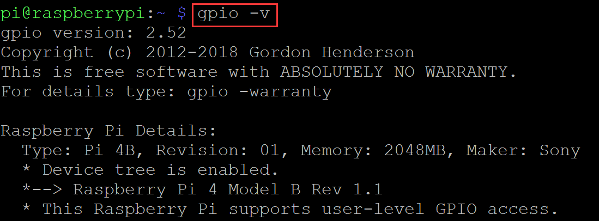
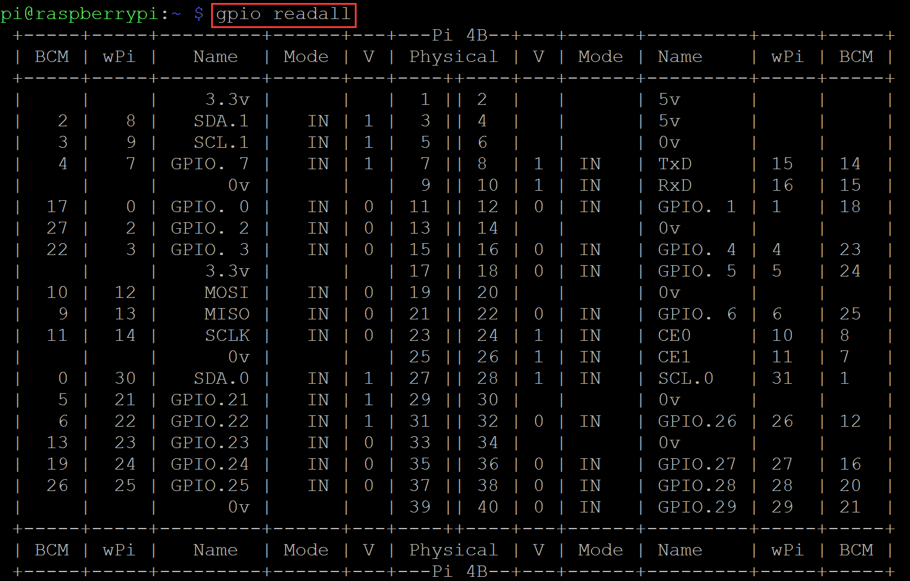
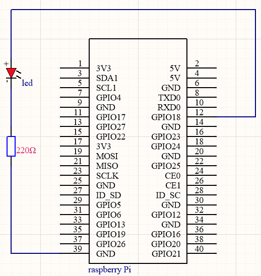

# WiringPi      
----------
[WiringPi](http://wiringpi.com/) is a PIN based GPIO access library written in C for the BCM2835, BCM2836 and BCM2837 SoC devices used in all Raspberry Pi. versions. The source code is not publicly available but may be made available to those who wish commercial support.  

It is designed for use with C and RTB (BASIC) ON THE RASPBERRY PI ONLY.  

It’s designed to be familiar to people who have used the Arduino “wiring” system1 and is intended for use by experienced C/C++ programmers.  

## Install      
----------
To update or install on a Raspbian-Lite system:  
```bash
sudo apt-get install wiringpi
```

Check with:
```bash
gpio -v
```
       
Pins definition of WiringPi GPIO Library:  

```bash
gpio readall
```
  

## WiringPi updated to 2.52 for the Raspberry Pi 4B       
---------------------------------------------------
Just a quick post to let you know that you’ll need a new wiringPi for the Raspberry Pi 4B.  

To upgrade:  
```bash
cd /tmp
wget https://project-downloads.drogon.net/wiringpi-latest.deb
sudo dpkg -i wiringpi-latest.deb
```

## Example          
----------
Use the [nano tool](https://www.nano-editor.org) that comes with the Raspberry PI system to create a new **"blick.c"** file:     
```bash
sudo nano blink.c
```
Enter the following code in the file:  
```c
#include <wiringPi.h>
int main (void)
{
  wiringPiSetup () ;
  pinMode (1, OUTPUT) ;
  for (;;)
  {
    digitalWrite (1, HIGH) ; 
    delay (500) ;
    digitalWrite (1,  LOW) ; 
    delay (500) ;
  }
  return 0 ;
}
```
When the editing is complete, save the file by typing the following command on the keyboard and exit the nano editor:  
```bash
Ctrl+O
Ctrl+C
```

then to compile and run, you would enter:  
```bash
gcc -Wall -o blink blink.c -lwiringPi
sudo ./blink
```

To see the output of this, you would need to connect a single LED to the GPIO connector of the Raspberry Pi as follows:   


and if all goes well, you should see the LED flashing once a second.

--------
**End!**