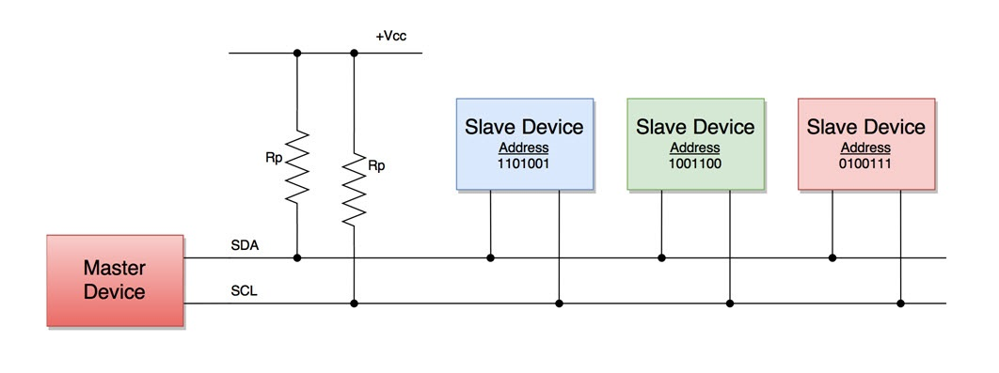
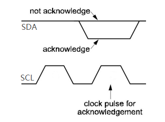

# IIC communication protocol   
----------------------------    
I2C is a communication protocol developed by Philips Semiconductor for data transfer between a host and multiple slaves on the same circuit board using two common wires.    
This is a synchronous serial communication protocol where the data bits are transmitted one after the other according to a pulse signal set by a clock line.    

Here are some important features of the I2C communication protocol:     
1. Only two common buses are needed to control any device on the I2C network.   
2. I2C networks are easily extensible. The new device can simply be connected to two generic I2C bus lines.    
3. There is no need to agree on the data transmission rate in advance as in UART communication. Therefore, the data transfer speed can be adjusted at any time.     
4. Use 7-bit addressing to find a specific device on the I2C bus.      

## Wiring    
---------      
The I2C bus consists of only two lines, called Serial Clock Line (SCL) and Serial Data line (SDA). The data to be transmitted is sent through the SDA line, and the clock signal of SCL is used to synchronize the data. All devices on the I2C network are connected to the same SCL and SDA lines as follows:    
        

Both I2C buses (SDA, SCL) operate as open-drain drivers. This means that any device on the I2C network can drive SDA and SCL to low, but cannot drive them to high. Therefore, a pull-up resistor is used for each bus to keep them high by default.    

**Master and slave devices:**    
1. Devices connected to the I2C bus are classified as master or slave. At any instant, only one host remains active on the I2C bus. It controls the SCL clock line and decides what operation to do on the SDA data line.    
2. To distinguish between multiple slaves connected to the same I2C bus, each slave is physically assigned a permanent 7-bit address.    
3. When a master device wants to transfer data to or read data from a slave device, it specifies this specific slave address on the SDA line and proceeds to transfer or read data. All other slave devices do not respond unless their address is the same as the address specified by the master device on the SDA line.   
        

## Data stream       
--------------      
The I2C data is transmitted as a data stream. The data stream is decomposed into multiple data frames. Each data stream has an address frame containing the binary address of the slave device, and one or more data frames containing the data being transferred. The data stream also includes start and stop conditions, read/write bits, and ACK/NACK bits between each data frame:    
        

**Validity analysis of data:**    
In the protocol, there is a special requirement for the SDA line and SCL line to transfer data bits. When the SCL line is HIGH, the state (level) on the SDA line is stable. The state (level) of the data line can be changed only if the SCL line is LOW (low level). Each data bit needs to generate a clock pulse.      
         

Read bit:      
```c++
// The master reads one bit of data
char IIC_Read_Bit(void){
    pinMode(scl, OUTPUT);
    digitalWrite(scl, LOW); 
    pinMode(sda, INPUT); 
    delayMicroseconds(8);

    digitalWrite(scl, HIGH);  
    delayMicroseconds(8); 
    if(digitalRead(sda) == HIGH) 
        return 1; 
    else
        return 0; 
}
```

Write bit:      
```c++
// The master writes one bit of data
void IIC_Write_Bit(char Bit){
    pinMode(scl, OUTPUT);
    digitalWrite(scl, LOW);
    pinMode(sda, OUTPUT);
    delayMicroseconds(8);

    if(Bit == 1)
        digitalWrite(sda, HIGH);
    else
        digitalWrite(sda, LOW);

    delayMicroseconds(8);
    digitalWrite(scl, HIGH);
    delayMicroseconds(8);
}
```

**Starting condition:**     
Whenever the master starts communication, it switches the SDA line from high to low before switching the SCL line from high to low. Once the master sends the start condition, all slave devices are activated even if they are in sleep mode and wait to receive the address bit.             
<center>
    
</center>    

Example code:    
```c++
// The I2C master sends the START signal
void I2C_Start(void){
    pinMode(scl, OUTPUT);
    pinMode(sda, OUTPUT);

    digitalWrite(scl, HIGH); 
    digitalWrite(sda, HIGH);
    delayMicroseconds(8);

    digitalWrite(sda, LOW);
    delayMicroseconds(8);
}
```

**Address frame:**    
It consists of 7 bits and fills in the address of the slave device where the master device needs to send/receive data. All slave devices on the I2C bus compare these address bits to their addresses.    

Read/write bit:   
This bit specifies the direction of data transmission. This bit is set to "0" if the master device needs to send data to the slave device. Set to "1" if the master device needs to read data from the slave device.   

If an IIC slave address is 0x20, the example code to send the slave address is as follows:            
```c++  
// Send a write command to the IIC slave
unsigned char IIC_slave_address = 0x20; 
I2C_Start();   
IIC_Master_Write_Byte((IIC_slave_address << 1)+0);
...
```

```c++  
// Send a read command to the IIC slave
unsigned char IIC_slave_address = 0x20;  
I2C_Start();    
IIC_Master_Write_Byte((IIC_slave_address << 1)+1); 
...
```

```(tip)
See the "Data frames" section below for details on the IIC_Master_Write_Byte function!
```

**ACK/NACK bit:**     
When the receiving device has successfully received the correct address or data frame and can send another byte, the bit is set to 0 (ACK).     

There are five cases in which the bit is NACK set by the receiving device:    
1. The receiving device received the wrong address.     
2. The receiver is busy.     
3. The receiving device receives commands or data it does not understand.    
4. The host has sent more bytes than the receiving device allows.    
5. When the host is reading a data frame (in read mode), it should generate a stop signal.   

        
         

Master sends an ACK signal:
<center>
    
</center> 

Example code: 
```c++    
// Master sends an ACK signal
void IIC_Master_ACK(void){
  pinMode(scl, OUTPUT);
  digitalWrite(scl, LOW);
  delayMicroseconds(8);
  
  pinMode(sda, OUTPUT);
  digitalWrite(sda, LOW);
  delayMicroseconds(8);

  digitalWrite(scl, HIGH);  
  delayMicroseconds(8); 
}
```

Master sends a NACK signal:    
<center>
    
</center> 

Example code:   
```c++
// Master sends a NACK signal
void IIC_Master_NACK(void){
  pinMode(scl, OUTPUT);
  digitalWrite(scl, LOW);
  delayMicroseconds(8);
  
  pinMode(sda, OUTPUT);
  digitalWrite(sda, HIGH);
  delayMicroseconds(8); 
  
  digitalWrite(scl, HIGH);  
  delayMicroseconds(8); 
}
```

Master reads ACK/NACK signal:
<center>
    
</center> 

Example code:   
```c++
// Master reads ACK/NACK signal
char Read_Slave_AckAndNack(void){
  char CNT = 0;
  pinMode(scl, OUTPUT);
  digitalWrite(scl, LOW);
  delayMicroseconds(8);
  
  pinMode(sda, INPUT);
  delayMicroseconds(8);
  digitalWrite(scl, HIGH);
  
  while((digitalRead(sda) == HIGH)  && (CNT < 100)){ 
    delayMicroseconds(10); 
    CNT++;
  }
  if(CNT >= 100){
    return 0;     // NACK
  } 
  return 1;       // ACK
}
```
   

**Data frames:**     
It consists of 8 bits, which are generated by the master or slave device. This frame is followed by an ACK/NACK bit that is set to "0" if the next data frame is to be received; Otherwise, it is set to "1". Data frames are in a format followed by ACK/NACK bits so that multiple data frames can be sent or received repeatedly. 

Example code:   
```c++
// The master reads a byte of data
unsigned IIC_Master_Read_Byte(void){
    unsigned char Byte = 0;
    pinMode(scl, OUTPUT);
    digitalWrite(scl, LOW); 
    pinMode(sda, INPUT); 
    delayMicroseconds(8); 

    for(char i=0;i<8;i++){ 
    digitalWrite(scl, HIGH);  
    delayMicroseconds(8); 
    if(digitalRead(sda) == HIGH) 
        Byte = (Byte<<1) | 1; 
    else
        Byte = Byte<<1;
    digitalWrite(scl, LOW);
    delayMicroseconds(8);   
    }  
    return Byte;
}
```

Example code:   
```c++
// The master writes a byte of data
void IIC_Master_Write_Byte(unsigned Byte){
    unsigned char Data = Byte;
    pinMode(scl, OUTPUT);
    digitalWrite(scl, LOW);
    pinMode(sda, OUTPUT);

    for(char N=0;N<8;N++){
    digitalWrite(scl, LOW);
    delayMicroseconds(ST);
    if((Data & 0x80) == 0x80)
        digitalWrite(sda, HIGH);
    else
        digitalWrite(sda, LOW);
    delayMicroseconds(ST);
    digitalWrite(scl, HIGH);
    delayMicroseconds(ST);
    Data = Data << 1;
    } 
}
```

**Stop condition:**    
When the SDA line has transmitted the required data block, the master switches the SCL line from low to high level, and then the SDA line from low to high level. At this point, the master is disconnected from the slave.              
<center>
    
</center>    

Example code:      
```c++  
// The I2C master sends the STOP signal
void Stop_I2C(void){
  pinMode(scl, OUTPUT);
  digitalWrite(scl, LOW);
  delayMicroseconds(8);
  
  pinMode(sda, OUTPUT);
  digitalWrite(sda, LOW); 
  delayMicroseconds(8);
  
  digitalWrite(scl, HIGH);
  delayMicroseconds(8); 
   
  digitalWrite(sda, HIGH);
  delayMicroseconds(8);
}
```

## Other
--------
More: [UM10204.pdf](../_static/resource/iic/pdf/UM10204.pdf)    
Standard I2C communication protocol: <https://en.wikipedia.org/wiki/I%C2%B2C>  

--------
**End!**