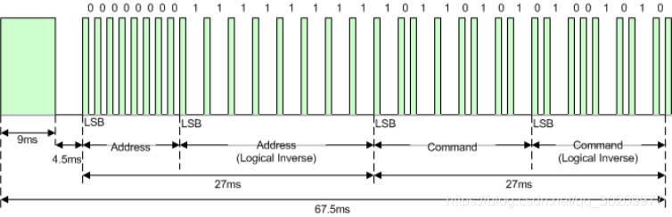

# NEC communication protocol   
----------------------------
The NEC IR transmission protocol uses pulse distance encoding of the message bits. Each pulse burst (mark – RC transmitter ON) is 562.5µs in length, at a carrier frequency of 38kHz (26.3µs).   

Logical bits are transmitted as follows:   
Logical ‘0’ – a 562.5µs pulse burst followed by a 562.5µs space, with a total transmit time of 1.125ms  
Logical ‘1’ – a 562.5µs pulse burst followed by a 1.6875ms space, with a total transmit time of 2.25ms  
  

Figure 1
  

When transmitting or receiving remote control codes using the NEC IR transmission protocol, the WB_IRRC performs optimally when the carrier frequency (used for modulation/demodulation) is set to 38.222kHz.  

When a key is pressed on the remote controller, the message transmitted consists of the following, in order:  
■ a 9ms leading pulse burst (16 times the pulse burst length used for a logical data bit)  
■ a 4.5ms space  
■ the 8-bit address for the receiving device  
■ the 8-bit logical inverse of the address  
■ the 8-bit command  
■ the 8-bit logical inverse of the command  
■ a final 562.5µs pulse burst to signify the end of message transmission.  

The four bytes of data bits are each sent least significant bit first. Figure 1 illustrates the format of an NEC IR transmission frame, for an address of 00h (00000000b) and a command of ADh (10101101b).  
  

Figure 2
  

Figure 2. Example message frame using the NEC IR transmission protocol.  
Notice from Figure 1 that it takes:  
■ 27ms to transmit both the 16 bits for the address (address + inverse) and the 16 bits for the command (command + inverse). This comes from each of the 16 bit blocks ultimately containing eight '0’s and eight '1’s - giving (8 * 1.125ms) + (8 * 2.25ms).  
■ 67.5ms to fully transmit the message frame (discounting the final 562.5µs pulse burst that signifies the end of message).  

## REPEAT CODES    
---------------
If the key on the remote controller is kept depressed, a repeat code will be issued, typically around 40ms after the pulse burst that signified the end of the message. A repeat code will continue to be sent out at 108ms intervals, until the key is finally released. The repeat code consists of the following, in order:  
■ a 9ms leading pulse burst  
■ a 2.25ms space  
■ a 562.5µs pulse burst to mark the end of the space (and hence end of the transmitted repeat code).  

  

Figure 3
  
Figure 3 illustrates the transmission of two repeat codes after an initial message frame is sent.  

  

Figure 4
  
Figure 4. Example repeat codes sent for a key held down on the transmitting remote controller.  

