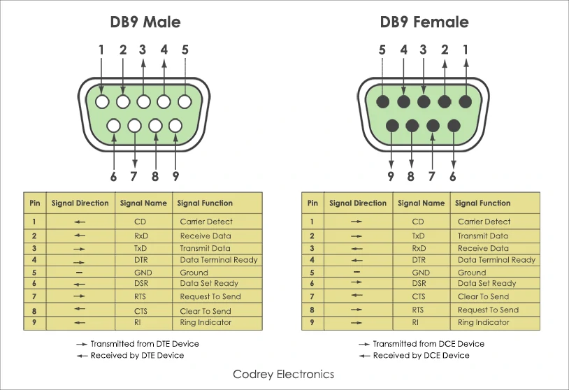
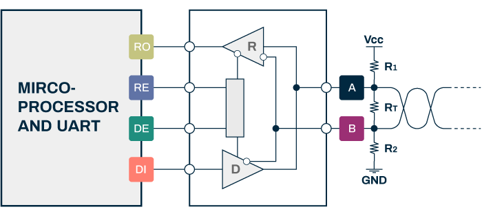
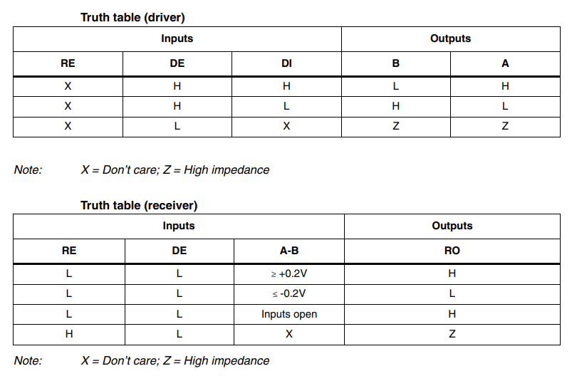
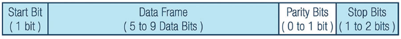
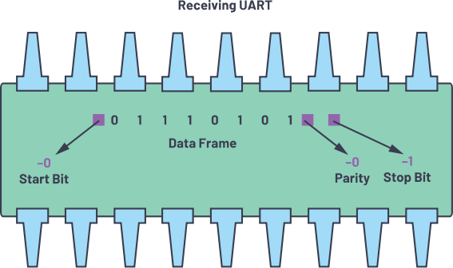
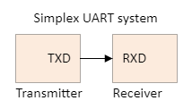
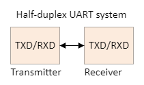

# Serial port  
-------------   
## Puzzled      
----------
There are many serial port products on the market, such as RS232, RS485, TTL, which can be divided into simplex, half-duplex and full-duplex communication, but they cannot be used together, which can easily confuse everyone. This is because people don't know the difference between them. Now let's study them in detail and divide them into **protocol layer**, **physical layer** and **communication direction** to explain.       

## physical layer      
-----------------
The physical layer is to optimize the interface shape or communication data level voltage, so that the transmission distance is longer, and the data transmission is faster and more accurate.       

**1\. RS232**    
The RS-232 interface conforms to the serial data communication interface standard formulated by the Electronic Industry Alliance (EIA) of the United States, and its full name is EIA-RS-232. It defines the interface between DTE (data terminal devices such as computers) and DCE (data communication devices such as modems) devices using serial binary data exchange.     
       

The line voltage range of RS232 is -25V to +25V. They are divided into signal voltage and control voltage.      
The signal voltage between +3V and +25V represents logic "1", and the signal voltage between -3V and -25V represents logic "0". However, the control voltage signal uses negative logic, that is, logic "1" represents -3 to -25 volts and logic "0" represents +3V to +25V. The voltage from -3V to +3V is considered as an uncertain state.     
       

DB9 interface:     
       

**2\. RS485**     
The RS-485 standard name is TIA/EIA-485-A, RS-485 makes up for the shortcomings of RS-232 short communication distance and low rate. RS-485 is differential transmission and uses A pair of twisted pair wires where one wire is defined as A and the other as B with R receiver and D transmitter inside. It is recommended to add pull-up and pull-down resistors to the terminals of the bus to eliminate interference signals generated externally when the bus is idle.      
       

Pin Description:      
       

Calculate the resistance formula (assuming that the terminal resistance Rt = 120 Ω, 200mV is the minimum threshold voltage of R receiver) :     
       

Truth table:     
       

Wiring:     
       
       

**3\. TTL Serial**      
TTL (Transistor-Transistor Logic) is composed of three wires, which are the data transmitting line (TXD), the data receiving line (RXD), and the common ground (GND).     
       

TTL level:      
| Output low (0) | Output high (1) | Input low (0) | Input high (1) |  
| :--: | :--: | :--: | :--: |  
| <0.8V | >2.4V	| <1.2V	| >2.0V |   

## Protocol layer        
-----------------  
The serial port communication protocol mentioned here is based on UART (**Universal Asynchronous Receiver-Transmitter**), which specifies the format of sending and receiving data between two devices. The device has two hardware units, one is the transmitter (TX) and the other is the receiver (RX). The connection between the two devices is as follows:     
       

The main purpose of each device's transmitter and receiver is to send and receive data on the serial data line.    
       
The transmitting UART is connected to the control data bus that transmits data in parallel, and the parallel data is serially transferred bit by bit on the transmission line to the receiving UART. The receiver converts the serial data to parallel data and transmits it to the parallel device.     

For UART and most serial communications, the same baud rate needs to be set on the sending and receiving devices. In serial port communications, the baud rate determines the maximum number of bits transferred per second.    

**UART summary:**    
1. Number of wires: 2   
2. Baud rate: 9600, 19200, 38400, 57600, 115200, 230400, 460800, 921600, 1000000, 1500000    
3. Transmission method: asynchronous     
4. Maximum number of hosts: 1     
5. Maximum number of slaves: 1      

A UART device does not use a clock signal to synchronize the transmitter and receiver devices, it transmits data asynchronously. While the receiver uses its internal clock signal to sample the incoming data, the transmitter also generates the bit stream based on its internal clock signal, and no clock signal is required between the receiver and transmitter to synchronize the data. Use the same baud rate on both devices to manage the synchronization point, failure to do so may affect the time to send and receive data, resulting in discrepancies in data processing. Under the premise that the timing of the bits does not deviate too much, the maximum allowable difference in the baud rate is 10%.       

In UART devices, data is transferred in packets. The transmitter and receiver need to create serial data packets and control these physical hardware lines for data transfer. A data packet consists of start bits, data frames, parity bits, and stop bits.     
       

**Start bit:**    
The data line of a UART device is normally held high when not transmitting data. To start a data transfer, the transmitting UART pulls the transmission line from high to low for 1 clock cycle. When the receiving UART detects a high-to-low transition, it starts reading the bits in the data frame at the set baud rate.    
       

**Data frame:**     
The data frame contains the actual data being transmitted. If parity bits are used, it can be 5 and up to 8 bits. If parity bits are not used, the data frame can be 9 bits. In most cases, the lowest bit of the data is sent first.     
       

**Parity bits:**    
The parity bit describes whether a number is even or odd. The parity bit is a way for the receiving UART to determine whether the data has changed during transmission. Bits can be altered by electromagnetic radiation or mismatched baud rates.     
After the receiving UART reads the data frame, it calculates the sum of the values of the bits in the data frame that are 1 and checks whether the sum is even or odd.  If the parity bit is 0, the sum of bits that are 1 in the data frame should be even. If the parity bit is 1, the sum of bits that are 1 in the data frame should be odd.    
       

To signal the end of a data packet, the transmitting UART drives the data transmission line from low voltage to high voltage for a duration of 1 to 2 bits.    
       

**UART transmission steps:**      
1\. The sending UART receives data from the data bus in parallel.   
       

2\. The sending UART adds the start, parity and stop bits to the data frame.    
       

3\. The entire data packet is sent serially to the receiving UART, which samples the data line at a preconfigured internal baud rate.   
       

4\. After verifying the received data successfully, the receiving UART discards the start bit, parity bit and stop bit of the data frame.     
       

5\. The receiving UART converts the serial data back to parallel data and transmits it to the parallel data bus on the receiving end.     
       

## Communication direction
--------------------------       
With only one data line, data can only be transmitted in one direction.    
        
With only one data line, two devices can send data to each other, but data can only be sent from one device to the other at the same time.       
     
There are two data lines, two devices can send data to each other, and the data of two devices can be sent to each other at the same time.           
       

## Summary     
----------
The serial port we are talking about is an overview. The interface that can send data or receive data serially in a piece of data can be called a serial port.      
1. RS232, RS485, TTL, etc. can also send or receive a piece of data serially, so it can be called a serial port. It's just that they specify the electrical properties on the data line, and they don't specify how the data is transmitted.     
2. We can run different data transmission protocols on RS232, RS485, and TTL serial ports, such as the Universal Asynchronous Receiver-Transmitter (UART) protocol explained in the protocol layer above, and you can also run your own defined protocols.     
3. Simplex, half-duplex, and full-duplex communication only stipulate the direction of data transmission at the same time, and do not involve any data transmission protocol and electrical properties.      

--------
**End!**