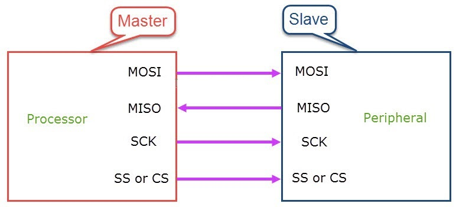
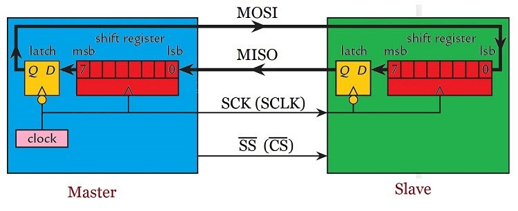
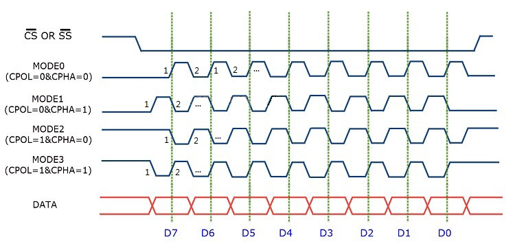
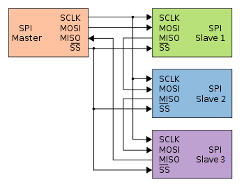

# SPI communication protocol   
----------------------------
The Serial Peripheral Interface (SPI), developed by MOTOROLA in the 1980s, is a master-slave synchronous serial communication protocol. The interface of this protocol enables full-duplex communication at a very high speed, providing a simple and low-cost interface between the microcontroller and peripheral devices.     

**2. Interface**     
The SPI bus has four signal lines:   
1. Master–Out/Slave–In (MOSI)
2. Master–In/Slave–Out (MISO)
3. Serial Clock (SCLK)
4. Chip Select (CS) or Slave Select (SS)

The following diagram depicts how the SPI bus master (processor) is connected to the slave (peripheral):     
        

**3. Internal principle**       
The hardware requirements for implementing SPI are very simple. For example, a master device and a slave device are connected using the SPI bus. The following figure shows the minimum configuration requirements for both devices.     
 

As can be seen from the figure above, the master device consists of a shift register, a data latch, and a clock generator. Slave devices consist of similar hardware: shift registers and data latches. Two shift registers are connected to form a loop. It takes 8 clock cycles for the device to transmit one byte of data.       
During each SPI clock cycle, a full-duplex data transfer occurs. The master sends a bit on the MOSI line and the slave reads it, while the slave sends a bit on the MISO line and the master reads it. This ordering is maintained even if only one-way data transfer is intended.       

**4. Work mode**        
The job of the master device is to generate clock signals of a specific frequency and assign them to the slave devices in order to synchronize data between the master and slave devices.     

The master and slave must also agree on certain synchronization protocols. Thus, two features of the clock, namely clock polarity (CPOL or CKP) and clock phase (CPHA), enter the picture.     
■ Clock polarity determines the state of the clock. When CPOL is 0, the clock signal generated by the master device is low when idle. When CPOL is 1, the clock signal is high when idle.      
■ The clock phase determines at what time on the clock the data is sent. When CPHA is 0, the data is sent at the first edge of the periodic clock. When CPHA is 1, the second edge of the data cycle clock is sent.     
■ According to the clock polarity (CPOL) and clock phase (CPHA) values. SPI has 4 modes of operation: modes 0 to 3.      
| SPI mode | Clock polarity(CPOL/CKP) | Clock phase(CPHA) | SCK level at idle time | Sampling time |   
| :--: | :--: | :--: | :--: | :--: |   
| 0 | 0 | 0 | Low level | The first edge |  
| 1 | 0 | 1 | Low level | The second edge |  
| 2 | 1 | 0 | High level | The first edge |  
| 3 | 1 | 1 | High level | The second edge |   

            
<span style="color: rgb(255, 76, 65);">Note: The master and slave need to work in the same mode to communicate normally.</span>      

**5. Connection mode**     
Independent master-slave configuration:    
           

Daisy chain configuration:   
             


## Example code    
---------------
**SPI mode 3:**
```c++
// Define the SIP communication clock period.
int T = 100; 

// Initialize the IO ports
void SPI_init(void){
    pinMode(miso, INPUT);
    pinMode(mosi, OUTPUT);

    pinMode(cs, OUTPUT);
    digitalWrite(cs, HIGH);

    pinMode(sck, OUTPUT);
    digitalWrite(sck, HIGH);
}

// The master reads the slave data.
unsigned int SPI_read_data(unsigned char addr, unsigned char data){
    unsigned int returnData = 0;
    unsigned int sendData = addr;
    sendData = (sendData << 8) + data; 

    digitalWrite(cs, LOW);
    for(byte i=0; i<16; i++){
        if((sendData & 0x8000) == 0x8000){
            digitalWrite(mosi, HIGH);
        }
        else{ 
            digitalWrite(mosi, LOW);
        }
        digitalWrite(sck, LOW);
        delayMicroseconds(T/2);
        digitalWrite(sck, HIGH);
        delayMicroseconds(T/2);

        returnData = returnData<<1;
        if(digitalRead(miso) == HIGH){
            returnData = returnData | 0x0001;
        }
        sendData = sendData << 1;	
    } 
    digitalWrite(cs, HIGH);
    return returnData;
}

// The master writes data to the slave.
void SPI_write_data(unsigned char addr, unsigned char data){
    unsigned int sendData = addr;
    sendData = (sendData << 8) + data;

    digitalWrite(cs, LOW);
    for(byte i=0; i<16; i++){
        if((sendData & 0x8000) == 0x8000){
            digitalWrite(mosi, HIGH);
        }
        else{ 
            digitalWrite(mosi, LOW);
        }
        digitalWrite(sck, LOW);
        delayMicroseconds(T/2);
        digitalWrite(sck, HIGH);
        delayMicroseconds(T/2);
        sendData = sendData << 1;
    }
    digitalWrite(cs, HIGH);
}
```


## Other
--------
More: [SPI_Block_Guide.pdf](../_static/resource/spi/pdf/SPI_Block_Guide.pdf)      
Standard SPI communication protocol: <https://en.wikipedia.org/wiki/Serial_Peripheral_Interface>    

--------
**End!**
